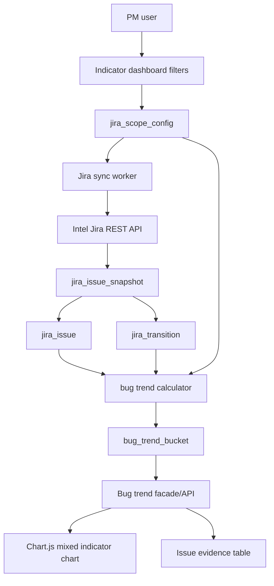
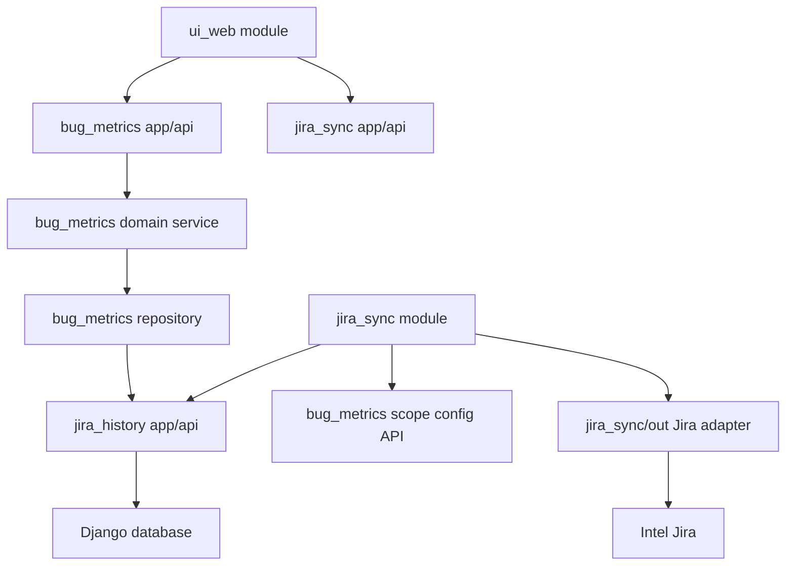
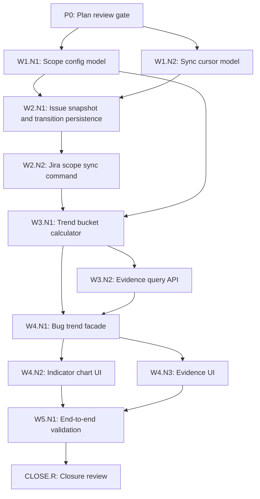

# MVP Bug Trend Architecture Spec

Date: 2026-08-19

## Goal

The first product goal is an Intel Jira bug trend indicator dashboard.

The dashboard must show, for a user-defined Jira scope:

- Day or week new bugs.
- Day or week fixed or closed bugs.
- Open bug backlog trend.
- Open critical or high bug trend when severity data is available.
- Evidence list from any time bucket to the matching Jira issues.

Intel Jira is a superset for many Intel projects. The MVP must therefore support project-specific Jira definitions instead of hardcoding one global workflow, one component field, or one bug status model.

## User-Facing MVP

The UI target is an indicator-style dashboard like the provided reference image:

- Top filter bar with compact selectors.
- Main chart occupying most of the screen.
- Mixed chart with line series for backlog and bar series for weekly/daily movement.
- Negative bars for fixed or closed bugs.
- Legend-driven visibility toggles.
- Date range controls using work-week or calendar date granularity.

Initial filter controls:

| Filter | Purpose | MVP input type |
| --- | --- | --- |
| IP | High-level product or organization grouping | Dropdown backed by saved scope config |
| Project | Jira project or named scope | Dropdown backed by saved scope config |
| Milestone | Release, milestone, or user-defined Jira field | Dropdown or free text depending on scope config |
| Begin | Start week/date | Date or work-week selector |
| End | End week/date | Date or work-week selector |
| Scope Query | Advanced user JQL scope | Saved scope selector, with edit/create handled on the scope configuration page |

Example JQL stored by a saved scope:

```jql
project = "131600" AND component = "team_int_qemu"
```

Another valid saved scope:

```jql
project = STDEL AND issuetype = Bug
```

## MVP Output

The first chart should support these series:

| Series | Type | Direction | Meaning |
| --- | --- | --- | --- |
| `all_open_bugs` | Line | Positive | Count of open bugs at the end of each bucket. |
| `all_open_critical_high` | Line | Positive | Count of open bugs whose severity or priority maps to critical/high. |
| `new_critical_high` | Bar | Positive | Bugs created in the bucket and classified as critical/high. |
| `new_medium_low` | Bar | Positive | Bugs created in the bucket and classified as medium/low or non-critical. |
| `fixed_or_closed_bugs` | Bar | Negative | Bugs transitioned into configured fixed/closed statuses in the bucket. |

These series names are dashboard metric names, not Jira status names. They must be computed from per-scope configuration because different Intel Jira projects can use different issue types, status names, resolution values, priority names, severity fields, and component/team conventions.

The MVP can render either daily buckets or weekly buckets. Weekly is acceptable for the first UI because the reference indicator uses work-week labels and the product request explicitly allows weekly or longer aggregation.

## Single Authority

`jira_scope_config` is the single authority for project-specific semantics.

Environment variables remain only the connectivity authority:

- `METRICS_JIRA_SERVER_URL`
- `METRICS_JIRA_AUTH_MODE`
- `METRICS_JIRA_API_TOKEN`
- `METRICS_JIRA_CA_BUNDLE`
- `METRICS_JIRA_VERIFY_SSL`

Project-specific truth must not live in global env vars long term. Different Intel Jira projects can define bug status, components, teams, owners, severity, fix versions, and milestone fields differently. Those definitions belong to saved scope configuration records.

## Scope Configuration Model

Minimum `jira_scope_config` fields:

| Field | Meaning |
| --- | --- |
| `id` | Stable local identifier. |
| `name` | Human-readable scope name. |
| `ip` | Optional product/IP grouping such as NVU. |
| `project_label` | Display label for the project dropdown. |
| `jql` | User-provided Jira query that defines the issue universe. |
| `bug_type_values` | Jira issue types considered bugs. |
| `open_status_values` | Statuses counted as open for backlog. Empty means all bugs not in fixed/closed terminal states. |
| `fixed_status_values` | Statuses counted as fixed. |
| `closed_status_values` | Statuses counted as closed/done. |
| `terminal_excluded_status_values` | Terminal statuses excluded from open backlog and fixed/closed counts unless explicitly mapped elsewhere. |
| `fixed_resolution_values` | Optional resolution values counted as fixed even when status naming differs. |
| `closed_resolution_values` | Optional resolution values counted as closed even when status naming differs. |
| `reopen_status_values` | Optional statuses counted as reopened. |
| `severity_field` | Jira field id/name used for severity or priority grouping. |
| `critical_high_values` | Values considered critical/high. |
| `medium_low_values` | Values considered medium/low. Empty means all non-critical/high bugs. |
| `component_field` | Jira component/team field for filtering. |
| `owner_field` | Jira field used as owner; defaults to assignee if unset. |
| `team_field` | Jira field used as team. |
| `milestone_field` | Jira field used for milestone/release filtering. |
| `fix_version_field` | Jira field used for affected or fixed version filtering. |
| `package_version_field` | Optional Jira field used when a project exposes package/version separately from fix version. |
| `display_fields` | Extra Jira fields shown in evidence rows for this scope. |
| `timezone` | Timezone used for date bucketing. |
| `bucket_granularity` | `daily` or `weekly`. |
| `enabled` | Whether this scope is visible in the dashboard. |
| `config_version_hash` | Hash of the saved semantic fields that define the scope's issue universe, lifecycle, severity, field mappings, timezone, and granularity. |

This model avoids a parallel truth system: every query, status definition, and field mapping used by bug trends comes from one scope config record.

## Series Mapping Contract

Each chart series is computed from `jira_scope_config`, not from hardcoded Jira names.

| Dashboard series | Required configuration inputs | Calculation rule |
| --- | --- | --- |
| `all_open_bugs` | `bug_type_values`, `open_status_values`, `fixed_status_values`, `closed_status_values`, `terminal_excluded_status_values`, optional resolution mappings | Count bugs that are open at bucket end according to this scope's lifecycle mapping. |
| `all_open_critical_high` | Open bug rule plus `severity_field` and `critical_high_values` | Count open bugs whose severity or priority value maps to critical/high. Hide this series when no severity mapping exists. |
| `new_critical_high` | `bug_type_values`, `severity_field`, `critical_high_values` | Count bugs created in the bucket and classified as critical/high by this scope. |
| `new_medium_low` | `bug_type_values`, `severity_field`, `medium_low_values` or fallback non-critical/high rule | Count bugs created in the bucket and classified as medium/low or not critical/high. |
| `fixed_or_closed_bugs` | `fixed_status_values`, `closed_status_values`, optional `fixed_resolution_values`, optional `closed_resolution_values` | Count bugs whose changelog transitions into configured fixed/closed lifecycle states in the bucket. |

Example scope configuration:

```yaml
name: team_int_qemu
jql: project = "131600" AND component = "team_int_qemu"
bug_type_values:
  - Bug
  - Defect
open_status_values:
  - Open
  - Assigned
  - Triaged
  - In Progress
fixed_status_values:
  - Fixed
  - Verified Fixed
closed_status_values:
  - Closed
  - Done
fixed_resolution_values:
  - Fixed
closed_resolution_values:
  - Done
  - Won't Fix
reopen_status_values:
  - Reopened
severity_field: priority
critical_high_values:
  - Critical
  - High
  - P1
  - P2
medium_low_values:
  - Medium
  - Low
  - P3
  - P4
component_field: component
owner_field: assignee
team_field: customfield_team
milestone_field: fixVersions
fix_version_field: fixVersions
bucket_granularity: weekly
```

If a project uses different names, only this scope config changes. The chart series names and trend calculator stay unchanged.

## Target MVP Workflow Example

The provided MVP project workflow includes these visible Jira statuses:

- `NEW`
- `OPEN`
- `IN ANALYSIS`
- `APPROVED FOR POR`
- `IN ARCHITECTURE`
- `IN EXECUTION`
- `IN TEST`
- `BLOCKED`
- `NON-POR`
- `DELETE`
- `DONE`
- `WAIVED`
- `PASS`
- `FAILED`
- `WON'T FIX`
- `FIXED`

This workflow should be represented as one `jira_scope_config` example, not as global application behavior.

Suggested starting mapping for this specific MVP scope:

```yaml
name: wrk_ipsafe_sln_all_2
bug_type_values:
  - Bug
open_status_values:
  - NEW
  - OPEN
  - IN ANALYSIS
  - APPROVED FOR POR
  - IN ARCHITECTURE
  - IN EXECUTION
  - IN TEST
  - BLOCKED
fixed_status_values:
  - FIXED
closed_status_values:
  - DONE
  - PASS
  - WAIVED
  - WON'T FIX
terminal_excluded_status_values:
  - NON-POR
  - DELETE
  - FAILED
reopen_status_values: []
```

Notes:

- `BLOCKED` is still open for backlog purposes unless the scope owner decides otherwise.
- `FIXED` feeds `fixed_or_closed_bugs` when the transition happens in the selected bucket.
- `DONE`, `PASS`, `WAIVED`, and `WON'T FIX` are closed terminal examples for this workflow.
- `NON-POR`, `DELETE`, and `FAILED` need owner confirmation. The MVP should support excluding or separately classifying them through scope config rather than hardcoding them.
- If this project uses Jira resolution values in addition to status names, configure `fixed_resolution_values` and `closed_resolution_values` as well.

## Target MVP Issue Field Example

The provided `STDEL-8942` issue screenshot confirms these useful fields for the first MVP scope:

| Jira UI field | Example value | MVP use |
| --- | --- | --- |
| Type | `Bug` | `bug_type_values` matching. |
| Status | `Fixed` | Status lifecycle mapping for `fixed_or_closed_bugs`. |
| Resolution | `Fixed` | Resolution lifecycle mapping for `fixed_or_closed_bugs`. |
| Priority | `P3-Medium` | Severity grouping for `new_medium_low` and open critical/high series. |
| Component/s | `team_emulation`, `team_integration` | Component/team filter dimension. |
| Affects Version/s | `crc_2a` | Optional affected-version filter/display field. |
| Fix Version/s | `crc_2a`, `CRC RC2a.2` | Milestone/fix-version filter dimension. |
| Packages / Version | `crc_2a`, `CRC RC2a.2` | Optional package/version filter dimension if exposed via REST. |
| Assignee | User field | Owner filter and evidence display. |
| Reporter | User field | Evidence display. |
| Created / Updated / Resolved | Date fields | Trend bucketing and sync verification. |
| Bug Type | `Emulation` | Optional bug subtype filter/display field. |
| Environment Found | `Emulation` | Optional environment filter/display field. |

Suggested starting field mapping for the target MVP scope:

```yaml
name: stdel_emulation_integration
jql: project = STDEL AND issuetype = Bug AND component in ("team_emulation", "team_integration")
bug_type_values:
  - Bug
fixed_status_values:
  - Fixed
fixed_resolution_values:
  - Fixed
closed_status_values:
  - Done
  - Closed
  - Pass
  - Waived
  - Won't Fix
severity_field: priority
critical_high_values:
  - P1-Critical
  - P2-High
  - Critical
  - High
medium_low_values:
  - P3-Medium
  - P4-Low
  - Medium
  - Low
component_field: components
owner_field: assignee
milestone_field: fixVersions
fix_version_field: fixVersions
package_version_field: packages
display_fields:
  - key
  - summary
  - status
  - resolution
  - priority
  - components
  - fixVersions
  - assignee
  - reporter
  - created
  - updated
  - resolved
  - Bug Type
  - Environment Found
```

The exact REST field ids for `Bug Type`, `Environment Found`, and `Packages / Version` must be discovered through Jira field metadata before implementation. The config should store Jira field ids or canonical field names after discovery, not UI labels only.

## Data Architecture



## Module Architecture

Reuse the baseline ownership paths first:



Ownership rules:

- `tasks/out` remains private to the existing task search module and must not be imported by `jira_sync`.
- `jira_sync/out` owns bug-trend Jira fetches, using only connectivity settings and reusable Jira client/provider patterns.
- `jira_sync` owns incremental data collection and sync cursors.
- `jira_history` owns normalized issue, snapshot, and transition persistence.
- `bug_metrics` owns trend calculation and bucket aggregation.
- `ui_web` owns rendering, HTMX partials, filters, and Chart.js chart setup.

Cross-module access uses public APIs under each module's `app/api/` package. The planned public contracts are:

| API owner | Public contract | Consumers |
| --- | --- | --- |
| `bug_metrics/app/api` | Read enabled scope configs and expose trend chart/evidence query methods. | `ui_web`, `jira_sync` |
| `jira_sync/app/api` | Expose sync trigger/status for a saved scope. | `ui_web`, management commands |
| `jira_history/app/api` | Store/read normalized Jira issues, snapshots, transitions, and bucket membership artifacts. | `jira_sync`, `bug_metrics` |

The existing `tasks/app/api` remains available for task dashboard features, but bug-trend sync does not consume `tasks/out` or task workflow configuration because that would create a second status authority beside `jira_scope_config`.

## Durable Data Model

MVP tables:

### `jira_scope_config`

Saved user/project configuration, including JQL and project-specific field/status definitions.

### `jira_sync_cursor`

Tracks each scope's sync progress.

Required fields:

- `scope_id`
- `last_successful_sync_at`
- `last_jira_updated_cutoff`
- `last_error`
- `status`
- `earliest_reliable_bucket_start`
- `latest_reliable_bucket_end`
- `changelog_coverage_status`
- `materialized_config_version_hash`

Incremental sync is valid only while `materialized_config_version_hash` equals the current saved scope `config_version_hash`. When JQL, field mappings, or lifecycle/severity semantics change, `jira_sync` must reject incremental sync and require full materialization before any new completed calculation run can become authoritative.

### `jira_issue`

Current normalized issue state for each scoped issue.

Required fields:

- `scope_id`
- `issue_key`
- `issue_type`
- `status`
- `resolution_value`
- `severity_value`
- `component_value`
- `owner_value`
- `team_value`
- `milestone_value`
- `created_at`
- `updated_at`
- `resolved_at`
- `raw_fields_json`
- `is_in_current_scope`

`jira_issue` keeps the latest known state for both current and recently out-of-scope known issues. Calculations consume only rows where `is_in_current_scope` is true; incremental sync is responsible for reconciling updated known keys that no longer match the saved scope JQL so stale local rows do not become a second scope authority.

### `jira_issue_snapshot`

Raw Jira payload snapshots for traceability and future remapping.

Required fields:

- `scope_id`
- `issue_key`
- `synced_at`
- `jira_updated_at`
- `payload_hash`
- `payload_json`

### `jira_transition`

Status and resolution transitions from Jira changelog.

Required fields:

- `scope_id`
- `issue_key`
- `transitioned_at`
- `field`
- `from_value`
- `to_value`

### `bug_trend_bucket`

Precomputed chart buckets.

Required fields:

- `id`
- `calculation_run_id`
- `scope_id`
- `bucket_start`
- `bucket_end`
- `granularity`
- `new_critical_high_count`
- `new_medium_low_count`
- `fixed_or_closed_count`
- `open_count`
- `open_critical_high_count`

### `bug_trend_calculation_run`

Durable identity for one trend calculation pass over a saved scope and coverage window.

Required fields:

- `id`
- `scope_id`
- `started_at`
- `completed_at`
- `status`
- `config_version_hash`
- `source_coverage_start`
- `source_coverage_end`
- `bucket_granularity`

The current chart reads buckets from the latest completed run for the selected scope and range. Both aggregate bucket counts and bucket membership rows must reference the same `calculation_run_id`.

The current dashboard only treats a completed run as authoritative when its `config_version_hash` matches the current saved `jira_scope_config.config_version_hash`. Saving scope semantics changes the hash and invalidates prior runs for current dashboard display until sync and recalculation produce a matching completed run. Historical runs may remain stored for traceability, but they must not be presented as current results under the updated scope configuration.

### `bug_trend_bucket_issue`

Durable evidence artifact connecting a chart bucket and series to the issue facts used for that exact count.

Required fields:

- `scope_id`
- `bucket_id`
- `bucket_start`
- `bucket_end`
- `granularity`
- `series_name`
- `issue_key`
- `calculation_run_id`
- `summary`
- `status`
- `severity_value`
- `owner_value`
- `component_value`
- `created_at`
- `updated_at`
- `extra_fields_json`

Evidence queries consume this table instead of reconstructing issue membership or display fields from mutable current issue state. Evidence queries must use the same `calculation_run_id` and persisted bucket artifact id as the chart bucket that produced the clicked count.

## Sync Strategy

The dashboard should not live-query Jira on every page load.

MVP sync flow:

1. Load the active `jira_scope_config`.
2. Run its JQL with an incremental update clause when a cursor exists.
3. Fetch required fields and changelog.
4. Store raw snapshots.
5. Normalize issue fields according to scope config.
6. Upsert status transitions.
7. Recompute affected daily or weekly buckets.

Incremental JQL pattern:

```jql
(<scope jql>) AND updated >= "2026-08-01"
```

Use an overlap window, for example 24 hours, to tolerate clock skew and late Jira indexing.

The cursor must also record data coverage. A scope cannot claim reliable buckets before the first full range sync that fetched issues and changelog covering that bucket range. If a user selects a range outside local coverage, the UI must either reject the range with a clear message or mark incomplete buckets as unavailable instead of rendering them as authoritative counts.

The chart API validates the selected date range against the completed calculation run's `source_coverage_start` and `source_coverage_end`, not only against the cursor. Before-start, after-end, and partial-overlap selections are all incomplete for authoritative charting unless the matching calculation run fully covers the selected range.

## Trend Semantics

For each scope and time bucket:

- New bugs: issues matching `bug_type_values` whose `created_at` falls in the bucket.
- Fixed or closed bugs: issues whose changelog transitions into `fixed_status_values` or `closed_status_values` in the bucket.
- Open bugs: bugs created before or during the bucket, minus bugs that reached a closed status before or during the bucket, plus reopened bugs when the scope defines reopen semantics.
- Critical/high open bugs: open bugs whose configured severity field value is in `critical_high_values`.

If a scope has no severity field configured, the dashboard hides critical/high series rather than guessing.

If a scope defines both status and resolution mappings, the calculator treats either configured signal as sufficient to classify a bug as fixed or closed. This is required because some Jira projects express completion primarily through status while others express it through resolution.

Each calculation run writes a `bug_trend_calculation_run`, aggregate bucket counts, and bucket evidence rows. The chart and evidence list both read artifacts with the same `calculation_run_id` and bucket artifact id so a later sync or mapping edit cannot make a bucket's issue list or displayed row facts drift away from the displayed count.

## UI Architecture

Use existing baseline UI technology:

- Django templates for page structure.
- Bulma for layout and controls.
- HTMX for filter changes, sync actions, and partial reloads.
- Chart.js for the mixed line/bar indicator chart.
- `chartjs-adapter-date-fns` for date axes.
- `chartjs-plugin-annotation` for optional milestone/current-week markers.

Do not introduce React, Recharts, ECharts, Plotly, or a custom charting layer for this MVP. Chart.js already exists in the baseline, supports mixed chart types, stacked positive/negative bars, dual y-axes, responsive layout, and legend toggles. Reusing it keeps the UI inside the existing ownership path.

Chart.js dataset shape:

```text
labels: ["25WW15", "25WW16", ...]
calculation_run_id: "run-123"
bucket_ids: ["bucket-25ww15", "bucket-25ww16", ...]
datasets:
  all_open_bugs: line, yellow
  all_open_critical_high: line, orange
  new_critical_high: bar, red
  new_medium_low: bar, yellow
  fixed_or_closed_bugs: bar, gray, negative values
```

## MVP Pages

### Bug Trend Indicator

URL:

```text
/bug-trend/
```

Responsibilities:

- Render filter bar.
- Render mixed indicator chart.
- Render synchronized evidence list when a completed calculation run covers the selected range.
- Trigger sync or refresh.
- Support chart bucket/series selection that loads run-pinned evidence rows.
- Read only saved `jira_scope_config` records. Freeform JQL edits belong to the scope configuration page and must be validated and synced before they can drive the chart.

### Scope Configuration

URL:

```text
/bug-trend/scopes/
```

MVP can be a simple form or Django admin-backed page.

Responsibilities:

- Name a scope.
- Store JQL.
- Store status/type/severity/field mappings.
- Validate JQL with a limited Jira search.
- Save the scope before dashboard charting; the chart does not execute unsaved per-request JQL.

### Evidence List

URL:

```text
/partials/bug-trend/evidence/?scope_id=<scope_id>&run=<calculation_run_id>&begin=<begin>&end=<end>&bucket=<bucket_id>&series=<series>&chart_id=<chart_id>
```

Responsibilities:

- List issue key, summary, status, severity, owner, component, created, updated.
- Link to the Intel Jira issue.
- Use the `calculation_run_id` and bucket artifact id carried by the clicked chart bucket; never re-resolve the latest run or rederive bucket boundaries at click time.
- Show the evidence row count as positive rows even when the chart renders a series below zero for visual contrast.

## Third-Party Library Decision

| Need | Decision | Reason |
| --- | --- | --- |
| Main indicator chart | Chart.js | Already loaded by baseline, MIT license, supports mixed line/bar chart, stacked bars, negative bars, date axis, dual axis, and legend toggles. |
| Date axis | chartjs-adapter-date-fns | Already loaded by baseline. Avoids custom date scale code. |
| Milestone/current marker | chartjs-plugin-annotation | Already loaded by baseline. Avoids custom canvas overlays. |
| UI partial updates | HTMX | Existing baseline pattern for content and evidence partials. |
| Styling | Bulma | Existing baseline CSS framework. |
| Data grid | HTML table first | Evidence-list MVP does not need DataTables/AG Grid yet. Add only if sorting/filtering exceeds native table needs. |

Rejected for MVP:

- ECharts: strong charting library, but duplicates existing Chart.js stack.
- Plotly: heavy for this dashboard and adds a parallel chart abstraction.
- Recharts: React-oriented and conflicts with baseline non-React UI direction.
- Highcharts: license/commercial-use concerns.

## MVP Acceptance Criteria

The MVP is complete when:

1. A user can create or select one saved Jira scope with raw JQL and project-specific status/type mappings.
2. The app can sync matching Intel Jira issues and changelog into local durable tables.
3. The app computes daily or weekly bug buckets from local data.
4. The indicator dashboard renders the mixed line/bar trend chart without live-querying Jira on page load.
5. Clicking or selecting a bucket exposes the issue list behind that count.
6. The implementation keeps Jira connectivity, scope config, trend calculation, and UI rendering in separate ownership paths.
7. The dashboard refuses or marks ranges outside known local history coverage instead of presenting incomplete trends as complete.
8. Saving scope semantics invalidates prior current-dashboard runs until a completed calculation run exists for the new `config_version_hash`.

## MVP Validation Coverage

The current repository has Python unit/API coverage patterns for domain services, facades, convertors, and utilities. That is not enough to close this MVP because the primary user value is an interactive indicator dashboard. MVP closure requires both backend contract tests and browser-observed UI validation.

Required validation layers:

| Layer | Required coverage | Closure role |
| --- | --- | --- |
| Domain and persistence tests | Scope config versioning, sync cursor coverage, snapshot/transition persistence, calculation runs, bucket counts, bucket membership, and evidence membership. | Proves calculation and durable truth contracts. |
| Facade/API tests | Chart API returns stable series, `calculation_run_id`, bucket ids, coverage state, and no live Jira dependency on dashboard load. | Proves UI consumes module APIs instead of private owners or Jira. |
| Django view/template tests | `/bug-trend/`, content partial refresh, scope configuration page, and evidence endpoint render expected controls, htmx attributes, links, run ids, bucket ids, and coverage/stale-run messages. | Proves server-rendered HTML contract. |
| Browser UI tests | User can load the dashboard, select a saved scope and date range, see a non-empty mixed Chart.js chart, trigger htmx refresh/sync controls, click a bucket/series, and observe the exact evidence rows for that run and bucket. | Proves the actual UI works, not only Python data shaping. |
| Browser negative-path tests | Stale config hash, before-start coverage, after-end coverage, partial-overlap coverage, and unavailable Jira on page load show safe UI states. | Proves the dashboard refuses misleading output. |

Browser UI validation should use Playwright or an equivalent real-browser harness. If no browser harness exists at implementation time, creating the harness is part of `W5.N1`; template tests alone are not a substitute for MVP closure. The browser gate may use seeded local durable data and mocked Jira because the dashboard is required to render from local artifacts.

Minimum browser UI scenarios:

1. Dashboard renders saved-scope filters and the mixed trend chart from local durable data with Jira unavailable.
2. Chart payload contains stable series keys, `calculation_run_id`, and bucket ids; the canvas is nonblank after Chart.js renders.
3. Clicking a bucket/series opens evidence with the same `calculation_run_id` and bucket id and displays the exact membership rows.
4. A saved scope edit that changes `config_version_hash` prevents old runs from rendering as current results and prompts sync/recalculation.
5. Date ranges before, after, or partially outside the completed calculation run coverage show unavailable or rejected states.
6. The page uses the existing Bulma, HTMX, and Chart.js path and introduces no React/ECharts/Plotly/Recharts runtime dependency.

## DAG Implementation Plan

This DAG is the implementation authority for later MVP work. Execute nodes in dependency order and keep each node's changes inside its declared `owner_paths` unless the plan is explicitly revised.

Scope baseline at plan creation:

```text
baseline_commit: 4511c78c346ddd5551d1cff5978266150f64a16c
dirty_paths:
  - docs/bug-trend-architecture-spec.md
```

### Contract Registry

| Contract | Owner | Consumers | Disconfirming check |
| --- | --- | --- | --- |
| `SCOPE-1` scope config is the only authority for project-specific JQL, lifecycle statuses, severity values, and field mappings. | `jira_scope_config` model and `bug_metrics/app/api` scope config API | `jira_sync`, `bug_metrics`, `ui_web` filters | A grep for trend code using global env workflow/status values instead of scope config for bug series calculation; a test shows a changed config hash prevents old runs from rendering as current results. |
| `SYNC-1` dashboard page load reads local durable data, not live Jira. | `jira_sync` and `jira_history/app/api` persistence | `bug_metrics`, `ui_web` | A focused test or trace showing `/bug-trend/` can render with Jira client mocked unavailable. |
| `TREND-1` chart series names are stable dashboard outputs, not Jira status names. | `bug_metrics` domain service | `ui_web` chart and evidence views | Unit tests with two scopes using different status names produce the same series keys. |
| `EVIDENCE-1` every chart bucket can resolve to the exact issue rows behind its counts. | `bug_metrics` calculation run and bucket membership artifact persistence | `bug_metrics/app/api` evidence query, `ui_web` evidence list | Tests for a bucket read persisted evidence rows with the same `calculation_run_id` and bucket artifact id as the bucket count, and later current-issue changes do not change old evidence row facts. |
| `UI-1` indicator UI uses existing Bulma, HTMX, and Chart.js ownership path. | `ui_web` templates/views/static | Browser users | No React/ECharts/Plotly/Recharts dependency or parallel chart abstraction is introduced. |
| `SEC-1` Jira credentials remain local secret/config only. | `.env`, deployment secret store, settings loader | `jira_sync/out` | `git ls-files` and staged diff scans do not contain `.env` or PAT-like values. |
| `COV-1` chart ranges are limited to locally reliable Jira history coverage. | `jira_sync_cursor` and trend calculation run metadata | `bug_metrics`, `ui_web` | Tests selecting ranges before start, after end, and partially overlapping the completed calculation run coverage reject or mark buckets unavailable. |

### Dependency Graph



### Node Table

| id | depends_on | owner_paths | authority_boundary | contracts | validation | exit_criteria | parallel_policy |
| --- | --- | --- | --- | --- | --- | --- | --- |
| `P0` | [] | `docs/bug-trend-architecture-spec.md` | Architecture plan | all | Architect/reviewer signoff | Plan contracts, graph, nodes, and ledger agree. | serial |
| `W1.N1` | [`P0`] | `bug_metrics/`, `metrics/settings/`, `docs/` | Scope configuration authority | `SCOPE-1`, `SEC-1` | Model/config unit tests; settings check | Saved scope stores JQL, lifecycle mappings, severity mappings, field mappings, display fields, and semantic config version hash. | serial |
| `W1.N2` | [`P0`] | `jira_sync/`, `docs/` | Sync state authority | `SYNC-1`, `COV-1` | Model tests; idempotent cursor and coverage tests | Cursor records last successful sync, safe updated cutoff, and reliable history coverage per scope. | parallel with `W1.N1` only if model migrations do not conflict |
| `W2.N1` | [`W1.N1`, `W1.N2`] | `jira_history/`, `docs/` | Durable Jira history | `SYNC-1`, `EVIDENCE-1`, `COV-1` | Snapshot/transition/calculation-run/bucket/bucket-membership persistence tests | Raw snapshots, normalized issues, transitions, calculation runs, bucket artifacts, and bucket membership artifacts are idempotently stored. | serial |
| `W2.N2` | [`W2.N1`] | `jira_sync/`, `docs/` | Jira sync orchestration | `SCOPE-1`, `SYNC-1`, `SEC-1`, `COV-1` | Management command test with mocked Jira adapter | Command syncs a saved scope JQL with updated-overlap, writes through `jira_history/app/api`, records coverage, and never prints tokens. | serial |
| `W3.N1` | [`W1.N1`, `W2.N1`, `W2.N2`] | `bug_metrics/`, `docs/` | Trend calculation | `SCOPE-1`, `TREND-1`, `EVIDENCE-1`, `COV-1` | Unit tests for two scopes with different status names; config-hash mismatch test; before-start, after-end, and partial-overlap coverage tests | Produces stable series keys, matching-config runs, bucket artifacts, and durable membership for daily and weekly buckets from local data. | serial |
| `W3.N2` | [`W3.N1`] | `bug_metrics/`, `docs/` | Evidence data | `EVIDENCE-1` | Bucket-to-issue query tests include `calculation_run_id` and bucket artifact id | Every bucket/series can return issue keys, source links, and display fields for the requested calculation run and bucket artifact. | serial |
| `W4.N1` | [`W3.N1`, `W3.N2`] | `ui_web/facades/`, `ui_web/data/`, `docs/` | UI federation API | `TREND-1`, `EVIDENCE-1`, `UI-1`, `COV-1` | Facade tests with mocked `bug_metrics/app/api` verify run id and bucket id propagation | Facade returns Chart.js-ready datasets, coverage state, calculation run id, bucket ids, and evidence data without Jira access. | serial |
| `W4.N2` | [`W4.N1`] | `ui_web/views/`, `ui_web/templates/`, `ui_web/static/`, `docs/` | Indicator chart UI | `UI-1`, `TREND-1` | Template/view tests; browser smoke proves Chart.js renders a nonblank mixed chart when local data exists | `/bug-trend/` renders filter bar and mixed Chart.js indicator chart. | serial |
| `W4.N3` | [`W4.N1`] | `ui_web/views/`, `ui_web/templates/`, `docs/` | Evidence UI | `EVIDENCE-1`, `UI-1` | View/template tests verify clicked run id and bucket id reach evidence API | Bucket evidence displays issue list and Jira links for the same calculation run and bucket artifact as the chart. | parallel with `W4.N2` if view/template ownership does not overlap |
| `W5.N1` | [`W4.N2`, `W4.N3`] | `tests/`, `docs/`, `README.md` | MVP validation | all | Focused tests, `python manage.py check`, browser UI validation with seeded local durable data, local manual sync against STDEL if token is available | Acceptance criteria are demonstrated through backend contracts and browser-observed UI behavior using local durable data. | serial |
| `CLOSE.R` | [`W5.N1`] | `docs/`, `README.md`, `.github/` if changed | Closure review | all | Independent review, file-size/whitespace gates if scripts exist | No unresolved blocker findings; residual risks are named. | serial |

### Execution Ledger

- [ ] `P0` - Plan review gate.
- [ ] `W1.N1` - Add scope configuration model.
- [ ] `W1.N2` - Add sync cursor model.
- [ ] `W2.N1` - Add issue snapshot, transition, calculation-run, bucket, and bucket-membership persistence.
- [ ] `W2.N2` - Add Jira scope sync command.
- [ ] `W3.N1` - Add trend bucket calculator.
- [ ] `W3.N2` - Add evidence query API.
- [ ] `W4.N1` - Add bug trend facade.
- [ ] `W4.N2` - Add indicator chart UI.
- [ ] `W4.N3` - Add evidence UI.
- [ ] `W5.N1` - Run end-to-end validation.
- [ ] `CLOSE.R` - Run closure review.

### Validation Gates

Run these as applicable per node:

```powershell
python -m pytest tasks/tests
python -m pytest bug_metrics/tests jira_sync/tests jira_history/tests ui_web/tests
python manage.py check
python scripts/check_file_size_limits.py --include-untracked
python scripts/check_diff_whitespace.py --include-untracked
```

If `scripts/` is not part of the tracked branch at execution time, record that the script-based gates are unavailable rather than substituting an unrelated check.

Run the browser UI validation gate before `CLOSE.R`. If Playwright or an equivalent browser harness has not been added yet, `W5.N1` is incomplete rather than passed.

### Code-Doc Sync Plan

| Surface | Status | Trigger |
| --- | --- | --- |
| `docs/bug-trend-architecture-spec.md` | update-required | Every DAG node changes this ledger or exits with evidence. |
| `README.md` | update-required | When user-facing setup, URLs, or operation commands are added. |
| `docs/architecture-manual.md` | update-required | When module boundaries or MVP ownership paths change. |
| `CLAUDE.md` | deferred-with-trigger | Update only if the baseline architecture rules change, not for feature-local details. |
| `.github/` customization | deferred-with-trigger | Update only if agent workflow or governance gates change. |

## Non-Goals

- Full Jira clone.
- Editing Jira issues.
- AI summary.
- Feature completion dashboard.
- Multi-scope comparison.
- Full field discovery UI.
- Perfect support for every Intel Jira project on day one.

## Next Implementation Step

Build the `jira_scope_config` and `jira_sync_cursor` model first. This is the smallest architectural step that prevents global env vars from becoming a parallel truth system for project-specific Jira semantics.
