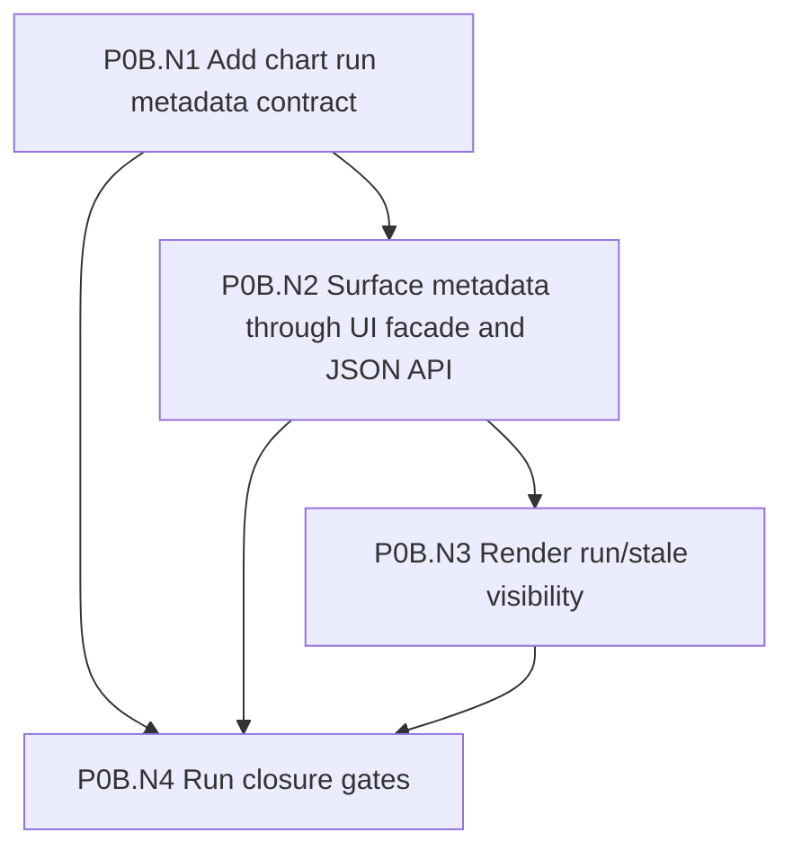

# Bug Trend Dashboard 产品要求文档

日期：2026-08-20

## 目的

本文件定义 Metrics dashboard 中 Bug Trend 功能从当前 demo 走向生产功能所需的产品能力、页面体验、设计细节和验收标准。

当前 demo 已经具备一个重要基础：真实 Intel Jira 数据可以被只读采集、持久化为本地历史与计算产物，并在 Bug Trend 页面上显示上方趋势图和下方 evidence ticket list。下一阶段的产品化目标是 C-first：验证 Grafana 能否成为主要 dashboard UI，同时让 Metrics 继续拥有 scope 语义、计算产物、evidence contract、Chart Catalog validation、audit 和 AI governance。

## 产品目标

1. 用户可以针对不同 Jira project/IP/team 创建和维护 Bug Trend scope，而不需要修改代码或环境变量。
2. 每个 scope 的 bug 类型、状态、resolution、severity、component、owner、milestone 等语义由 Metrics 统一管理。
3. Dashboard 图表和 ticket evidence list 必须从同一个计算产物读取数据，不能出现图表数字和列表证据不一致。
4. 用户可以从图表点击到对应 bucket/series 的 ticket 证据，也可以对列表做局部过滤和导出。
5. 生产页面需要清楚展示数据新鲜度、计算版本、配置版本、sync/calculation 状态和潜在数据质量问题。
6. Grafana 和 AI 模块只能消费 Metrics 产出的确定性数据/定义，不能成为项目语义的第二套 truth system。

## 目标用户

| 用户 | 主要需求 |
| --- | --- |
| Engineering manager | 快速判断 bug in、bug out、open backlog 和 critical/high 趋势是否健康。 |
| Scrum master / project owner | 按 milestone、component、owner、team 查看趋势和证据列表。 |
| Developer / validator | 点击图表后看到具体 Jira ticket，确认某个 bucket 数字从哪里来。 |
| Dashboard maintainer | 配置项目 scope、检查 unmapped Jira values、处理 sync/calculation 异常。 |
| Future AI user | 用自然语言要求系统生成某个时间范围、某个 scope、某种指标的图表。 |

## 核心用户故事

1. 作为 dashboard 用户，我可以选择 IP、Project/Scope、Begin、End，看到指定范围的 Bug Trend 图和证据列表。
2. 作为 dashboard 用户，我点击某个 week/day 的 `new_critical_high` bar 后，下方列表只显示贡献这个 bar 的 Jira tickets。
3. 作为 dashboard 用户，我点击 Clear selection 后，列表恢复为当前可见时间范围内所有参与图表计算的 distinct tickets。
4. 作为 dashboard 用户，我可以用 list-local filters 缩小 evidence list，但不会误以为图表数字也被改变。
5. 作为 scope owner，我可以编辑当前 project 的 bug/status/severity/milestone 映射，并触发重新计算。
6. 作为 scope owner，我可以看到真实 Jira 中出现过但未被当前 scope config 覆盖的 status、priority、resolution 或 component。
7. 作为生产运维者，我可以看到每个 scope 最近一次 sync 和 calculation 是否成功、是否 stale、是否有 warning。
8. 作为 AI 用户，我可以请求生成一个新的 daily bug in/out 图表，并在 Metrics-governed chart surface、Grafana App chart selector 或 Chart Catalog 中查看、切换和追溯它。

## 部署模式、权限与审计

产品需要支持两种部署模式，通过环境配置切换。第一阶段优先实现个人使用模式，但必须预留 cloud 审批接口和状态字段。

```text
METRICS_DASHBOARD_GOVERNANCE_MODE=personal | cloud
```

| 模式 | 目标场景 | 发布策略 | 第一阶段要求 |
| --- | --- | --- | --- |
| `personal` | 单人或本地 demo 使用。 | AI-generated chart、user-created chart 通过 validator 后可直接保存为个人可见 draft/published。 | 优先实现；无需人工审批，但仍记录 audit event。 |
| `cloud` | 多用户公共 dashboard。 | Chart publish、Grafana provisioning、shared scope config activation 需要审批。 | 第一阶段留好接口、状态和权限模型，不要求完整审批 UI。 |

### 角色

| 角色 | 权限边界 |
| --- | --- |
| `viewer` | 查看被授权 scope 的 dashboard、点击 evidence、使用 list filters、导出 evidence。 |
| `scope_owner` | 创建/编辑自己负责的 scope config draft，触发 audit/recalculation，申请启用配置。 |
| `dashboard_maintainer` | 管理 scope、sync/calculation、Data Health、Grafana parity 和故障处理。 |
| `chart_author` | 创建 user-created 或 AI-generated chart draft，预览并提交发布。 |
| `chart_approver` | cloud 模式下审批、发布、禁用、回滚 shared chart。 |
| `admin` | 管理用户权限、全局配置、Grafana datasource allowlist 和治理模式。 |

### 动作权限

| 动作 | `personal` 模式 | `cloud` 模式 |
| --- | --- | --- |
| 查看 dashboard | 有 scope view 权限即可。 | 有 scope view 权限即可。 |
| 导出 evidence | 有页面访问权即可，必须审计。 | 有页面访问权即可，必须审计。 |
| 编辑 scope config | scope owner 或 maintainer。 | scope owner 可编辑 draft，启用需 maintainer/admin。 |
| 触发 recalculation | scope owner 或 maintainer。 | scope owner 或 maintainer，必须审计。 |
| 创建 AI chart draft | chart author 或 maintainer。 | chart author 或 maintainer。 |
| 发布 chart | chart author 或 maintainer；validator 通过即可发布到个人 chart selector，必须审计。 | 需要 chart approver/admin 审批。 |
| 回滚/禁用 chart | chart owner 或 maintainer。 | chart approver、maintainer 或 admin。 |
| Grafana provisioning | maintainer。 | maintainer 发起，approver/admin 批准。 |

### 审计事件

所有生产相关动作都应写入 audit log，至少包含：

| 字段 | 含义 |
| --- | --- |
| `event_type` | scope_saved、scope_activated、calculation_started、evidence_exported、chart_draft_created、chart_validation_started、chart_validation_passed、chart_validation_failed、chart_publish_requested、chart_publish_approved、chart_publish_rejected、chart_published、chart_disabled、chart_rolled_back、chart_archived、grafana_provisioned 等。 |
| `actor` | 用户或服务账号。 |
| `governance_mode` | `personal` 或 `cloud`。 |
| `scope_id` | 关联 scope。 |
| `chart_id` / `chart_version` | 关联 chart。 |
| `calculation_run_id` | 关联计算产物。 |
| `request_summary` | 非 secret 的请求摘要。 |
| `result` | success、warning、failed、rejected。 |
| `created_at` | 事件时间。 |

## 页面信息架构

### 主导航

建议增加或保留以下 dashboard 入口：

| 页面 | 用途 |
| --- | --- |
| Bug Trend | 当前主要用户页面，显示趋势图、筛选器和 evidence list。 |
| Scope Config | 创建和维护 Jira scope config。 |
| Scope Audit | 展示真实 Jira observed values、unmapped values 和配置建议。 |
| Calculation Runs | 查看每次计算的范围、版本、状态、耗时、warning 和产物数量。 |
| Data Health | 查看 Jira connectivity、sync status、scheduler status、DB 状态和 stale scopes。 |
| Chart Catalog | 未来管理 Grafana/AI 生成的 chart specs、版本和可见性。 |

### Bug Trend 页面布局

页面采用上下结构：

1. 顶部 filter bar。
2. 主图表区域。
3. 图表状态和数据版本摘要。
4. 下方 evidence ticket list。
5. 可选的 chart catalog/variant selector，用于切换同一 scope 下的不同图表。

建议布局：

```text
Bug Trend Dashboard

[Scope] [Milestone] [Component] [Owner] [Begin] [End] [Apply]
[Data freshness/status line: last sync, calculation run, config hash, warnings]

[Chart slot: default Bug Trend / selected Grafana panel / selected AI-generated chart]

[Selection summary: visible range or selected bucket/series]
[List-local filters: text, status, severity, owner, component, series]
[Evidence ticket table]
```

## Filter 设计要求

### Chart filters

Chart filters 同时影响图表和 evidence list。

MVP 后续建议支持：

| Filter | 数据来源 | 行为 |
| --- | --- | --- |
| Scope | `jira_scope_config` | 切换完整数据 universe 和语义配置。 |
| Begin / End | 用户输入 | 限制 bucket 时间范围。 |
| Milestone / Fix Version | scope config 指定字段 | 同时过滤 chart buckets 和 evidence rows。 |
| Component / Team | scope config 指定字段 | 同时过滤 chart buckets 和 evidence rows。 |
| Owner | assignee 或 scope owner field | 同时过滤 chart buckets 和 evidence rows。 |
| Priority / Severity | severity field | 同时过滤 chart buckets 和 evidence rows。 |
| Work item type | Jira issue type | 默认可锁定为 bug，也可做诊断过滤。 |

### List-local filters

List-local filters 只缩小 evidence list，不改变图表数据。

UI 必须明确标注，例如使用标题 `Evidence filters` 或 helper text `These filters narrow the ticket list only`。

建议支持：

| Filter | 行为 |
| --- | --- |
| Text search | 搜索 key、summary、owner、component。 |
| Status | 过滤当前 evidence rows。 |
| Severity | 过滤当前 evidence rows。 |
| Owner | 过滤当前 evidence rows。 |
| Component | 过滤当前 evidence rows。 |
| Series | 过滤当前 evidence rows。 |

## 图表设计要求

### 默认 Bug Trend 图

默认图表应继续支持：

| Series | 类型 | 方向 | 设计 |
| --- | --- | --- | --- |
| `all_open_bugs` | Line | Positive | 主 backlog 趋势线，颜色稳定。 |
| `all_open_critical_high` | Line | Positive | critical/high 趋势线，视觉优先级高于普通 backlog。 |
| `new_critical_high` | Bar | Positive | bug in，高严重度，使用警示色。 |
| `new_medium_low` | Bar | Positive | bug in，中低严重度，使用次级色。 |
| `fixed_or_closed_bugs` | Bar | Negative | bug out，负向柱状图，但 evidence list count 始终为正数。 |

图表必须支持：

1. Legend toggle。
2. Hover tooltip。
3. Click bucket/series 后刷新下方 evidence list。
4. Empty state：没有数据时说明当前 scope/date/filter 没有可计算 bucket。
5. Error state：计算失败时显示原因和下一步动作。
6. Stale state：scope config 或 Jira sync 已更新但 chart 仍来自旧 calculation run。

### 图表容器设计

生产方向是 C-first：Grafana 应成为主要 dashboard UI candidate，但不能成为业务语义和 evidence query owner。Metrics 必须继续拥有 `PageQueryState` schema、`IndicatorDefinition`、`EvidenceContract`、Chart Catalog validator、audit、fallback/reference path 和 AI governance。

因此产品上需要的不是任意 Grafana iframe，而是受控 chart surface：

```text
ChartSurface
  chart_id
  chart_version
  renderer_type: chartjs | grafana | static_image
  integration_route: reference | c_stock | c_plugin
  page_query_state
  evidence_contract_id
```

这样图表可以由 Grafana 承载，但筛选器语义、证据列表、权限、导出、audit 和 AI 生成图表仍由 Metrics 统一治理。

### Chart 与 Evidence List 的主从关系

Bug Trend 页面最终可以由 Grafana dashboard/app shell 承载。页面内的当前 evidence context 由上半部分的 active chart 拥有，下半部分 Evidence list 是 active chart 的证据投影，且由 Metrics evidence API 生成。

```text
Grafana Dashboard/App Shell
  owns: chart layout, active chart interaction, dashboard variables

Metrics Backend Governance
  owns: scope/date state schema, permissions, Chart Catalog, export, audit, evidence API

Active Chart
  owns: selected chart definition, selected bucket/series/dimension

Evidence List
  derives from: active chart evidence contract + list-local filters
```

这意味着切换上半部分图表时，下半部分列表必须重新绑定到新 active chart 的 evidence contract。点击图表时，只更新 chart selection 和 evidence list，不应让 Grafana 或 Chart.js 独立决定列表内容。

并非所有图表都可以驱动 bug list。每个 chart definition 必须声明自己的 evidence 能力：

| Evidence 能力 | 说明 | UI 行为 |
| --- | --- | --- |
| `bucket_series` | 图表点击可映射到 bucket + series + membership。 | 支持点击图表刷新 Evidence list。 |
| `range_only` | 图表只能映射到当前 scope/date/filter 范围。 | 不支持单点 drilldown，下方显示 visible-range evidence。 |
| `summary_only` | 图表无法可靠映射到 tickets。 | 不驱动 Evidence list，UI 必须明确提示。 |

产品规则：只有 `bucket_series` 或等价能力的 chart 才能成为 Bug Trend + Evidence 页面主 slot 的完整 active evidence owner。`range_only` chart 可以显示列表，但不能声称列表解释了某个图表点。`summary_only` chart 更适合放在 summary dashboard，不适合放在需要 ticket evidence 的主分析页面。

### EvidenceContract 字段要求

每个可解释图表必须绑定一个后端可验证的 `EvidenceContract`。它是图表和 bug list 之间的唯一连接点。

| 字段 | 要求 |
| --- | --- |
| `contract_id` | 稳定 ID，供 ChartDefinition 引用。 |
| `capability` | `bucket_series`、`range_only` 或 `summary_only`。 |
| `membership_source` | 允许的 membership table/view；逻辑名为 `bucket_membership_view`，MVP 默认映射到当前 durable artifact `bug_trend_bucket_issue`，未来 source-neutral 实现可映射到 `work_item_bucket_membership`。 |
| `membership_key` | membership row 的唯一键，避免 export/pagination 重复。 |
| `bucket_dimension` | bucket 字段，例如 week、date 或 bucket id。 |
| `series_dimension` | series 字段，例如 `new_critical_high`。 |
| `ticket_identity` | source system + source item key，定义 distinct ticket。 |
| `dedupe_policy` | visible-range 是否 distinct ticket；bucket-series 是否 membership grain。 |
| `time_boundary_policy` | bucket timezone、inclusive/exclusive 边界。 |
| `allowed_list_filters` | 允许的 list-local filters。 |
| `export_policy` | export 使用当前 result snapshot/calculation run，不重新查最新 run。 |
| `unsupported_reason` | `summary_only` chart 必须给出用户可读原因。 |

EvidenceContract 不能包含任意业务 SQL。它只能引用 Metrics-owned indicator definition、fact view 和 membership artifacts。

## Evidence List 设计要求

Evidence list 是生产功能的核心，不是辅助表格。

### 必需状态

| 状态 | 触发 | 标题示例 | 列表内容 |
| --- | --- | --- | --- |
| Visible range evidence | 未选择 bucket | Evidence tickets for visible range | 当前图表可见范围内参与任意 series 的 distinct tickets。 |
| Bucket evidence | 选择某个 bucket | Evidence tickets for 25WW16 | 该 bucket 内参与任意 series 的 tickets。 |
| Bucket-series evidence | 选择 bucket + series | `new_critical_high` tickets for 25WW16 | 该 bucket/series 的 membership rows。 |

### 必需列

| 列 | 要求 |
| --- | --- |
| Source | Jira/GitHub/未来来源。 |
| Key | 可点击 source URL，不再调用 source API。 |
| Summary | ticket 标题。 |
| Series | 解释该行贡献了哪个图表 series。 |
| Type | Jira issue type 或 source-neutral type。 |
| Status / State | 当前状态或计算所需历史状态。 |
| Priority / Severity | 支持 critical/high 解释。 |
| Owner | assignee 或 owner field。 |
| Component / Label | component、label 或 team 维度。 |
| Created / Updated / Resolved | 支持时间范围解释。 |
| Display Fields | 每个 scope 自定义的额外字段，顺序必须跟 scope config 一致。 |

### 交互细节

1. 当用户点击图表时，Evidence list 更新但图表不需要重绘。
2. Clear selection 只清除 bucket/series 选择，不改变 scope/date/chart filters。
3. List-local filters 不改变图表数字。
4. Export 必须导出当前 evidence result，而不是重新查最新 run。
5. 每一行 source link 必须来自已存储 source URL 或可确定构造的 URL，不能依赖实时 Jira API。
6. 切换 chart selector 时，Evidence list 必须清除旧 chart 的 bucket/series selection，并按新 chart 的默认 evidence state 重新加载。
7. 如果新 chart 是 `range_only`，Evidence list 标题必须说明它显示的是当前 chart range evidence，而不是某个 clicked point 的 evidence。
8. 如果新 chart 是 `summary_only`，Evidence list 区域应显示说明性 empty state，避免用户误以为列表解释了该图。
9. Multi-panel layout 中只能有一个 active panel 控制 Evidence list；active panel 必须有明确视觉状态。
10. Evidence list 的 query 由 Metrics 后端执行，不能由 Grafana panel SQL 或前端脚本拼接成为第二套规则。

## Scope Config 产品要求

### 字段编辑

Scope config 页面至少支持：

1. 基本信息：name、IP、project label、enabled。
2. Query：JQL 或 saved query。
3. Bug classification：bug type values。
4. Lifecycle mapping：open/fixed/closed/terminal excluded/reopen statuses。
5. Resolution mapping：fixed/closed resolution values。
6. Severity mapping：severity field、critical/high values、medium/low values。
7. Display fields：evidence table 的额外字段和顺序。
8. Timezone 和 bucket granularity。
9. Component/owner/team/milestone/fix version field mappings。

### 配置体验

1. 支持保存草稿和启用配置。
2. 保存后显示 semantic config hash。
3. 修改会提示是否需要重新计算。
4. 配置页面应显示 observed values，帮助用户从真实 Jira 数据选择 mapping。
5. 禁止在 UI 中显示或保存 Jira token、PAT、password。

## Scope Audit 产品要求

Scope Audit 页面用于把真实 Jira 数据中的值暴露给配置 owner。

建议展示：

| 区域 | 内容 |
| --- | --- |
| Observed issue types | 所有 issue type 及计数。 |
| Observed statuses | 所有 status 及计数，标记是否已映射到 open/fixed/closed/excluded。 |
| Observed resolutions | 所有 resolution 及计数，标记是否已映射。 |
| Observed priorities/severities | 所有 priority/severity 值及 critical/high mapping 状态。 |
| Observed components/labels | component/team/label 值及计数。 |
| Unmapped values | 当前配置没有覆盖但出现在真实数据中的值。 |
| Data coverage | created、updated、resolutiondate、changelog、status transitions、resolution transitions 覆盖率。 |

验收标准：

1. 新 Jira scope 至少可以通过 Audit 页面发现 `P1-Stopper` 这类真实 priority 值。
2. Unmapped lifecycle values 必须可见，不能只在日志中出现。
3. Audit 不修改 Jira，仅读取本地 raw archive 或已同步 payload。

## Calculation Runs 产品要求

Calculation Runs 页面用于生产可追溯性。

每次 run 应展示：

1. run id。
2. scope id/name。
3. begin/end。
4. bucket granularity。
5. config version hash。
6. source snapshot/sync marker。
7. issue count、bucket count、membership count。
8. started/finished/duration。
9. status：success、warning、failed、stale。
10. warnings/errors。

用户动作：

1. View chart from this run。
2. View evidence from this run。
3. Recalculate current scope。
4. Compare two runs。

## Data Health 产品要求

生产环境需要一个 Data Health 页面或顶部状态入口：

1. Jira connectivity health。
2. Read-only auth validation。
3. Scheduler/worker health。
4. Latest sync per scope。
5. Latest calculation per scope。
6. Stale scopes。
7. Failed sync/calculation。
8. Warning count。
9. Local DB/storage usage。

## Chart Catalog 产品要求

Chart Catalog 是未来支持多图和 AI-generated charts 的核心。

每个 chart definition 应包含：

| 字段 | 含义 |
| --- | --- |
| chart_id | 稳定 ID。 |
| title | UI 显示名称。 |
| description | 用户可读说明。 |
| renderer_type | canonical renderer enum：`chartjs`、`grafana`、`static_image`。 |
| integration_route | `reference`、`c_stock` 或 `c_plugin`，表示宿主/集成路线，不是第二套 renderer truth。 |
| source | built-in、user-created、ai-generated。 |
| scope compatibility | 可用于哪些 scope/source/indicator definition。 |
| required facts | 需要哪些 fact tables/views。 |
| evidence contract | 点击图表后如何查询 evidence。 |
| evidence capability | `bucket_series`、`range_only` 或 `summary_only`。 |
| click mapping | 图表点击事件如何映射到 bucket、series、dimension。 |
| status | `draft`、`previewed`、`pending_approval`、`approved`、`rejected`、`published`、`disabled`、`rolled_back`、`archived`。 |
| version | 图表定义版本。 |
| owner | 创建者或 owning team。 |
| enabled | 是否在 UI 可见。 |

Bug Trend 页面可以在主图上方提供 chart selector：

```text
[Chart: Default Bug Trend v1 ▼] [Manage charts]
```

选择不同 chart 后，页面仍保留同一套 scope/date filters 和 evidence list contract。

Chart Catalog 必须阻止没有 evidence contract 的 chart 被误配置成主 evidence chart。AI-generated chart 默认进入 draft 状态，只有通过 Metrics validator 后才能成为可选 chart。

ChartDefinition 不拥有业务语义 SQL。它只能组合：

```text
ChartDefinition
  -> IndicatorDefinition reference
  -> EvidenceContract reference
  -> RendererSpec
  -> Scope compatibility
```

`published` 版本不可原地修改；任何改变都创建新版本。旧版本可以 disabled 或 archived，但不能被静默覆盖。

`approved` 只在 cloud shared publish 中必需。`personal` 模式下，chart author 或 maintainer 可以在 validator 通过后直接发布到个人 chart selector，但仍必须记录 validation 和 publish audit events。

## 非功能要求

1. Jira 操作必须只读。
2. 不得在 docs、fixtures、logs、Grafana JSON、AI prompt 或 DB fact rows 中存储 secret。
3. 图表和 evidence list 必须 pin 到同一个 calculation run。
4. 生产路径不能依赖 demo fixture。
5. Warning 默认作为 test failure 处理。
6. 页面加载应允许 chart 和 evidence 局部刷新，不需要整页 reload。
7. 对大 scope 必须支持分页、limit、导出任务或异步导出，避免一次性渲染过多 ticket rows。
8. Chart selector、chart click、Clear selection 和 list-local filters 都必须收敛到一个后端 PageQueryState，不允许各层保存互相独立的选择状态。
9. `personal` 模式可以跳过人工审批，但不能跳过 validator 和 audit。
10. `cloud` 模式必须支持 chart publish/provisioning 审批接口。

## MVP 后续实施增量

| 增量 | 用户价值 | 交付范围 | 非目标 | DoD |
| --- | --- | --- | --- | --- |
| P0a Demo hardening | 当前真实 Jira demo 可稳定验收。 | 保持 Chart.js reference chart + evidence list；补数据状态、empty/error/unsupported 文案。 | 不做 Grafana 正式路径。 | 现有 real Jira fixture chart/list 回归通过；warnings-as-errors 通过。 |
| P0b Run/stale visibility | 用户知道图表来自哪次计算。 | 显示 calculation run、config hash、coverage、completed time、fresh/stale 状态。 | 不做完整 run compare；`last sync` 留给 P1 Data Health。 | 改 scope config 后旧 chart 显示 config stale。 |
| P0c Read-only Scope Audit | scope owner 能看真实 Jira observed values。 | issue type/status/resolution/priority/component/coverage audit。 | 不提供自动修复 mapping。 | `P1-Stopper` 等真实值可见且标记 mapped/unmapped。 |
| P0d Scope Config draft/activate | 用户可维护项目语义。 | draft 编辑、activate、config hash、recalculate 提示。 | cloud 审批 UI 仅预留接口。 | 新 scope 无需改代码可生成 Bug Trend。 |
| P1 Chart/list filters + export | 用户能做实际分析和带走证据。 | chart filters、list-local filters、audit-backed evidence export。 | 不做自定义图表。 | Export 行数等于当前 evidence result。 |
| P1 Data Health | Maintainer 能定位生产问题。 | Jira connectivity、sync/calculation status、failed/warning scopes。 | 不做自动恢复。 | Data Health 可定位最近失败 run。 |
| P2 Minimal Chart Catalog | 支持多图入口但不扩大主路径。 | ChartDefinition、EvidenceContract、Chart selector，一个 built-in chart。 | 不做 multi-panel layout。 | 切换 chart 清除旧 selection 并重载 evidence。 |
| P2 C-stock Grafana feasibility | 验证是否可以直接让 stock Grafana 成为主图表路径。 | Grafana 主图、变量/time range 同步、与 Chart.js 数字比对、click/data-link 到 evidence 可行性。 | 不承诺 stock Grafana 覆盖全部 PRD。 | 同一 PageQueryState 下 Grafana 与 reference chart 一致，并明确 event/evidence gate 是否通过。 |
| P2/P3 C-plugin spike | 当 C-stock 不满足 evidence 联动时，验证 Grafana App/Scenes 主页面。 | Grafana App/Scenes 内实现 chart selector、active chart state、evidence list 调 Metrics API。 | 不迁移 Jira sync/indicator/evidence ownership 到 Grafana。 | Grafana app 可以在同一页面完成 chart + evidence 联动。 |
| P3 AI draft chart pipeline | 用户可用自然语言生成 draft chart。 | AI request、validator、draft preview、personal 模式直接发布。 | cloud 审批完整 UI 可后续。 | AI chart 未通过 validator 不出现在 chart selector。 |

## P0b Run/Stale Visibility DAG

P0b 只解决一个生产可见性问题：用户必须知道当前 Bug Trend 图表来自哪次 Metrics-owned calculation run，以及该 run 是否匹配当前 scope config。它不实现 scope config editor、不做完整 run compare、不显示 `last sync`，也不让 Grafana 或 Django template 自己推断 stale 语义。`last sync` 的 owner 属于后续 P1 Data Health。

### P0b Contract Registry

| Contract | Owner | Consumers | Disconfirming check |
| --- | --- | --- | --- |
| `INV-P0B-RUN-METADATA` | `bug_metrics.app.api.BugTrendChart` | `ui_web` page, JSON API, Grafana payload | Focused tests fail if a fresh chart omits run id, run config hash, current scope config hash, completed time, coverage range, or freshness status. |
| `INV-P0B-STALE-AUTHORITY` | `bug_metrics.app.api.ApiForBugTrend.get_chart` | `ui_web`, Grafana payload | Test changes scope config after a completed run and expects `freshness_status=stale_config`, stale run metadata, and no evidence panel claiming current data. |
| `INV-P0B-UI-VISIBILITY` | `ui_web` Bug Trend template/facade | End user | View test fails if fresh/stale status and run/config hash are not visible in the Bug Trend page. |
| `INV-P0B-GRAFANA-PAYLOAD` | `ui_web.facades.BugTrendFacade.get_chart_payload` | Grafana C-stock dashboard and validators | JSON API test fails if payload omits `run_metadata.calculation_run_id`, `run_config_version_hash`, `current_config_version_hash`, `freshness_status`, `source_coverage_start`, `source_coverage_end`, or `completed_at`. |

### P0b DAG Nodes

| id | depends_on | owner_paths | authority_boundary | contracts | validation | exit_criteria | parallel_policy |
| --- | --- | --- | --- | --- | --- | --- | --- |
| P0B.N1 - Add chart run metadata contract | [] | `bug_metrics/app/api/`, `bug_metrics/tests/` | `bug_metrics` owns calculation run freshness and config-hash semantics. | `INV-P0B-RUN-METADATA`, `INV-P0B-STALE-AUTHORITY` | API tests for fresh run metadata and stale config after scope config changes. | `BugTrendChart` exposes fresh/stale/no-run metadata without UI-specific interpretation. | serial |
| P0B.N2 - Surface metadata through UI facade and JSON API | [P0B.N1] | `ui_web/facades/`, `ui_web/data/`, `ui_web/tests/` | UI facade transports API-owned metadata; it does not recompute freshness. | `INV-P0B-RUN-METADATA`, `INV-P0B-GRAFANA-PAYLOAD` | Facade/API tests assert payload contains run metadata and stale status. | Chart JSON and Grafana payload can show operator-visible run/config state. | serial |
| P0B.N3 - Render run/stale visibility on Bug Trend page | [P0B.N2] | `ui_web/templates/`, `ui_web/tests/` | Template presents API-owned freshness state. | `INV-P0B-UI-VISIBILITY`, `INV-P0B-STALE-AUTHORITY` | View tests assert fresh run details render; stale config displays recalculation guidance and no evidence panel is rendered under current-scope semantics. This is P0b UI policy, not a claim that historical stale evidence is unavailable. | User can distinguish fresh current chart from stale/no-run state. | serial |
| P0B.N4 - Run closure gates | [P0B.N1, P0B.N2, P0B.N3] | `bug_metrics/tests/`, `ui_web/tests/`, `docs/` | Validation evidence owner. | all P0b contracts | Focused tests, `manage.py check`, Grafana artifact validator, C0/C1 evidence checkers, whitespace/file-size gates. | P0b can be committed without weakening C-stock validation. | serial |



### P0b Execution Ledger

- [ ] P0B.N1 - Add chart run metadata contract
- [ ] P0B.N2 - Surface metadata through UI facade and JSON API
- [ ] P0B.N3 - Render run/stale visibility on Bug Trend page
- [ ] P0B.N4 - Run closure gates

### P0b Validation Commands

```powershell
.venv\Scripts\python.exe -m pytest bug_metrics\tests\test_api_bug_trend_contracts.py ui_web\tests\test_bug_trend_views.py ui_web\tests\test_bug_trend_fact_table_ui.py -q
.venv\Scripts\python.exe scripts\validate_grafana_artifacts.py --artifact-root ops\grafana --allowlist docs\grafana-approved-data-surfaces.json
.venv\Scripts\python.exe scripts\check_c0_validation_evidence.py --evidence docs\c0-validation-closure-evidence.md
.venv\Scripts\python.exe scripts\check_c1_evidence_link_evidence.py --evidence docs\c1-evidence-link-validation-evidence.md
.venv\Scripts\python.exe manage.py check
.venv\Scripts\python.exe scripts\check_file_size_limits.py --include-untracked
.venv\Scripts\python.exe scripts\check_diff_whitespace.py --include-untracked
```

## 验收标准

1. 用户无需改代码即可创建一个新的 Jira scope 并生成 Bug Trend。
2. 一个真实 Jira scope 的 observed status/priority/resolution values 可以在 UI 中查看。
3. 图表点击任意 bucket/series 后，Evidence list 只显示同一 calculation run 的匹配 tickets。
4. Clear selection 后，Evidence list 回到 visible-range distinct tickets。
5. 修改 scope config 后，旧 chart 明确显示 stale 或要求重新计算。
6. Export 的行数和当前 Evidence list result 一致。
7. Data Health 可以显示最新 sync/calculation 状态。
8. Grafana panel 或 AI-generated chart 即使渲染失败，也不能破坏默认 Bug Trend reference chart 和 evidence list。
9. 切换到另一个 evidence-backed chart 后，下方 Evidence list 使用新 chart 的 evidence contract，旧 chart 的 selection 不再生效。
10. 切换到 `summary_only` chart 后，UI 不显示误导性的 ticket evidence，而是明确说明该图不支持 ticket-level evidence。

### 行为验收样例

| 场景 | Given | When | Then |
| --- | --- | --- | --- |
| 点击 bucket-series | active chart 是 `bucket_series`，chart/list pin 到 run `R1`。 | 用户点击 `25WW16/new_critical_high`。 | Evidence query 使用 run `R1`、bucket `25WW16`、series `new_critical_high`，列表只显示匹配 membership。 |
| 切换 chart | 用户已在 Chart A 选择 bucket。 | 用户切换到 Chart B。 | PageQueryState 清除 Chart A selection，Evidence list 按 Chart B evidence capability 重新加载。 |
| List-local filter | 图表显示 100 个 evidence tickets。 | 用户在 Evidence filters 输入 owner。 | 图表不变，列表缩小，标题显示 shown/total。 |
| Summary-only chart | active chart 是 `summary_only`。 | 页面渲染或用户切换到该 chart。 | Evidence 区域显示 unsupported state，不展示旧列表。 |
| Export | 当前 evidence result pin 到 run `R1` 且有 list filters。 | 用户点击 export。 | 导出内容与当前 result 一致，并记录 `evidence_exported` audit event。 |
| Personal AI publish | governance mode 是 `personal`，AI chart validator 通过。 | 用户保存 chart。 | Chart 可直接进入个人 chart selector，并记录 audit event。 |
| Cloud AI publish | governance mode 是 `cloud`，AI chart validator 通过。 | 用户提交发布。 | Chart 进入 pending approval，不进入 shared chart selector。 |
