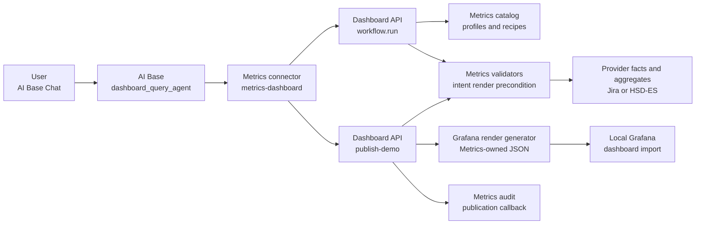
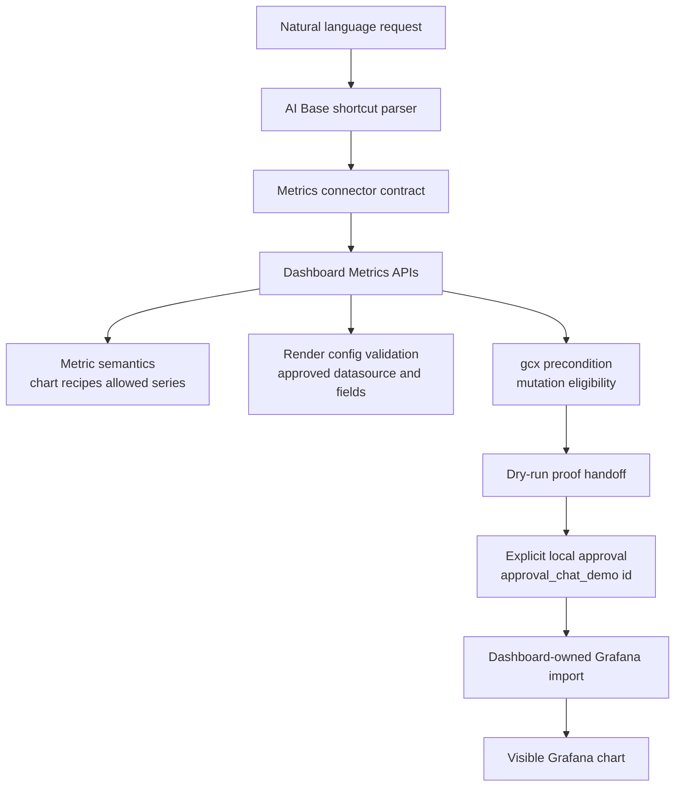
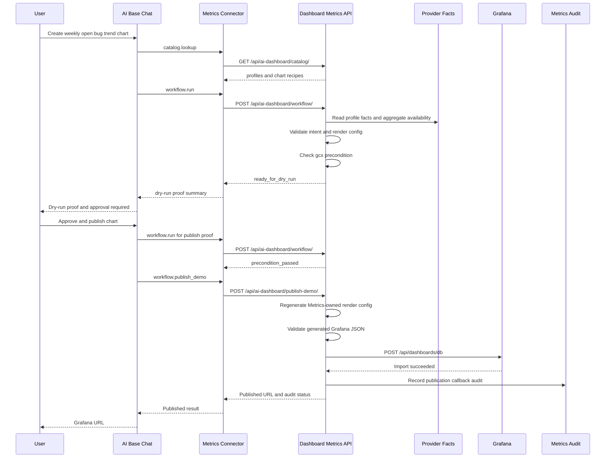
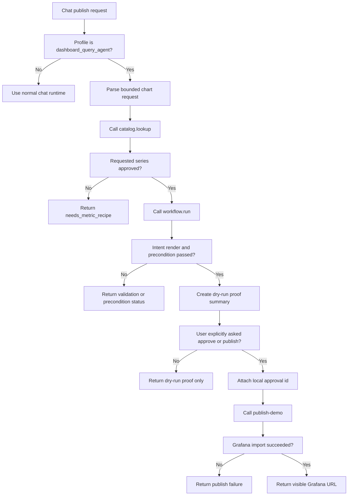
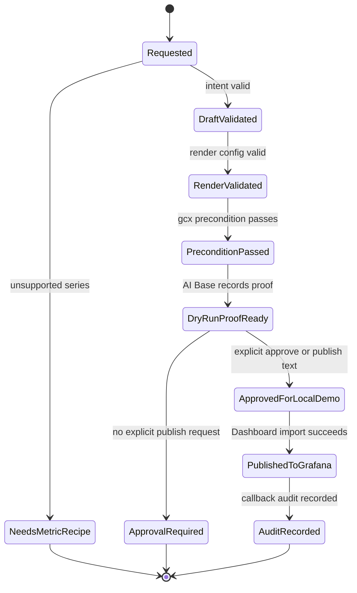
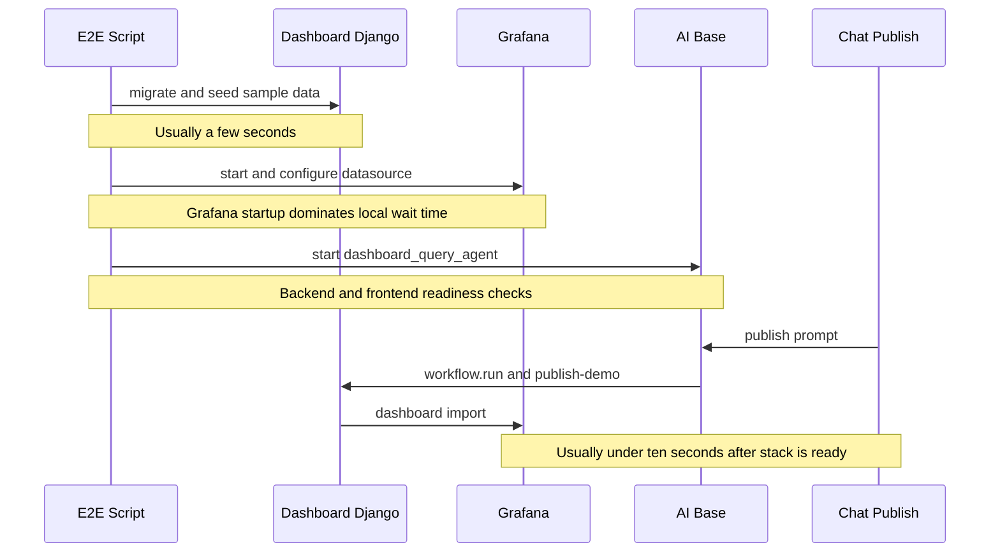

# AI Base Chat 到 Grafana 可见图表端到端案例

## 概览

本案例描述 `scrum_dashboard` 与 `Report_creater_agent` 两个应用如何协作，让用户在 AI Base Chat 中用一句自然语言请求生成 dashboard chart，并在明确 approve/publish 后把 Metrics 验证过的图表发布到本地 Grafana 页面。

案例使用的演示请求是：

```text
Approve and publish a weekly open bug trend chart for NVU HSDES from 26WW32 to 26WW35, only new critical/high.
```

成功结果是 Grafana 中出现一个由 Dashboard 生成并导入的 `AI Draft Dashboard`，其中包含 `Open Bug Trend` chart，profile 为 `nvu-ttl-hsdes`，range 为 `26WW32` 到 `26WW35`，series 为 `new_critical_high`。

## 目的

这个 case study 的目的不是证明 AI 可以直接修改 Grafana，而是证明一个更安全的产品形态：

- 用户可以从 AI Base Chat 发起 chart authoring 请求。
- AI Base 只负责 orchestration、Chat 交互、connector 调用和 approval handoff。
- Dashboard/Metrics 始终拥有 provider profile、chart recipe、metric semantics、render config validation、Grafana import 和 audit。
- AI 不能绕过 Metrics validator，也不能把 unsupported semantics 静默改写成 supported semantics。
- 只有用户明确输入 approve/publish 意图后，才会执行 local approved demo publish。

## 参与应用

| 组件 | 职责 |
| --- | --- |
| 用户 | 在 AI Base Chat 中输入创建或发布图表的自然语言请求。 |
| AI Base / `dashboard_query_agent` | 识别受控 Chat shortcut，调用 Metrics connector，返回 dry-run proof 或 Grafana URL。 |
| Dashboard / Metrics Django | 暴露 `workflow.run` 和 `publish-demo` API，执行 Metrics validation、render config generation、Grafana import、audit。 |
| Provider facts / aggregates | 提供 Jira 或 HSD-ES profile 的 canonical facts 和 materialized aggregate。 |
| Grafana | 展示由 Dashboard 导入的 dashboard JSON。 |

## 架构总览



关键点：

- AI Base 通过 connector 调 Dashboard API，不直接访问 provider credential。
- Dashboard 通过 profile registry 和 chart recipe 决定哪些 chart/series 能被生成。
- `workflow.run` 只产生验证结果和 dry-run proof guidance。
- `publish-demo` 需要 explicit approval id 和 dry-run proof id。
- Grafana 只接收 Dashboard 生成并验证过的 JSON。

## 分层职责



这条链路把 “AI 想要做什么” 和 “系统允许发布什么” 分开：

- AI Base 可以解释用户意图，但不能拥有 metric semantics。
- Dashboard 可以接受意图，但必须用 catalog/recipe/validator 证明它安全。
- Grafana import 是最后一步，并且只能使用 Dashboard 生成的 artifact。

## 两阶段用户流程

### 阶段一：创建 chart dry-run proof

用户输入：

```text
Create a weekly open bug trend chart for NVU HSDES from 26WW32 to 26WW35, only new critical/high.
```

预期结果：

- AI Base 调用 Dashboard `workflow.run`。
- Dashboard 返回 `draft_validated`、`render_validation=draft_validated`、`gcx_precondition=precondition_passed`。
- AI Base 返回 `dryrun_...` proof。
- 不执行 Grafana mutation。

### 阶段二：明确批准并发布到 Grafana

用户输入：

```text
Approve and publish a weekly open bug trend chart for NVU HSDES from 26WW32 to 26WW35, only new critical/high.
```

预期结果：

- AI Base 重新走 dry-run validation。
- AI Base 生成 local demo approval id。
- AI Base 调用 Dashboard `publish-demo`。
- Dashboard 重新生成和验证 render config。
- Dashboard 导入 Grafana dashboard。
- Dashboard 记录 publication callback audit。
- AI Base Chat 返回 Grafana URL。

## 详细交互时序



## Publish 决策流程



## 状态机



## Timing 视图

下面的时间不是 SLA，而是本地 E2E demo 中的典型观察点，用于理解等待发生在哪里。



## 实际 Demo 步骤

### 1. 启动环境

```powershell
cd "C:\Users\lsheng2\OneDrive - Intel Corporation\Documents\my_project\scrum_dashboard"
powershell -ExecutionPolicy Bypass -File scripts\e2e_restart_dashboard_ai_stack.ps1 -ForceByPort -SkipJiraSync
```

成功后应看到：

- Dashboard AI Workflow: `http://127.0.0.1:8002/ai-dashboard/workflow/`
- AI Base frontend: `http://127.0.0.1:48310/`
- AI Base backend: `http://127.0.0.1:48300/`
- Grafana 通常为 `http://127.0.0.1:3001/`

### 2. 打开 AI Base Chat

打开：

```text
http://127.0.0.1:48310/
```

进入 `Chat`，新建 session。

### 3. 执行 dry-run

输入：

```text
Create a weekly open bug trend chart for NVU HSDES from 26WW32 to 26WW35, only new critical/high.
```

预期 Chat 回复包含：

- `Dashboard chart workflow completed.`
- `Profile: nvu-ttl-hsdes`
- `Provider: hsdes`
- `Series: new_critical_high`
- `Intent validation: draft_validated`
- `Render validation: draft_validated`
- `gcx precondition: precondition_passed`
- `Dry-run proof: dryrun_...`
- `Approval: human approval required before Grafana mutation`

### 4. 执行批准发布

输入：

```text
Approve and publish a weekly open bug trend chart for NVU HSDES from 26WW32 to 26WW35, only new critical/high.
```

预期 Chat 回复包含：

- `Dashboard chart published to Grafana.`
- `Dashboard: ai-open-bug-trend-demo`
- `URL: http://127.0.0.1:3001/d/ai-open-bug-trend-demo/...`
- `Dry-run proof: dryrun_...`
- `Approval: approval_chat_demo_...`
- `Audit: recorded`

### 5. 打开 Grafana URL

打开 Chat 回复里的 URL。当前验证过的形态类似：

```text
http://127.0.0.1:3001/d/ai-open-bug-trend-demo/ai-draft-dashboard?orgId=1&var-profile_id=nvu-ttl-hsdes&var-range_mode=ww&var-begin_ww=26WW32&var-end_ww=26WW35
```

预期看到：

- Dashboard title: `AI Draft Dashboard`
- Panel title: `Open Bug Trend`
- Profile variable: `nvu-ttl-hsdes`
- 图表有可见数据，不是 `No data`

## API 和契约

| 操作 | Owner | Endpoint / Operation | 作用 | 示例数据 |
| --- | --- | --- | --- | --- |
| Catalog lookup | Dashboard | `GET /api/ai-dashboard/catalog/` | 返回 profile 和 chart recipe catalog。 | Request: `profile_id=nvu-ttl-hsdes`。Response: `profiles[0].provider_id=hsdes`, `chart_recipes.open_bug_trend.allowed_series=[all_open_bugs, all_open_critical_high, new_critical_high, ...]`。 |
| Workflow run | Dashboard | `POST /api/ai-dashboard/workflow/` | 组合 intent validation、render validation、gcx precondition。 | Request: `profile_id=nvu-ttl-hsdes`, `chart_id=open_bug_trend`, `requested_series=[new_critical_high]`, `range_start=26WW32`, `range_end=26WW35`。Response: `intent_validation.status=draft_validated`, `render_validation.status=draft_validated`, `gcx_precondition.status=precondition_passed`。 |
| Publish demo | Dashboard | `POST /api/ai-dashboard/publish-demo/` | 在 approval/proof 存在时导入本地 Grafana。 | Request: `approval_id=approval_chat_demo_...`, `dry_run_proof_id=dryrun_...`, `dashboard_uid=ai-open-bug-trend-demo`。Response: `status=published`, `dashboard_url=http://127.0.0.1:3001/d/ai-open-bug-trend-demo/...`, `audit.status=recorded`。 |
| Connector orchestration | AI Base | `workflow.run`, `workflow.publish_demo` | 通过 Metrics connector 调用 Dashboard。 | `workflow.run` returns `dryRunProofId=dryrun_...`; `workflow.publish_demo` sends that proof plus `approval_chat_demo_...` to Dashboard and receives `status=published`。 |
| Chat shortcut | AI Base | `Create...`, `Approve and publish...` | 提供 deterministic E2E demo 入口。 | User prompt: `Approve and publish a weekly open bug trend chart for NVU HSDES from 26WW32 to 26WW35, only new critical/high.` Chat response includes `Dashboard chart published to Grafana`, `URL: ...`, `Audit: recorded`。 |

## 为什么使用 HSD-ES 做最终可视化案例

当前 fast E2E 命令使用 `-SkipJiraSync`，因此 Jira `chiplet-2a-jira` 在 `26WW32` 到 `26WW35` 可能没有 completed aggregate artifact。结果是 dashboard 会创建成功，但 panel 显示 `No data`。

HSD-ES `nvu-ttl-hsdes` 在本地已有可用 aggregate 数据，因此更适合作为不依赖外部 live sync 的稳定 demo case。

如果要用 Jira 作为 demo：

```powershell
powershell -ExecutionPolicy Bypass -File scripts\e2e_restart_dashboard_ai_stack.ps1 -ForceByPort
```

或者手动 sync Jira profile，确保 `26WW32` 到 `26WW35` 有 completed aggregate artifact。

## 安全边界

| 风险 | 当前防线 |
| --- | --- |
| AI 编造 metric semantics | Dashboard chart recipe allowlist；unsupported series 返回 `needs_metric_recipe`。 |
| AI 直接写 Grafana JSON | Dashboard 重新生成 Metrics-owned render config 和 Grafana JSON。 |
| 未审批 mutation | `publish-demo` 要求 `approval_id` 和 `dry_run_proof_id`。 |
| provider credential 泄露 | Connector payload 和 Dashboard response 会过滤 secret/native query/private path。 |
| 其他 AI Base profile 误触发 | Dashboard Chat shortcut 只在 `dashboard_query_agent` profile 生效。 |
| 模型直接调用 publish operation | `workflow.publish_demo` 在 connector contract 中不是 model-visible operation。 |

## 验证记录

本案例完成时执行过以下验证：

- Dashboard `openspec validate --all --strict`
- Dashboard `python manage.py check`
- Dashboard focused tests: `bug_metrics.tests.test_ai_sidecar_contract_fixtures` 和 `ui_web.tests.test_ai_dashboard_api_surface`
- AI Base `openspec validate --all --strict`
- AI Base focused tests: Dashboard connector、gcx safety、Chat dry-run/publish shortcut
- E2E stack restart smoke checks
- AI Base Chat publish prompt
- Grafana 页面 Playwright 检查：`Open Bug Trend` 文本可见，chart canvas 非空

截图输出位置：

```text
C:\Users\lsheng2\OneDrive - Intel Corporation\Documents\my_project\scrum_dashboard\state\e2e\ai_open_bug_trend_demo_hsdes.png
```

## 后续扩展方向

1. 把 local demo approval 替换成正式 Chat approval UI。
2. 把 `publish-demo` 演进成 production-ready publish policy，区分 personal、team、cloud shared。
3. 增加 Jira live sync 后的同款可视化 demo。
4. 扩展 chart recipe catalog，让 AI 能生成更多 approved chart 类型。
5. 把 AI Base 的 deterministic shortcut 逐步替换为 tool-call workflow，但保留同样的 Metrics validation/audit contract。
