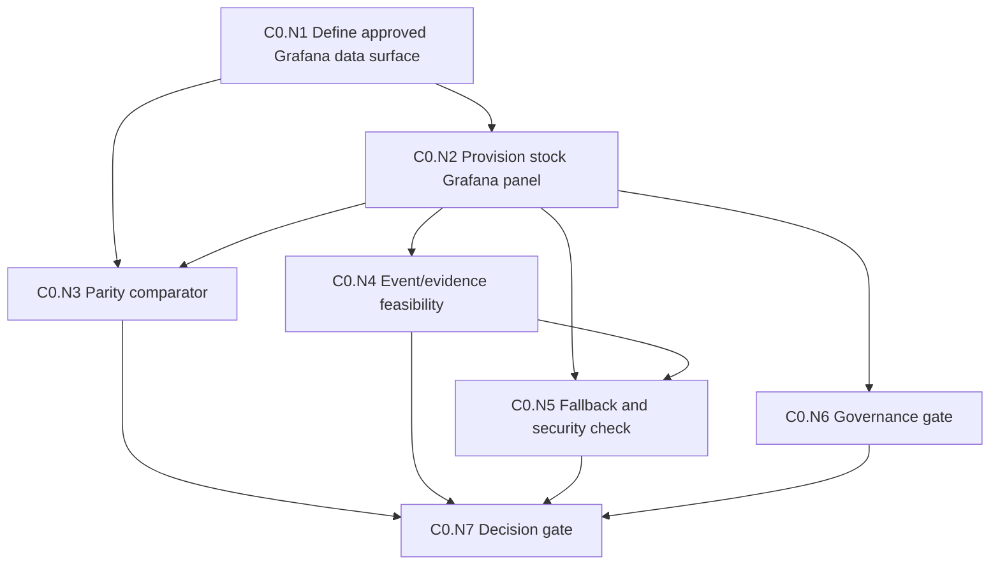
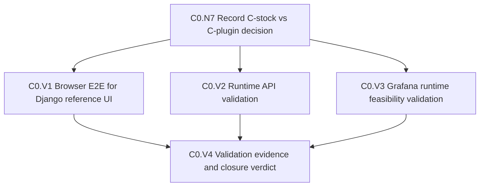
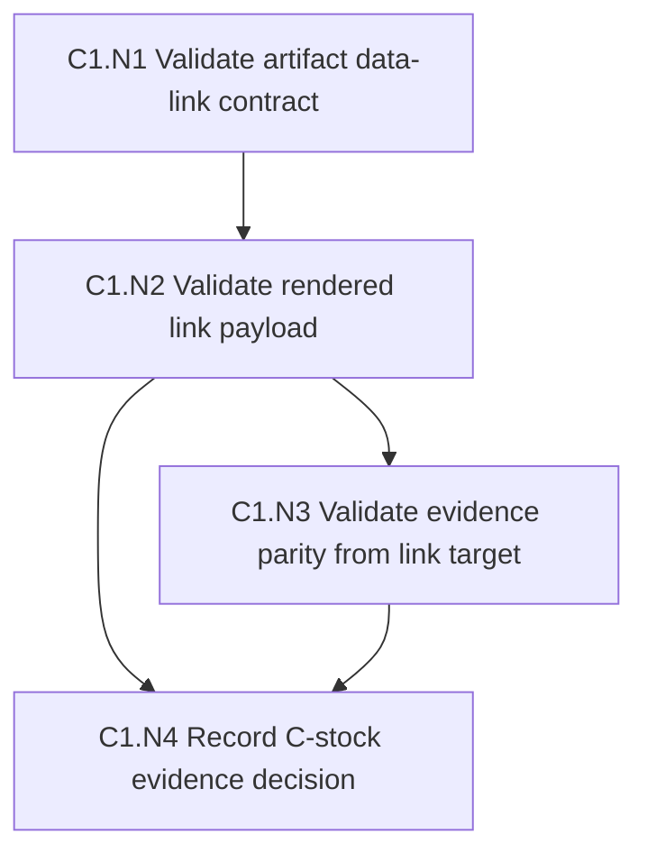

# Grafana 与 AI 生成图表编排设计

日期：2026-08-20

## 目的

本文件回答三个产品和架构问题：

1. 当前 demo 的 Django UI 和未来 Grafana UI 是什么关系？
2. 如果要在 Metrics UI 中增加更多 Grafana 图，应该直接使用 Grafana UI，还是在 Metrics UI 中预留 chart container placeholder？
3. 如果未来接入 AI-base，用户用自然语言要求生成某个时间范围的 daily bug in / bug out trend，应该如何从 prompt 到图表落地？

## 当前结论

最终目标是 Grafana C-first：Grafana 承担主要图表和 dashboard UI，Metrics 继续拥有 source collection、scope semantics、IndicatorDefinition、EvidenceContract、Chart Catalog validation、audit 和 AI governance。第一阶段直接做 C-stock feasibility spike；如果 stock Grafana dashboard 无法满足 evidence 联动和治理要求，就升级到 Grafana App/Scenes 的 C-plugin 路线。

不要让 Grafana SQL、Grafana dashboard JSON、Django template 或 AI prompt 成为第二套业务 truth system。AI-base 只能生成 draft chart spec；Metrics 必须先验证、版本化、审计并按 `personal` / `cloud` governance mode 发布，Grafana 才能渲染或 provision 这些图表。

## 当前 Demo UI 与 Grafana 的关系

当前 demo 中的 Bug Trend 页面是 Django + Bulma + htmx + Chart.js 实现的 reference UI。它的职责不只是画图，还包括：

1. 选择 scope/date。
2. 使用 Metrics-owned calculation run。
3. 展示 chart。
4. 点击 chart 后刷新 evidence list。
5. 保证 chart 和 evidence list 使用同一个 `calculation_run_id`。
6. 作为用户验收路径证明真实 Jira 数据可以端到端驱动 dashboard。

Grafana 的目标角色是主要 dashboard UI 和 rendering/composition layer。Grafana 可以负责图表布局、panel rendering、legend、tooltip、变量和 dashboard 组合，但不应该负责定义什么是 bug、什么是 fixed、什么是 critical/high、哪些 ticket 属于某个 bucket。

关系可以这样理解：

```text
Metrics-owned data and semantics
  -> calculation runs / fact tables / bucket memberships
  -> deterministic chart/evidence query contract
  -> renderer / UI surface
       -> current Django Chart.js reference chart during transition
       -> C-stock Grafana dashboard feasibility spike
       -> C-plugin Grafana App/Scenes if stock Grafana cannot satisfy evidence UX
       -> future AI-generated Grafana chart after Metrics validation
```

## 为什么不能把 Stock Grafana UI 直接等同于完整产品页

Grafana C-first 是目标，但直接把用户带到未受约束的 stock Grafana dashboard 有几个问题：

1. Scope/date/chart filters 和 evidence list 很难保持一个统一的 `PageQueryState`。
2. Data links 更像跳转，不天然等价于同页下方 evidence list 联动。
3. Grafana panel SQL 可能慢慢变成第二套语义定义。
4. 权限、导出、audit、stale indicator、Jira source link 等产品能力会分散。
5. AI 生成的 panel 如果直接进入 Grafana，缺少 Metrics 的验证、版本化和回滚流程。

因此 C-first 的第一步是验证 stock Grafana 能不能通过受控 datasource、variables、data links 和 Metrics evidence API 承载主分析页；如果不能，主分析页应进入 Grafana App/Scenes，而不是回到长期 Django chart shell。

## 推荐 UI 形态：Grafana 主 UI + Metrics 后端治理

C-first 下，UI shell 可以逐步由 Grafana dashboard 或 Grafana App/Scenes 承载；Metrics Django 保留 reference/fallback 页面和所有后端治理能力。

```text
Grafana Bug Trend Surface
  Scope/date variables
  Data freshness / calculation status
  Chart selector or dashboard variables
  Active chart panel / scene
  Evidence list panel/app view
  Export / audit / source links via Metrics API
```

每个 chart surface 绑定一个 Metrics-governed chart definition，而不是任意 Grafana panel：

```text
ChartDefinition
  chart_id
  title
  renderer_type
  integration_route
  renderer_spec
  required_query_state
  evidence_contract_id
  evidence_capability
  click_mapping
  version
  owner
  enabled
```

`renderer_type` 只有一个 canonical registry，由 `ChartDefinition -> RendererSpec.renderer_type` 拥有：

| renderer_type | 说明 |
| --- | --- |
| `chartjs` | 当前 reference chart renderer，最适合本地验收和回归测试。 |
| `grafana` | Grafana stock dashboard、panel 或 Grafana App/Scenes renderer。 |
| `static_image` | 可选，用于报告或低交互导出。 |

`C-stock`、`C-plugin` 和 `reference` 是 `integration_route`，不是第二套 renderer enum：

| integration_route | 说明 |
| --- | --- |
| `reference` | Django/Chart.js reference surface。 |
| `c_stock` | Stock Grafana dashboard/panel 主路径 feasibility。 |
| `c_plugin` | Grafana App/Scenes 主路径。 |

## 页面 Owner 与 Active Chart Owner

页面 owner 和 evidence owner 必须区分：

```text
Grafana Dashboard/App Shell
  owns: user-facing chart layout and interactions

Metrics Backend Governance
  owns: permissions, scope/date state schema, Chart Catalog, export, audit, evidence API

Active Chart Definition
  owns: chart query shape, renderer type, click mapping, evidence capability

Evidence List
  derives from: active chart definition + PageQueryState + list-local filters
```

所以最终页面可以由 Grafana 承载，但业务状态和证据契约不能由 Grafana panel SQL 私有化。Grafana shell 负责交互和展示；Metrics backend 负责把 active chart 的选择状态转换成后端可验证的 evidence query。

在同一个页面中，上半部分 active chart 是当前 evidence context 的 owner。下半部分 bug list 必须跟着 active chart 联动，但只能在 active chart 声明了可验证 evidence contract 时联动。

## Evidence 能力分级

不是所有 Grafana diagram 都天然能反映到 bug list。每个 chart definition 必须声明 evidence 能力。

| Evidence 能力 | 适用图表 | 是否能点击驱动 bug list | 下方列表行为 |
| --- | --- | --- | --- |
| `bucket_series` | daily/weekly bug in-out bar、open backlog line、critical/high trend 等。 | 可以。点击点、bar 或 series 后映射到 bucket/series membership。 | 显示 selected bucket/series evidence。 |
| `range_only` | 当前 open backlog snapshot、按 owner/component 聚合但无单点 membership 的图。 | 不可以或仅部分可以。 | 显示当前 scope/date/filter 的 visible-range evidence，并标注不是 clicked-point evidence。 |
| `summary_only` | average fix time、健康分数、纯 gauge、没有 ticket membership 的 KPI。 | 不可以。 | 不显示 ticket evidence，或显示说明该图不支持 ticket-level evidence。 |

产品约束：Bug Trend + Evidence 页面主 slot 默认只接受 `bucket_series` chart。`range_only` chart 可以作为次级分析图，但 UI 文案必须说明列表只代表当前范围。`summary_only` chart 更适合 summary dashboard，不应伪装成可以解释到 ticket 的图。

示例：可联动图表。

```yaml
chart_id: daily_bug_in_out
evidence_capability: bucket_series
click_mapping:
  x: bucket_date
  series: series_name
evidence_query:
  membership_source: bucket_membership_view
  filters:
    bucket_date: clicked.x
    series_name: clicked.series
```

示例：只支持范围证据。

```yaml
chart_id: open_bug_count_gauge
evidence_capability: range_only
evidence_query:
  mode: visible_range
  definition: current_open_bugs_for_scope_and_date_range
```

示例：不支持证据。

```yaml
chart_id: average_fix_time
evidence_capability: summary_only
evidence_query: null
```

## 多图展示方式

如果要在 UI 里添加更多 Grafana 图，不建议只做一个大 Grafana iframe。推荐两种模式并存。

### 模式 A：Chart Selector

适合用户一次关注一个主图。

```text
[Chart: Default Bug Trend v1 ▼]

[Selected Metrics-governed chart surface]
[Evidence list for selected chart/query]
```

优点：

1. 页面简单。
2. Evidence list 可以明确对应当前 selected chart。
3. AI 生成的新图可以进入下拉菜单。
4. 适合当前 Bug Trend 页面演进。

### 模式 B：Multi-panel Layout

适合一个 dashboard 同时展示多个固定图。

```text
[Bug in/out daily bars] [Open backlog line]
[Critical high trend]   [Aging bugs]

[Evidence list follows active/selected panel]
```

优点：

1. 更接近生产 dashboard。
2. 可以让多个 panel 共用同一套 scope/date filters。
3. 用户点击某个 panel 后，下方 evidence list 跟随 active panel。

设计要求：

1. 只有一个 active panel 控制 evidence list。
2. active panel 要有明显边框或标题状态。
3. 每个 panel 都必须声明自己的 evidence contract。
4. panel 之间不能各自定义 bug/status/severity 语义。
5. 用户切换 active panel 时，旧 panel 的 selected bucket/series 必须失效。
6. 如果 active panel 不支持 evidence，Evidence list 区域必须显示清楚的 unsupported state。

## Grafana 嵌入方式

建议优先支持 embedded panel，而不是完整 Grafana app。

可选方式：

| 方式 | 用途 | 注意事项 |
| --- | --- | --- |
| Grafana panel iframe | 快速嵌入已有 panel。 | 需要处理 auth、time range、theme、变量同步。 |
| Grafana dashboard link | 维护者跳转到 Grafana 详情。 | 普通用户会离开 Metrics 页面。 |
| Grafana render/image API | 报告或静态预览。 | 交互较弱，不适合点击 evidence。 |
| Grafana dashboard JSON provisioning | 管理图表定义。 | 必须由 Metrics 生成/验证，不要手工分叉语义。 |

推荐第一阶段：直接按 C-first 目标验证 Grafana 主渲染路径，但不要把 C 理解成“只嵌一个 stock Grafana iframe”。C-first 的合理含义是：Grafana 成为主要图表/仪表盘 UI，Metrics 继续拥有数据、语义、evidence query、权限和 AI chart validation。

### Grafana C-first 路线判断

如果 Grafana C 是最终目标，可以直接从 C-first spike 开始。这里的关键判断不是 Grafana 能不能画图，而是 stock Grafana dashboard 是否能承载 PRD 要求的 evidence 联动、AI chart governance 和 Metrics-owned semantics。

| 路线 | 含义 | 优点 | 风险 |
| --- | --- | --- | --- |
| B | Metrics UI 拥有页面，Grafana 是嵌入式 renderer。 | 保留 Metrics 的 filter、evidence、audit、AI chart catalog、fallback 灵活性。 | 长期会维护两个 UI 心智模型。 |
| C-stock | Grafana stock dashboard 成为主 UI，Metrics 提供 governed data/API/contracts。 | 最快使用 Grafana 图表、变量、布局。 | 已知不能自然满足全部 PRD：chart click 到下方 evidence list、PageQueryState、AI governance、unsupported state 都会受限。 |
| C-plugin | Grafana App/Scenes 成为主 UI，Metrics 提供 API/data service。 | 最大程度使用 Grafana UI，同时可实现自定义 evidence list、状态同步和 AI chart catalog。 | 需要开发 Grafana plugin/app，复杂度高于 iframe。 |

Grafana UI 能实现大部分图表展示需求，但 stock Grafana dashboard 不能天然满足全部 PRD 要求。尤其是这些能力需要 Metrics 继续拥有，或通过 Grafana App/Scenes/plugin bridge 实现：

1. 图表点击精确映射回 `EvidenceContract`。
2. Evidence list pin 到同一 `calculation_run_id` 或 fact snapshot。
3. List-local filters 不改变 chart query。
4. Chart selector、AI draft/published 状态、audit、export、unsupported state 的统一产品体验。
5. 防止 Grafana panel SQL 自行定义 bug/fixed/critical/high 语义。
6. Grafana failure 时无损 fallback 到 reference chart 和 evidence list。

C-first 路线的建议是：先做 `C-stock feasibility spike`，如果无法通过 event/evidence gates，则升级到 `C-plugin`，而不是退回纯 Django UI。C 成为主路径前必须通过以下 gates：

| Gate | 验收 |
| --- | --- |
| Parity gate | 同一 PageQueryState 下，Grafana panel 与 Chart.js reference chart 的 series/bucket 数字一致。 |
| Event bridge gate | Grafana click/selection 能可靠回传 bucket、series、chart id、version。 |
| Evidence gate | 回传事件只能触发 Metrics 后端 evidence query，不能由 Grafana SQL 直接拼列表。 |
| Security gate | Grafana datasource allowlist、iframe auth、CSP/frame policy、same-user permission mapping 清楚。 |
| Fallback gate | Grafana unavailable 时，Metrics UI 显示 fallback/reference chart，Evidence list 不受影响。 |
| Governance gate | AI-generated Grafana spec 经过 validator、audit、personal/cloud 发布模式控制。 |

因此短期产品路线调整为：C-first，但以 `C-plugin capable architecture` 为目标。若 stock Grafana dashboard 无法满足 evidence 联动，就把主分析页面做成 Grafana App/Scenes；Metrics Django 保留为 read-only source collection、fact/indicator/evidence API、AI chart validation 和 audit service。

### Grafana SDK 与集成接口

Grafana 没有一个适合直接把完整 Grafana React 组件嵌入 Django/Bulma 页面并自由组合的通用 SDK。实际可用的集成方式分三类：

| 集成方式 | 适合场景 | 与 Metrics 的接口 |
| --- | --- | --- |
| iframe / panel embed | 快速显示 Grafana panel 或 dashboard。 | Metrics 生成 Grafana URL，传递 `from`、`to`、dashboard variables；需要 Grafana `allow_embedding`、auth/cookie/CSP 配置。 |
| HTTP API / provisioning | 由 Metrics 创建、更新、版本化 Grafana dashboard、datasource、folder。 | Metrics validator 通过后，把受控 dashboard/panel JSON provision 到 Grafana。 |
| Grafana Plugin / App / Scenes | C-plugin 主路径：在 Grafana 内实现完整产品页面、chart selector、evidence list、AI chart preview。 | Grafana app 调 Metrics backend API；Metrics 提供 fact/evidence/chart catalog API。 |

Grafana 还有 plugin tooling、frontend plugin APIs、`@grafana/scenes`，可用于构建 Grafana app/plugin 内的 dashboard-like experience。它们更适合“把 Metrics 产品页面做进 Grafana”，而不是“把 Grafana 内部组件拆出来放进 Django”。

### C-first 推荐架构

如果直接上 C，推荐目标架构如下：

```text
Grafana App / Dashboard UI
  -> renders charts, variables, layouts, chart selector
  -> emits selection events or uses app state
  -> renders evidence list panel/app page

Metrics Django backend
  -> read-only Jira sync
  -> raw archive and normalized facts
  -> IndicatorDefinition and calculation runs
  -> EvidenceContract and evidence query API
  -> Chart Catalog and AI chart validator
  -> audit and governance mode
```

接口边界：

| Direction | Interface | 用途 |
| --- | --- | --- |
| Metrics -> Grafana | provisioning / HTTP API | 创建 datasource、folder、dashboard、panel、library panel。 |
| Grafana -> Metrics | datasource or HTTP API | 查询 fact views、chart data、evidence rows、chart catalog。 |
| AI-base -> Metrics | chart draft API | 返回候选 chart spec，由 Metrics 验证。 |
| Metrics -> AI-base | constrained schema/context | 发送允许使用的 IndicatorDefinition、FactView、EvidenceContract，不发送 secrets。 |
| Grafana UI -> Evidence | Metrics evidence API | 点击 bucket/series 后查询 ticket rows。 |

### Stock Grafana 已知限制

这些不是 Grafana 完全做不到，而是 stock dashboard/iframe 模式默认不保证：

1. iframe 内置 panel click 事件不能可靠作为父 Django 页面状态的 source of truth。
2. Data links 可以跳转到 Metrics URL，但不是同页下方列表的自然联动。
3. Grafana panel SQL 如果不受约束，容易成为第二套业务语义。
4. AI-generated dashboard JSON 如果直接 provision，缺少 Metrics validator 和审批。
5. Grafana Cloud/Enterprise/Open Source 对 embedding、anonymous access、auth、PDF/reporting 能力支持不同，不能假设所有部署一致。
6. Evidence list、export audit、unsupported/range-only state 这类产品体验需要自定义 app/plugin 或 Metrics 页面配合。

结论：C 不是不可达；C-stock 不足以覆盖全部 PRD；C-plugin 是最接近最终目标的路线。

## 第一阶段 C-stock Feasibility Spike 详细设计

### Spike 目标

第一阶段不直接承诺 stock Grafana 能覆盖全部生产 PRD。它要回答一个明确问题：

```text
在不开发 Grafana App/Scenes plugin 的前提下，stock Grafana dashboard/panel 是否足以成为 Bug Trend 主图表 UI，并且仍能保持 Metrics-owned evidence list、PageQueryState、权限和语义契约？
```

Spike 成功不是“Grafana 能画出一张类似图”。Spike 成功必须同时证明：

1. Grafana 与当前 Chart.js reference chart 在同一真实 Jira fixture、scope、date range、calculation run 下数值一致。
2. Grafana dashboard variables/time range 可以由 Metrics PageQueryState 稳定驱动。
3. Grafana panel click 或 data link 至少能把 bucket、series、chart id、chart version、calculation run/fact snapshot 带回 Metrics。
4. Evidence list 仍由 Metrics evidence API 生成，不由 Grafana SQL 或前端脚本拼接。
5. Grafana 失败时，当前 Django/Chart.js reference path 可以作为 fallback，不影响 evidence API。
6. 若第 3 点不可达，结论必须明确升级到 C-plugin，而不是继续扩大 stock iframe workaround。

### Spike 非目标

1. 不迁移 Jira sync、indicator definition、evidence query、AI validator 到 Grafana。
2. 不把 Grafana SQL 作为 bug/fixed/critical/high 语义 owner。
3. 不实现完整 Chart Catalog 审批 UI。
4. 不实现 AI-base 生成图表。
5. 不承诺 Grafana Cloud、Enterprise、Open Source 所有部署模式都等价。
6. 不在 spike 中删除当前 Chart.js reference chart。

### Spike 推荐实现形态

```text
Metrics Django
  -> exposes chart data/fact view endpoint or SQL-compatible view
  -> exposes evidence API
  -> owns PageQueryState serialization
  -> provisions or documents Grafana dashboard/panel JSON

Grafana stock dashboard
  -> consumes Metrics-approved data source/view
  -> renders Bug Trend chart
  -> uses variables for scope/date/run/chart version
  -> uses data links or panel links to call back into Metrics evidence URL

Metrics Bug Trend page
  -> can embed or link the Grafana panel for comparison
  -> keeps Chart.js reference chart during spike
  -> shows evidence list from Metrics API
```

### Candidate Interfaces

| Interface | Purpose | Spike decision |
| --- | --- | --- |
| Metrics HTTP datasource/API | Lets Grafana query chart/evidence-safe JSON endpoints. | Preferred default; preserves Metrics ownership, authorization, PageQueryState and audit. |
| SQL datasource over Metrics DB/read replica | Potential later optimization for materialized facts. | Deferred for first spike. It can be enabled only after `bug_metrics` or the future fact owner produces named, versioned DB views/materialized facts with migrations/schema tests. Until then, the allowlist contains no SQL views and SQL artifacts fail validation. |
| Dashboard/panel provisioning JSON | Reproducible Grafana setup. | Required for spike repeatability. |
| Grafana data links | Return clicked bucket/series to Metrics. | First thing to test for event/evidence feasibility. |
| iframe embed | Show Grafana from Metrics page. | Optional; not sufficient by itself for C success. |

### Approved API Surface For First Spike

The first C-stock spike has exactly two executable Metrics-owned JSON producers, both routed through `ui_web` and backed by the existing `bug_metrics.app.api` owner path:

| Endpoint | Producer | Required params | Optional params | Purpose |
| --- | --- | --- | --- | --- |
| `/api/charts/data/` | `BugTrendChartDataApiView` -> `BugTrendFacade.get_chart_data` -> `bug_trend_api.get_chart` | `scope_id`, `begin`, `end`, `chart_id` | none | Grafana chart data source for the current scope/date range and catalog chart. |
| `/api/charts/evidence/` | `BugTrendEvidenceApiView` -> `BugTrendFacade.get_evidence_data` -> `bug_trend_api.get_evidence_tickets` | `scope_id`, `begin`, `end`, `run`, `chart_id` | `bucket`, `series`, `owner`, `status`, `severity`, `component`, `text` | Evidence rows for visible range or selected bucket/series under the selected catalog chart. |

`docs/grafana-approved-data-surfaces.json` must only approve query parameters consumed by these producers. Future parameters such as chart version must be added to the runtime parser and tests before they are added to the allowlist.

### Contract Registry

| Contract | Owner | Consumers | Disconfirming check |
| --- | --- | --- | --- |
| `INV-CSTOCK-SEMANTICS` | Metrics `IndicatorDefinition` / scope config | Grafana query, Chart.js reference, evidence API | Parse provisioned Grafana datasource/dashboard artifacts and fail if a query uses unapproved datasource UID, raw tables, arbitrary joins, `CASE` semantics, or status/severity literals outside approved Metrics views/API endpoints. |
| `INV-CSTOCK-PARITY` | Metrics calculation run / fact view | Grafana chart, Chart.js chart | Compare series labels, bucket ids and values for the same `calculation_run_id`; mismatch fails spike. |
| `INV-CSTOCK-PAGESTATE` | Metrics PageQueryState serializer | Grafana variables, evidence URL, share links | Round-trip scope/begin/end/run/chart through Grafana URL and Metrics evidence URL without losing run pinning. |
| `INV-CSTOCK-EVIDENCE` | Metrics EvidenceContract / evidence API | Grafana data links, Evidence list | Click/data-link payload must resolve to the same evidence rows as Chart.js click for one known bucket/series. |
| `INV-CSTOCK-FALLBACK` | Metrics Bug Trend page | User-facing dashboard | Stop/unavailable Grafana must not break Chart.js reference chart or evidence API. |
| `INV-CSTOCK-SECURITY` | Metrics/Grafana deployment config | iframe/provisioning/API clients | Verify no secrets in Grafana JSON, docs, URL params, audit logs, or AI prompt context. |
| `INV-CSTOCK-GOVERNANCE` | Metrics Chart Catalog / validator / audit / governance mode | Grafana provisioning, AI chart draft/publish pipeline | Any Grafana dashboard JSON, AI candidate spec, or provisioning artifact that bypasses validator/audit/personal-cloud state fails the gate. |
| `INV-C0-VALIDATION-CLOSURE` | C0 validation evidence record | C0 decision gate, next implementation phase | Run `scripts/check_c0_validation_evidence.py --evidence docs/c0-validation-closure-evidence.md`; fail if any C0.V1-C0.V4 record lacks a field required by the C0 Validation Evidence Schema for that node, or if `runtime_not_available` is described as Grafana runtime validation passed. |

### DAG Plan Baseline

| Field | Value |
| --- | --- |
| baseline_head | `d60066446e301a8f87eec530302c7782c2807035` |
| pre_existing_dirty_paths | `.github/copilot-instructions.md` |
| plan_owner_paths | `docs/grafana-ai-dashboard-composition-design.zh.md`, `docs/bug-trend-dashboard-product-requirements.zh.md`, `docs/c0-validation-closure-evidence.md`, `scripts/`, future `ops/grafana/`, future `ui_web/`, future `bug_metrics/` API/views/tests |
| code_doc_truth_sync | update-required for `docs/`; future implementation must update README/operator docs if Grafana runtime/config is introduced |

### DAG Nodes

| id | depends_on | owner_paths | authority_boundary | contracts | validation | exit_criteria | parallel_policy |
| --- | --- | --- | --- | --- | --- | --- | --- |
| C0.N1 - Define approved Grafana data surface | [] | `bug_metrics/`, future `work_item_facts/`, `docs/` | Metrics owns facts and indicator semantics. | `INV-CSTOCK-SEMANTICS`, `INV-CSTOCK-PARITY` | Focused API tests for chart/fact output; artifact parser validates explicit datasource allowlist, approved API endpoints, and absence of SQL until a Metrics-owned SQL producer exists. | One approved chart data surface exists for Grafana without duplicating bug semantics. | serial |
| C0.N2 - Provision stock Grafana panel | [C0.N1] | `ops/grafana/`, `docs/` | Grafana renders; Metrics provisions approved renderer spec. | `INV-CSTOCK-SEMANTICS`, `INV-CSTOCK-PAGESTATE` | Provision dashboard locally; verify variables for scope/date/run/chart. | Grafana renders Bug Trend with real fixture data for the same range as reference chart. | serial |
| C0.N3 - Parity comparator | [C0.N1, C0.N2] | `scripts/`, `bug_metrics/tests/`, `docs/` | Metrics defines expected series; comparator only checks. | `INV-CSTOCK-PARITY` | Script or test compares Grafana query result vs Metrics chart JSON for one run. | Mismatches show bucket/series/value diffs; clean run passes. | serial |
| C0.N4 - Event/evidence feasibility | [C0.N2] | `ui_web/`, `bug_metrics/`, `docs/` | Metrics evidence API owns list rows. | `INV-CSTOCK-EVIDENCE`, `INV-CSTOCK-PAGESTATE` | Manual or Playwright flow follows Grafana data link for one bucket/series and compares evidence rows to Chart.js click. | Gate records pass/fail: stock Grafana can or cannot drive same-page/linked evidence with required payload. | serial |
| C0.N5 - Fallback and security check | [C0.N2, C0.N4] | `ui_web/`, `ops/grafana/`, `docs/` | Metrics controls user-facing fallback and secret policy. | `INV-CSTOCK-FALLBACK`, `INV-CSTOCK-SECURITY` | Disable Grafana URL/service and verify reference chart/evidence still work; scan provisioned files for secrets. | Grafana failure is visible and non-destructive; no secrets in committed Grafana artifacts. | serial |
| C0.N6 - Governance gate | [C0.N2] | `bug_metrics/`, `ops/grafana/`, `docs/` | Metrics validator/audit owns chart publication. | `INV-CSTOCK-GOVERNANCE`, `INV-CSTOCK-SEMANTICS`, `INV-CSTOCK-SECURITY` | Verify built-in Grafana artifacts are marked built-in/validated; AI-generated charts remain disabled until P3 governance exists. | C-stock adoption applies to built-in charts only until AI chart lifecycle gates are implemented. | serial |
| C0.N7 - Decision gate | [C0.N3, C0.N4, C0.N5, C0.N6] | `docs/` | Architecture decision owner. | all C-stock contracts | Reviewer checks parity/event/evidence/fallback/security/governance evidence. | Decision is one of: adopt C-stock, use C-stock only for non-evidence dashboards, or escalate to C-plugin. | serial |

### Mermaid DAG



### Execution Ledger

- [x] C0.N1 - Define approved Grafana data surface
- [x] C0.N2 - Provision stock Grafana panel
- [x] C0.N3 - Build parity comparator
- [x] C0.N4 - Validate event/evidence feasibility
- [x] C0.N5 - Validate fallback and security
- [x] C0.N6 - Validate governance boundary
- [x] C0.N7 - Record C-stock vs C-plugin decision

### C0 Validation Closure Slice

这个切片是 C0 spike 的后继 validation gate，不属于下一阶段产品功能。它的目标不是扩大实现范围，而是把当前已经产生的 API、Django reference UI、Grafana artifact 和运行态 demo 逐层验清楚，避免下一阶段把 C0 基线问题和新功能问题混在一起。

| id | depends_on | owner_paths | authority_boundary | contracts | validation | exit_criteria | parallel_policy |
| --- | --- | --- | --- | --- | --- | --- | --- |
| C0.V1 - Browser E2E for Django reference UI | [C0.N7] | `ui_web/templates/`, `ui_web/tests/`, `scripts/`, `docs/` | Django reference UI proves user-facing chart and evidence behavior during transition. | `INV-CSTOCK-EVIDENCE`, `INV-CSTOCK-FALLBACK`, `INV-C0-VALIDATION-CLOSURE` | Browser or Playwright flow loads Bug Trend page, verifies Chart.js canvas is nonblank, evidence table is populated, chart bucket click filters evidence, and Clear selection restores visible-range evidence. Django client tests can support this node but cannot close it by themselves. | Current demo has explicit browser evidence for chart + evidence drilldown, or records the exact unsupported blocker with `status=failed`; no non-browser pytest result may be reported as browser E2E pass. | serial |
| C0.V2 - Runtime API validation | [C0.N7] | `ui_web/views/`, `ui_web/facades/`, `bug_metrics/`, `ui_web/tests/`, `scripts/`, `docs/` | Metrics JSON API is the producer for Grafana and reference UI evidence contracts. | `INV-CSTOCK-PARITY`, `INV-CSTOCK-PAGESTATE`, `INV-CSTOCK-EVIDENCE`, `INV-C0-VALIDATION-CLOSURE` | Direct runtime requests validate `/api/charts/data/` required params including `chart_id`, range-to-run selection, `points` fields, and invalid-param failures; `/api/charts/evidence/` validates explicit `run` and `chart_id` pinning plus selected bucket/series behavior. Chart-data remains non-run-param until the API, allowlist, tests, and parity script are changed together. | API runtime behavior is measured against the same scope/date/run/chart context used by the demo and parity script without implying chart-data accepts `run`. | serial |
| C0.V3 - Grafana runtime feasibility validation | [C0.N7] | `ops/grafana/`, `scripts/`, `docs/` | Grafana stock artifact may render charts, but Metrics owns the validated data surface and evidence links. | `INV-CSTOCK-SEMANTICS`, `INV-CSTOCK-PARITY`, `INV-CSTOCK-PAGESTATE`, `INV-CSTOCK-GOVERNANCE`, `INV-C0-VALIDATION-CLOSURE` | If Grafana runtime is locally available, provision/load the dashboard artifact and verify render plus data-link payload. If unavailable, record `runtime_not_available` with artifact/API/static validation evidence and residual risk. | `runtime_render_validated` is required before claiming Grafana runtime closure. `runtime_not_available` permits only partial closure: static artifact, API, parity, and Django reference UI validated; Grafana runtime remains deferred-with-trigger. | serial |
| C0.V4 - Validation evidence record and closure verdict | [C0.V1, C0.V2, C0.V3] | `docs/c0-validation-closure-evidence.md`, `scripts/`, `screenshots/` optional | Validation evidence is the owner of C0 closure claims. | `INV-C0-VALIDATION-CLOSURE` | Create or update the evidence record with structured rows for each C0.V node, then run `scripts/check_c0_validation_evidence.py --evidence docs/c0-validation-closure-evidence.md`. | Future stages can cite only the closure verdict recorded here: `full_c0_runtime_closure`, `partial_c0_static_api_reference_closure`, or `failed`. | serial |



### C0 Validation Closure Ledger

- [ ] C0.V1 - Browser E2E for Django reference UI
- [ ] C0.V2 - Runtime API validation
- [ ] C0.V3 - Grafana runtime feasibility validation
- [ ] C0.V4 - Record validation evidence and closure verdict

### C0 Validation Evidence Schema

`docs/c0-validation-closure-evidence.md` 必须为每个 C0.V 节点记录以下字段；缺字段就是 validation closure 失败。

| Field | Required for | Meaning |
| --- | --- | --- |
| `node_id` | all | `C0.V1`、`C0.V2`、`C0.V3` 或 `C0.V4`。 |
| `status` | all | `passed`、`failed`、`blocked` 或 `deferred_with_trigger`。 |
| `command_or_manual_step` | all | 具体命令、Playwright step、browser manual step 或 Grafana provisioning step。 |
| `exit_code_or_result` | all | 命令 exit code、browser observed result 或明确失败原因。 |
| `scope_id` | C0.V1, C0.V2, C0.V3 | Demo/API/Grafana 使用的 scope。 |
| `begin` / `end` | C0.V1, C0.V2, C0.V3 | Demo/API/Grafana 使用的日期范围。 |
| `calculation_run_id` | C0.V1, C0.V2, C0.V3 | Evidence 或 parity 使用的 run id；chart-data 若未接受 `run`，记录 range-to-run 解析出的 run。 |
| `observed_url` | C0.V1, C0.V3 | Browser page 或 Grafana dashboard URL。 |
| `evidence_before_after` | C0.V1 | Chart click 前后 evidence count 或 row identity 差异；Clear selection 后恢复结果。 |
| `grafana_runtime_state` | C0.V3, C0.V4 | `runtime_render_validated` 或 `runtime_not_available`。 |
| `residual_risk` | all | 无风险写 `none`；Grafana runtime 缺失必须写 deferred trigger。 |
| `closure_verdict` | C0.V4 | `full_c0_runtime_closure`、`partial_c0_static_api_reference_closure` 或 `failed`。 |

Closure verdict 规则：

| Verdict | Required evidence |
| --- | --- |
| `full_c0_runtime_closure` | C0.V1 和 C0.V2 passed；C0.V3 `grafana_runtime_state=runtime_render_validated`；C0.V4 evidence checker passed。 |
| `partial_c0_static_api_reference_closure` | C0.V1 和 C0.V2 passed；C0.V3 `grafana_runtime_state=runtime_not_available`；C0.V4 evidence checker passed；residual risk names the trigger for future Grafana runtime validation. |
| `failed` | Any required C0.V evidence is missing, failed, or claims broader validation than its recorded state supports. |

### C0 Validation Closure Commands

这些命令补充第一阶段 spike 的 artifact/API gates，用于证明运行态边界。实际执行时可以按可用环境替换具体 test 文件名，但不能把 Grafana runtime 缺失静默当作通过。

```powershell
.venv\Scripts\python.exe -m pytest ui_web\tests\test_bug_trend_fact_table_ui.py -q
.venv\Scripts\python.exe -m pytest bug_metrics\tests\test_grafana_data_surface_contract.py -q
.venv\Scripts\python.exe scripts\validate_grafana_artifacts.py --artifact-root ops\grafana --allowlist docs\grafana-approved-data-surfaces.json
.venv\Scripts\python.exe scripts\compare_grafana_bug_trend_parity.py --calculation-run-id <calculation_run_id>
.venv\Scripts\python.exe manage.py check
.venv\Scripts\python.exe scripts\check_c0_validation_evidence.py --evidence docs\c0-validation-closure-evidence.md
```

Browser validation must additionally record the observed URL, selected scope, date range, canvas nonblank evidence, evidence row count before click, evidence row count or row identity after click, and Clear selection result. Grafana runtime validation must record one of two explicit states: `runtime_render_validated` or `runtime_not_available`; only `runtime_render_validated` supports a claim that Grafana runtime was validated.

### Spike Exit Decision

| Result | Meaning | Next action |
| --- | --- | --- |
| Adopt C-stock | Parity, PageQueryState, event/evidence, fallback, security and governance gates pass. | Make Grafana stock dashboard the primary chart renderer and keep Metrics evidence API. |
| Use C-stock only for non-evidence dashboards | Chart parity passes, but event/evidence is only link-out or range-only. | Use stock Grafana for summary dashboards; use C-plugin for evidence-backed analysis pages. |
| Escalate to C-plugin | Event/evidence or governance gates fail. | Build Grafana App/Scenes plugin that calls Metrics APIs for chart state and evidence list. |

## C1 Evidence Link / Drilldown Validation DAG

 C0 已证明 stock Grafana 可以安装、加载 datasource、渲染 Bug Trend panel，并与 Metrics chart payload 保持 parity。C1 只验证一条更窄的产品边界：Grafana panel 的 data link 是否能把用户从 rendered point 带回 Metrics-owned evidence query，并且 payload 不丢失 `scope_id`、`begin`、`end`、`calculation_run_id`、`bucket_id`、`series_name` 和 `chart_id`。

C1 不实现 Grafana App/Scenes，不创建第二套 evidence list，不让 Grafana query ticket rows。若 stock Grafana 只能 link-out 到 Metrics API/页面，C1 必须明确记录该能力边界；如果 payload 不可靠，则 C1 决策应升级 C-plugin，而不是继续加 workaround。

字段映射必须保持单一权威：Grafana point dataframe 字段 `calculation_run_id`、`bucket_id`、`series_name` 只来自 Metrics chart-data API；Grafana data link 只能把它们映射为 Metrics evidence API query params `run`、`bucket`、`series`。Evidence API 不接受长字段名参数。

### C1 Contract Registry

| Contract | Owner | Consumers | Disconfirming check |
| --- | --- | --- | --- |
| `INV-C1-LINK-FIELDS` | Grafana dashboard artifact `metricsContract.evidenceLinkFields` | Grafana field link, Metrics evidence API | Validator/test fails if the data link URL does not reference every field named in `evidenceLinkFields`, or if a referenced field is absent from target columns. |
| `INV-C1-LINK-PAYLOAD` | Grafana rendered dataframe and field link | User click/link action, Metrics evidence API | Browser or Grafana API evidence proves one rendered point exposes a link carrying `scope_id`, `begin`, `end`, `run`, `bucket`, `series`, and `chart_id`; missing or unresolved template variables fail the node. |
| `INV-C1-EVIDENCE-PARITY` | Metrics EvidenceContract / evidence API | Grafana data link, Chart.js reference click | For one known bucket/series, the Grafana link target returns the same selection title and row count as the Chart.js click/API evidence path. |
| `INV-C1-DECISION` | `docs/c1-evidence-link-validation-evidence.md` | C2/C-plugin planning | Decision record must be exactly one of `c_stock_linked_evidence_supported`, `c_stock_non_evidence_only`, or `c_plugin_required`; unsupported same-page behavior cannot be described as full same-page evidence support. |

### C1 DAG Nodes

| id | depends_on | owner_paths | authority_boundary | contracts | validation | exit_criteria | parallel_policy |
| --- | --- | --- | --- | --- | --- | --- | --- |
| C1.N1 - Validate artifact data-link contract | [] | `ops/grafana/`, `scripts/`, `bug_metrics/tests/`, `docs/` | Grafana artifact may describe links; Metrics validator owns allowed fields and URLs. | `INV-C1-LINK-FIELDS`, `INV-CSTOCK-SEMANTICS`, `INV-CSTOCK-SECURITY` | Extend artifact validation/tests to assert link URL field refs are backed by target columns and include required evidence params. | Static artifact cannot publish a data link that drops run/bucket/series or references missing fields. | serial |
| C1.N2 - Validate rendered link payload | [C1.N1] | `ops/grafana/`, `docs/c1-evidence-link-validation-evidence.md` | Grafana runtime renders field links; Metrics remains evidence owner. | `INV-C1-LINK-PAYLOAD`, `INV-CSTOCK-PAGESTATE` | Use local Grafana runtime on `127.0.0.1:3001` to inspect the rendered panel or panel JSON for one point/link; record `payload_captured` with resolved URL, or `payload_unavailable` with exact runtime limitation. | Result is one of `payload_captured` or `payload_unavailable`; unresolved template variables fail this node. | serial |
| C1.N3 - Validate evidence parity from Grafana link target | [C1.N2] | `ui_web/`, `bug_metrics/`, `docs/c1-evidence-link-validation-evidence.md` | Metrics evidence API owns ticket rows. | `INV-C1-EVIDENCE-PARITY`, `INV-CSTOCK-EVIDENCE` | If C1.N2 is `payload_captured`, request the captured link target and compare selection title/row count against Chart.js/API evidence for the same bucket/series. If C1.N2 is `payload_unavailable`, record `skipped_with_reason` and do not claim evidence parity. | Captured target matches reference evidence, or parity is explicitly skipped/failed because stock Grafana cannot expose reliable payload. | serial |
| C1.N4 - Record C-stock evidence decision | [C1.N2, C1.N3] | `docs/c1-evidence-link-validation-evidence.md`, `docs/` | C1 evidence record owns the decision consumed by later C2/C-plugin work. | `INV-C1-DECISION` | Update evidence/decision doc with supported mode, limitations, and next route; run `scripts/check_c1_evidence_link_evidence.py --evidence docs/c1-evidence-link-validation-evidence.md`. | Decision is precise: link-out evidence supported, non-evidence-only, or C-plugin required. | serial |



### C1 Execution Ledger

- [ ] C1.N1 - Validate artifact data-link contract
- [ ] C1.N2 - Validate rendered link payload
- [ ] C1.N3 - Validate evidence parity from Grafana link target
- [ ] C1.N4 - Record C-stock evidence decision

### C1 Validation Commands

```powershell
.venv\Scripts\python.exe scripts\validate_grafana_artifacts.py --artifact-root ops\grafana --allowlist docs\grafana-approved-data-surfaces.json
.venv\Scripts\python.exe -m pytest bug_metrics\tests\test_grafana_data_surface_contract.py -q
.venv\Scripts\python.exe scripts\compare_grafana_bug_trend_parity.py --calculation-run-id <calculation_run_id>
.venv\Scripts\python.exe scripts\check_c1_evidence_link_evidence.py --evidence docs\c1-evidence-link-validation-evidence.md
.venv\Scripts\python.exe scripts\check_c0_validation_evidence.py --evidence docs\c0-validation-closure-evidence.md
```

### C1 Evidence Record Schema

`docs/c1-evidence-link-validation-evidence.md` 必须记录：

| Field | Meaning |
| --- | --- |
| `node_id` | `C1.N1`、`C1.N2`、`C1.N3` 或 `C1.N4`。 |
| `status` | `passed`、`failed`、`blocked` 或 `skipped_with_reason`。 |
| `command_or_manual_step` | 具体命令、Grafana browser step 或 manual inspection step。 |
| `result` | 退出码、观察结果或失败原因。 |
| `observed_grafana_url` | Grafana dashboard/panel URL。 |
| `payload_state` | `payload_captured` 或 `payload_unavailable`。 |
| `resolved_link_url` | C1.N2 捕获到的 Metrics evidence URL；payload unavailable 时为空。 |
| `scope_id` / `begin` / `end` | PageQueryState。 |
| `run` / `bucket` / `series` | Evidence API query 参数。 |
| `reference_selection_title` / `linked_selection_title` | 参考路径和 link target 的 evidence title。 |
| `reference_row_count` / `linked_row_count` | 参考路径和 link target 的 row count。 |
| `decision_verdict` | `c_stock_linked_evidence_supported`、`c_stock_non_evidence_only` 或 `c_plugin_required`。 |
| `residual_risk` | 若无写 `none`；如果只是 link-out 而非 same-page，必须写明。 |

Verdict 规则：

| Verdict | Required evidence |
| --- | --- |
| `c_stock_linked_evidence_supported` | C1.N1、C1.N2、C1.N3、C1.N4 all passed；`payload_state=payload_captured`；resolved link target 与 reference evidence row count/title 一致；residual risk 明确说明 stock Grafana 支持的是 link-out evidence，不是同页下方 evidence list。 |
| `c_stock_non_evidence_only` | C1.N1 passed；C1.N2 `payload_unavailable` 或 C1.N3 skipped/failed；C1.N4 passed；后续 evidence-backed analysis 不使用 C-stock。 |
| `c_plugin_required` | C1.N1 failed，或 link payload/evidence parity 失败且 C-stock workaround 会产生 parallel truth system。 |

### First Spike Validation Commands

Initial implementation should end with at least these checks, adjusted to the actual files introduced by the spike:

```powershell
.venv\Scripts\python.exe manage.py export_grafana_bug_trend_fixture --scope <scope_id> --run <calculation_run_id>
.venv\Scripts\python.exe scripts\compare_grafana_bug_trend_parity.py --calculation-run-id <calculation_run_id>
.venv\Scripts\python.exe -m pytest bug_metrics\tests\test_grafana_data_surface_contract.py -q
.venv\Scripts\python.exe -m pytest bug_metrics\tests\test_grafana_parity_contract.py -q
.venv\Scripts\python.exe -m pytest ui_web\tests\test_grafana_evidence_callback.py -q
.venv\Scripts\python.exe scripts\validate_grafana_artifacts.py --artifact-root ops\grafana --allowlist docs\grafana-approved-data-surfaces.json
.venv\Scripts\python.exe -m pytest bug_metrics\tests ui_web\tests -q
.venv\Scripts\python.exe manage.py check
.venv\Scripts\python.exe scripts\check_file_size_limits.py --include-untracked
.venv\Scripts\python.exe scripts\check_diff_whitespace.py --include-untracked
git diff --check
```

## PageQueryState 是核心契约

无论图表来自 Chart.js、Grafana 还是 AI-generated panel，都必须收敛到同一个页面状态：

```text
PageQueryState
  scope_id
  begin
  end
  calculation_run_id or fact_snapshot_id
  chart_id
  chart_version
  chart_filters
  selected_panel_id
  selected_bucket_id optional
  selected_series_name optional
  list_filters
```

如果一个 Grafana panel 不能把点击事件映射回 `selected_bucket_id` 和 `selected_series_name`，它只能作为只读图表，不能驱动 evidence list。

### 状态转移规则

| 用户动作 | PageQueryState 变化 | Chart 行为 | Evidence list 行为 |
| --- | --- | --- | --- |
| 修改 scope/date/chart filters | 更新 scope/date/chart_filters，清除 selected bucket/series。 | 重新查询或刷新 active chart。 | 按 active chart 默认 evidence state 重新加载。 |
| 切换 chart selector | 更新 chart_id/chart_version，清除 selected bucket/series。 | 渲染新的 chart renderer。 | 根据新 chart 的 evidence capability 决定 visible-range、range-only 或 unsupported state。 |
| 点击 evidence-backed chart point | 设置 selected_bucket_id 和 selected_series_name。 | 图表可保持不变或高亮 selection。 | 查询 selected bucket/series membership。 |
| 点击 Clear selection | 清除 selected_bucket_id 和 selected_series_name。 | 图表取消 selection 高亮。 | 回到 active chart 的 visible-range evidence。 |
| 修改 list-local filters | 只更新 list_filters。 | 图表不变。 | 只过滤当前 evidence result。 |

状态 owner 规则：

1. `scope_id`、`begin`、`end`、`chart_filters` 由 Metrics page shell 拥有。
2. `chart_id`、`chart_version`、`evidence_capability`、`click_mapping` 来自 Chart Catalog。
3. `selected_bucket_id`、`selected_series_name` 来自 active chart 的点击事件，但必须由 Metrics 后端验证。
4. `list_filters` 只属于 Evidence list，不能改变 chart query。
5. Grafana iframe 内部状态不能成为 source of truth；需要通过 Metrics 认可的事件或 URL 参数同步回 PageQueryState。

### Unsupported Evidence UI

当 active chart 不支持 ticket evidence 时，UI 应显示明确状态，而不是展示可能误导的旧列表。

```text
This chart does not support ticket-level evidence.
Choose an evidence-backed chart or use the visible-range Bug Trend chart to inspect Jira tickets.
```

如果 chart 是 `range_only`，UI 文案应类似：

```text
Evidence tickets for the current chart range.
This chart does not support point-level drilldown.
```

## AI-base 的推荐职责边界

AI-base 不应该直接拥有 Jira credentials、直接查询 Jira、直接写生产 Grafana dashboard，也不应该决定项目级 bug 语义。

AI-base 推荐职责：

1. 把自然语言请求转成结构化 chart intent。
2. 基于 Metrics 提供的 schema、available facts、indicator definitions 和 chart contract 生成候选 chart spec。
3. 返回解释、限制和需要的 fields。
4. 由 Metrics 验证、保存、版本化和发布。

Metrics 推荐职责：

1. 接收用户 prompt。
2. 解析当前 scope/date/user context。
3. 提供允许使用的数据 contract 给 AI-base。
4. 验证 AI-base 返回的 chart spec。
5. 把通过验证的 spec 存入 Chart Catalog。
6. 把新 chart 暴露到 Metrics-governed chart selector、Grafana App chart selector 或受控 chart surface。
7. 管理 evidence list、export、audit、权限和回滚。

## Chart Spec Catalog：AI 生成 Grafana Spec 的轨道

这条未来工作已经迁移到 backlog：见 [backlog/chart-spec-catalog.md](backlog/chart-spec-catalog.md)。

该 backlog 记录现在是 `Chart Spec Catalog` 的 canonical deferred spec。这里不再保留完整设计正文，避免 backlog 记录和架构设计文档之间出现双写漂移。

## 自然语言生成图表示例流程

用户输入：

```text
请做一个从 2026-01-01 到 2026-03-31 的 daily bug in / bug out trend 柱状图。
```

推荐流程：

```text
User
  -> Metrics-governed chart request surface
  -> Metrics chart request service
  -> AI-base app
  -> Metrics chart spec validator
  -> Chart Catalog
  -> Grafana App chart selector or Metrics-governed chart surface
  -> Grafana panel/app or Chart.js reference renderer
  -> Evidence list uses Metrics evidence query
```

详细步骤：

1. Metrics UI 收集用户 prompt、当前 scope、begin/end、用户身份和权限。
2. Metrics 将 prompt 归一化为 chart request，例如：

```yaml
intent: bug_in_out_daily_trend
scope_id: wrk_ipsafe_sln_all_2
begin: 2026-01-01
end: 2026-03-31
granularity: daily
series:
  - bug_in
  - bug_out
renderer_type: grafana
integration_route_preference: c_stock
```

3. Metrics 把允许的 schema、series registry、fact tables、example query、UI constraints 发给 AI-base。
4. AI-base 返回候选 chart spec，而不是直接写 Grafana：

```yaml
chart_title: Daily Bug In / Bug Out Trend
renderer_type: grafana
integration_route: c_stock
query_contract:
  indicator_definition: bug_trend_daily_in_out
  fact_view: work_item_bucket_fact
  required_dimensions:
    - bucket_date
    - series_name
  required_series:
    - daily_bug_in
    - daily_bug_out
evidence_contract:
  membership_source: bucket_membership_view
  click_dimensions:
    - bucket_date
    - series_name
grafana_spec:
  panel_type: timeseries_or_bar_chart
  x_axis: bucket_date
  y_axis: ticket_count
  series_mapping:
    daily_bug_in: positive_bar
    daily_bug_out: negative_bar
```

5. Metrics 验证：
   - series 是否存在或可由 Metrics-owned indicator definition 生成。
  - query 只引用允许的 IndicatorDefinition、FactView 和 EvidenceContract。
   - time range 和 scope 权限合法。
   - Grafana spec 不包含 secret、外部 datasource、任意 SQL 或未批准 datasource。
   - evidence contract 可以从 bucket/series 回到 membership rows。

6. 验证通过后，Metrics 存储为 chart definition：

```text
chart_id: ai_daily_bug_in_out_2026q1
version: 1
source: ai-generated
status: draft | previewed | pending_approval | approved | rejected | published | disabled | rolled_back | archived
owner: user/team
```

7. UI 提供两种落点：
  - 插入当前 Grafana App 或 Metrics-governed chart surface。
  - 保存到 Chart Catalog，通过 Grafana App chart selector 或受控下拉菜单切换。

## 新图应该插到 UI 什么位置

推荐分阶段：

### 第一阶段：Chart Selector

AI 生成的新图先进入当前 Bug Trend 页面主图区域的下拉菜单。

```text
[Chart: Default Bug Trend ▼]
  - Default Bug Trend
  - Daily Bug In / Bug Out Trend generated by AI
  - Open Critical High Trend
```

优点是实现简单，evidence list 始终对应当前 selected chart。

### 第二阶段：User Dashboard Layout

当 chart catalog 稳定后，支持用户把图添加到 dashboard layout 中。

```text
[Add chart]
[Layout: 2 columns ▼]

[Chart A] [Chart B]
[Chart C] [Chart D]

[Evidence list for active chart]
```

这个阶段需要额外保存 layout definition。

### 第三阶段：Grafana Managed Dashboard

当 Grafana parity 稳定后，Metrics 可以把 chart catalog 中已发布图表 provision 到 Grafana dashboard，并在 Metrics UI 里嵌入对应 panels。

## 推荐数据对象

未来可以增加这些概念，但不要一次性过度实现。

### ChartDefinition

```text
ChartDefinition
  id
  title
  description
  renderer_type
  integration_route
  indicator_definition_id
  renderer_spec_id
  evidence_contract_id
  scope_compatibility_json
  version
  status: draft | previewed | pending_approval | approved | rejected | published | disabled | rolled_back | archived
  owner
  created_at
  updated_at
```

ChartDefinition 不保存任意业务 SQL。它只引用 Metrics-owned definitions 和 renderer spec。`published` version 不可原地修改。

`approved` 仅 cloud shared publish 必需；personal publish 可在 validator 通过后跳过 `pending_approval` 和 `approved`，直接发布到个人 chart selector。

### IndicatorDefinition

```text
IndicatorDefinition
  id
  metric_names
  semantic_owner: Metrics
  required_scope_config_fields
  fact_view_id
  version
```

### EvidenceContract

```text
EvidenceContract
  id
  capability: bucket_series | range_only | summary_only
  membership_source
  membership_key
  bucket_dimension
  series_dimension
  ticket_identity
  dedupe_policy
  time_boundary_policy
  allowed_list_filters
  export_policy
  unsupported_reason
```

### RendererSpec

```text
RendererSpec
  id
  renderer_type: chartjs | grafana | static_image
  integration_route: reference | c_stock | c_plugin
  datasource_ref
  visual_encoding_json
  grafana_spec_json optional
  event_bridge_json optional
```

### ChartRequest

```text
ChartRequest
  user_prompt
  normalized_intent
  scope_id
  begin
  end
  renderer_preference
  user_id
```

### ChartValidationResult

```text
ChartValidationResult
  is_valid
  errors
  warnings
  required_facts
  required_series
  evidence_supported
```

## 设计原则

1. Metrics owns semantics。
2. Grafana renders charts。
3. AI-base drafts chart specs。
4. Metrics validates and publishes。
5. Evidence list remains deterministic。
6. Every chart must declare whether it supports evidence click-through。
7. A generated chart can be rejected, drafted, published, disabled, or rolled back。
8. Prompt text is not a production artifact; validated chart spec is the artifact。
9. Personal mode skips human approval, not validator or audit。
10. Cloud mode requires approval for shared chart publish and Grafana provisioning。

## 第一批建议实现

1. 增加 Chart Catalog 文档模型或轻量配置文件，不急着接 AI。
2. 把当前 default Bug Trend chart 注册成第一个 built-in chart definition。
3. 在 Bug Trend 页面增加 chart selector，但先只有一个选项。
4. 抽象 ChartSlot，让当前 Chart.js 成为一个 renderer。
5. 增加 C-stock feasibility spike，用同一个 scope/date state 渲染 Grafana 主图。
6. 证明 Grafana panel 和当前 Chart.js reference chart 数字一致，并验证 click/data-link 是否足够驱动 evidence。
7. 再接 AI-base，让它只生成 draft chart spec，并经过 Metrics validator。
8. 如果 C-stock 无法通过 event/evidence gates，进入 C-plugin spike：Grafana App/Scenes 实现 chart + evidence list 主分析页面。

## 不建议做的事情

1. 不建议让 AI-base 直接写 Grafana production dashboard。
2. 不建议让 Grafana SQL 独立定义 bug/fixed/critical/high 语义。
3. 不建议把完整 Grafana UI iframe 作为普通用户主页面。
4. 不建议每生成一个 AI 图就临时改 Django template。
5. 不建议让图表没有 evidence contract 就宣称可解释。
