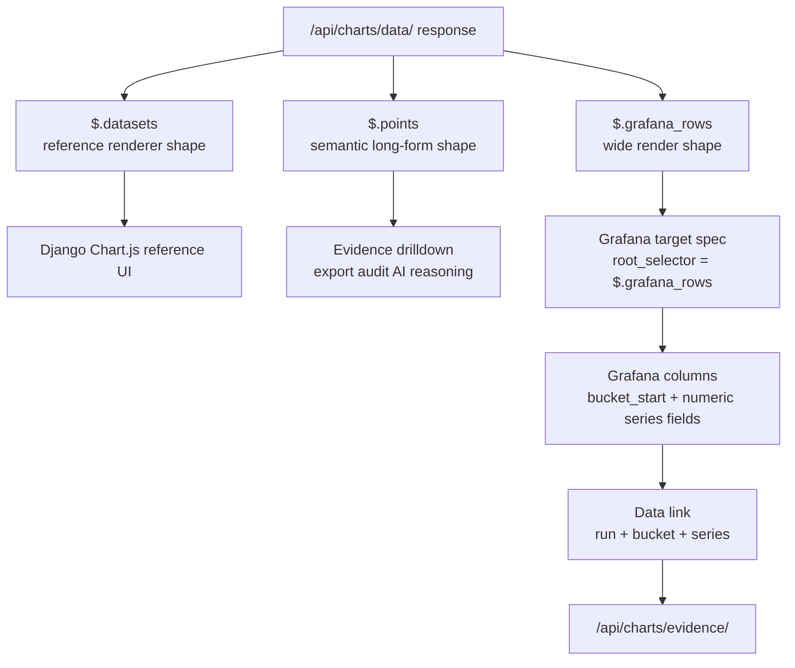

# Grafana 图表渲染契约架构

日期：2026-08-22

## 目的

Grafana dashboard 必须消费 Metrics 拥有的图表契约，而不是在 Grafana dashboard JSON、SQL、或者 AI 生成内容里重新发明 Jira、workflow、status、severity、evidence 等业务语义。本文件定义当前 Grafana stock dashboard 和未来 AI 生成 dashboard specification 都必须遵守的 chart data contract。

触发本契约的直接问题是 daily Bug Trend 图表：后端已经返回了正确的 daily 数据，但 Grafana bar chart 消费 long-form `points` 后渲染为空图。根因不是 daily bucket 本身，而是 render contract 描述不足，让 Grafana 只能从 `label`、`value` 这类泛化字段名里猜测字段含义。

## 先读懂这些概念

这条链路容易混淆，是因为同一份业务数据会经历多次“形态变化”。每一层都应该有明确的 owner 和 contract，不能让下一层靠字段名猜测上一层的意图。

先把几个高频关键词固定下来：

| Keyword | 在本契约里的含义 | 例子 | 容易混淆的点 |
| ------- | ---------------- | ---- | ------------ |
| `labels` | Chart.js/reference UI 使用的 category label 数组，通常对应一组 bucket 的显示名。 | `["2026-06-01", "2026-06-02"]` | 它只是显示顺序和横轴标签，不是 evidence 查询的稳定 id。新契约优先使用 `bucket_label` 明确表达含义。 |
| `datasets` | Chart.js 风格的 series 列表；每个 dataset 通常包含一个 `series_name`、显示属性和与 `labels` 对齐的数据数组。 | `all_open_bugs: [7, 8, 6]` | 适合 reference renderer 和 parity check，但不适合作为 Grafana stock panel 的主输入。 |
| `bucket` | 时间或分类聚合单元；在 Bug Trend 里通常是一日或一周，后端有稳定的 `bucket_id`、`bucket_start`、`bucket_end` 和 `bucket_granularity`。 | daily bucket `2026-06-01` | `bucket_label` 是显示文本，`bucket_id` 才是 evidence drilldown 应该使用的 artifact id。 |
| `series` | 图表中的一条指标序列，也就是同一类数值跨多个 bucket 的集合。 | `all_open_bugs`、`new_medium_low` | 在 long-form `points` 里它是 `series_name` 字段；在 wide `grafana_rows` 里它变成 numeric column name。 |
| `point` | 一个 bucket 和一个 series 交叉出来的单个数值。 | `bucket=2026-06-01, series=all_open_bugs, value=7` | 适合解释和 evidence，不一定是 Grafana 最稳定的渲染形态。 |
| `row` | API 返回给某个 consumer 的一行数据；在 `grafana_rows` 里一行代表一个 bucket，并包含多个 series numeric columns。 | `{ bucket_start, all_open_bugs, new_medium_low }` | `row` 是 render shape 的结构，不等于 Jira issue row。 |

| 概念                                                                      | 所在层                               | Owner               | 解决的问题                                                                    | 不能做的事                                    |
| ------------------------------------------------------------------------- | ------------------------------------ | ------------------- | ----------------------------------------------------------------------------- | --------------------------------------------- |
| Jira raw payload                                                          | 外部 source                          | Intel Jira          | 提供原始 issue、field、changelog。                                            | 不定义 Metrics 图表语义。                     |
| `JiraIssue` / `JiraTransition`                                        | `jira_history` durable history     | Metrics Django      | 把 Jira REST payload 转成稳定本地历史事实。                                   | 不直接面向 Grafana 渲染。                     |
| `JiraScopeConfig`                                                       | `bug_metrics` scope semantics      | Metrics Django      | 定义什么是 bug、open、fixed、closed、critical/high，以及 bucket granularity。 | 不放到 Grafana JSON 或 AI prompt 里重复定义。 |
| `BugTrendCalculationRun` / `BugTrendBucket` / `BugTrendBucketIssue` | `bug_metrics` calculated artifacts | Metrics Django      | 固化某次计算的 bucket、series 数值和 evidence membership。                    | 不由 Grafana 临时计算。                       |
| `/api/charts/data/`                                                     | chart data API                       | Metrics Django      | 把计算产物发布为多个显式 shape。                                              | 不让 consumer 自行推断 shape。                |
| `datasets`                                                              | API response root                    | Metrics Django      | 给 Django reference renderer 和 parity check 用。                             | 不作为 Grafana stock 主路径。                 |
| `points`                                                                | API response root                    | Metrics Django      | 给 evidence drilldown、audit、export、AI reasoning 用。                       | 不作为 Grafana stock 主渲染输入。             |
| `grafana_rows`                                                          | API response root                    | Metrics Django      | 给 Grafana stock panel 用的 wide render rows。                                | 不承载 Jira 业务语义。                        |
| `metricsContract`                                                       | Grafana target spec                  | Metrics + validator | 声明 Grafana 应该消费哪个 root、什么 shape、哪些字段是 value fields。         | 不允许缺省或靠 Grafana 猜。                   |
| `/api/charts/evidence/`                                                 | evidence API                         | Metrics Django      | 根据`run`、`bucket`、`series`、`chart_id` 返回 ticket evidence。      | 不由 Grafana SQL 拼 ticket list。             |

## 当前 Bug Trend Reference Map

如果读者想从当前实现继续深入，可以按下面的顺序看。这里列的是本契约已经落地的 reference，而不是未来设想。

| 想理解什么 | Reference | 重点看什么 |
| ---------- | --------- | ---------- |
| 当前 Grafana chart spec 的逐字段解释 | [grafana-bug-trend-chart-spec-reference.zh.md](grafana-bug-trend-chart-spec-reference.zh.md) | `bug_trend_dashboard.json` 每块含义、最终图形映射、每个数据域来源。 |
| Grafana stock dashboard 如何声明 chart spec | [../ops/grafana/bug_trend_dashboard.json](../ops/grafana/bug_trend_dashboard.json) | target 的 `url`、`root_selector`、`columns`、`metricsContract`、data link。 |
| 哪些 API/root/shape 被批准给 Grafana 使用 | [grafana-approved-data-surfaces.json](grafana-approved-data-surfaces.json) | approved data surfaces、allowed roots、allowed shapes、evidence capability。 |
| Grafana artifact 的机器 gate | [../scripts/validate_grafana_artifacts.py](../scripts/validate_grafana_artifacts.py) | 如何拒绝缺失 `metricsContract`、错误 root、错误 shape、SQL、未批准字段。 |
| Grafana artifact 和 API payload 的 parity check | [../scripts/compare_grafana_bug_trend_parity.py](../scripts/compare_grafana_bug_trend_parity.py) | `grafana_rows`、`datasets`、series fields、evidence link 是否一致。 |
| Django API 路由位置 | [../ui_web/urls.py](../ui_web/urls.py) | `/api/charts/data/` 和 `/api/charts/evidence/` 对应的 view。 |
| Chart/evidence API view | [../ui_web/views/bug_trend_view.py](../ui_web/views/bug_trend_view.py) | request 参数如何进入 facade，以及 evidence response 如何返回。 |
| API response 如何组装成 `datasets`、`points`、`grafana_rows` | [../ui_web/facades/bug_trend_facade.py](../ui_web/facades/bug_trend_facade.py) | UI/API 层如何把 bug_metrics 的 chart data 转成外部 response。 |
| UI/API data shape 的 Python 定义 | [../ui_web/data/bug_trend_data.py](../ui_web/data/bug_trend_data.py) | `BugTrendChartData`、point row、Grafana row 等 response data object。 |
| Domain chart API 的核心对象 | [../bug_metrics/app/api/chart_data.py](../bug_metrics/app/api/chart_data.py) | `BugTrendChart`、`BugTrendDataset`、bucket metadata、series data。 |
| Series 名称和显示语义 | [../bug_metrics/app/api/series.py](../bug_metrics/app/api/series.py) | `all_open_bugs`、`new_medium_low` 等 series id、label、颜色、sign。 |
| Scope 语义配置入口 | [../bug_metrics/app/api/scope_config.py](../bug_metrics/app/api/scope_config.py) | 什么算 bug、open、fixed、closed、critical/high、bucket granularity。 |
| Calculation run、bucket、membership 的数据库 artifact | [../bug_metrics/models.py](../bug_metrics/models.py) | `JiraScopeConfig`、`BugTrendCalculationRun`、`BugTrendBucket`、`BugTrendBucketIssue`。 |
| Jira durable history 的来源数据 | [../jira_history/models.py](../jira_history/models.py) | `JiraIssue`、`JiraIssueSnapshot`、`JiraTransition`。 |
| 计算逻辑如何生成 buckets 和 memberships | [../bug_metrics/app/api/calculation.py](../bug_metrics/app/api/calculation.py) | 从 durable history 到 calculation artifacts 的转换。 |
| 本地 E2E 如何启动并验证 Grafana/Django | [../scripts/e2e_bug_trend.py](../scripts/e2e_bug_trend.py) | runtime restart、Grafana provisioning、API validation、dashboard open。 |
| 更完整的 Bug Trend 架构背景 | [bug-trend-architecture-spec.md](bug-trend-architecture-spec.md) | Jira history、scope config、calculation artifacts、UI/API 的设计背景。 |

## 端到端数据流

下面这张图说明“Jira 数据如何变成 Grafana 图表，并从图表回到 evidence list”。关键点是：Grafana 只消费 Metrics 发布出来的 API contract，不直接理解 Jira workflow。

```mermaid
flowchart LR
  jira["Intel Jira REST\nissues + changelog"]
  sync["jira_sync\nfetch and materialize"]
  history["jira_history tables\nJiraIssue + JiraTransition"]
  calc["bug_metrics calculation\nCalculationRun + Buckets + Memberships"]
  api["Django chart API\n/api/charts/data/"]
  shapes["API response shapes\ndatasets + points + grafana_rows"]
  grafana["Grafana datasource\nmetrics-bug-trend-api"]
  panel["Grafana panel spec\nroot_selector + columns + metricsContract"]
  chart["Rendered chart\ncanvas + legend + tooltip"]
  evidence["Django evidence API\n/api/charts/evidence/"]
  list["Evidence list\ntickets for clicked bucket/series"]
  jira --> sync
  sync --> history
  history --> calc
  calc --> api
  api --> shapes
  shapes --> grafana
  grafana --> panel
  panel --> chart
  chart --> evidence
  evidence --> list
```



## 一份 API，多种 Shape

`/api/charts/data/` 不是“一个图表等于一种 JSON”。它是一个 chart data envelope，可以同时带多个 root。不同 consumer 只应该读取自己声明要消费的 root。



### 为什么需要多个 shape

同一个业务含义在不同 consumer 那里需要不同结构：

- Chart.js/reference UI 更容易使用 `labels + datasets`。
- Evidence 和 audit 需要一行一个 `bucket + series + value` 的 `points`，因为每个点都能解释到 ticket membership。
- Grafana stock panel 更稳定地消费 wide table，也就是一行一个 bucket、每个 series 一个 numeric column 的 `grafana_rows`。

因此，`points` 和 `grafana_rows` 不是重复数据，而是同一组 calculation artifacts 的两种 contract projection。

### 字段如何对应到 Grafana chart spec

Grafana target 不能只写一个 URL。它必须写清楚这几个层次：

| Grafana target 字段                    | 应该填什么                                                                         | 作用                                             |
| -------------------------------------- | ---------------------------------------------------------------------------------- | ------------------------------------------------ |
| `url`                                | `/api/charts/data/?scope_id=$scope_id&begin=$begin&end=$end&chart_id=<chart_id>` | 指向 Metrics-owned chart API。                   |
| `root_selector`                      | `$.grafana_rows`                                                                 | 选择 wide render shape。                         |
| `columns[].selector`                 | `bucket_start`、`bucket_label`、`all_open_bugs` 等                           | 声明 Grafana 从`grafana_rows` 中取哪些字段。   |
| `columns[].type`                     | `timestamp`、`string`、`number`                                              | 防止 Grafana 猜错字段类型。                      |
| `metricsContract.root`               | `grafana_rows`                                                                   | 机器可检查地声明消费哪个 root。                  |
| `metricsContract.contractVersion`    | `0.1`                                                                            | 机器可检查地声明 consumer 依赖的 contract 版本。 |
| `metricsContract.shape`              | `wide_bucket_series`                                                             | 机器可检查地声明数据形态。                       |
| `metricsContract.valueFields`        | `all_open_bugs`、`new_medium_low` 等                                           | 声明哪些 numeric fields 是要渲染的 series。      |
| `metricsContract.evidenceLinkFields` | `calculation_run_id`、`bucket_id`                                              | 声明点击后 evidence link 必需字段。              |
| `metricsContract.seriesFieldSource`  | `__field.name`                                                                   | 声明 clicked numeric field name 就是`series`。 |

对于 bucket-series 图，Grafana data link 应该从 clicked row 取 `run` 和 `bucket`，从 clicked field 取 `series`：

```text
run=${__data.fields.calculation_run_id}
bucket=${__data.fields.bucket_id}
series=${__field.name}
```

这比 `series=${__data.fields.series_name}` 更适合 wide table，因为 wide table 不再有单独的 `series_name` 列；series 被表达为 numeric column name。

## AI 生成时的安全路径

未来 AI 接入时，不应该让 AI 直接生成“看起来能跑”的任意 Grafana JSON。AI 应该生成 draft，然后交给 Metrics validator 判断能否发布。

推荐流程：

1. 用户用自然语言描述想看的图。
2. AI 选择已注册的 chart family 和 shape，例如 `wide_bucket_series`。
3. AI 生成 Grafana target spec draft。
4. Validator 检查 datasource、API path、query params、`metricsContract`、字段名、evidence link 和 SQL 禁用规则。
5. 通过后才允许进入 chart catalog 或 Grafana provisioning。

如果 validator 报错，AI 只能根据错误修复 draft，不能绕过 contract。

## 所有权边界

Metrics 拥有：

- 从 Jira 或未来 work-item 系统同步 source data；
- scope 语义、semantic list normalization 和配置 hash；
- calculation run 和 freshness；
- chart definition 和 evidence contract；
- 已批准的 render surface；
- Grafana dashboard JSON 的验证，不管该 JSON 是人写的还是 AI 生成的。

Grafana 拥有：

- layout；
- panel rendering；
- legend 和 tooltip 展示；
- dashboard variables；
- 链接回 Metrics-owned evidence APIs。

Grafana 不应该拥有：

- Jira status 或 severity mapping；
- fixed、closed、open、critical/high 等 lifecycle definition；
- 对内部表的任意 SQL；
- 为 AI-generated charts 自行发明 data-contract 字段。

## Scope Semantic Normalization

所有 chart family 都不能直接消费未正规化的配置文本。`JiraScopeConfig` 是 scope semantics 的持久化 owner，因此 list 型语义字段必须在这个边界统一正规化，而不是让每个 chart 或 renderer 自己拆字符串。

当前正规化规则适用于所有 `bug_type_values`、status/resolution values、severity buckets、`display_fields` 等 semantic list fields：

| 输入形态 | 正规化结果 | 说明 |
| -------- | ---------- | ---- |
| `"Fixed\nResolved\nDone"` | `["Fixed", "Resolved", "Done"]` | 支持 textarea 真实换行。 |
| `"Fixed\\nResolved\\nDone"` | `["Fixed", "Resolved", "Done"]` | 支持 JSON/fixture 中的 escaped newline。 |
| `"Fixed, Resolved, Done"` | `["Fixed", "Resolved", "Done"]` | 支持逗号分隔。 |
| `["Fixed", "Resolved", "Fixed"]` | `["Fixed", "Resolved"]` | 去掉空值和重复值，保留首次出现顺序。 |

这个规则解决的是 upstream semantic mapping，不是 Grafana rendering。Grafana 只应该消费已经计算好的 `grafana_rows`；如果 `critical_high_values`、`medium_low_values`、`fixed_status_values` 这类配置未被正规化，后端会把真实 Jira 值匹配失败，最终表现为 Grafana legend 有 5 条 series，但除了 `all_open_bugs` 以外全是 0。

落地点：

- [`bug_metrics/models.py`](../bug_metrics/models.py) 的 `normalize_scope_list_values()` 和 `JiraScopeConfig.save()` 负责持久化边界。
- [`bug_metrics/app/api/scope_config.py`](../bug_metrics/app/api/scope_config.py) 负责 API/form payload 到 `SavedScopeConfig` 的正规化。
- [`bug_metrics/migrations/0010_normalize_scope_semantic_lists.py`](../bug_metrics/migrations/0010_normalize_scope_semantic_lists.py) 和 [`bug_metrics/migrations/0011_normalize_escaped_scope_semantic_lists.py`](../bug_metrics/migrations/0011_normalize_escaped_scope_semantic_lists.py) 修复既有数据库记录。
- [`bug_metrics/tests/test_api_scope_config.py`](../bug_metrics/tests/test_api_scope_config.py) 和 [`bug_metrics/tests/test_api_bug_trend_contracts.py`](../bug_metrics/tests/test_api_bug_trend_contracts.py) 覆盖 direct model save、API save 和 calculation behavior。

## 契约分层

一个 chart API 可以为不同 consumer 暴露多种 shape。这些 shape 必须显式命名。

当前 baseline contract 是 `default_bug_trend@0.1`。版本号从 `0.1` 开始，是因为当前系统仍处在 MVP/contract discovery 阶段：允许破坏兼容，但每一次破坏都必须显式改版本、改 allowlist、改 Grafana spec，并让 validator/parity check 拒绝旧假设。

版本由三处共同声明：

| 位置 | 字段 | 当前值 | 作用 |
| ---- | ---- | ------ | ---- |
| Chart API response | `contract_version` | `0.1` | Producer 声明实际返回的数据契约版本。 |
| Grafana target `metricsContract` | `contractVersion` | `0.1` | Consumer 声明自己按哪一版契约读取数据。 |
| Approved data surfaces | `approved_contract_versions` | `["0.1"]` | Validator 的 allowlist，决定哪些版本允许发布。 |

版本 bump 规则：

| 改动类型 | 版本动作 |
| -------- | -------- |
| 只改 Grafana layout、颜色、legend、tooltip，不改 API 字段或含义 | 不改 contract version。 |
| Additive metadata field，旧 consumer 不受影响 | 可以保留 `0.1`，或在需要明确沟通时升 minor。 |
| 新增 rendered numeric series | 升 minor，例如 `0.2`，并更新 `valueFields`。 |
| 重命名/删除字段，或改变字段含义、sign、evidence 参数语义 | 升 major baseline，例如 `1.0` 或下一条明确 breaking 版本。 |
| 新增不同 shape | 新 shape 自己定义版本，不复用旧 shape 的隐含语义。 |

| Shape            | Chart API / Root                                | 目的                                              | 典型 Consumer                                      |
| ---------------- | ----------------------------------------------- | ------------------------------------------------- | -------------------------------------------------- |
| `datasets`     | `GET /api/charts/data/` -> `$.datasets`     | Renderer-neutral 的 Chart.js/reference 结构。     | Django reference UI、parity checks。               |
| `points`       | `GET /api/charts/data/` -> `$.points`       | Long-form semantic/evidence rows。                | Evidence drilldown、exports、audit、AI reasoning。 |
| `grafana_rows` | `GET /api/charts/data/` -> `$.grafana_rows` | 为 Grafana stock panels 准备的 wide render rows。 | Grafana bar/time-series/table panels。             |

同一个 response 可以同时包含三种 shape。Consumer 必须选择 `metricsContract.root` 声明的 shape。

当前 Bug Trend chart-data API 的标准查询参数是：

```text
GET /api/charts/data/?scope_id=<scope>&begin=<YYYY-MM-DD>&end=<YYYY-MM-DD>&chart_id=<chart_id>
```

不同 renderer 不能自行更换业务语义，只能选择同一个 API response 中已声明的 root。对于 Grafana stock panel，`metricsContract.root` 必须和 target 的 `root_selector` 对齐，例如：

```json
{
  "root_selector": "$.grafana_rows",
  "metricsContract": {
    "chartId": "default_bug_trend",
    "contractVersion": "0.1",
    "root": "grafana_rows",
    "shape": "wide_bucket_series"
  }
}
```

### Chart API Shape 对照表

| API                       | Root                                                                                                                                                                                                            | Shape             | 是否用于渲染                          | 是否用于 Evidence | 说明                                                                |
| ------------------------- | --------------------------------------------------------------------------------------------------------------------------------------------------------------------------------------------------------------- | ----------------- | ------------------------------------- | ----------------- | ------------------------------------------------------------------- |
| `/api/charts/data/`     | `$.datasets`                                                                                                                                                                                                  | `datasets`      | 可以，主要用于 reference renderer。   | 否                | 保持 Chart.js/reference UI 和 parity check 稳定。                   |
| `/api/charts/data/`     | `$.points`                                                                                                                                                                                                    | `points`        | 不推荐作为 Grafana stock 主渲染输入。 | 是                | 一行一个 bucket/series/value，适合 drilldown、audit、AI reasoning。 |
| `/api/charts/data/`     | `$.grafana_rows`                                                                                                                                                                                              | `wide_bucket_series` | 是，Grafana stock bucket-series 主路径。 | 间接支持 | 一行一个 bucket，每个 series 一个 numeric column，点击时用 `series=${__field.name}` 映射回 evidence API。 |
| `/api/charts/evidence/` | `$.rows`                                                                                                                                                                                                      | `evidence_rows` | 只用于 table/list。                   | 是                | 由`run`、`bucket`、`series`、`chart_id` 等参数限定。        |

## Semantic Point Contract

`points` 是 canonical long-form semantic shape，优化目标是 evidence 和可解释性。

必需字段：

| Field                  | 含义                                                       |
| ---------------------- | ---------------------------------------------------------- |
| `calculation_run_id` | 图表使用的已完成 Metrics calculation run。                 |
| `bucket_id`          | 稳定的 bucket artifact id。                                |
| `bucket_label`       | bucket 的显示标签，例如`26WW32` 或 `2026-06-01`。      |
| `bucket_start`       | bucket start 的 ISO date。                                 |
| `bucket_end`         | bucket end 的 ISO date。                                   |
| `bucket_granularity` | `daily`、`weekly`，或未来注册过的 bucket granularity。 |
| `series_name`        | Metrics 拥有的稳定 machine series id。                     |
| `series_label`       | 从 series metadata 派生的人类可读 display label。          |
| `value`              | 已经应用 chart sign 的 numeric value。                     |
| `type`               | renderer hint，例如`line` 或 `bar`。                   |
| `color`              | 推荐的 series color。                                      |

兼容性说明：旧 client 可能仍会读取 `label`。新的契约必须使用 `bucket_label`。

## Grafana Wide Render Contract

Grafana bar chart 在 query 返回一个 text/time category field 加一个或多个 numeric fields 时最稳定。`grafana_rows` shape 遵循这个模型。

必需字段：

| Field                  | 含义                                            |
| ---------------------- | ----------------------------------------------- |
| `calculation_run_id` | 当前 row 使用的已完成 Metrics calculation run。 |
| `bucket_id`          | 稳定的 bucket artifact id。                     |
| `bucket_label`       | category axis label。                           |
| `bucket_start`       | ISO bucket start date。                         |
| `bucket_end`         | ISO bucket end date。                           |
| `bucket_granularity` | Bucket granularity。                            |
| `<series_name>`      | 每个 rendered series 一个 numeric column。      |

示例：

```json
{
  "calculation_run_id": "run-123",
  "bucket_id": "bucket-123",
  "bucket_label": "2026-06-01",
  "bucket_start": "2026-06-01",
  "bucket_end": "2026-06-01",
  "bucket_granularity": "daily",
  "all_open_bugs": 7,
  "all_open_critical_high": 1,
  "new_critical_high": 0,
  "new_medium_low": 2,
  "fixed_or_closed_bugs": -1
}
```

渲染 bucket-series chart 的 Grafana stock dashboard target 必须声明：

```json
{
  "metricsContract": {
    "chartId": "default_bug_trend",
    "contractVersion": "0.1",
    "root": "grafana_rows",
    "shape": "wide_bucket_series",
    "categoryField": "bucket_label",
    "requiredFields": ["calculation_run_id", "bucket_id", "bucket_label", "bucket_start", "bucket_end", "bucket_granularity"],
    "valueFields": ["all_open_bugs", "new_medium_low"],
    "evidenceLinkFields": ["calculation_run_id", "bucket_id"],
    "seriesFieldSource": "__field.name"
  }
}
```

Wide render rows 的 evidence data link 通过被点击的 numeric field name 映射回 Metrics series id：

```text
/api/charts/evidence/?scope_id=$scope_id&begin=$begin&end=$end&chart_id=default_bug_trend&run=${__data.fields.calculation_run_id}&bucket=${__data.fields.bucket_id}&series=${__field.name}
```

## AI Contract

AI 生成的 Grafana 描述只是 draft，不是可直接部署的 artifact。AI-generated chart 在发布前必须通过与人工 Grafana JSON 相同的 validator。

AI chart draft 必须声明：

- `chart_id`；
- `contract_version` / `contractVersion`，当前 baseline 是 `0.1`；
- renderer route，例如 `c_stock` 或 `c_plugin`；
- `metricsContract.root`；
- `metricsContract.shape`；
- `metricsContract.requiredFields`；
- 对 wide render charts，必须声明 `metricsContract.valueFields`；
- `metricsContract.evidenceLinkFields`；
- evidence capability，例如 `bucket_series`、`range_only` 或 `summary_only`。

AI chart draft 禁止：

- 使用任意 SQL；
- 查询 raw Jira 或 Metrics internal tables；
- 硬编码 status、severity、priority、component 或 workflow values；
- 发明 approved contract 之外的字段名；
- 当 `bucket_label` 可用时，用泛化的 `label` 作为 render category；
- 绕过 Metrics evidence APIs 自行拼 ticket list。

`scripts/validate_grafana_artifacts.py` 是本契约的机器 gate。未来 AI 生成流程应该把 validator 的错误信息作为修复反馈。

## 扩展规则

本契约有意不绑定 Bug Trend 单一图表。新的 chart family 应该增加具名 shape，而不是复用含义模糊的字段。

示例：

| 未来图表                     | 推荐 Shape                                        |
| ---------------------------- | ------------------------------------------------- |
| bucket-series trend          | `wide_bucket_series` + `points` evidence rows |
| owner/component distribution | `wide_category_series` 或 `category_points`   |
| single KPI                   | `summary_value`                                 |
| time-based line chart        | `wide_time_series`                              |
| evidence-only table          | `evidence_rows`                                 |

每个新 shape 必须定义：

- API payload 中的 root name；
- required fields；
- numeric value fields 或 row value field；
- evidence mapping policy；
- approved Grafana visualization families；
- validator checks；
- 一个 positive test 和一个 negative test。

## 迁移规则

在所有 consumer 完成迁移前，不要删除 `labels`、`datasets` 或 `points` 等 legacy fields。允许 additive fields。新的 Grafana stock dashboard 在 bucket-series render path 上应该使用 `grafana_rows`，`points` 只用于 evidence-oriented long-form consumers。
