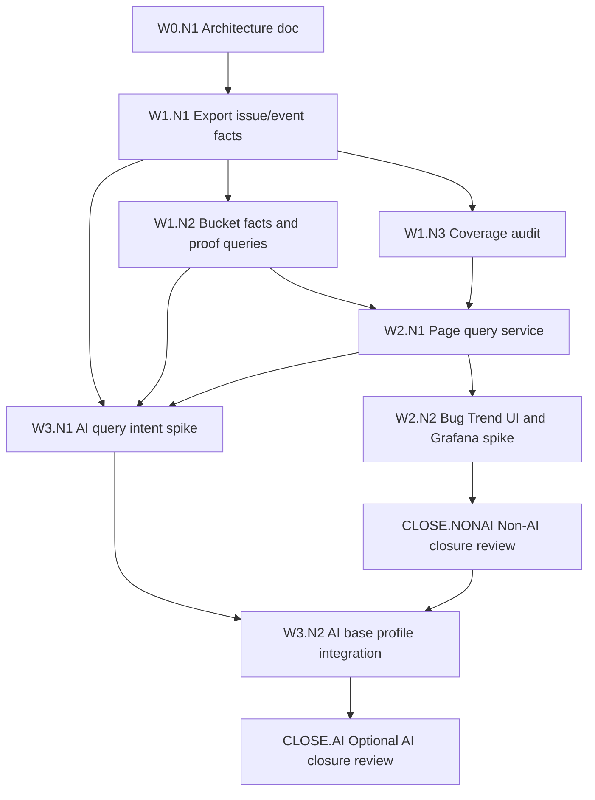

# Grafana Jira Fact Table Architecture

Date: 2026-08-19

## Current Status

This document remains a future source-neutral fact-table architecture reference. The executable authority for the first Grafana C-stock spike is intentionally narrower: Grafana may use only the Metrics-owned HTTP/API surfaces listed in `docs/grafana-approved-data-surfaces.json` and enforced by `scripts/validate_grafana_artifacts.py`.

Direct Grafana SQL over fact views is deferred until the owning Metrics/fact module actually produces named, versioned DB views or materialized facts with migrations and schema tests. Until then, SQL examples in this document are directional, not an enabled C-stock data surface.

## Purpose

This document adjusts the bug trend direction after validating real Intel Jira data from project `131600`.

The prior MVP architecture put project-specific bug semantics in `jira_scope_config`. Real project data showed why that is useful, but the desired direction is lighter: keep the Django fork responsible for read-only Jira collection, fact-table normalization, and Metrics-owned indicator definitions, then let Grafana, SQL views, or provisioned dashboard JSON render those indicators.

The core decision is source-modular and Metrics-owned for data semantics:

```text
Source collector module, for example Jira today or GitHub tomorrow
  -> source-neutral raw archive and normalized fact tables
  -> Metrics-owned indicator definitions and bucket/membership facts
  -> Grafana SQL/dashboard rendering and optional AI query clients/results
```

Django should not become a long-term semantic DSL engine unless Grafana/SQL cannot express a required indicator safely.

## Target Product Outcome

The Grafana/fact-table spike is not complete merely because tables and SQL exist. It is complete only when the real Jira fixture dumped from project `131600` can drive the bug trend end to end on the user-facing page:

1. The dumped Jira REST payload is replayed into source-neutral facts without Jira writes.
2. Metrics-owned indicator definitions materialize chart buckets and bucket memberships from those facts.
3. The Bug Trend page renders the same time-range chart from the materialized facts, either through Grafana panels embedded/linked from the page or through the existing Django/Chart.js reference path while Grafana parity is being proven.
4. The same page shows a ticket list below the chart for the selected time range and dropdown filters.
5. Clicking a chart bucket or changing dropdown filters uses the same bucket membership/query contract, so the chart and list cannot disagree about which Jira or GitHub tickets are included.

For the first real Jira validation, the semantic definition may follow the current Jira ticket definitions observed in project `131600` rather than the earlier demo defaults. For example, `Bug`, `P1-Stopper`, `P2-High`, `Fixed`, `Done`, `Waived`, and `Delete` should be classified by the versioned indicator definition selected for that Jira scope, not by hidden demo-era constants. The important rule is single ownership: those meanings live in Metrics-owned indicator definitions and generated facts, not separately in Grafana panel SQL, Django templates, or AI prompts.

## Evidence From Real Jira Project 131600

The real fixture was dumped with read-only Jira JQL:

```jql
issuekey = STDEL-8942 OR project = 131600 ORDER BY updated DESC
```

The current bounded fixture contains `500` Jira REST issue payloads. The raw payloads include the data needed for the existing MVP bug trend calculation:

| Raw REST fact | Coverage in fixture | Use |
| --- | ---: | --- |
| `fields.created` | 500 / 500 | New issue bucket date. |
| `fields.updated` | 500 / 500 | Sync freshness and snapshot ordering. |
| `fields.resolutiondate` | 213 / 500 | Resolved date shortcut when Jira populates it. |
| `changelog.histories` | 500 / 500 | Historical status/resolution reconstruction. |
| Issues with status transitions | 332 / 500 | Fixed/closed/open-at-time reconstruction. |
| Issues with resolution transitions | 219 / 500 | Fixed/closed/open-at-time reconstruction. |

The materialized local history for the same fixture contains:

| Materialized fact | Count |
| --- | ---: |
| Jira issues | 500 |
| Jira snapshots | 500 |
| Status transitions | 602 |
| Resolution transitions | 258 |
| Weekly buckets | 70 |

The real Jira values also show why fixed keyword lists are not enough:

| Field | Observed values |
| --- | --- |
| Issue type | `Story`, `Task`, `Bug`, `Epic`, `Sub-task`, `Feedback`, `Approval`, ... |
| Status | `New`, `Done`, `In Execution`, `In Analysis`, `Waived`, `Delete`, `Fixed`, ... |
| Priority | `Undecided`, `P3-Medium`, `P2-High`, `P4-Low`, `P1-Stopper` |
| Resolution | empty, `Done`, `Rejected`, `Waive`, `Fixed`, `Wont Fix` |

Example gap: `P1-Stopper` appears in real Jira but was not part of the earlier `critical_high_values` default. This is a project indicator-definition problem, not a Jira REST data-shape problem.

## Architecture Decision

Use Grafana as the preferred visualization and dashboard-composition layer. Keep this Django fork as a thin data acquisition, normalization, and Metrics-owned indicator-definition service with replaceable source collector modules.

Jira is the first source module, not the permanent data-source boundary. A future GitHub source should be able to produce the same normalized fact contract from GitHub issues, pull requests, labels, state changes, milestones, projects, or workflow events.

### Django Responsibilities

- Perform read-only source collection through source-specific modules such as Jira REST or GitHub REST/GraphQL.
- Store raw source payloads for traceability and replay.
- Normalize source-specific records and event histories into queryable fact tables.
- Provide optional validation/audit commands that summarize observed Jira enum values and unmapped dashboard categories.
- Keep the existing Django/Chart.js MVP as a reference implementation and local smoke-test path until Grafana parity is proven.

### Source Module Boundary

Each source integration owns authentication, pagination, source-specific API quirks, raw payload capture, and conversion into the shared fact contract. It must not own Grafana panel semantics.

Minimum source module interface:

| Interface | Purpose |
| --- | --- |
| `fetch_raw_records(scope)` | Performs read-only source API calls and returns bounded raw records. |
| `write_raw_snapshot(scope, raw_records)` | Archives raw payloads for replay and audit. |
| `normalize_issue_facts(scope, raw_records)` | Emits one current fact row per source item. |
| `normalize_event_facts(scope, raw_records)` | Emits lifecycle/event rows such as created, status changed, closed, reopened, label changed, or milestone changed. |
| `audit_observed_values(scope, raw_records)` | Reports source-specific enum/category values that dashboard rules may need to classify. |

For Jira, this interface maps to JQL search, `fields`, and `changelog.histories`. For GitHub, the same interface can map to issues, pull requests, timeline events, labels, milestones, projects, review states, and state-change events. Grafana may use different dashboard JSON files for Jira and GitHub, but both should consume the same normalized table family where practical.

### Source Configuration And Authentication Isolation

Each source module owns its own configuration namespace, authentication mechanism, credential validation, pagination settings, rate-limit behavior, and source-specific query shape.

| Source | Configuration owner | Credential owner | Query/scope owner | Module tests |
| --- | --- | --- | --- | --- |
| Jira | `jira_sync/` settings/config loader or Jira source config | Jira PAT / Jira auth mode / Jira CA bundle | JQL, field list, changelog expansion, page size | `jira_sync/tests/` |
| GitHub | future `github_sync/` settings/config loader or GitHub source config | GitHub token / GitHub App credentials / API base URL | Repository/org scope, search query, GraphQL selection set, timeline event selection | future `github_sync/tests/` |

Credential rules:

- Source credentials must stay inside the source module runtime environment and must not be written into Grafana dashboard JSON, SQL files, raw fixtures, or normalized fact rows.
- Adding a new source must not modify an existing source's credential loader except through a shared non-secret interface.
- A source module may expose non-secret metadata such as `source_system`, `source_project_key`, `source_item_key`, and pagination/sync status.
- Grafana reads only the normalized database or source-specific compatibility views. It does not call Jira, GitHub, or any future source API directly in this architecture.

### Layered Test Ownership

Tests should follow the source boundary rather than mixing all source behaviors in one suite.

| Test layer | Owner | What it proves | What it must not prove |
| --- | --- | --- | --- |
| Source adapter tests | `jira_sync/tests/`, future `github_sync/tests/` | Auth mode selection, source query construction, pagination, raw payload shape handling, source-specific history extraction. | Grafana panel correctness or another source's behavior. |
| Source normalization tests | Source module tests plus shared contract fixtures | A source module emits the required `work_item_fact` and `work_item_event_fact` columns from its raw payloads. | Project-specific indicator semantics unless the source itself owns that raw value extraction. |
| Shared fact contract tests | Shared tests near the fact exporter/schema owner | Every source module can satisfy the neutral fact schema and conformance checks. | Jira-only or GitHub-only API assumptions. |
| SQL/Grafana tests | `docs/sql/`, `ops/grafana/`, dashboard validation tests | Dashboard queries consume neutral facts or compatibility views and compute expected series. | Source API pagination/auth behavior. |
| End-to-end parity tests | Cross-layer validation plan | A concrete source fixture produces the same reference series through normalized facts and Grafana SQL. | Whether all future source modules behave identically internally. |

Jira-specific tests should stay bound to Jira source behavior and fixtures. When a GitHub module is introduced, it must bring its own GitHub source tests instead of extending Jira tests with GitHub cases. Shared tests should assert only the neutral fact contract, not source-specific API details.

### Grafana / SQL Responsibilities

- Render project-specific indicators using Metrics-owned definition ids, SQL views, or materialized bucket facts.
- Own display names, colors, legends, panel layout, and dashboard-level filters.
- Compose presentation queries over shared views or facts, without independently defining what counts as a bug, critical/high item, fixed/closed item, or open backlog.

### Bug Trend Page Responsibilities

The Bug Trend page remains the product-level acceptance surface even when Grafana becomes the preferred chart renderer. Grafana can render the chart, but the page contract is broader than a chart panel:

- Scope/date dropdowns select the source scope and time window.
- Additional dropdowns filter ticket rows by source-supported dimensions such as source system, work item type, status, priority/severity, assignee, component, fix version/milestone, repository/project, and series name.
- The chart reads `work_item_bucket_fact` or generated indicator views for the selected definition id/version.
- The ticket list below the chart reads `work_item_bucket_membership` joined to `work_item_fact`, or a generated evidence view over those same facts.
- Bucket click evidence and dropdown-filtered ticket lists share one query service, so chart membership, list membership, and exported links are produced by the same fact artifacts.
- Jira and GitHub tickets use the same list shape: source label, source key, title, state/status, priority/severity when available, owner, component/labels, created/updated/resolved times, series membership, and stored source URL.

The page can initially keep the existing Django/HTMX shape and swap the chart/list data source from MVP tables to `work_item_*` facts. Embedding Grafana should not remove the deterministic list and evidence API; Grafana is allowed to render the chart, while Metrics owns the ticket list query and membership contract.

### Indicator Diagram And Ticket List Synchronization

The diagram and list should be modeled as two projections of one page query state. The diagram is the aggregate view; the ticket list is the evidence view. They must not be backed by independent definitions or unrelated SQL.

```text
PageQueryState
  -> bucket membership query
  -> aggregate projection for indicator diagram
  -> row projection for evidence ticket list
```

Minimum page state:

```text
PageQueryState
  scope_id
  source_system
  begin
  end
  definition_id
  definition_version
  chart_filters
    work_item_type
    priority_or_severity
    status_or_state
    assignee_or_owner
    component_or_label
    fix_version_or_milestone
  selected_bucket_id optional
  selected_series_name optional
  list_filters
    text
    status_or_state
    priority_or_severity
    assignee_or_owner
    component_or_label
    work_item_type
    series_name
```

`chart_filters` change both the diagram and the evidence list. `list_filters` narrow only the currently visible evidence rows and must be labeled as list-local filters in the UI. If a dropdown visually appears in the chart scope/filter bar, it must be treated as a chart filter and therefore affect both projections.

The ticket list has three required states:

| State | Trigger | List content | Required title example |
| --- | --- | --- | --- |
| Visible-range evidence | No bucket selected | Distinct tickets that contributed to any visible bucket/series in the selected time range after chart filters. | `Evidence tickets for visible range` |
| Bucket evidence | User selects a bucket/week on the diagram | Tickets that contributed to any series in the selected bucket after chart filters. | `Evidence tickets for 25WW16` |
| Bucket-series evidence | User selects a bucket and series, for example by clicking one bar/line/legend series | Tickets that contributed to that exact bucket and series after chart filters. | `weekly_new_medium_low tickets for 25WW16` |

The list should include a clear selection summary and a `Clear selection` control whenever `selected_bucket_id` or `selected_series_name` is active.

For negative chart series such as `closed_bugs`, the diagram may render values below zero for visual contrast, but the list count is always the positive number of contributing tickets. A chart point with `closed_bugs = -1` should show one closed ticket in the evidence list.

Required ticket-list columns:

| Column | Source | Purpose |
| --- | --- | --- |
| Source | `work_item_fact.source_system` | Distinguishes Jira, GitHub issue, GitHub pull request, or future sources. |
| Key | `work_item_fact.source_item_key` plus `source_url` | Opens the source ticket without calling the source API. |
| Title | `work_item_fact.summary` | Human-readable issue summary. |
| Series | `work_item_bucket_membership.series_name` | Shows which diagram series the row explains. |
| Type | `work_item_fact.work_item_type` | Preserves Jira/GitHub native type. |
| Priority/Severity | `work_item_fact.priority` or membership dimensions | Explains severity filters and critical/high classifications. |
| Status/State | `work_item_fact.status` or membership dimensions | Shows current state unless historical state is required. |
| Resolution | `work_item_fact.resolution` or membership dimensions | Explains fixed/closed membership. |
| Owner | `work_item_fact.assignee` | Supports owner filtering. |
| Component/Label | flattened `components_json` or membership dimensions | Supports component/label filtering. |
| Created | `work_item_fact.created_at` | Explains new-ticket buckets. |
| Updated/Resolved | `updated_at` / `resolved_at` | Explains freshness and closure. |
| Membership reason | `work_item_bucket_membership.membership_reason` | Explains why the ticket is counted in the selected bucket/series. |

Synchronization invariant: for any active `PageQueryState`, grouping the chart-comparable membership evidence by `bucket_id` and `series_name` must reproduce the diagram counts after applying the same sign convention. Chart-comparable evidence means the membership rows after chart filters and bucket/series selection, but before list-local filters such as text search. Displayed evidence rows may be narrower when list-local filters are active, and the UI must show both the chart-comparable count and the displayed count.

Example: if `25WW16` has `all_open_bugs = 2`, the unfiltered bucket evidence must contain two open-bug memberships. If the user then applies a list-local owner filter and only one row remains visible, the chart still shows `2`, while the list summary should say `1 of 2 evidence rows shown`.

Grafana integration should preserve this ownership. Metrics owns `PageQueryState`, membership queries, and ticket rows. Grafana receives page state as variables or URL parameters and renders the aggregate panel. Grafana data links may set `selected_bucket_id` and `selected_series_name` back on the Metrics page, but Grafana should not own a separate ticket-list query contract.

### Non-Goals

- Do not build a full Python semantic profile DSL as the first solution.
- Do not make Grafana parse raw nested Jira changelog JSON directly.
- Do not put Jira credentials or PATs into Grafana dashboard JSON.
- Do not remove the durable raw archive; Grafana dashboards must be reproducible from captured Jira facts.

## Data Shape Required By Grafana

Grafana can express the project-specific logic only if the input is already table-shaped. The minimum normalized model is:

### `work_item_fact`

One row per current work item snapshot within a dumped scope. Jira-specific SQL views may alias this as `jira_issue_fact`; GitHub-specific SQL views may alias it as `github_issue_fact` or `github_pull_request_fact`.

| Column | Meaning |
| --- | --- |
| `source_system` | Source module identifier such as `jira` or `github`. |
| `scope_id` | Local scope/dump identifier. |
| `source_item_id` | Stable source item id. |
| `source_item_key` | Human-readable key such as Jira issue key or GitHub `owner/repo#number`. |
| `source_url` | Stored source URL for the Jira issue, GitHub issue, or GitHub pull request. |
| `source_project_key` | Jira project, GitHub repository, or equivalent source grouping. |
| `work_item_type` | Source-specific type such as Jira issue type, GitHub issue, or GitHub pull request. |
| `summary` | Title or summary. |
| `priority` | Source priority/severity when available. |
| `status` | Current source state/status. |
| `resolution` | Current source resolution/closed reason when available. |
| `assignee` | Display name/key/login from the source. |
| `components_json` | Component/team/module labels or fields when available. |
| `fix_versions_json` | Fix versions, milestones, releases, or equivalent target versions. |
| `created_at` | Source creation time. |
| `updated_at` | Source update time. |
| `resolved_at` | Source resolved/closed time when available. |
| `raw_fields_json` | Original source fields object for later dimensions. |

### `work_item_event_fact`

One row per event that can drive a time-series calculation.

| Column | Meaning |
| --- | --- |
| `source_system` | Source module identifier such as `jira` or `github`. |
| `scope_id` | Local scope/dump identifier. |
| `source_item_key` | Human-readable source key. |
| `event_time` | Event timestamp. |
| `event_type` | `created`, `status_changed`, `resolution_changed`, `closed`, `reopened`, `label_changed`, or source-specific extension. |
| `field` | Source field for transition events. |
| `from_value` | Previous source value, empty when not applicable. |
| `to_value` | New source value, empty when not applicable. |
| `work_item_type` | Denormalized work item type for easy Grafana queries. |
| `priority` | Denormalized priority/severity for easy Grafana queries. |
| `status_at_dump` | Current source status at dump time. |
| `resolution_at_dump` | Current source resolution at dump time. |
| `raw_event_json` | Original source event fragment for replay/debugging. |

The normalized event table keeps Grafana out of source-specific nested history shapes while preserving enough facts to express indicator definitions. Jira dashboards may use compatibility views named `jira_issue_fact` and `jira_issue_event_fact` over these source-neutral tables if that makes SQL easier to read.

### Fact Contract Owner

The source-neutral `work_item_*` schema needs one Metrics-owned authority. Source modules must not each define their own version of the neutral table contract.

Recommended owner: create a dedicated `work_item_facts/` module when the source-neutral implementation begins. Until that module exists, the current Jira MVP tables remain an implementation reference, not the stable cross-source contract.

The fact-contract owner should own:

- `work_item_fact`, `work_item_event_fact`, `work_item_bucket_fact`, `work_item_bucket_membership`, and optional `work_item_lifecycle_state_fact` schemas.
- DTOs emitted by source modules into the neutral fact writer.
- Write APIs that accept source-normalized DTOs and reject source-specific raw payloads.
- Conformance tests every source module must pass.
- Compatibility views such as `jira_issue_fact` or `github_issue_fact`.

Source modules own API quirks and raw-to-DTO conversion. The fact-contract owner owns persistence semantics, column meanings, lifecycle baseline requirements, and compatibility views.

### Indicator Definition Owner

Project-specific indicator semantics need one Metrics-owned authority. Grafana dashboards and AI queries must consume this authority instead of redefining classifications in panel SQL or prompt logic.

Recommended owner: keep this under `bug_metrics/` for the bug-trend product surface because that module already owns trend bucket calculation and evidence membership in the current MVP. If non-bug metric families expand later, extract a shared `indicator_definitions/` owner only after more than one metrics module needs it.

Minimum definition contract:

```text
indicator_definition
  definition_id
  scope_id
  source_system
  metric_family
  display_name
  definition_version
  work_item_class_rules
  lifecycle_state_rules
  severity_rules
  bucket_granularity
  supported_result_kinds
  generated_view_names
```

Grafana should reference generated views, materialized bucket facts, or `definition_id`. The AI query API should expose definitions through capabilities and require user vocabulary such as "critical/high bugs" to resolve to a selected `definition_id` plus version before execution.

### Lifecycle Reconstruction Contract

Open backlog and open critical/high backlog require lifecycle state at each bucket end. They cannot be derived from transition-event counts alone.

The fact export must therefore provide one of these two contracts before Grafana parity can be claimed:

1. `work_item_event_fact` contains synthetic baseline rows at item creation for status, resolution, and severity/priority state. Status and resolution history rows then form a complete ordered state stream per item.
2. A materialized state or bucket table records the reconstructed state directly, such as `work_item_lifecycle_state_fact` or `work_item_bucket_fact`. Jira-specific names may exist only as compatibility views over these neutral facts.

For the first Grafana spike, severity may be treated as current-at-dump only if the dashboard is labeled as a parity experiment and does not claim historical `all_open_critical_high` correctness. If the project changes priority/severity over time, priority/severity changelog normalization is required before `all_open_critical_high` can be accepted as historically correct.

Validation rule: SQL/Grafana output for `all_open_bugs` and `all_open_critical_high` must be compared with the current Django reference output over the same 70-week project `131600` fixture range.

## Grafana Query Patterns

### New Critical/High Bugs By Week

```sql
SELECT
  bucket_start AS time,
  value
FROM work_item_bucket_fact
WHERE scope_id = $scope_id
  AND source_system = 'jira'
  AND definition_id = $definition_id
  AND definition_version = $definition_version
  AND series_name = 'new_critical_high'
ORDER BY 1;
```

For project `131600`, the Metrics-owned indicator definition decides whether values such as `P1-Stopper` and `P2-High` belong to this series. Grafana selects the definition id/version and renders the returned values; it does not own the priority/status/type classification lists.

### Fixed Or Closed Bugs By Week

```sql
SELECT
  bucket_start AS time,
  -value AS value
FROM work_item_bucket_fact
WHERE scope_id = $scope_id
  AND source_system = 'jira'
  AND definition_id = $definition_id
  AND definition_version = $definition_version
  AND series_name = 'fixed_or_closed_bugs'
ORDER BY 1;
```

This query reads a Metrics-owned bucket fact that already counted distinct source items per bucket. A Jira issue can have both status and resolution transitions in the same bucket; the `fixed_or_closed_bugs` materialization must count that issue once.

For stricter reuse, prefer stable facts or stable views parameterized by `definition_id` and `definition_version`. Generated per-definition SQL views such as `v_indicator_bucket_fact_<definition_id>` should be reserved for narrow Grafana compatibility cases and must be produced from the same Metrics-owned indicator definition authority. Grafana should not copy the classification predicates into panel SQL.

### Open Bugs At Bucket End

Open backlog is the hardest series to leave entirely in Grafana because it asks for state at each bucket end, not just event counts. It needs a latest-transition-at-time calculation.

Preferred implementation options, owned by `bug_metrics/` or the future `work_item_facts/` materialization layer:

1. A Metrics-owned materialized table or stable view computes open backlog per bucket from `work_item_event_fact`.
2. Grafana queries that materialized fact/view as a simple time series.
3. If the database is PostgreSQL, use window functions or `DISTINCT ON` to reconstruct latest status/resolution at bucket end.
4. No-transition issues are classified from their synthetic baseline state or from a materialized lifecycle-state table, not from current dump status alone.

Example target view shape:

```text
work_item_bucket_fact
  scope_id
  source_system
  bucket_start
  bucket_end
  series_name
  value
  dimensions_json
```

This keeps project semantics in Metrics-owned definitions and bucket materialization while avoiding fragile Grafana panel transforms for historical state reconstruction.

`docs/sql/` may carry spike queries and proof scripts, but it is not the production owner of open-backlog semantics. Production ownership stays with `bug_metrics/` for the bug trend product surface or moves to `work_item_facts/` when the neutral fact owner exists.

### `work_item_bucket_membership`

One row per source item that contributes to a materialized bucket series. This table is the producer for chart-click evidence, same-page ticket lists, and AI/Grafana explanations.

| Column | Meaning |
| --- | --- |
| `scope_id` | Local scope/dump identifier. |
| `source_system` | Source module identifier such as `jira` or `github`. |
| `definition_id` | Metrics-owned indicator definition id. |
| `definition_version` | Definition version used when membership was materialized. |
| `bucket_id` | Stable bucket artifact id. |
| `bucket_start` | Bucket start date/time. |
| `bucket_end` | Bucket end date/time. |
| `series_name` | Series that included the item, such as `new_critical_high` or `all_open_bugs`. |
| `source_item_key` | Human-readable source key. |
| `membership_reason` | Short deterministic reason or rule id explaining why the item was included. |
| `dimensions_json` | Denormalized filter dimensions captured at materialization time when historical accuracy is needed. |

Ticket-list queries should join this table to `work_item_fact` for current display fields and source links. If a filter must be historically accurate at bucket time, it must use `dimensions_json` or a lifecycle-state fact captured during materialization, not mutable current fields.

### Ticket List Filter Contract

The page-level dropdown filters should be generated from the same facts/views they query. The first implementation should support at least:

| Filter | Source |
| --- | --- |
| Scope/date range | Selected page controls and bucket facts. |
| Series | `work_item_bucket_membership.series_name`. |
| Source system | `work_item_fact.source_system`. |
| Work item type | `work_item_fact.work_item_type`. |
| Status/state | `work_item_fact.status`, or historical membership dimensions when required. |
| Priority/severity | `work_item_fact.priority`, or historical membership dimensions when required. |
| Assignee/owner | `work_item_fact.assignee`. |
| Component/label | `components_json` or generated flattened dimension view. |
| Fix version/milestone/release | `fix_versions_json` or generated flattened dimension view. |

Filters are source-neutral in shape, but values are source-native. For the real Jira validation, dropdown values should reflect the actual Jira values dumped from project `131600`, not normalized demo labels unless the selected indicator definition explicitly maps them.

### Evidence Query Contract

The same query service should produce both chart aggregates and ticket-list evidence from `PageQueryState`.

Minimum service operations:

| Operation | Input | Output |
| --- | --- | --- |
| `get_indicator_chart(state)` | `PageQueryState` without list-local filters | Bucket labels, bucket ids, series names, signed values, definition id/version. |
| `get_chart_membership_evidence(state)` | `PageQueryState` without list-local filters | Chart-comparable membership rows or grouped counts used for sync validation. |
| `get_evidence_tickets(state)` | `PageQueryState` with optional selected bucket/series and list filters | Bounded displayed ticket rows, displayed count, chart-comparable count, applied filters, selection summary. |
| `get_filter_options(state)` | Scope/date/definition plus chart filters | Dropdown values derived from the same fact/membership views. |
| `validate_chart_list_sync(state)` | Test-only or diagnostic state | Per bucket/series chart values compared with evidence-row aggregates. |

Implementation notes:

- `get_indicator_chart`, `get_chart_membership_evidence`, and `get_evidence_tickets` must share the same definition id/version and chart-filter predicate builder.
- List-local text/status/owner filters may narrow displayed evidence rows, but they must not be used to claim the chart count changed unless the UI explicitly promotes them to chart filters.
- For bucket-series evidence, `selected_bucket_id` and `selected_series_name` must filter `work_item_bucket_membership` before joining display fields.
- For visible-range evidence, rows should be distinct by `(source_system, source_item_key, series_name)` or show grouped series membership per ticket so duplicate appearances across weeks are understandable.
- Every result should include applied scope, time range, definition id/version, chart filters, list filters, and whether a bucket or series is selected.

## What Grafana Cannot Safely Replace

Grafana can own display and panel composition, but it should not replace these foundations:

- Source API collection and authentication, including Jira REST or GitHub REST/GraphQL.
- Raw payload archive for replay and audit.
- Changelog normalization into events.
- Data-quality checks that report unclassified or newly observed Jira enum values.
- Open-backlog state reconstruction when it becomes too complex for panel-local SQL.

## Natural Language And AI Query Layer

The product can add an AI-assisted query layer so users can ask questions such as:

- "Show bugs newly opened in the last 10 days."
- "List the eight highest-risk open defects from the last 10 days."
- "What bugs are still open right now?"
- "Show an indicator diagram for fixed versus newly opened Jira bugs this month."

This layer is optional. The Metrics dashboard must remain functionally complete for source sync, fact normalization, indicator definitions, Grafana/dashboard rendering, deterministic evidence, and ticket-list queries when no AI base is installed or connected. AI adds a natural-language entry point; it must not become a runtime dependency for the non-AI dashboard product.

This should not be implemented as an LLM with direct access to Jira, GitHub, or arbitrary database execution. The safe architecture is:

```text
Natural language request
  -> intent parser / LLM planner
  -> approved query or chart specification
  -> bounded query service over work_item_* facts
  -> ticket list, Grafana URL, dashboard panel variables, or Django/HTMX result view
```

### Mature Libraries Worth Reusing

Several mature frameworks can help with the AI orchestration layer:

| Framework | Useful for | Fit |
| --- | --- | --- |
| Microsoft Semantic Kernel | Tool/function calling, planners, enterprise-friendly orchestration, C#/Python support. | Good fit if the project wants explicit skills/tools and controlled execution. |
| LangChain / LangGraph | Agent workflows, tool routing, SQL agents, graph-based conversational flows. | Useful for prototyping; use strict tool allowlists and avoid open-ended SQL agents in production. |
| LlamaIndex | Natural language over structured/unstructured data, SQL query engines, retrieval over docs. | Useful for schema-aware query generation and documentation retrieval. |
| Vanna / text-to-SQL tools | Training or prompting text-to-SQL from schema and examples. | Useful for SQL generation experiments, but generated SQL still needs validation and read-only guards. |
| Grafana dashboard URLs / variables / API | Turning approved chart specs into dashboards or panel links. | Useful output target; not the LLM orchestration layer. |

These libraries can reduce orchestration work, but they do not replace our domain contracts. We still need to define source-neutral facts, allowed intents, query safety, authorization, and result shapes.

### Reusing The Existing AI Base Project

The local project at `D:\AIGC\Report_creater_agent\` is a feasible AI base for this dashboard query capability. It already has a multi-profile app architecture with:

- `config/app-profiles.json` for profile registration and per-app capabilities.
- `services/app-service/` as a shared FastAPI App Service.
- `template_runtime` as the shared agent runtime, backend registry, model gateway, and tool-binding layer.
- Existing profiles for `sample_agent`, `report_creator`, and `soc_ai_driver`.
- Chat routes that call `AgentRuntimeService.run_chat_turn(...)` with `runtime_tools`, `allowed_host_tools`, `approval_policy`, `mcp_servers`, and `skill_directories`.
- Host tool governance through `RuntimeToolBinding`, Pydantic parameter models, permission modes, approval policy, and tool allowlists.

Recommended optional direction: add a fourth AI-base profile such as `dashboard_query_agent` instead of creating a separate AI orchestration service in this metrics repository. This profile is a plug-in conversational client over Metrics APIs, not a required Metrics component.

The split should be:

```text
Dashboard Query Agent profile in Report_creater_agent
  owns: chat UI, model routing, agent runtime, tool governance, natural-language intent parsing
  calls: metrics dashboard query API / read-only fact query tools

Metrics dashboard service
  owns: Jira/GitHub/source sync, raw archive, work_item_* facts, deterministic query builder, Grafana URLs
  does not own: model gateway, chat session runtime, generic AI backend routing
```

This keeps the AI base reusable across applications while preserving metrics as the data and query authority.

### Optional AI Integration Boundary

The Metrics product has two independently deployable capability sets:

| Capability set | Required for non-AI dashboard | Owner | Must work without AI base |
| --- | --- | --- | --- |
| Source collection and raw archive | Yes | Source modules in Metrics | Yes |
| `work_item_*` facts and fact conformance | Yes | Metrics fact owner | Yes |
| Metrics-owned indicator definitions | Yes | `bug_metrics/` / future definition owner | Yes |
| Grafana/Django chart rendering | Yes | Grafana and/or Metrics UI | Yes |
| Bucket evidence and ticket lists | Yes | Metrics query/evidence APIs | Yes |
| Natural-language chat and intent parsing | No | Optional AI base profile or future `ai_query/` client | No |

If the AI base is absent, disabled, unauthorized, or unreachable, the Metrics dashboard should still support configured charts, filters, evidence lists, ticket lists, Grafana links, and deterministic API queries. The only unavailable capability should be natural-language query orchestration.

The Metrics side may expose deterministic read-only query endpoints for both UI and optional AI clients. Those endpoints should not require an AI-base caller; they should accept validated structured filters/intents from trusted non-AI callers as well.

### Product Ownership And UX Relationship

The recommended relationship is not a single parent-child UI. It is a split of authority by layer:

| Layer | Primary owner | Reason |
| --- | --- | --- |
| Data truth | Metrics dashboard service | It owns source sync, raw archives, normalized facts, scope authorization, deterministic query execution, and audit. |
| Conversation orchestration | AI base Dashboard Query Agent profile | It owns chat UX, model routing, runtime tools, approvals, backend selection, and natural-language intent parsing. |
| Dashboard rendering | Grafana and/or metrics UI | Grafana owns exploratory visual dashboards; metrics UI can keep operational dashboards and richer HTMX workflows. |
| Source credentials | Source modules in metrics | Jira/GitHub credentials belong to source collectors, not AI base or Grafana. |

Two user-facing modes should be supported over the same metrics AI-query API:

1. AI-base-primary mode: the user opens the Dashboard Query Agent profile, asks natural-language questions, and receives ticket lists, chart specs, or Grafana links. In this mode the AI base is the primary UX shell and metrics is the backend data/query authority.
2. Metrics-primary mode: the user opens the metrics dashboard and uses an embedded AI assistant sidebar for contextual questions about the current scope, bucket, series, or ticket list. In this mode metrics is the primary UX shell and the AI base capability is surfaced as an assistant/sidebar.

Both modes must use the same contract:

```text
MetricQueryIntent
  -> metrics /api/ai-query/*
  -> work_item_* facts
  -> ticket list / chart spec / Grafana link
```

Short-term AI implementation should prefer AI-base-primary mode because it reuses the existing profile, chat, model, and tool-governance infrastructure with minimal metrics UI churn. This is an optional AI add-on path. The non-AI Metrics/Grafana path remains the baseline product path and should not wait for Dashboard Query Agent readiness.

### AI Base Integration Boundary

The dashboard query APP should integrate with the AI base through a small read-only tool/API boundary:

| Boundary | Owner | Contract |
| --- | --- | --- |
| App profile | `D:\AIGC\Report_creater_agent\config\app-profiles.json` | Adds `dashboard_query_agent` display metadata, ports, surfaces, and capabilities. |
| AI runtime | `Report_creater_agent/services/app-service/template_runtime/` | Reused as-is for model backend routing, chat execution, tool calling, streaming, and approvals. |
| Dashboard AI service | future `Report_creater_agent/services/app-service/app/services/dashboard_query_service.py` or profile-specific equivalent | Converts natural language into `MetricQueryIntent`, invokes approved dashboard query tools, shapes responses. |
| Dashboard tools | future AI-base host/runtime tool bindings | Read-only tools such as `list_metric_tickets`, `build_indicator_chart_spec`, `build_grafana_link`, and `explain_bucket_membership`. |
| Metrics query API | this repository, future `ai_query/` or query-service endpoint | Validates intent, enforces row/time limits, queries `work_item_*` facts, returns ticket lists/chart specs. |
| Source modules | this repository, `jira_sync/`, future `github_sync/` | Source-specific auth and collection; never called directly by the AI base. |

Do not put source credentials, raw source API clients, Jira PATs, GitHub tokens, or unbounded SQL tools inside the AI base profile. The AI base should receive only normalized query results and stable source links.

### AI Base Feasibility Assessment

| Question | Assessment |
| --- | --- |
| Can the AI base host another dashboard APP? | Yes. Its profile manifest already supports multiple apps with separate names, ports, surfaces, capabilities, docs, and desktop metadata. |
| Can it reuse existing model/backend plumbing? | Yes. `AgentRuntimeService` already abstracts backend selection, model catalog, chat turns, runtime tools, approvals, and streaming. |
| Can it enforce tool boundaries? | Mostly yes. Existing host tool governance supports explicit tool catalogs, permission modes, approval policies, and Pydantic tool schemas. Dashboard tools should follow the same pattern but be read-only and non-filesystem by default. |
| Does it replace the metrics service? | No. The metrics service remains the owner of source sync, normalized facts, deterministic query building, and Grafana/dashboard links. |
| Main integration risk | Cross-repo contract drift between AI-base DTOs/tools and metrics query API. Mitigate with OpenAPI/schema snapshots and contract tests in both repos. |

### Cross-Repo Interface Sketch

Minimum metrics-side API for the AI base:

```text
POST /api/ai-query/intent/validate
  request: MetricQueryIntent
  response: validated intent, normalized filters, warnings

POST /api/ai-query/tickets
  request: MetricQueryIntent where result_kind = ticket_list
  response: bounded ticket rows, applied filters, source links

POST /api/ai-query/chart-spec
  request: MetricQueryIntent where result_kind = indicator_chart | dashboard_link
  response: chart spec or Grafana URL with variables

GET /api/ai-query/capabilities
  response: allowed sources, scopes, lifecycle states, result kinds, max limits
```

The AI-base profile can expose user-facing chat routes using its existing `/api/chat/...` contracts. Its dashboard query tools should call only the metrics-side AI-query API above.

Cross-repo tests should include:

- AI-base unit tests for natural-language-to-intent examples.
- AI-base tool tests with mocked metrics API responses.
- Metrics-side API tests for intent validation, query limits, and deterministic result shaping.
- Contract snapshot tests for request/response schemas shared between the two repositories.

### Cross-Repo Auth And Authorization

Keeping Jira/GitHub credentials out of the AI base is necessary but not sufficient. The metrics AI-query API also needs its own service-to-service and user/scope authorization contract so normalized facts are not overexposed.

Minimum contract:

| Concern | Required behavior |
| --- | --- |
| Service identity | The AI base calls metrics AI-query endpoints as a registered client such as `dashboard_query_agent`, using a non-source API credential or local mTLS/loopback trust mechanism. |
| User context | Requests carry a user/session identity or an explicitly bounded service account context. The metrics API records it in audit logs. |
| Scope authorization | The metrics API validates that the caller may access the requested `scope_id`, `source_project_key`, and `source_system` before executing a query. |
| Operator overrides | Row-limit/time-window overrides require an explicit operator role or admin capability; the LLM cannot grant itself overrides. |
| Audit | Every AI-query request records applied intent, caller, scope, time window, row limit, result count, and whether an override was used. |
| Failure mode | Unauthorized or over-broad requests fail closed with a structured error; the AI base may explain the denial but must not retry by broadening scope. |

The metrics service owns this authorization check because it owns the facts and project scopes. The AI base may authenticate users and sessions, but metrics must enforce access before returning ticket rows or chart data.

`loopback_trust` is local-development only. It is allowed only when both the AI base and Metrics service are bound to loopback and the runtime profile is explicitly local/dev. Production must use a registered service identity such as service token, mTLS, or an equivalent managed client credential. Metrics must reject loopback-trust requests outside local dev, from non-loopback origins, or when the service is remotely bound.

### What We Should Design Ourselves

The application should own a small, explicit query contract instead of letting the LLM invent SQL freely.

Minimum approved intent schema:

```text
MetricQueryIntent
  result_kind: ticket_list | indicator_chart | dashboard_link
  source_system: jira | github | any
  scope_id or source_project_key
  time_window
  work_item_class: bug | issue | pull_request | task | any
  lifecycle_state: open | created | fixed_or_closed | closed | reopened | any
  severity_class: critical_high | medium_low | any
  limit
  sort
  group_by
```

The LLM should produce this intent JSON, not raw SQL. A deterministic query builder then translates approved intents into SQL against `work_item_fact`, `work_item_event_fact`, `work_item_bucket_fact`, or `work_item_bucket_membership`.

### Query Safety Rules

- AI tools are read-only.
- The LLM never receives Jira/GitHub credentials.
- The LLM never calls source APIs directly.
- Generated SQL, if used, must be parsed or constrained to `SELECT` over approved views only.
- Every query has a bounded time window and row limit unless an operator explicitly overrides it.
- User-visible answers must show which scope, source, time window, and filters were applied.
- Ticket lists must link to source items through stored `source_url` or source key mapping, not through freshly calling the source API.

### AI Output Targets

| User asks for | Preferred output |
| --- | --- |
| "Which bugs are open?" | Ticket list from `work_item_fact` or current-state view. |
| "Which bugs were new in the last 10 days?" | Ticket list from `work_item_event_fact` joined to `work_item_fact`. |
| "Show a trend diagram." | Grafana dashboard URL with variables, or Django/Chart.js reference chart from `work_item_bucket_fact`. |
| "Why is this bucket high?" | Evidence list from `work_item_bucket_membership` plus optional summarization over bounded rows. |

AI should be an assistant over the normalized fact layer. It should not become another source-specific data integration path.

Recommended implementation owner: create a dedicated `ai_query/` module if this spike moves beyond design. That module owns intent parsing, tool allowlists, query safety, and result shaping. It consumes approved query services over `work_item_*` facts and may return Grafana URLs or Django result payloads, but it must not live inside a source module such as `jira_sync/` or `github_sync/`.

If the existing AI base is used, split ownership as follows: this metrics repository owns the deterministic `ai_query/` API and fact queries; `D:\AIGC\Report_creater_agent\` owns the `dashboard_query_agent` profile, chat UX, model runtime, and tool orchestration.

The AI query API must not define global meanings for terms such as `bug`, `critical_high`, or `fixed_or_closed`. Natural language may use those words, but execution must resolve them through Metrics-owned capabilities for the selected scope/source. The resolved request should carry `indicatorDefinitionId` and `definitionVersion`, or an equivalent Metrics-owned generated view id.

## Configuration Model Shift

The previous MVP treated `jira_scope_config` as the single authority for Jira project semantics. Under the Grafana-first direction, that authority moves:

| Concern | Previous owner | New preferred owner |
| --- | --- | --- |
| Jira connectivity | Django settings | Django settings |
| Read-only Jira query scope | `jira_scope_config.jql` | Metrics-owned source scope registry/query contract selected by `scope_id`; dump job config owns collection boundaries, while Grafana variables only select Metrics-defined scopes |
| Raw payload retention | `jira_history` | `jira_history` / raw fixture archive |
| Changelog normalization | `jira_sync` + `jira_history` | `jira_sync` + fact table export |
| Project-specific priority/status/issue-type semantics | `jira_scope_config` | Metrics-owned indicator definitions in `bug_metrics/`, compiled to SQL views/materialized facts consumed by Grafana and AI |
| Visual labels/colors/layout | Django templates/Chart.js | Grafana dashboard JSON |
| Coverage audit | new command/query | new command/query or Grafana table panel |

The existing Django MVP remains useful as a reference implementation. It should not be expanded into a large semantic DSL unless Grafana/SQL proves insufficient.

## Risks And Mitigations

| Risk | Impact | Mitigation |
| --- | --- | --- |
| Dashboard queries drift across panels | Different panels classify the same Jira value differently. | Panel-local predicates are non-authoritative; Grafana must reference Metrics-owned indicator definitions, generated views, or materialized facts. |
| Grafana cannot parse nested changelog safely | Fixed/closed and open backlog become wrong or brittle. | Normalize changelog into event fact tables before Grafana consumes it. |
| Value mapping is mistaken for calculation mapping | Labels look right while counts remain wrong. | Keep value mapping for display only; calculate series with explicit SQL predicates. |
| Open backlog query is too complex | Slow or incorrect historical state reconstruction. | Materialize `work_item_bucket_fact` in SQL or Django after indicator rules are stable. |
| Unmapped Jira values are invisible | Project-specific gaps such as `P1-Stopper` are missed. | Add a coverage audit query/command and expose unmapped values in a Grafana table. |
| Grafana credentials sprawl | Jira PATs leak into dashboards or data sources. | Grafana reads normalized local DB only; Jira PAT stays in Django dump environment. |

## Recommended Next Spike

The next spike should prove or disprove this direction using project `131600` real data.

1. Export the existing dumped Jira payloads into source-neutral `work_item_fact` and `work_item_event_fact`, with optional Jira compatibility views.
2. Build SQL queries for the five existing MVP series.
3. Materialize `work_item_bucket_fact` and `work_item_bucket_membership` for the real Jira fixture, using a definition that reflects current project `131600` Jira values rather than demo-only defaults.
4. Compare SQL/Grafana results against the current Django bucket output for the same 70-week range.
5. Add a same-page ticket list under Bug Trend that reads membership facts joined to work item facts and supports dropdown filters over the selected time range.
6. Add coverage audit output for issue type, priority, status, and resolution values not included by the dashboard variables.
7. Compare `all_open_critical_high` separately and decide whether current-at-dump severity is acceptable for the spike or whether severity changelog normalization is required.
8. Decide which Metrics-owned representation carries open backlog state-at-bucket-end: bucket fact materialization, stable Metrics-owned view, or lifecycle-state materialization. Grafana remains a consumer of that result.
9. Prototype a natural-language query intent adapter over the normalized facts for bounded ticket-list and indicator-chart requests.

## DAG Execution Plan

### Scope Baseline

| Item | Value |
| --- | --- |
| Baseline commit | `fd1bb39132cfde9c2bb3c092e9cf533ad4dcf8c9` |
| Pre-existing dirty paths | `jira_sync/management/commands/sync_jira_scope.py`, `jira_sync/out/jira_scope_issue_adapter.py`, `jira_sync/tests/test_sync_jira_scope_command.py`, `jira_sync/app/api/issue_payload_materializer.py`, `jira_sync/management/commands/dump_real_jira_bug_trend_fixture.py` |
| Plan owner path | `docs/grafana-jira-fact-table-architecture.md` |

### Contract Registry

| id | Contract | Owner | Consumers | Disconfirming check |
| --- | --- | --- | --- | --- |
| `INV-SRC-1` | Source integrations are replaceable modules; Jira is the first implementation, and GitHub can be added without changing Grafana's normalized fact contract. | `jira_sync/`, future source modules such as `github_sync/` | `work_item_fact`, `work_item_event_fact`, `work_item_bucket_fact`, `ops/grafana/` | A conformance test or SQL schema check verifies each source module can emit the required neutral fact columns; Grafana SQL depends on `work_item_*` tables or source compatibility views, not raw Jira JSON or Jira-only normalized columns. |
| `INV-AUTH-1` | Source configuration and credentials are isolated per source module; Grafana never owns source API credentials. | `jira_sync/`, future `github_sync/`, settings/config loaders | Source collectors, raw archive, Grafana datasource | A grep/config review shows no Jira/GitHub tokens in dashboard JSON, SQL, fixtures, or normalized facts; adding GitHub does not change Jira auth loader behavior. |
| `INV-TEST-1` | Source-specific tests stay with their source module; shared tests cover only the neutral fact contract. | `jira_sync/tests/`, future `github_sync/tests/`, shared fact contract tests | Source modules, fact exporter, Grafana SQL tests | Jira adapter tests do not contain GitHub fixtures/cases; GitHub adapter tests do not modify Jira expectations; shared conformance tests use source-neutral fixtures/assertions. |
| `INV-RAW-1` | Raw source payloads remain archived and replayable; Grafana does not become the source API client. | `jira_sync` dump command and raw archive; future source dump commands | Fact-table exporter, audit queries, Grafana datasource | Strict JSON parse of `state/real_jira_bug_trend_fixture_131600.json`; no Jira/GitHub credentials in dashboard docs. |
| `INV-NORM-1` | Grafana consumes table-shaped work item/event facts, not nested raw source history JSON. | future `work_item_facts/`, source modules, compatibility views | `ops/grafana/`, `docs/sql/`, `ai_query/` | Query examples reference `work_item_fact` and `work_item_event_fact`, not `issues[].changelog.histories[]`; source modules write through the fact owner rather than owning table semantics. |
| `INV-DEF-1` | Metrics owns versioned indicator definitions; Grafana and AI consume definition ids/views instead of redefining bug/severity/lifecycle semantics. | `bug_metrics/`, future definition APIs/views | Grafana panels, `ai_query/`, project owners | A capability/definition query returns `definition_id`, version, labels, allowed dimensions, and generated view names; panel SQL and AI intents do not hardcode global `bug`, `critical_high`, or `fixed_or_closed` semantics. |
| `INV-GRAF-1` | Grafana is a renderer/composition layer, not the authority for project-specific indicator semantics. | `ops/grafana/`, `docs/sql/`, `bug_metrics/` generated views | Bug trend panels and project owners | Grafana panels reference Metrics-owned definitions/views/materialized facts; panel-local classification predicates are marked non-authoritative or absent. |
| `INV-QUERY-1` | The indicator diagram and ticket list are two projections of one `PageQueryState`; chart filters affect both, list filters affect only displayed evidence rows and are labeled as such. | `bug_metrics/` query service, `ui_web/`, optional `ops/grafana/` variables | Bug Trend page, Grafana panel, evidence list, optional AI query tools | A sync test builds chart data and chart-comparable membership evidence from the same state and verifies membership aggregates reproduce chart counts per bucket/series after sign convention; a separate display test verifies list-local filters report `shown of total` without changing chart counts. |
| `INV-UI-E2E-1` | The real project `131600` Jira fixture must drive the Bug Trend page end to end: chart, date/scope controls, same-page filtered ticket list, and chart-click evidence all read the same materialized facts. | `ui_web/`, `bug_metrics/`, `work_item_facts/`, `ops/grafana/` | Users, Grafana panels, deterministic query APIs | Browser or view-level smoke test opens `/bug-trend/` for the real fixture range, sees non-empty chart data, applies at least one chart dropdown filter, sees chart and list update from the same state, clicks a bucket/series, and sees evidence rows whose source keys belong to the selected bucket/time/filter contract. |
| `INV-TICKET-1` | Ticket lists for Jira and GitHub use a source-neutral row shape while preserving source-native values and stored source URLs. | `work_item_facts/`, query service, `ui_web/` | Bug Trend ticket list, evidence list, optional AI query tools | Contract tests show Jira issue rows and future GitHub issue/PR rows expose source system, key, URL, title, status/state, priority/severity, owner, components/labels, timestamps, and series membership without source API calls. |
| `INV-AI-1` | AI natural-language queries compile to approved intent JSON and then resolve through Metrics-owned capabilities/indicator definitions before any database query or dashboard link is produced. | future `ai_query/` module, query service, `bug_metrics/` definition API | `work_item_*` facts, Grafana URLs, Django result views | Tests show requests like "new bugs in last 10 days" produce bounded intent JSON plus resolved `indicatorDefinitionId`/version, not raw SQL, source API calls, or global hardcoded semantics. |
| `INV-AI-2` | AI tools are read-only and cannot access source credentials, source APIs, arbitrary SQL, or unbounded result sets. | future `ai_query/` module, query service, settings | Source modules, normalized DB, users | Tool allowlist/config review shows only approved read-only query/dashboard tools; SQL validation rejects non-`SELECT`, non-approved views, missing time bounds, or excessive limits. |
| `INV-AIBASE-1` | The dashboard query AI app is an optional plug-in profile that reuses the existing AI base as a profile/tool-orchestration host, while this metrics repo remains independently functional as the data/query authority. | `D:\AIGC\Report_creater_agent\config\app-profiles.json`, AI-base `services/app-service/`, metrics `ai_query`/query API | Dashboard Query Agent profile, metrics query API, users | Cross-repo contract tests or schema snapshots verify `MetricQueryIntent` and response DTO compatibility; AI-base tools call only metrics AI-query endpoints and never source APIs directly; non-AI Metrics/Grafana flows pass without AI base running. |
| `INV-AIAUTH-1` | Metrics AI-query APIs authenticate the AI-base client and enforce user/scope authorization before returning normalized facts. | metrics `ai_query/` API, AI-base Dashboard Query Agent profile auth config | Users, normalized facts, audit logs | Tests show unauthorized scopes fail closed, row/time overrides require operator role, and audit records caller/scope/time window/result count for every AI-query request. |
| `INV-OPEN-1` | Open backlog is treated as state-at-bucket-end and must not be reduced to a simple event count. | `bug_metrics/` bucket fact materialization or future `work_item_facts/` lifecycle materialization | Grafana open backlog panel, Bug Trend evidence list, optional AI query tools | Focused reconstruction tests prove no-transition baseline rows, status/resolution transitions, and terminal states produce correct open-at-bucket-end membership before Grafana consumes the result. |
| `INV-AUDIT-1` | Real Jira enum coverage gaps must be visible before a dashboard is called correct. | `jira_sync/`, `docs/sql/` | Project owners, Grafana table panel | Audit output lists unmapped issue type/status/priority/resolution values from fixture. |

### Node Table

| id | depends_on | owner_paths | authority_boundary | contracts | validation | exit_criteria | parallel_policy |
| --- | --- | --- | --- | --- | --- | --- | --- |
| `W0.N1` | [] | `docs/grafana-jira-fact-table-architecture.md` | Architecture docs | `INV-SRC-1`, `INV-AUTH-1`, `INV-TEST-1`, `INV-RAW-1`, `INV-NORM-1`, `INV-DEF-1`, `INV-GRAF-1`, `INV-QUERY-1`, `INV-UI-E2E-1`, `INV-TICKET-1`, `INV-AI-1`, `INV-AI-2`, `INV-AIBASE-1`, `INV-OPEN-1`, `INV-AUDIT-1` | Independent review of this document | Document states target architecture, source module boundary, fact/definition ownership, Bug Trend page E2E outcome, PageQueryState synchronization, ticket-list/filter contract, config/auth isolation, layered tests, AI-base reuse boundary, AI query boundary, risks, and Grafana/non-Grafana responsibilities. | serial |
| `W1.N1` | [`W0.N1`] | future `work_item_facts/`, `jira_sync/`, `jira_history/`, `jira_sync/tests/`, shared fact contract tests | Dump/normalization | `INV-SRC-1`, `INV-AUTH-1`, `INV-TEST-1`, `INV-RAW-1`, `INV-NORM-1` | Jira source tests plus neutral schema conformance check | `work_item_fact` and `work_item_event_fact` can be generated from the real fixture through the fact owner without Jira writes, Jira auth/config tests remain Jira-owned, and the source exporter is checked against the neutral column contract. | serial |
| `W1.N2` | [`W1.N1`] | `bug_metrics/`, future `work_item_facts/`, `docs/sql/`, `docs/` | Bucket fact and Grafana query design | `INV-DEF-1`, `INV-GRAF-1`, `INV-OPEN-1`, `INV-TICKET-1` | Bucket reconstruction tests, SQL query smoke test against fixture DB, definition capability checks, and membership checks | Five MVP series can be expressed from Metrics-owned indicator definitions as materialized bucket facts or stable generated views, with fixed/closed deduped by issue per bucket; open backlog is reconstructed by Metrics-owned materialization; `work_item_bucket_membership` contains source keys, positive membership counts, and reason fields needed for chart-click and filtered ticket-list evidence. | serial |
| `W1.N3` | [`W1.N1`] | `jira_sync/`, `jira_sync/tests/`, docs | Coverage audit | `INV-AUDIT-1`, `INV-TEST-1` | Jira audit command/query test with known unmapped Jira fixture values | Audit reports unmapped `P1-Stopper`-class gaps and status/resolution gaps without adding non-Jira source cases to Jira tests. | parallel after `W1.N1` with `W1.N2` if owner paths do not overlap |
| `W2.N1` | [`W1.N2`, `W1.N3`] | `bug_metrics/`, `ui_web/facades/`, `ui_web/tests/`, docs | Page query service | `INV-QUERY-1`, `INV-TICKET-1`, `INV-DEF-1` | Focused query tests for visible-range, bucket, bucket-series, chart-filter, list-filter, and sync states | `PageQueryState` can produce chart aggregates, chart-comparable membership evidence, displayed evidence ticket rows, filter options, selection summaries, `shown of total` counts, and chart/list sync diagnostics from the same materialized facts for the real fixture range. | serial |
| `W2.N2` | [`W2.N1`] | `ui_web/views/`, `ui_web/templates/`, `ui_web/static/`, `ui_web/tests/`, optional `ops/grafana/` | Bug Trend product UI | `INV-GRAF-1`, `INV-QUERY-1`, `INV-UI-E2E-1`, `INV-TICKET-1`, `INV-AUDIT-1` | Bug Trend browser/view smoke over the real fixture range plus Grafana dashboard smoke check or exported JSON review | Bug Trend renders five series from normalized DB for project `131600`, shows the evidence ticket list below the chart, supports chart filters and list-local filters with clear labels, handles no selection/bucket/bucket-series states, and keeps chart-click evidence/list rows consistent with `work_item_bucket_membership`; Grafana also renders an unmapped-values panel or links back with equivalent variables. | serial |
| `W3.N1` | [`W1.N1`, `W1.N2`, `W2.N1`] | future `ai_query/`, `ai_query/tests/`, docs | Natural-language query adapter | `INV-AI-1`, `INV-AI-2`, `INV-DEF-1`, `INV-NORM-1`, `INV-QUERY-1` | Intent parser tests, query safety tests, definition-resolution tests, and bounded read-only result tests | Natural-language examples compile to approved intent JSON, resolve to Metrics-owned indicator definitions/capabilities, and return ticket lists or chart/dashboard specs from the same query contract without source API calls. | parallel after `W2.N1` with `W2.N2` if owner paths do not overlap |
| `CLOSE.NONAI` | [`W2.N2`] | `docs/`, tests | Non-AI page closure review | `INV-SRC-1`, `INV-AUTH-1`, `INV-TEST-1`, `INV-RAW-1`, `INV-NORM-1`, `INV-DEF-1`, `INV-GRAF-1`, `INV-QUERY-1`, `INV-UI-E2E-1`, `INV-TICKET-1`, `INV-OPEN-1`, `INV-AUDIT-1` | Independent review plus file-size/diff-whitespace gates, focused query tests, Bug Trend UI smoke, `python manage.py check` | Real Jira fixture drives the non-AI Bug Trend page with synchronized diagram and evidence list; AI-base is stopped or absent during this closure check. | serial |
| `W3.N2` | [`W3.N1`, `CLOSE.NONAI`] | `D:\AIGC\Report_creater_agent\config\app-profiles.json`, AI-base docs/profile files, metrics query API docs/tests | Optional AI-base profile integration | `INV-AIBASE-1`, `INV-AIAUTH-1`, `INV-AI-1`, `INV-AI-2` | Cross-repo contract snapshot, mocked metrics API tool tests, authorization tests, AI-base profile smoke test, non-AI Metrics/Grafana smoke test with AI base stopped | Dashboard Query Agent profile can call metrics AI-query API through read-only tools and returns ticket lists/chart specs without direct source API credentials; metrics API authenticates caller and enforces scope/limit authorization; Metrics/Grafana baseline remains green with no AI base. | optional serial after `W3.N1` and non-AI closure |
| `CLOSE.AI` | [`W3.N2`] | `docs/`, metrics query API docs/tests, AI-base profile files | Optional AI closure review | `INV-AIBASE-1`, `INV-AIAUTH-1`, `INV-AI-1`, `INV-AI-2`, `INV-QUERY-1` | Independent cross-repo review plus AI-base profile smoke and contract tests | Optional Dashboard Query Agent profile is verified without becoming a dependency of the non-AI Metrics/Grafana product. | optional serial |

### Mermaid DAG



### Execution Ledger

- [x] `W0.N1` - Draft Grafana fact-table architecture and DAG plan.
- [ ] `W1.N1` - Export issue/event fact tables from real Jira fixture.
- [ ] `W1.N2` - Materialize bucket facts and membership facts with Grafana proof queries for five MVP bug trend series.
- [ ] `W1.N3` - Add real-data coverage audit for unmapped values.
- [ ] `W2.N1` - Build shared PageQueryState service for chart aggregates and evidence ticket rows.
- [ ] `W2.N2` - Build Bug Trend UI/Grafana spike with synchronized chart and same-page evidence list.
- [ ] `W3.N1` - Prototype AI query intent adapter over normalized facts.
- [ ] `W3.N2` - Add Dashboard Query Agent profile integration in the AI base.
- [ ] `CLOSE.NONAI` - Run independent non-AI Bug Trend page closure review and gates.
- [ ] `CLOSE.AI` - Run optional AI-base closure review and gates.

### Validation Commands

Current document-only validation:

```powershell
python scripts/check_file_size_limits.py --include-untracked
python scripts/check_diff_whitespace.py --include-untracked
```

Future implementation validation:

```powershell
python -m pytest jira_sync\tests\test_sync_jira_scope_command.py -q
python -m pytest bug_metrics\tests\test_api_bug_trend_contracts.py -q
python -m pytest bug_metrics\tests\test_bug_trend_page_query_state.py -q
python -m pytest ui_web\tests\test_bug_trend_fact_table_ui.py -q
python -m pytest ui_web\tests -q
python manage.py check
```

### Code-Doc Truth Sync

| Surface | Status | Reason |
| --- | --- | --- |
| `docs/mvp-bug-trend-architecture-spec.md` | deferred-with-trigger | It records the current Django MVP semantic-owner model. Update it only if the Grafana spike is accepted as the replacement target. |
| `docs/architecture-manual.md` | deferred-with-trigger | It remains the baseline architecture manual. Add a pointer after fact-table/Grafana spike moves beyond proposal. |
| `.github/copilot-instructions.md` | deferred-with-trigger | It still routes current MVP work through `jira_scope_config`; change only after implementation changes the stable owner. |
| `README.md` | no-doc-change | No user setup or runtime command changes in this document-only step. |

Until `W2.N1` passes Grafana parity review and `.github/copilot-instructions.md` plus `docs/mvp-bug-trend-architecture-spec.md` are updated, the existing Django MVP owner model remains the implementation authority.