# Bug Trend Scope Config 微架构手册

Date: 2026-08-23

## 目标

当前 `Bug Trend Scope Config` 页面把 Jira 语义配置暴露为 raw text 输入。用户需要手动填写 issue type、status、resolution、severity、component、owner、milestone 等值，容易出现拼写错误、大小写不一致、字段名填错、把全局 Jira 值误用于当前 project 等问题。

本手册定义一个只读的 metadata discovery 微架构。当前 provider 是 Intel Jira，用来把可枚举的 Jira 候选项加载到 Scope Config 页面，并把页面改造成“选择优先、文本兜底”的配置体验。这个微架构应把通用 scope 配置体验和 Jira-specific adapter 分开，避免未来接入其他管理系统时重写整个模块。

## 核心决策

`jira_scope_config` 仍然是 bug trend 项目语义的单一事实来源。

Jira metadata discovery 只负责发现候选项和解释候选项来源，不负责决定某个值在最终图表里要被拼成哪条业务曲线。用户在 UI 中选择后，最终保存的 truth 仍然写回 `JiraScopeConfig` 的现有字段；priority/severity 这类字段应优先保存 Jira 原始选项，后续 chart/Grafana 配置再决定是否组合成 critical-only、high+low、P0/P1/P2 等展示口径。

Scope 的基础语义应分成两层：

1. Scope universe 前提：`project` + `item_type`。在 Jira provider 下就是 Project key/name + Issue Type。这两个维度共同定义“我们要分析哪一类工作项”。
2. Filter/dimension 条件：status、resolution、priority、severity、component、owner、team、milestone、version 等。它们是在同一个 universe 内继续筛选、分组、映射或展示的维度，可以按字段性质支持单选、多选、搜索或 raw fallback。

`jql` 仍然保留为高级 scope query，但 UI 不应该让用户从一大段 JQL 开始思考。推荐先让用户选择 Project 和 Issue Type，再由 UI 生成或校验基础 JQL；高级用户仍可展开编辑完整 JQL。

原因：

- Intel Jira 下不同 project、issuetype、workflow、custom field context 可能不同；其他管理系统也会有自己的 item type、workflow state、resolution、priority、owner、component 或 release 概念。
- metadata 是配置辅助，不是指标计算输入。
- 历史计算、audit、evidence、Grafana artifact 必须继续通过保存后的 `config_version_hash` 判断语义版本。

## 多管理系统扩展边界

Scope Config 不应该长期等同于 Jira Config。更稳的边界是：

```text
Reusable scope config core
  - scope identity
  - query/filter expression
  - lifecycle mapping
  - field mapping
  - raw value pools
  - chart-level value grouping
  - validation and config hash

Provider-specific metadata adapters
  - Jira metadata adapter
  - Azure DevOps metadata adapter
  - GitHub Issues metadata adapter
  - other tracker adapters
```

也就是说，将来接另外八个管理系统时不应该重写整个 Scope Config 页面和保存逻辑。应该新增 provider adapter，把外部系统的 metadata 转换成统一的候选项模型，再复用同一套 UI、normalization、保存、audit 和 chart grouping。

### 可复用部分

| 部分 | 是否可复用 | 原因 |
| --- | --- | --- |
| Scope identity：`name`、`ip`、`project_label`、`enabled` | 可复用 | 这些是 dashboard 管理维度，不依赖 Jira。 |
| Query/filter expression | 部分可复用 | UI 和保存字段可复用，但表达式语法 provider-specific。Jira 是 JQL，Azure 是 WIQL，GitHub 可能是 search query。 |
| Project + item type universe | 可复用 | 各系统通常都有“项目/空间 + 工作项类型”的基础范围概念；字段名称 provider-specific。 |
| Lifecycle mapping：open/fixed/closed/reopen/excluded | 可复用 | 所有缺陷系统都会有状态生命周期，只是候选值来源不同。 |
| Field mapping：severity/component/owner/team/milestone/version | 可复用 | 概念可复用，字段 id/name 的格式 provider-specific。 |
| Raw value pool display | 可复用 | UI 展示“原始候选值 + 来源 + 是否已保存”这一模式跨系统成立。 |
| Chart-level value grouping | 可复用 | Grafana/Chart.js 关心的是规范化维度和值组合，不应该绑定 Jira API。 |
| `normalize_scope_list_values` | 可复用 | 换行、逗号、去重 normalization 是通用输入处理。 |
| `config_version_hash` | 可复用 | 任何 provider 的语义配置变化都需要触发 stale/recalculate 判断。 |
| Jira issue type/status/resolution endpoints | 不可复用 | 这是 Jira provider adapter 的职责。 |
| Jira field ids，例如 `customfield_12345` | 不可复用 | 这是 Jira-specific field identity。 |

### 建议的抽象命名

当前数据库模型叫 `JiraScopeConfig`，适合 MVP，但后续多系统版本建议引入 provider-neutral 概念：

```python
@dataclass(slots=True)
class ScopeConfigOptions:
    provider: str
    projects: list[TrackerOption]
    item_types: list[TrackerOption]
    lifecycle_states: list[TrackerOption]
    resolutions: list[TrackerOption]
    fields: list[TrackerFieldOption]
    field_values: dict[str, list[TrackerOption]]
    warnings: list[str]


@dataclass(slots=True)
class TrackerOption:
    id: str
    name: str
    provider: str
    source: str
    parent_id: str = ''


@dataclass(slots=True)
class TrackerFieldOption:
    id: str
    name: str
    provider: str
    value_kind: str
    supports_allowed_values: bool
```

Jira adapter 输出 `TrackerOption`，Azure adapter 也输出 `TrackerOption`。UI 不需要知道 Jira 的 `allowedValues`、Azure 的 picklist、GitHub 的 labels/milestones 分别长什么样。

### Provider Adapter Contract

```python
class ScopeMetadataProvider:
    provider_name: str

    def parse_scope_projects(self, query: str) -> list[str]:
        ...

    def discover_options(self, query: str, selected_item_types: list[str]) -> ScopeConfigOptions:
        ...

    def discover_field_values(self, project_id: str, item_type_ids: list[str], field_id: str) -> list[TrackerOption]:
        ...
```

Jira 的实现使用 JQL、project statuses、createmeta、field metadata；其他系统的实现只需要满足这个 contract。

### Provider-Neutral UI 文案

UI 上不建议把所有区域写死成 Jira 术语。推荐：

| 当前 Jira 文案 | Provider-neutral 文案 | Jira 页面中的显示 |
| --- | --- | --- |
| JQL | Scope Query | Scope Query (JQL) |
| Issue types | Item types | Item types (Jira issue types) |
| Statuses | Lifecycle states | Lifecycle states (Jira statuses) |
| Resolutions | Resolutions / outcomes | Resolutions |
| Components | Components / areas | Components |
| Fix versions | Versions / releases | Fix versions |

这样 Jira 首版不会牺牲清晰度，未来多系统接入时也不需要把 UI 文案推倒重来。

### 数据库演进建议

短期可以继续使用 `JiraScopeConfig`，不要为了未来八个系统提前大迁移。实现上先把 metadata discovery 抽象做成 provider-neutral，数据库仍由现有模型承接。

中期如果第二个 provider 落地，再考虑：

- 增加 `provider` 字段，例如 `jira`、`azure_devops`、`github_issues`。
- 把 `jql` 泛化为 `scope_query`，保留 `jql` 作为 Jira alias 或 migration source。
- 把 `bug_type_values` 泛化为 `item_type_values`。
- 把 `*_status_values` 泛化为 `*_state_values`，UI 可以继续在 Jira provider 下显示为 status。
- 保留 provider-specific JSON extension，例如 `provider_config_json`，用于存储 Jira project key、Azure area path 等无法统一的上下文。

不要在第一个 Jira metadata 版本里同时做数据库泛化迁移。先把 adapter contract 和 UI 组件边界切出来，等第二个 provider 出现时再用真实差异驱动模型升级。

## 当前入口

当前相关代码边界：

| 层          | 文件                                             | 当前职责                                                   |
| ----------- | ------------------------------------------------ | ---------------------------------------------------------- |
| UI template | `ui_web/templates/bug_trend_scope_config.html` | 渲染 raw text 表单。                                       |
| UI view     | `ui_web/views/bug_trend_view.py`               | 处理 GET/POST、保存后 redirect。                           |
| UI facade   | `ui_web/facades/bug_trend_facade.py`           | 把 POST 解析为`SavedScopeConfig`，调用 bug metrics API。 |
| Scope API   | `bug_metrics/app/api/scope_config.py`          | 验证、保存、normalize semantic list fields。               |
| Scope model | `bug_metrics/models.py`                        | 存储`JiraScopeConfig` 并计算 `config_version_hash`。   |
| Jira client | `jira_sync/out/jira_scope_issue_adapter.py`    | 创建`atlassian.Jira` client，当前只用于 issue sync。     |

## 多 Scope 配置与落盘

当前数据模型已经支持多条 scope 配置落盘。

| 能力 | 当前状态 | 证据 / 说明 |
| --- | --- | --- |
| 多条 scope 记录 | 已支持 | `JiraScopeConfig` 是普通 Django model，每条记录有独立 `id`、`name`、`ip`、`project_label`、`jql`、semantic fields。 |
| 唯一名称 | 已支持 | `JiraScopeConfig.name` 是 `unique=True`，`ScopeConfigService` 也验证重复名称。 |
| 多 scope dashboard selector | 已支持 | `ApiForBugTrend.list_enabled_scopes()` 返回所有 enabled scopes，并按 `ip`、`project_label`、`name` 排序；Bug Trend 页面用 `scope_id` 选择当前 scope。 |
| 编辑已有 scope | 已支持 | `BugTrendScopeConfigView` 通过 `scope_id` 读取 config，POST 保存同一条记录。 |
| API 创建新 scope | 已支持 | `ScopeConfigService.save_scope_config()` 在 `config.id` 为空时会创建新的 `JiraScopeConfig`。 |
| UI 创建新 scope | 已支持基础流程 | `BugTrendScopeConfigView` 支持 `mode=new`；`BugTrendFacade.save_scope_config()` 允许无 id payload 创建 disabled draft 或 save-and-enable。Selector-first Project + Issue Type 控件仍是后续 UX 增强。 |
| 禁用 scope | 已支持基础流程 | `enabled` 字段存在，`disable_scope_config()` 存在；Scope Library 提供带确认的 Disable action；dashboard 只列 enabled scopes。 |
| 每个 scope 独立 sync cursor | 已支持 | `JiraSyncCursor.scope` 是 `OneToOneField(JiraScopeConfig)`，每个 scope 有独立 sync 状态、coverage window、materialized hash。 |
| 每个 scope 独立 history/calculation/evidence | 已支持 | `JiraIssue`、`JiraTransition`、`BugTrendCalculationRun`、`BugTrendBucket`、`BugTrendBucketIssue` 都关联 scope 或 calculation run。 |

因此，架构上不是“只能保存一个 scope”。基础 UI workflow 已扩展为“Scope Library + Create/Edit/Duplicate/Disable”。剩余缺口集中在更完整的 selector-first Project + Issue Type 控件、候选项写回交互，以及更细粒度的 sync/calculation 状态展示。

### Target Multi-Scope Workflow

推荐 workflow：

```text
Scope Library
  -> Create scope
      -> choose provider
      -> choose Project + Item Type universe
      -> discover filters/dimensions
      -> save draft or enabled scope
  -> Edit scope
      -> load persisted config by scope_id
      -> refresh metadata without saving
      -> save and mark stale if config hash changed
  -> Duplicate scope
      -> clone query, mappings, chart groups
      -> require new unique name
      -> save as disabled draft by default
  -> Disable scope
      -> hide from dashboard selector
      -> keep historical runs/evidence for audit
```

### Multi-Scope UX Requirements

- Scope Library 页面按 `ip`、`project_label`、`provider`、`enabled` 分组展示。
- 每个 scope 显示：name、provider、project universe、item types、enabled 状态、latest sync status、latest calculation run、config hash stale 状态。
- `Create` 不要求先有 `scope_id`。
- `Duplicate` 是创建相似 scope 的主路径，适合多个 team/component/version 变体。
- 保存 scope 时只保存当前 `scope_id`；metadata refresh 不创建也不更新 scope。
- 修改 semantic fields 后必须继续提示 recalculation。
- 禁用 scope 不删除历史数据；删除 scope 如需支持，应是单独的高风险操作并要求确认。

### Scope 操作按钮与编辑状态

Scope Config 不是单页裸表单，而应该是“Scope Library + Config Editor”的两层操作模型。

Scope Library 顶部操作：

| 操作 | 入口 | 行为 | 风险控制 |
| --- | --- | --- | --- |
| `New scope` | library toolbar primary button | 打开 create mode，表单没有 `scope_id`，默认 disabled draft，先选择 provider、Project、Issue Type。 | 未保存草稿离开页面时提示确认。 |
| `Edit` | 每个 scope row action | 用 `scope_id` 读取已落盘配置，所有字段回填到 form、chips、dropdown、raw fallback。 | 页面显示 persisted baseline hash 和 latest saved time。 |
| `Duplicate` | 每个 scope row action | 复制 query、field mappings、semantic values、chart compatibility groups，要求新 name，默认 disabled draft。 | Source scope 只读，不复制 history/cursor/run/evidence。 |
| `Disable` | 每个 scope row action | 设置 `enabled=false`，从 dashboard selector 隐藏。 | 二次确认；确认文案说明历史数据保留。 |
| `Delete` | 不放首版主路径 | 首版不做硬删除。若未来加入，必须在 advanced danger zone。 | 要求输入 scope name 确认，并先证明无合规/audit 保留要求。 |

Config Editor 固定操作区：

| 操作 | 位置 | 行为 | 可用条件 |
| --- | --- | --- | --- |
| `Save draft` / `Save changes` | sticky footer / page top mirrored action | 新建或 duplicate scope 时保存为 disabled draft，不进入 dashboard selector；编辑已有 scope 时保存更改并保留当前 enabled 状态。 | create/edit mode 都可用；从 dashboard selector 移除已有 scope 必须使用 `Disable`。 |
| `Save and enable` | sticky footer primary action | 保存并启用 scope；如果 semantic hash 改变，提示需要 sync/recalculate。 | 必须满足 name、provider、Project、Issue Type、query 基础校验。 |
| `Discard changes` | sticky footer secondary action | 放弃当前未保存修改，edit mode 重新从数据库读取 persisted config，create mode 清空回 draft 初始值。 | 仅当页面有 dirty fields 时启用；需要确认。 |
| `Refresh metadata` | metadata panel action | 只刷新候选项和 warning，不保存 scope，不改变 dirty baseline。 | provider、Project、Issue Type 或 query 至少能确定一个 metadata universe。 |
| `Back to library` | breadcrumb / footer | 返回 library。 | 有 dirty fields 时先提示 save/discard/cancel navigation。 |
| `Advanced edit as text` | 每个 mapping section | 展开 raw textarea fallback。 | 始终可用，但默认折叠。 |

编辑已有 scope 时，页面必须从已落盘的 `JiraScopeConfig` 读取值作为 persisted baseline，再把候选 metadata 叠加在同一个控件上：

- 已保存且仍在当前 metadata 候选池里的值显示为 selected chips。
- 已保存但当前 metadata 找不到的值仍显示为 selected chips，并标记 `Saved, not in current metadata`。
- 用户本次新增或删除的值显示 dirty marker，例如 `Modified` tag 或 section-level `3 changes`。
- 与 persisted baseline 完全一致的 section 不显示 dirty marker。
- `Save draft` / `Save and enable` 提交的是当前 form state；`Discard changes` 必须恢复 persisted baseline，而不是恢复最近一次 metadata refresh 结果。

Dirty state 的判断单位应覆盖 field-level 和 section-level：

| 层级 | 标记 | 用途 |
| --- | --- | --- |
| Field | `Modified` tag beside label | 告诉用户哪个字段与落盘值不同。 |
| Section | change count in header | 折叠 section 时仍能看到里面有修改。 |
| Page | sticky unsaved banner | 防止用户切 scope 或返回 library 时丢失修改。 |
| Scope row | stale/config changed badge after save | 提醒 operator 后续需要 sync/recalculate。 |

### 用户动线

推荐把用户使用顺序从“先写 JQL 和 raw text”调整成“先定义 universe，再逐步收窄语义”：

```text
Scope Library
    -> New scope or Edit existing scope
    -> Identity: name, provider, IP/project label
    -> Universe: Project + Issue Type
    -> Refresh metadata
    -> Workflow semantics: open/fixed/closed/reopen/excluded statuses and resolutions
    -> Severity/Priority: choose raw value pool, then compatibility groups
    -> Dimensions: component, owner, team, milestone, fix/package version, display fields
    -> Advanced query/raw text fallback only when needed
    -> Save draft or Save and enable
    -> Prompt sync/recalculate when semantic hash changed
    -> Return to library/dashboard selector
```

这个动线的 UI 结果是：Project + Issue Type 必须排在第一屏；status/resolution 等依赖它们的候选项在后面加载；高级 JQL/raw text 不能成为默认起点。切换已保存 scope 时，先离开当前 editor 的 dirty guard，再按目标 `scope_id` 重新读取落盘配置，不能把当前草稿状态带到另一个 scope。

### Multi-Scope Persistence Contract

| Contract | Required behavior |
| --- | --- |
| Identity | 每条 scope 必须有唯一 `name` 和稳定 `id`。 |
| Isolation | 一个 scope 的 metadata refresh、save、sync、calculation 不应修改其他 scope。 |
| Cursor | 每个 scope 最多一个 `JiraSyncCursor`，cursor 的 config hash 必须对应该 scope。 |
| History | issue/snapshot/transition 必须按 scope 隔离，即使不同 scope 命中同一个 Jira issue key。 |
| Dashboard | chart/evidence API 必须用显式 `scope_id`，不能从最近编辑或默认 scope 推断。 |
| Audit | 保存、激活、禁用、metadata refresh failure 如记录 audit event，必须带 scope id 或明确标记为 pre-create draft。 |

### Remaining Follow-Up for Selector-First Flow

基础 create/edit/duplicate/disable/save workflow 已实现。后续如果要把“选择优先、文本兜底”的 UX 做完整，需要继续新增或修改：

- Project selector 和 Issue Type selector：从 metadata/project parse 结果中显式选择，生成或校验基础 JQL。
- Candidate write-back controls：把 metadata candidates 从 tags 升级为 checkbox chips/searchable select，并写回现有字段名。
- Section-level dirty counts：当前已有 field marker/page banner 基础，后续可增强折叠 section 的 change count。
- Sync/calculation status summaries：Scope Library 当前有 enabled/draft/hash，后续可接入 latest sync status 和 latest calculation run。
- Tests：selector-first Project + Issue Type、candidate chip write-back、section dirty count、sync/calculation status rendering。

## 非目标

- 不在首版中自动推断 open/fixed/closed 映射，也不把 critical/high、medium/low 当成唯一 severity 分桶模型。
- 不把项目语义移动到 env var、settings 或硬编码列表。
- 不要求所有字段都有 dropdown；Jira 没有稳定枚举的字段必须保留 raw fallback。
- 不在 dashboard render 时 live-query Jira。metadata discovery 只用于配置页面和显式刷新动作。
- 不把历史库中 observed values 当成完整候选来源。历史 audit 可以作为补充提示，但不是 Jira 配置全集。

## Jira Metadata 接口矩阵

当前项目使用 `atlassian-python-api` 的 `Jira` client。该 client 已暴露大部分需要的 Server/Data Center REST 封装。Intel Jira 当前应继续走 `server_pat` 模式，由 `create_jira_client(settings)` 创建 client。

Atlassian Jira Data Center REST 文档确认：

- REST URI 形态是 `/rest/{api-name}/{api-version}/{resource-name}`。
- Jira Core API 当前稳定版本是 `2`，`latest` 是实例解析的 symbolic version，不应作为设计主锚点。
- REST response 使用 JSON。
- 分页接口使用 `startAt`、`maxResults`、`total`；`total` 可能变化或省略，客户端必须允许空 page 和短 page。
- Server/Data Center 支持 Personal Access Token；本项目继续复用 `METRICS_JIRA_AUTH_MODE=server_pat`。
- Jira 浏览器页面依赖 cookie-based auth；本项目后端 discovery 不应依赖浏览器 cookie，而应通过服务端 PAT 调 REST API。

## Jira Website/API 搜索任务设计

这里的“Jira website 搜索”分成两类：

1. 用户在 Jira 网站里看到和手动验证的页面，例如 project、issue type、workflow、custom field、component、version。
2. Metrics 后端通过 REST API 读取的 metadata。产品实现必须以后端 REST discovery 为准，Jira website 只用于人工验证和排查权限/字段上下文差异。

### 搜索目标

| 目标 | 人工 Jira website 检查 | 后端 REST/API 检查 | 成功判据 |
| --- | --- | --- | --- |
| 当前 scope 属于哪些 project | 在 Jira issue/search 页面确认 JQL 的 project 条件 | 本地解析 JQL；无法解析时提示用户选择 project | 至少得到一个明确 project key，或给出可操作 warning。 |
| project 下有哪些 issue types | Project settings 或 Create Issue 页面 | `issue_createmeta_issuetypes(project_key)` | 返回 issue type id/name，并能匹配已保存 `bug_type_values`。 |
| issue type 下有哪些 workflow statuses | Workflow/status 页面或 issue transition UI | `/rest/api/2/project/{projectKey}/statuses` | status 候选按 project + issue type 保留来源。 |
| 有哪些 resolution | Jira admin/status 或 closed issue 页面 | `get_all_resolutions()` | resolution name 可用于 fixed/closed mappings。 |
| priority 原始选项 | issue priority dropdown | `get_all_priorities()` | priority name/id 可用于 severity/priority 原始值池。 |
| custom severity field 可选值 | issue create/edit 页面字段 dropdown | `issue_createmeta_fieldtypes(project_key, issue_type_id)` 的 `allowedValues`，必要时 `get_custom_field_options(...)` | custom field 值池可独立于 priority 展示。 |
| components | project component 页面 | `get_project_components(project_key)` | component name 可作为筛选候选。 |
| versions/milestones | project versions/releases 页面 | `get_project_versions(project_key)` 或 paginated 版本 | version name 可用于 release/milestone 候选。 |
| owner/assignee | issue assignee picker | `get_all_assignable_users_for_project(project_key)` 或 user search | 大集合不全量渲染，支持 typeahead 或 fallback。 |
| 字段 id 和字段名 | issue field tooltip/admin field 页面 | `get_all_fields()` | UI 展示 `name (id)`，保存稳定 id/name。 |

### 搜索顺序

首版 discovery 按低风险、低权限成本的顺序执行：

1. 解析 JQL project key。
2. 读取全局 visible fields：`get_all_fields()`。
3. 对每个 project 读取 issue types：`issue_createmeta_issuetypes(project_key)`。
4. 对每个 project 读取 project statuses：`/rest/api/2/project/{projectKey}/statuses`。
5. 读取 global resolutions 和 priorities。
6. 对 project 读取 components 和 versions。
7. 对当前已选择的 `severity_field`、`team_field`、`milestone_field` 等 custom field，按 project + issue type 读取 `allowedValues`。
8. 对无法读取 allowed values 的字段，合并本地 Scope Audit observed values，并标记为 observed-only。

这个顺序有两个好处：基础候选项先出来，custom field 失败不会让整个页面不可用；同时不需要在 GET 页面时立刻拉取 owner/user 大集合。

### REST Probe 清单

在真实 Intel Jira 环境验证前，先用不输出 token 的本地 probe 证明 endpoint 可用。命令示例只展示形态，不把 PAT 写入文档或日志：

```powershell
$env:JIRA_PAT = "<set locally>"
$base = "https://jira.devtools.intel.com"
$headers = @{ Authorization = "Bearer $env:JIRA_PAT"; Accept = "application/json" }

Invoke-RestMethod -Headers $headers "$base/rest/api/2/serverInfo"
Invoke-RestMethod -Headers $headers "$base/rest/api/2/field"
Invoke-RestMethod -Headers $headers "$base/rest/api/2/project/STDEL/statuses"
Invoke-RestMethod -Headers $headers "$base/rest/api/2/resolution"
Invoke-RestMethod -Headers $headers "$base/rest/api/2/priority"
Invoke-RestMethod -Headers $headers "$base/rest/api/2/project/STDEL/components"
Invoke-RestMethod -Headers $headers "$base/rest/api/2/project/STDEL/versions"
```

如果企业代理拦截 loopback 或内部 host，优先使用 `curl.exe --noproxy jira.devtools.intel.com` 做对照。任何 probe 输出不得包含 Authorization header、PAT、cookie 或完整敏感 issue 内容。

### 搜索结果记录格式

每个 endpoint probe 应记录为结构化 evidence，便于后续 DAG 节点消费：

```yaml
endpoint: /rest/api/2/project/STDEL/statuses
method: GET
auth_mode: server_pat
result: PASS
status_code: 200
shape_observed:
    root: list
    contains_issue_type_groups: true
    status_name_path: statuses[].name
redacted: true
notes: "No token, cookie, or issue description stored."
```

失败也要记录 shape：

```yaml
endpoint: /rest/api/2/customFields/{field_id}/options
result: FAIL
status_code: 403
fallback: "Use createmeta allowedValues or raw textarea."
```

### 搜索风险

- Jira website 可见不代表 service account REST 可见。必须以后端 PAT probe 为准。
- `get_all_fields()` 是 visible fields，不保证某个 project/issuetype 可编辑或可创建。
- `createmeta` 描述 create screen，不一定覆盖 edit-only 字段。
- `editmeta` 需要具体 issue key，只能作为 spot-check，不能替代 project-level metadata。
- custom field option context 可能按 project、issue type、permission 或 plugin 变化。
- owner/user 候选可能很大，应使用搜索或懒加载，不要一次性塞进页面。

## DAG-Based 任务拆解

### Plan Metadata

| Field | Value |
| --- | --- |
| profile_source | repo-local |
| agent_routing_mode | multiagent-configured |
| baseline_commit | `575dc5d6d44218cbe59ffefc492a44f16392720c` |
| dirty_baseline | `?? openspec/docs/current-baseline/bug-trend-scope-config-micro-architecture.zh.md` |
| primary_owner_paths | `jira_sync/`, `bug_metrics/`, `ui_web/`, `openspec/docs/` |
| risk_level | high |

### Contract Registry

| contract_id | authority | owner | consumers | risk_level | disconfirming_check |
| --- | --- | --- | --- | --- | --- |
| INV-META-001 | Metadata discovery must be read-only and must not mutate `JiraScopeConfig` or sync history. | `jira_sync/app/api/scope_metadata.py` | `ui_web/facades/bug_trend_facade.py`, `ui_web/views/bug_trend_view.py` | high | Metadata refresh request leaves `config_version_hash` and scope fields unchanged. |
| INV-META-002 | Provider-specific APIs must be hidden behind provider-neutral option DTOs. | `jira_sync/app/api/scope_metadata.py` | `ui_web/templates/partials/bug_trend_scope_metadata_options.html`, template partials | high | UI tests render/use only neutral option names, not `allowedValues` payload shape. |
| INV-META-003 | Saved scope semantics remain the calculation truth. | `bug_metrics/app/api/scope_config.py` | calculation, audit, evidence, Grafana artifact generation | high | Existing scope config save tests still pass; metadata failure does not block POST save. |
| INV-META-004 | Jira status candidates are project + issue type scoped, not global-only. | `jira_sync/out/jira_scope_metadata_adapter.py` | semantic mapping UI | high | Adapter test with two issue types preserves status source labels and avoids global-only status fallback unless endpoint fails. |
| INV-META-005 | Priority/severity raw value pools stay separate from chart-level derived groups. | `bug_metrics` chart config or future group contract | Chart.js, Grafana, evidence filters | high | Test proves raw severity options render even when built-in Django critical/high group is empty or narrower than all values. |
| INV-META-006 | Raw fallback remains available for unsupported fields and failed metadata. | `ui_web/templates/bug_trend_scope_config.html` | operators editing legacy/private scopes | normal | View test simulates discovery warning and still saves raw textarea values. |
| INV-META-007 | Metadata options endpoint and cache must be explicit, bounded, and read-only. | `ui_web/urls.py`, `jira_sync/app/api/scope_metadata.py` | htmx options partial, Scope Config page | high | Cache hit/bypass tests prove refresh does not save scope and stale cache is marked after API failure. |
| INV-SCOPE-001 | Scope library must list multiple persisted scopes without implying only one active config exists. | `bug_metrics/app/api/__init__.py`, `ui_web/views/bug_trend_view.py` | Scope Library page, dashboard selector | high | Two scopes render independently; disabled scope is hidden from dashboard selector. |
| INV-SCOPE-002 | Create mode must allow saving a new scope without an existing `scope_id`. | `bug_metrics/app/api/scope_config.py`, `ui_web/facades/bug_trend_facade.py` | Scope Config create page | high | POST without id creates one new `JiraScopeConfig` and enforces unique name validation. |
| INV-SCOPE-003 | Duplicate mode must clone one scope into a new disabled draft without mutating the source scope. | `ui_web/facades/bug_trend_facade.py` | Scope Library duplicate action, Scope Config edit page | normal | Duplicate source A, edit clone B, then assert A's fields/hash are unchanged and B has a different id. |
| INV-SCOPE-004 | Disable mode must hide a scope from dashboards without deleting history, runs, or evidence. | `bug_metrics/app/api/scope_config.py`, `ui_web/views/bug_trend_view.py` | dashboard selector, Scope Library, sync/data-health views | high | Disable scope; dashboard selector omits it while persisted runs/issues remain in database. |
| INV-SCOPE-005 | All create/edit/metadata actions must be isolated to the explicit scope id or draft. | `ui_web/views/bug_trend_view.py`, `bug_metrics/app/api/scope_config.py` | multi-scope operators, tests, audit | high | Editing scope A cannot mutate scope B; metadata refresh for A cannot create/update B. |
| INV-SCOPE-006 | Scope editor must preserve persisted baseline, dirty markers, discard behavior, and explicit operator actions. | `ui_web/views/bug_trend_view.py`, `ui_web/templates/bug_trend_scope_config.html` | Scope Library, Config Editor, operators switching saved scopes | high | Edit scope A, change two fields, verify dirty markers and discard restore database values; switch to scope B reloads B from persistence. |
| JOURNEY-SCOPE-ORDER | Operator journey must start from Scope Library, put Project + Issue Type before dependent metadata, keep raw fallback non-primary, and guard saved-scope switching. | `ui_web/templates/bug_trend_scope_library.html`, `ui_web/templates/bug_trend_scope_config.html` | Scope Library, Config Editor, operator workflow docs | high | Rendered or documented workflow cannot start from raw JQL/text; switching from scope A to B requires save/discard/cancel and reloads B from persistence. |
| ARCH-BOUNDARY-001 | Runtime dashboard paths must not consume metadata discovery. | `ui_web/views/bug_trend_view.py`, `ui_web/facades/bug_trend_facade.py` | `BugTrendView`, `BugTrendChartDataApiView`, `BugTrendEvidenceApiView`, `BugTrendEvidenceExportView` | high | Inject failing metadata API and verify dashboard render, chart data, evidence, and export paths do not call it. |

### Contract Propagation Matrix

| contract_id | authority_field | producer_paths | consumer_paths | required_behavior | negative_check | non_goal_paths |
| --- | --- | --- | --- | --- | --- | --- |
| INV-META-001 | metadata refresh | `jira_sync/app/api/scope_metadata.py`, `ui_web/views/bug_trend_view.py` | `ui_web/templates/partials/bug_trend_scope_metadata_options.html` | Refresh displays candidates only; no persisted config changes. It accepts draft `selected_projects` for manual Project selector fallback. | GET partial with `selected_projects=STDEL` and no project in JQL returns options while `JiraScopeConfig.config_version_hash` remains unchanged. | `sync_jira_scope` does not call metadata discovery. |
| INV-META-002 | option DTO shape | `jira_sync/app/api/scope_metadata.py` | `ui_web/facades/bug_trend_facade.py`, templates | UI consumes `TrackerOption` / `TrackerFieldOption`, not raw Jira JSON. | Replace fake Jira payload shape while keeping DTO shape; UI test remains stable. | Existing issue sync payload materializer remains Jira-specific. |
| INV-META-003 | saved semantic fields | `bug_metrics/app/api/scope_config.py`, `bug_metrics/models.py` | `bug_metrics/app/api/calculation.py`, `bug_metrics/app/api/scope_audit.py`, `bug_metrics/app/api/evidence_export.py`, `jira_sync/management/commands/sync_jira_scope.py`, `ops/grafana/` artifacts | Calculation, audit, evidence, sync, and Grafana exports read saved config only. | Metadata unavailable but POST save and recalculation prompt still work. | No automatic mapping inference. |
| INV-META-004 | workflow state candidates | `jira_sync/out/jira_scope_metadata_adapter.py` | `ui_web/templates/partials/bug_trend_scope_metadata_options.html`, `ui_web/templates/bug_trend_scope_config.html` | Status options include project and issue type provenance. | Mock project statuses with duplicate status names from different issue types. | Global `get_all_statuses()` is diagnostic fallback only. |
| INV-META-005 | severity raw values and derived groups | `jira_sync/app/api/scope_metadata.py` | `ui_web/templates/bug_trend_scope_config.html`, `ui_web/templates/partials/bug_trend_scope_metadata_options.html`, `bug_metrics/app/api/series.py`, `ops/grafana/` artifacts when value grouping is enabled | Raw priority/severity values are listed independently from built-in Django compatibility groups. | Configure `Critical` only compatibility group while raw pool includes `High` and `Low`. | New chart-level grouping implementation is deferred until explicitly triggered. |
| INV-META-006 | raw fallback | `ui_web/templates/bug_trend_scope_config.html`, `ui_web/facades/bug_trend_facade.py` | `BugTrendScopeConfigView`, operators editing legacy scopes, `ui_web/tests/test_bug_trend_scope_config_views.py` | Unsupported values remain editable and savable. | Simulate Jira 403; submit raw `P1-Stopper`; saved list contains value. | Does not guarantee raw value exists in Jira. |
| INV-META-007 | metadata route and cache | `ui_web/urls.py`, `ui_web/views/bug_trend_view.py`, `jira_sync/app/api/scope_metadata.py` | htmx options partial, Scope Config page, Jira service account | Options refresh route is explicit; cache key includes Jira base URL and project/type/field dimensions; refresh bypass is available. | Cache hit avoids duplicate Jira calls; bypass fetches again; failure returns warning and no mutation. | No background metadata sync. |
| ARCH-BOUNDARY-001 | runtime dashboard non-consumers | `ui_web/views/bug_trend_view.py`, `ui_web/facades/bug_trend_facade.py` | `BugTrendView`, `BugTrendChartDataApiView`, `BugTrendEvidenceApiView`, `BugTrendEvidenceExportView` | Dashboard render, chart data, evidence, and export paths read saved history/calculation artifacts only; they must not call `jira_sync` metadata discovery. | Tests or review checks inject a failing metadata API and verify dashboard/chart/evidence/export paths still use saved artifacts without calling discovery. | Scope Config page and metadata options partial are intended metadata discovery consumers. |
| INV-SCOPE-001 | scope library list | `bug_metrics/app/api/__init__.py`, `ui_web/views/bug_trend_view.py` | `ui_web/templates/bug_trend_scope_library.html`, `ui_web/templates/partials/bug_trend_content.html` | Library shows all scopes; dashboard selector shows enabled scopes only. | Create enabled and disabled scopes; assert selector only includes enabled while library includes both. | Delete is not in first release. |
| INV-SCOPE-002 | create mode | `ui_web/facades/bug_trend_facade.py`, `bug_metrics/app/api/scope_config.py` | `BugTrendScopeConfigView`, create template state, scope library create action | New scope can be created without existing id. | POST create twice with same name returns validation error and creates only one row. | Bulk import is not in first release. |
| INV-SCOPE-003 | duplicate mode | `ui_web/facades/bug_trend_facade.py`, `BugTrendScopeConfigView` | scope library duplicate action, config edit page | Duplicate copies semantic config into a new disabled draft with new id/name. | Edit duplicate and assert source scope is unchanged. | Does not duplicate history, sync cursor, runs, buckets, or evidence. |
| INV-SCOPE-004 | disable mode | `bug_metrics/app/api/scope_config.py`, `BugTrendScopeConfigView` | dashboard selector, scope library, data-health/sync operator views | Disable hides from normal dashboard use but preserves persisted evidence. | Disable scope with runs/issues; assert data still exists and selector omits scope. | Hard delete is deferred high-risk operation. |
| INV-SCOPE-005 | scope isolation | `bug_metrics/models.py`, `bug_metrics/app/api/scope_config.py`, `jira_sync/models.py` | all multi-scope tests, calculation/sync/evidence APIs | Every mutation or read uses explicit scope id or draft context. | Editing scope A and refreshing metadata for A leaves scope B and B cursor unchanged. | Cross-scope aggregate comparison is not in this plan. |
| INV-SCOPE-006 | editor action state | `ui_web/views/bug_trend_view.py`, `ui_web/templates/bug_trend_scope_config.html`, `ui_web/templates/bug_trend_scope_library.html` | create/edit/duplicate/disable buttons, persisted baseline loading, dirty guard, discard action | New/edit/duplicate/disable/save/discard controls are explicit; edit mode reloads persisted values by `scope_id`; dirty markers compare current form state to persisted baseline. | Modify scope A, see field and page dirty markers, discard and verify database values re-render; navigate to scope B and verify A draft values do not leak. | Hard delete and autosave are not in first release. |
| JOURNEY-SCOPE-ORDER | operator journey order | `ui_web/templates/bug_trend_scope_library.html`, `ui_web/templates/bug_trend_scope_config.html`, docs/operator workflow | Scope Library entry, create/edit pages, operator docs | User flow starts from Scope Library, proceeds through identity and Project + Issue Type universe before metadata-dependent filters, keeps Advanced raw text fallback folded/non-primary, then saves draft or enables with sync/recalculate prompt. Saved-scope switching must require save/discard/cancel and reload the target scope by `scope_id`. | Review rendered or documented workflow order; switching scope A to B without save/discard/cancel or reusing A draft state for B is a failure. | Dashboard render path is governed by saved history and `ARCH-BOUNDARY-001`, not editor journey state. |

### Consumer Universe Checklist

| Category | Applies | Reason |
| --- | --- | --- |
| public API | applies | New `jira_sync/app/api/scope_metadata.py` provider-neutral API. |
| internal service/facade | applies | `ui_web/facades/bug_trend_facade.py` must request options and preserve save behavior. |
| UI route/template/component | applies | Scope Config page and htmx partial change. |
| export/report | deferred-with-trigger | Applies when Grafana/chart grouping config is implemented. |
| audit/log/event | deferred-with-trigger | Applies if metadata refresh events are logged later. |
| validation script | not-applies | No new script required for first implementation. |
| migration/schema | deferred-with-trigger | Applies only if adding provider-neutral DB fields. First Jira discovery wave should avoid schema changes. |
| background job/scheduler | not-applies | Discovery is user-triggered, not scheduled. |
| cache/index/search | applies | Metadata cache key, TTL, refresh bypass, stale cache warning, and auth-context separation need tests. |
| external artifact | deferred-with-trigger | Applies when Grafana artifact contract consumes value groups. |
| CLI/admin command | deferred-with-trigger | Optional future `probe_jira_metadata` command. |
| docs/operator workflow | applies | This manual and deployment/runbook need update. |
| test double/fake/fixture | applies | Jira client fake must cover metadata payload variants and failures. |

### DAG Graph

```mermaid
flowchart TD
        W0N1[W0.N1 Research Jira endpoints]
        W0N2[W0.N2 Freeze provider-neutral contracts]
        PLANR[PLAN.R Architecture review]
        W1N1[W1.N1 Implement Jira metadata adapter]
        W1N2[W1.N2 Add jira_sync public API]
        W1VA[W1.VA Validation signoff]
        W1R[W1.R Wave review]
        W1REPLAN[W1.REPLAN Refreeze UI assumptions]
        W2N0[W2.N0 Add URL and container wiring]
        W2N1[W2.N1 Add UI facade/view integration]
        W2N2[W2.N2 Redesign template and htmx partial]
        W2N3[W2.N3 Preserve raw fallback POST path]
        W2N4[W2.N4 Add Scope Library]
        W2N5[W2.N5 Add create mode]
        W2N6[W2.N6 Add duplicate mode]
        W2N7[W2.N7 Add disable mode]
        W2N8[W2.N8 Add multi-scope isolation tests]
        W2N9[W2.N9 Add metadata cache]
        W2N10[W2.N10 Update operator workflow docs]
        W2R[W2.R UI behavior review]
        W2REPLAN[W2.REPLAN Refreeze deferred grouping decision]
        CLOSEPREFLIGHT[CLOSE.PREFLIGHT Consumer coverage preflight]
        CLOSER[CLOSE.R Final closure]

        W0N1 --> W0N2 --> PLANR
        PLANR --> W1N1 --> W1N2 --> W1VA --> W1R --> W1REPLAN
        W1REPLAN --> W2N0 --> W2N1 --> W2N2 --> W2N3 --> W2N4 --> W2N5 --> W2N6 --> W2N7 --> W2N8 --> W2N9 --> W2N10 --> W2R --> W2REPLAN
        W2REPLAN --> CLOSEPREFLIGHT --> CLOSER
```



### Machine-Readable DAG Checker Input

实现前应把下面的 JSON 复制到计划 checker 输入，或由文档 lint 工具从本节读取。它是 Node Table、Mermaid graph、Execution Ledger 的机器可核对来源。

```json
{
    "expected_node_count": 23,
    "nodes": [
        {"id": "W0.N1", "depends_on": [], "owner_paths": ["docs/"], "contracts": ["INV-META-001", "INV-META-004"], "validation": "Manual REST probes with redacted output"},
        {"id": "W0.N2", "depends_on": ["W0.N1"], "owner_paths": ["openspec/docs/current-baseline/bug-trend-scope-config-micro-architecture.zh.md"], "contracts": ["INV-META-002", "INV-META-005"], "validation": "Doc review against contract registry"},
        {"id": "PLAN.R", "depends_on": ["W0.N2"], "owner_paths": ["docs/"], "contracts": ["all"], "validation": "Architect review"},
        {"id": "W1.N1", "depends_on": ["PLAN.R"], "owner_paths": ["jira_sync/out/jira_scope_metadata_adapter.py", "jira_sync/tests/test_api_scope_metadata.py"], "contracts": ["INV-META-001", "INV-META-004"], "validation": "python -m pytest jira_sync/tests/test_api_scope_metadata.py -q"},
        {"id": "W1.N2", "depends_on": ["W1.N1"], "owner_paths": ["jira_sync/app/api/scope_metadata.py", "jira_sync/container.py"], "contracts": ["INV-META-002"], "validation": "python -m pytest jira_sync/tests/test_api_scope_metadata.py -q"},
        {"id": "W1.VA", "depends_on": ["W1.N2"], "owner_paths": ["jira_sync/tests/", "docs/"], "contracts": ["all Wave 1 contracts"], "validation": "Validation review"},
        {"id": "W1.R", "depends_on": ["W1.VA"], "owner_paths": ["jira_sync/", "docs/"], "contracts": ["all Wave 1 contracts"], "validation": "Focused tests plus python manage.py check"},
        {"id": "W1.REPLAN", "depends_on": ["W1.R"], "owner_paths": ["docs/"], "contracts": ["all"], "validation": "Replan review"},
        {"id": "W2.N0", "depends_on": ["W1.REPLAN"], "owner_paths": ["ui_web/urls.py", "ui_web/container.py", "jira_sync/container.py"], "contracts": ["INV-META-002", "INV-META-007"], "validation": "URL resolve tests or Scope Config view tests"},
        {"id": "W2.N1", "depends_on": ["W2.N0"], "owner_paths": ["ui_web/facades/bug_trend_facade.py", "ui_web/views/bug_trend_view.py", "ui_web/tests/test_bug_trend_scope_config_views.py"], "contracts": ["INV-META-001", "INV-META-003", "INV-META-006"], "validation": "python -m pytest ui_web/tests/test_bug_trend_scope_config_views.py -q"},
        {"id": "W2.N2", "depends_on": ["W2.N1"], "owner_paths": ["ui_web/templates/bug_trend_scope_config.html", "ui_web/templates/partials/bug_trend_scope_metadata_options.html"], "contracts": ["INV-META-002", "INV-META-005", "INV-META-006", "INV-SCOPE-006"], "validation": "Scope Config view tests; browser smoke if local server available"},
        {"id": "W2.N3", "depends_on": ["W2.N2"], "owner_paths": ["ui_web/facades/bug_trend_facade.py", "bug_metrics/app/api/scope_config.py"], "contracts": ["INV-META-003", "INV-META-006"], "validation": "Existing scope save tests"},
        {"id": "W2.N4", "depends_on": ["W2.N3"], "owner_paths": ["ui_web/views/bug_trend_view.py", "ui_web/urls.py", "ui_web/templates/bug_trend_scope_library.html", "ui_web/tests/test_bug_trend_scope_config_views.py"], "contracts": ["INV-SCOPE-001", "INV-SCOPE-006", "JOURNEY-SCOPE-ORDER"], "validation": "Scope library view tests"},
        {"id": "W2.N5", "depends_on": ["W2.N4"], "owner_paths": ["ui_web/facades/bug_trend_facade.py", "ui_web/views/bug_trend_view.py", "bug_metrics/app/api/scope_config.py", "ui_web/tests/test_bug_trend_scope_config_views.py"], "contracts": ["INV-SCOPE-002", "INV-SCOPE-006", "JOURNEY-SCOPE-ORDER"], "validation": "Scope create tests plus existing save tests"},
        {"id": "W2.N6", "depends_on": ["W2.N5"], "owner_paths": ["ui_web/facades/bug_trend_facade.py", "ui_web/views/bug_trend_view.py", "ui_web/tests/test_bug_trend_scope_config_views.py"], "contracts": ["INV-SCOPE-003"], "validation": "Duplicate scope view/facade tests"},
        {"id": "W2.N7", "depends_on": ["W2.N6"], "owner_paths": ["bug_metrics/app/api/scope_config.py", "ui_web/views/bug_trend_view.py", "ui_web/tests/test_bug_trend_scope_config_views.py", "bug_metrics/tests/test_api_scope_config.py"], "contracts": ["INV-SCOPE-004", "INV-SCOPE-006"], "validation": "Disable scope tests"},
        {"id": "W2.N8", "depends_on": ["W2.N7"], "owner_paths": ["bug_metrics/tests/", "jira_sync/tests/", "ui_web/tests/"], "contracts": ["INV-SCOPE-005", "ARCH-BOUNDARY-001"], "validation": "Multi-scope isolation tests plus dashboard/chart/evidence no-metadata-discovery checks"},
        {"id": "W2.N9", "depends_on": ["W2.N8"], "owner_paths": ["jira_sync/app/api/scope_metadata.py", "jira_sync/tests/test_api_scope_metadata.py", "metrics/settings/"], "contracts": ["INV-META-007"], "validation": "Metadata cache tests"},
        {"id": "W2.N10", "depends_on": ["W2.N9"], "owner_paths": ["docs/", "README.md if operator entrypoints change"], "contracts": ["INV-SCOPE-001", "INV-SCOPE-002", "INV-SCOPE-003", "INV-SCOPE-004", "INV-SCOPE-006", "JOURNEY-SCOPE-ORDER", "INV-META-007"], "validation": "Doc review and git diff --check"},
        {"id": "W2.R", "depends_on": ["W2.N10"], "owner_paths": ["ui_web/", "bug_metrics/", "jira_sync/", "docs/"], "contracts": ["all Wave 2 contracts"], "validation": "Behavior review"},
        {"id": "W2.REPLAN", "depends_on": ["W2.R"], "owner_paths": ["docs/", "chart/Grafana docs"], "contracts": ["INV-META-005"], "validation": "Replan review"},
        {"id": "CLOSE.PREFLIGHT", "depends_on": ["W2.REPLAN"], "owner_paths": ["docs/"], "contracts": ["all"], "validation": "Consumer checklist to node-table cross-check; git diff --check; focused tests named by completed nodes"},
        {"id": "CLOSE.R", "depends_on": ["CLOSE.PREFLIGHT"], "owner_paths": ["all touched paths"], "contracts": ["all"], "validation": "python manage.py check; focused tests; file-size and whitespace checks for nontrivial code wave"}
    ]
}
```

### Node Table

| id | depends_on | owner_paths | contracts | validation | exit_criteria |
| --- | --- | --- | --- | --- | --- |
| W0.N1 | [] | `openspec/docs/`, local Jira probe notes | INV-META-001, INV-META-004 | Manual REST probes with redacted output; no secrets stored. | Endpoint availability and payload shapes are recorded as PASS/FAIL evidence. |
| W0.N2 | [W0.N1] | `openspec/docs/current-baseline/bug-trend-scope-config-micro-architecture.zh.md` | INV-META-002, INV-META-005 | Doc review against contract registry. | Provider-neutral DTOs and Jira-specific adapter boundary are frozen. |
| PLAN.R | [W0.N2] | `openspec/docs/` | all | Architect review. | Reviewer agrees contracts, consumers, and non-goals are complete enough for Wave 1. |
| W1.N1 | [PLAN.R] | `jira_sync/out/jira_scope_metadata_adapter.py`, `jira_sync/tests/test_api_scope_metadata.py` | INV-META-001, INV-META-004 | `python -m pytest jira_sync/tests/test_api_scope_metadata.py -q` | Adapter converts issue types, statuses, resolutions, priorities, fields, components, versions, and failure warnings. |
| W1.N2 | [W1.N1] | `jira_sync/app/api/scope_metadata.py`, `jira_sync/container.py` | INV-META-002 | `python -m pytest jira_sync/tests/test_api_scope_metadata.py -q` | Public API returns provider-neutral DTOs and has a production container call site. |
| W1.VA | [W1.N2] | `jira_sync/tests/`, `openspec/docs/` | all Wave 1 contracts | Validation review. | Negative cases cover missing project, endpoint failure, duplicate options, and custom field without allowed values. |
| W1.R | [W1.VA] | `jira_sync/`, `openspec/docs/` | all Wave 1 contracts | Focused tests plus `python manage.py check`. | Adapter/API behavior accepted before UI work starts. |
| W1.REPLAN | [W1.R] | `openspec/docs/` | all | Replan review. | UI assumptions updated from actual adapter payloads. |
| W2.N0 | [W1.REPLAN] | `ui_web/urls.py`, `ui_web/container.py`, `jira_sync/container.py` | INV-META-002, INV-META-007 | URL resolve tests or Scope Config view tests. | Metadata options partial route and provider API wiring have production call sites. |
| W2.N1 | [W2.N0] | `ui_web/facades/bug_trend_facade.py`, `ui_web/views/bug_trend_view.py`, `ui_web/tests/test_bug_trend_scope_config_views.py` | INV-META-001, INV-META-003, INV-META-006 | `python -m pytest ui_web/tests/test_bug_trend_scope_config_views.py -q` | GET loads options; metadata failure does not block save. |
| W2.N2 | [W2.N1] | `ui_web/templates/bug_trend_scope_config.html`, `ui_web/templates/partials/bug_trend_scope_metadata_options.html` | INV-META-002, INV-META-005, INV-META-006, INV-SCOPE-006 | Scope Config view tests; browser smoke if local server available. | UI shows discovered options, source labels, warnings, raw fallback, and dirty state for edited fields. |
| W2.N3 | [W2.N2] | `ui_web/facades/bug_trend_facade.py`, `bug_metrics/app/api/scope_config.py` | INV-META-003, INV-META-006 | Existing scope save tests. | Existing POST contract and normalization remain backward-compatible. |
| W2.N4 | [W2.N3] | `ui_web/views/bug_trend_view.py`, `ui_web/urls.py`, `ui_web/templates/bug_trend_scope_library.html`, `ui_web/tests/test_bug_trend_scope_config_views.py` | INV-SCOPE-001, INV-SCOPE-006, JOURNEY-SCOPE-ORDER | Scope library view tests. | Library lists multiple scopes, exposes New/Edit/Duplicate/Disable actions, starts the operator path from Scope Library, and dashboard selector remains enabled-only. |
| W2.N5 | [W2.N4] | `ui_web/facades/bug_trend_facade.py`, `ui_web/views/bug_trend_view.py`, `bug_metrics/app/api/scope_config.py`, `ui_web/tests/test_bug_trend_scope_config_views.py` | INV-SCOPE-002, INV-SCOPE-006 | Scope create tests plus existing save tests. | Create mode saves new scope without id, preserves duplicate-name validation, and supports draft/save/enable/discard actions while keeping JQL and bug-type values as the current saved inputs. Selector-first Project + Issue Type UX remains a follow-up under W2.REPLAN. |
| W2.N6 | [W2.N5] | `ui_web/facades/bug_trend_facade.py`, `ui_web/views/bug_trend_view.py`, `ui_web/tests/test_bug_trend_scope_config_views.py` | INV-SCOPE-003 | Duplicate scope view/facade tests. | Duplicate creates disabled draft and never mutates source scope/history. |
| W2.N7 | [W2.N6] | `bug_metrics/app/api/scope_config.py`, `ui_web/views/bug_trend_view.py`, `ui_web/tests/test_bug_trend_scope_config_views.py`, `bug_metrics/tests/test_api_scope_config.py` | INV-SCOPE-004, INV-SCOPE-006 | Disable scope tests. | Disabled scope is hidden from dashboard selector, persisted artifacts remain, and the action requires explicit confirmation. |
| W2.N8 | [W2.N7] | `bug_metrics/tests/`, `jira_sync/tests/`, `ui_web/tests/` | INV-SCOPE-005, ARCH-BOUNDARY-001 | Multi-scope isolation tests plus dashboard/chart/evidence/export no-metadata-discovery checks. | Save, refresh, sync cursor, calculation, and evidence paths use explicit scope ids; runtime dashboard/API paths do not call metadata discovery. |
| W2.N9 | [W2.N8] | `jira_sync/app/api/scope_metadata.py`, `jira_sync/tests/test_api_scope_metadata.py`, `metrics/settings/` if cache defaults change | INV-META-007 | Metadata cache tests. | Cache key/TTL/bypass/failure warning behavior is covered without leaking credentials. |
| W2.N10 | [W2.N9] | `openspec/docs/`, `README.md if operator entrypoints change` | INV-SCOPE-001, INV-SCOPE-002, INV-SCOPE-003, INV-SCOPE-004, INV-SCOPE-006, INV-META-007 | Doc review and `git diff --check`. | Operator workflow documents current create/edit/duplicate/disable, new/duplicate draft saves, existing-scope save changes preserving enabled state, save and enable, discard, refresh metadata, dirty markers, saved-scope switch guard, and recalculation prompts. It explicitly leaves selector-first Project + Issue Type controls and Advanced raw fallback demotion for W2.REPLAN/follow-up implementation. |
| W2.R | [W2.N10] | `ui_web/`, `bug_metrics/`, `jira_sync/`, `openspec/docs/` | all Wave 2 contracts | Behavior review. | Reviewer accepts UI/save/cache/multi-scope behavior and fallback coverage. |
| W2.REPLAN | [W2.R] | `openspec/docs/`, chart/Grafana docs | INV-META-005 | Replan review. | Chart-level grouping is either explicitly deferred-with-trigger or split into a new DAG; first-release closure does not depend on grouping implementation. |
| CLOSE.PREFLIGHT | [W2.REPLAN] | `openspec/docs/` | all | Consumer checklist to node-table cross-check; `git diff --check`; focused tests named by completed nodes. | Every `applies` consumer category has at least one owner node or explicit deferred trigger. |
| CLOSE.R | [CLOSE.PREFLIGHT] | all touched paths | all | `python manage.py check`; focused tests; file-size and whitespace checks for nontrivial code wave. | Every contract has producer, consumer, validation, and unresolved risk statement. |

### Execution Ledger

- [ ] W0.N1 - Research Jira endpoints and record redacted payload shapes.
- [ ] W0.N2 - Freeze provider-neutral metadata contracts.
- [ ] PLAN.R - Review contracts, consumers, and non-goals.
- [x] W1.N1 - Implement Jira metadata adapter. Validation: `python -m pytest jira_sync/tests/test_api_scope_metadata.py -q`.
- [x] W1.N2 - Expose `jira_sync` public metadata API. Validation: `python -m pytest jira_sync/tests/test_api_scope_metadata.py -q`.
- [ ] W1.VA - Review validation coverage for metadata adapter.
- [ ] W1.R - Review Wave 1 behavior.
- [ ] W1.REPLAN - Refreeze UI assumptions from adapter evidence.
- [x] W2.N0 - Add URL and container wiring. Validation: `python manage.py check`.
- [x] W2.N1 - Wire UI facade and view to metadata options. Validation: `python -m pytest ui_web/tests/test_bug_trend_scope_config_views.py -q`.
- [x] W2.N2 - Redesign Scope Config template and htmx partial. Validation: `python -m pytest ui_web/tests/test_bug_trend_scope_config_views.py -q`.
- [x] W2.N3 - Preserve raw fallback save path. Validation: `python -m pytest bug_metrics/tests/test_api_scope_config.py ui_web/tests/test_bug_trend_scope_config_views.py -q`.
- [x] W2.N4 - Add Scope Library. Validation: `python -m pytest ui_web/tests/test_bug_trend_scope_config_views.py -q`.
- [x] W2.N5 - Add create mode with current JQL and bug-type inputs. Validation: `python -m pytest ui_web/tests/test_api_bug_trend_facade.py ui_web/tests/test_bug_trend_scope_config_views.py -q`. Selector-first Project + Issue Type controls remain follow-up work.
- [x] W2.N6 - Add duplicate mode. Validation: `python -m pytest ui_web/tests/test_api_bug_trend_facade.py ui_web/tests/test_bug_trend_scope_config_views.py -q`.
- [x] W2.N7 - Add disable mode. Validation: `python -m pytest bug_metrics/tests/test_api_scope_config.py ui_web/tests/test_bug_trend_scope_config_views.py -q`.
- [x] W2.N8 - Add multi-scope isolation tests. Validation: focused create/duplicate/disable/metadata refresh tests plus runtime chart non-metadata guard.
- [x] W2.N9 - Add metadata cache. Validation: `python -m pytest jira_sync/tests/test_api_scope_metadata.py -q`.
- [x] W2.N10 - Update operator workflow docs for current Scope Library/editor behavior, including new/duplicate draft saves versus existing-scope save changes. Validation: `python scripts/check_diff_whitespace.py --include-untracked`. Selector-first Project + Issue Type UX is not claimed complete in this wave.
- [ ] W2.R - Review Scope Config UI behavior.
- [ ] W2.REPLAN - Defer or split chart-level grouping scope.
- [ ] CLOSE.PREFLIGHT - Cross-check consumers against nodes.
- [ ] CLOSE.R - Final closure review and evidence check.


### Project 与 Issue Type

| Scope config 字段        | 推荐 Jira 接口                                       | 读取维度  | 说明                                                                                                |
| ------------------------ | ---------------------------------------------------- | --------- | --------------------------------------------------------------------------------------------------- |
| `jql` 中的 project key | 本地解析 JQL，必要时用 Jira JQL validate/search 兜底 | scope JQL | 首版支持解析简单形态：`project = STDEL`、`project in (...)`。解析不到时让用户手动选择 project。 |
| `bug_type_values`      | `jira.issue_createmeta_issuetypes(project_key)`    | project   | 返回 project 下可用 issue types。保存时仍然写入 issue type name，例如`Bug`、`Defect`。          |

注意：`jira.issue_createmeta(project, expand='projects.issuetypes.fields')` 已被当前依赖标记为 deprecated，并提示 Jira 9+ 可能失败。新实现应使用 `issue_createmeta_issuetypes` 加 `issue_createmeta_fieldtypes` 的两段式接口。

Project 和 Issue Type 是配置页面的 primary scope selectors。其他字段即使最终会影响 chart 计算，也应该作为这个基础 universe 下的 filter/dimension selectors 来呈现，而不是和 Project/Issue Type 平铺在同一层。

### 字段定义

| Scope config 字段         | 推荐 Jira 接口                           | 读取维度              | UI 用法                                                                                                              |
| ------------------------- | ---------------------------------------- | --------------------- | -------------------------------------------------------------------------------------------------------------------- |
| `severity_field`        | `jira.get_all_fields()` + field search | global visible fields | 下拉展示 field name，保存 field id/name。推荐优先保存`id`，例如 `customfield_12345`，内置字段保存 `priority`。 |
| `component_field`       | `jira.get_all_fields()`                | global visible fields | 默认建议`components`，允许选择 custom component/team 字段。                                                        |
| `owner_field`           | `jira.get_all_fields()`                | global visible fields | 默认建议`assignee`。user picker 字段值不适合一次性全量列出，应支持搜索。                                           |
| `team_field`            | `jira.get_all_fields()`                | global visible fields | 常见为 custom select 或 user/group picker；需要根据 field schema 决定后续值来源。                                    |
| `milestone_field`       | `jira.get_all_fields()`                | global visible fields | 常见为`fixVersions`、`versions` 或 custom version/select 字段。                                                  |
| `fix_version_field`     | `jira.get_all_fields()`                | global visible fields | 默认建议`fixVersions`。                                                                                            |
| `package_version_field` | `jira.get_all_fields()`                | global visible fields | 通常为 custom field，按 schema 判断是否可枚举。                                                                      |
| `display_fields`        | `jira.get_all_fields()`                | global visible fields | 多选字段列表，保存 field id/name。                                                                                   |

字段下拉必须显示两个信息：人类可读名称和真实字段 id。例如 `Severity (customfield_12345)`。保存值必须明确、稳定，避免两个同名 custom field 互相冲突。

### Status 与 Resolution

| Scope config 字段                   | 推荐 Jira 接口                                | 读取维度             | 说明                                                                                 |
| ----------------------------------- | --------------------------------------------- | -------------------- | ------------------------------------------------------------------------------------ |
| `open_status_values`              | `/rest/api/2/project/{projectKey}/statuses` | project + issue type | 优先按当前 project 和选中的 issue type 汇总 workflow statuses。不要首选全局 status。 |
| `fixed_status_values`             | `/rest/api/2/project/{projectKey}/statuses` | project + issue type | 从同一 status pool 多选。                                                            |
| `closed_status_values`            | `/rest/api/2/project/{projectKey}/statuses` | project + issue type | 从同一 status pool 多选。                                                            |
| `terminal_excluded_status_values` | `/rest/api/2/project/{projectKey}/statuses` | project + issue type | 从同一 status pool 多选，用于 excluded terminal 状态。                               |
| `reopen_status_values`            | `/rest/api/2/project/{projectKey}/statuses` | project + issue type | 从同一 status pool 多选。                                                            |
| `fixed_resolution_values`         | `jira.get_all_resolutions()`                | global               | Jira resolution 通常是全局枚举。                                                     |
| `closed_resolution_values`        | `jira.get_all_resolutions()`                | global               | 与 fixed resolution 共用候选池。                                                     |

`atlassian.Jira` 当前没有列出专门的 `get_project_statuses(project_key)` 方法，但可以通过底层 `get` 调用：

```python
url = jira.resource_url(f"project/{project_key}/statuses")
payload = jira.get(url)
```

返回结构通常按 issue type 分组。UI 应允许用户切换 issue type，并展示该 issue type 下的 status；如果 scope 选择多个 bug issue types，默认展示合并后的 status pool，并保留每个 status 的来源 issue type 标签。

### Severity、Priority 与 Custom Select 值

| Scope config 概念 | 推荐 Jira 接口 | 读取维度 | 说明 |
| --- | --- | --- | --- |
| severity/priority 原始候选值 | 当 `severity_field=priority` 时用 `jira.get_all_priorities()`；custom field 用 `issue_createmeta_fieldtypes(project_key, issue_type_id)` 的 `allowedValues` | field + project + issue type | UI 首先展示 Jira 原始值，例如 `Critical`、`High`、`Low`、`P1`、`P2`。 |
| `critical_high_values` | 从原始候选值中选择 | scope semantic mapping | 仅作为当前 Django `new_critical_high` / `all_open_critical_high` 计算的兼容映射，不应限制未来只能有 critical/high 这一组。 |
| `medium_low_values` | 从原始候选值中选择 | scope semantic mapping | 仅作为当前 Django `new_medium_low` 计算的兼容映射。为空时计算层仍可使用“非 critical/high”兜底规则。 |

推荐把 severity/priority 拆成两层概念：

1. 原始 Jira 维度：从 Jira metadata 读取完整候选项，保存为字段值池或在 UI 中实时展示。
2. 派生指标分组：由 chart definition、Grafana panel query、或后续 `BugTrendSeriesDefinition` 决定哪些原始值组合成某条曲线。

例如用户只想看 `Critical`，但 Jira severity 仍然包含 `High`、`Medium`、`Low`。这时 scope config 页面不应该强迫用户把 `High` 放进 `critical_high_values`。更好的表达是：scope 记录 severity 字段和所有可选原始值；图表配置定义 `critical_only = ['Critical']`。如果另一个 Grafana panel 想看 `High + Low`，它应使用同一套原始值再定义自己的组合，而不是要求用户另存一个语义不同的 scope。

在当前模型尚未新增 chart-level grouping 前，`critical_high_values` / `medium_low_values` 可以继续作为 legacy derived groups 使用，但 UI 文案应改成：

- `Critical/high group for built-in Django chart`
- `Medium/low group for built-in Django chart`

并在旁边展示完整原始候选池，避免用户误以为 Jira severity 只能被切成这两个固定桶。

对于 custom field，候选项优先从 create field metadata 的 `allowedValues` 读取。如果 metadata 没有返回 `allowedValues`，再考虑：

- `jira.get_custom_field_options(field_id, project_id, issue_type_id)`，适合 Jira Data Center 的 custom field context。
- 从本地 `Scope Audit` observed values 做“已观测值建议”，但 UI 必须标注为 observed，不标注为 complete。
- 保留 raw textarea。

### Component、Version、Milestone、Owner

| Scope config 字段      | 推荐 Jira 接口                                                                                     | 读取维度                | 说明                                                                                                                          |
| ---------------------- | -------------------------------------------------------------------------------------------------- | ----------------------- | ----------------------------------------------------------------------------------------------------------------------------- |
| component value 候选   | `jira.get_project_components(project_key)`                                                       | project                 | 如果`component_field=components`，可直接作为 component dropdown。custom component field 走 custom field `allowedValues`。 |
| fix version value 候选 | `jira.get_project_versions(project_key)` 或 `jira.get_project_versions_paginated(project_key)` | project                 | 如果`fix_version_field=fixVersions`，用 project versions。                                                                  |
| milestone value 候选   | `jira.get_project_versions(project_key)` 或 custom field options                                 | project / field context | 若 milestone field 指向`fixVersions` 或 `versions`，用 project versions；custom field 按 schema 读取。                    |
| owner value 候选       | `jira.get_all_assignable_users_for_project(project_key)` 或 user search                          | project                 | 不建议全量加载到页面。UI 应使用 typeahead 搜索或保留 raw input。                                                              |

## 建议新增微架构

### 模块边界

新增只读 discovery 能力，归属 `jira_sync`，因为它负责与 Intel Jira REST API 通信。

```text
Browser
  -> BugTrendScopeConfigView
      -> BugTrendFacade
          -> bug_metrics API: read/save JiraScopeConfig
          -> jira_sync API: discover candidate Jira metadata
              -> JiraScopeMetadataAdapter
                  -> atlassian.Jira client
                      -> Intel Jira REST API
```

建议文件：

```text
jira_sync/app/api/scope_metadata.py
jira_sync/out/jira_scope_metadata_adapter.py
jira_sync/tests/test_api_scope_metadata.py
jira_sync/app/api/scope_metadata.py
ui_web/templates/partials/bug_trend_scope_metadata_options.html
ui_web/tests/test_bug_trend_scope_config_views.py
```

### Domain 数据结构

```python
@dataclass(slots=True)
class TrackerOption:
    id: str
    name: str
    provider: str
    source: str
    parent_id: str = ''


@dataclass(slots=True)
class TrackerFieldOption:
    id: str
    name: str
    provider: str
    value_kind: str
    supports_allowed_values: bool


@dataclass(slots=True)
class ScopeConfigOptions:
    provider: str
    projects: list[TrackerOption]
    item_types: list[TrackerOption]
    lifecycle_states: list[TrackerOption]
    resolutions: list[TrackerOption]
    fields: list[TrackerFieldOption]
    field_values: dict[str, list[TrackerOption]]
    warnings: list[str]
```

`field_values['priority']` 是 Jira 内置 priority 值池；`field_values[severity_field]` 是当前 `severity_field` 解析出来的原始值池。两者不要混在一起：某些 Intel Jira project 会把 severity 放在 custom field，而 priority 仍然存在但不是 bug trend 的 severity 口径。

Jira-specific payload shape 只能存在于 `jira_sync/out/jira_scope_metadata_adapter.py` 内部。跨模块 public API 和 UI data 都使用 `ScopeConfigOptions`、`TrackerOption`、`TrackerFieldOption` 这些 provider-neutral DTO。

后续如果要支持任意 severity 组合，建议新增 chart-level grouping contract，而不是继续扩展 `critical_high_values` / `medium_low_values`：

```python
@dataclass(slots=True)
class JiraValueGroup:
    group_id: str
    label: str
    field_id: str
    values: list[str]
```

这个 group 可以被 Grafana panel、Chart.js series 或 evidence filter 引用。scope config 负责提供原始字段和原始值，chart config 负责“拼装”。

### API Contract

`jira_sync` public API 建议提供 provider-neutral API：

```python
class ApiForScopeMetadata:
    def discover_scope_options(
        self,
        provider: str,
        query: str,
        selected_projects: list[str],
        selected_item_types: list[str],
    ) -> ScopeConfigOptions:
        ...

    def discover_field_values(self, provider: str, project_id: str, item_type_ids: list[str], field_id: str) -> list[TrackerOption]:
        ...
```

`discover_scope_options` 用于页面初次打开和点击 refresh；`discover_field_values` 用于用户切换 `severity_field`、`milestone_field`、`team_field` 等字段后按需加载 value 候选。

`selected_projects` 是手动 Project selector 的 draft 输入。当 `query` 里无法安全解析 project，或用户在 create/edit 页面临时切换 project 但还未保存 scope 时，metadata discovery 必须使用 `selected_projects` 读取候选项。它不得写回 `JiraScopeConfig`，也不得改变 `config_version_hash`。

### JQL Project 解析策略

首版只支持低风险解析：

| JQL 形态                    | 结果                                  |
| --------------------------- | ------------------------------------- |
| `project = STDEL`         | `['STDEL']`                         |
| `project = "131600"`      | `['131600']`                        |
| `project in (STDEL, ABC)` | `['STDEL', 'ABC']`                  |
| 无 project 或复杂函数       | `[]`，UI 要求用户手动选择 project。 |

不应该为了便利而在首版实现完整 JQL parser。解析失败时，页面可以显示 Project selector，让用户显式选 project，再读取 metadata。

## UI/UX 重新设计

### 页面结构

把当前单个长表单拆成四个清晰区域：

1. Scope Identity
2. Jira Discovery
3. Semantic Mapping
4. Advanced Fields

推荐布局：

```text
Bug Trend Scope Config

[Scope Identity]
Name | IP | Project label | Enabled
Project selector | Item type selector
Scope Query (JQL) advanced textarea
[Discover from Jira] [Refresh metadata]

[Jira Discovery]
Project: STDEL
Issue types found: Bug, Defect, Story
Metadata status: Loaded 2026-08-23 14:20
Warnings: Custom field Team has no allowedValues; raw fallback enabled.

[Semantic Mapping]
Item types             primary scope selector, multi-select when needed
Open statuses          grouped multi-select chips
Fixed statuses         grouped multi-select chips
Closed statuses        grouped multi-select chips
Excluded terminal      grouped multi-select chips
Reopen statuses        grouped multi-select chips
Severity field         searchable select
Severity values        raw Jira option pool
Built-in chart groups  optional selected groups for current Django chart
Resolution mappings    multi-select chips

[Advanced Fields]
Component field | Owner field | Team field
Milestone field | Fix version field | Package version field
Display fields multi-select
Timezone | Bucket granularity

[Save scope config] [Back to Bug Trend]
```

### 控件类型

| 字段类型        | UI 控件                                | 行为                                   |
| --------------- | -------------------------------------- | -------------------------------------- |
| 单个文本值      | Bulma`.input`                        | `name`、`ip`、`project_label`。  |
| JQL             | Bulma`.textarea`                     | 保留高级能力，旁边放 Discover 按钮。   |
| 可枚举列表      | checkbox chips 或`<select multiple>` | 用户点击选择，提交仍然使用现有字段名。 |
| 字段名          | searchable select                      | 显示`name (id)`，保存 `id`。       |
| 大量用户        | htmx typeahead                         | owner/assignee 不全量渲染。            |
| metadata 不可用 | raw textarea fallback                  | 展开式 Advanced raw editor。           |

### Filter 控件矩阵

Scope Config 页面必须按字段语义选择控件，不应把所有字段都退化成 raw text。

| 配置项 | UI 控件 | 单选/多选 | 候选来源 | 保存值 | Fallback |
| --- | --- | --- | --- | --- | --- |
| `project` / project key | searchable dropdown | 单选优先；跨 project scope 可多选 | JQL 解析结果；必要时 provider project search | project key/name | 手动输入 project key |
| `bug_type_values` / item types | checkbox chips 或 multi-select | 多选 | `issue_createmeta_issuetypes(project_key)` | issue type display name | raw textarea |
| `open_status_values` | grouped checkbox chips | 多选 | `/rest/api/2/project/{projectKey}/statuses` | status display name | raw textarea |
| `fixed_status_values` | grouped checkbox chips | 多选 | `/rest/api/2/project/{projectKey}/statuses` | status display name | raw textarea |
| `closed_status_values` | grouped checkbox chips | 多选 | `/rest/api/2/project/{projectKey}/statuses` | status display name | raw textarea |
| `terminal_excluded_status_values` | grouped checkbox chips | 多选 | `/rest/api/2/project/{projectKey}/statuses` | status display name | raw textarea |
| `reopen_status_values` | grouped checkbox chips | 多选 | `/rest/api/2/project/{projectKey}/statuses` | status display name | raw textarea |
| `fixed_resolution_values` | checkbox chips 或 multi-select | 多选 | `jira.get_all_resolutions()` | resolution display name | raw textarea |
| `closed_resolution_values` | checkbox chips 或 multi-select | 多选 | `jira.get_all_resolutions()` | resolution display name | raw textarea |
| `severity_field` | searchable field dropdown | 单选 | `jira.get_all_fields()` | field id/name，例如 `priority` 或 `customfield_12345` | raw input |
| severity/priority 原始值池 | readonly option pool with selectable group builder | 多选用于分组，不直接等同固定业务桶 | `jira.get_all_priorities()` 或 field metadata `allowedValues` | display value | observed values + raw textarea |
| `critical_high_values` | compatibility group selector | 多选 | severity/priority 原始值池 | display value | raw textarea |
| `medium_low_values` | compatibility group selector | 多选 | severity/priority 原始值池 | display value | raw textarea |
| `component_field` | searchable field dropdown | 单选 | `jira.get_all_fields()` | field id/name | raw input |
| component values | checkbox chips with search | 多选 | `jira.get_project_components(project_key)` 或 custom field `allowedValues` | component display name | raw textarea |
| `owner_field` | searchable field dropdown | 单选 | `jira.get_all_fields()` | field id/name，默认 `assignee` | raw input |
| owner values | htmx typeahead | 单选或多选，取决于 filter 用途 | `get_all_assignable_users_for_project(project_key)` 或 user search | user display name/account key policy must be explicit | raw input |
| `team_field` | searchable field dropdown | 单选 | `jira.get_all_fields()` | field id/name | raw input |
| team values | checkbox chips 或 typeahead | 多选 | custom field `allowedValues`；user/group picker 用 search | display value | raw textarea |
| `milestone_field` | searchable field dropdown | 单选 | `jira.get_all_fields()` | field id/name | raw input |
| milestone values | checkbox chips with search | 多选 | `jira.get_project_versions(project_key)` 或 custom field `allowedValues` | version/milestone display name | raw textarea |
| `fix_version_field` | searchable field dropdown | 单选 | `jira.get_all_fields()` | field id/name，默认 `fixVersions` | raw input |
| fix version values | checkbox chips with search | 多选 | `jira.get_project_versions(project_key)` | version display name | raw textarea |
| `package_version_field` | searchable field dropdown | 单选 | `jira.get_all_fields()` | field id/name | raw input |
| package version values | checkbox chips 或 raw input | 多选 when enumerable | custom field `allowedValues` if available | display value | raw textarea |
| `display_fields` | searchable multi-select | 多选 | `jira.get_all_fields()` | field ids/names | raw textarea |
| `timezone` | dropdown with search | 单选 | Python/IANA timezone list, default `UTC` | timezone id | raw input only if advanced mode enabled |
| `bucket_granularity` | dropdown / segmented control | 单选 | fixed local choices | `daily` or `weekly` | none |
| `jql` / scope query | textarea in Advanced section | 文本 | generated from project + item types, or manual input | JQL text | primary control itself |

规则：

- Project + Issue Type 是 primary scope selectors。
- Status、resolution、severity、priority、component、owner、team、milestone、version 都是同一个 scope universe 下的 filters/dimensions。
- 可枚举且数量较小的字段用 checkbox chips 或 multi-select。
- 候选量大、受权限影响或需要搜索的字段用 htmx typeahead。
- 字段选择保存 field id/name，值选择保存 Jira issue payload 中实际出现的 display value。
- 每个自动控件旁边保留 `Advanced edit as text`，但默认折叠。

首版可以不用引入新的前端框架。继续使用 Django template、Bulma、htmx：

- `hx-get` 触发 metadata refresh。
- metadata partial 只替换候选区域。
- 保存仍然是普通 POST。
- 没有 JavaScript 也能通过 raw textarea 保存。

### 防错设计

页面应主动降低错误输入概率：

- 已选值渲染为 tags，并标明是否来自 Jira metadata。
- 不在当前候选池中的已保存值继续显示，但标记为 `Not found in current Jira metadata`。
- 同名字段必须显示 field id，避免选错 custom field。
- status 显示 issue type 来源，例如 `Fixed · Bug workflow`。
- severity/priority 先显示原始 Jira 候选项，再显示当前 chart grouping，避免把 `critical_high_values` 误解成 Jira 原始 truth。
- 如果 JQL 解析出多个 project，所有候选项显示 project 来源。
- 如果 metadata refresh 失败，不清空现有配置。
- 保存前不要求所有值都来自候选池，因为老 scope 或 private workflow 值可能暂时读不到。

### Raw Text Fallback

raw text 不应该完全移除。推荐将它降级为每个 mapping 区域里的 `Advanced edit as text` 折叠面板。

原因：

- Jira custom field metadata 在 Server/Data Center 上可能受权限、context、plugin 字段影响。
- 某些字段没有有限候选集。
- 历史配置可能包含已删除但仍需用于历史回放的值。
- 批量粘贴仍然是 power user 的高效路径。

提交格式保持不变：textarea、多选 checkbox、hidden input 都最终产生同名 POST field，继续走 `normalize_scope_list_values`。

## 数据读取流程

### 页面 GET

```text
GET /bug-trend/scope-config/?scope_id=1
  -> BugTrendScopeConfigView.populate_context
      -> bug_trend_facade.get_scope_config(scope_id)
      -> jira_metadata_facade.discover_scope_options(config.jql, config.bug_type_values)
      -> render form + options
```

如果 Jira metadata 失败：

- 页面仍然渲染当前 config。
- `scope_options.warnings` 显示失败原因的安全摘要。
- 所有 raw fallback 可用。

### Metadata Refresh

```text
GET /partials/bug-trend/scope-metadata/?scope_id=1&jql=...&selected_projects=STDEL&bug_type_values=Bug
  -> read current draft values from query params
  -> discover options
  -> render partial option panels
```

这个 endpoint 不保存任何配置，也不改变 `config_version_hash`。

`selected_projects` 可重复出现或使用逗号分隔。refresh endpoint 必须优先使用显式 `selected_projects`；只有该参数为空时才尝试从 draft JQL 解析 project。解析失败且没有 `selected_projects` 时，返回 warning 和 Project selector，不调用 project-scoped Jira metadata endpoints。

### Save

```text
POST /bug-trend/scope-config/
  -> BugTrendFacade.scope_config_from_post
  -> normalize_scope_list_values
  -> bug_metrics ScopeConfigService.validate_scope_config
  -> JiraScopeConfig.save
  -> recalculate prompt if config_version_hash changed
```

保存路径不依赖 Jira metadata 是否成功。metadata 只是 UI 辅助。

## 候选项合并规则

多个 project 或多个 issue type 会产生重复 name。合并时使用稳定 key：

```text
option_identity = (field_id, option_id_or_name, project_key, issue_type_id)
display_identity = option_name
```

UI 默认按 display name 去重展示，但 hover/title 或 subtitle 显示来源：

```text
Fixed
From: STDEL / Bug, STDEL / Defect
```

如果两个 option name 相同但 id 不同，仍然只保存 name，因为当前 `JiraScopeConfig` 的计算层按 materialized issue value 的 display text 匹配。文档和 UI 必须说明这一点：scope config 保存的是 Jira issue payload 中实际出现的 display value，而不是 Jira option id。

## 缓存与性能

metadata discovery 不应该每次页面打开都打满 Jira。

建议使用 Django cache，key 包含：

```text
scope_metadata:{provider}:{base_url_hash}:{auth_context_hash}:{project_keys_hash}:{item_type_ids_hash}:{field_ids_hash}
```

`auth_context_hash` 必须来自非 secret 身份上下文，例如 provider name、Jira base URL、auth mode、service account username/account id、deployment environment id 的 hash。不要把 PAT、cookie、Authorization header 或完整 settings 写入 cache key、日志或测试 fixture。如果运行时无法稳定识别 service account 身份，团队部署应禁用跨用户共享 metadata cache，只使用 request-local 或 process-local cache。

默认 TTL：15 到 60 分钟。

用户点击 `Refresh metadata` 时可跳过 cache。刷新失败时保留旧 cache，并提示 stale metadata。

## 权限与安全

- 不在页面、日志、测试 fixture 中输出 PAT。
- 错误消息只展示 endpoint 类型和安全摘要，不展示 Authorization header 或完整 settings。
- Jira metadata API 使用与 sync 相同的 `METRICS_JIRA_AUTH_MODE=server_pat` 和 CA 设置。
- UI 不应把用户无权看到的字段缓存成共享全局 artifact；cache key 至少需要区分 Jira base URL 和认证上下文。单用户本地部署可以先用进程级 cache，团队部署需要按 operator 或 service account 明确权限模型。

## Validation Strategy

### Unit Tests

`jira_sync/tests/test_api_scope_metadata.py`：

- 应从 `project = STDEL` 解析 project key。
- 应从 `project in (STDEL, ABC)` 解析多个 project key。
- 应在无法解析 project 时返回 warning，而不是 crash。
- 应从 `issue_createmeta_issuetypes` 转换 issue type options。
- 应从 project statuses payload 转换 status options，并保留 issue type 来源。
- 应从 `get_all_resolutions` 转换 resolution options。
- 应把 Jira 原始 priority/severity 候选池与 chart-level derived groups 分开建模。
- 应从 field metadata `allowedValues` 转换 custom field options。
- 应在 Jira API 报错时返回 warning，并保留已知部分结果。

### UI Tests

`ui_web/tests/test_bug_trend_scope_config_views.py`：

- GET config page 应渲染 Jira-discovered issue type/status/resolution 候选项。
- 已保存但不在候选池中的值应继续显示并被标记为 not found。
- POST 多选字段应保存为现有 `JiraScopeConfig` list fields。
- metadata discovery 失败时页面仍可保存 raw textarea。
- refresh metadata partial 不应保存 scope，也不应改变 `config_version_hash`。
- JQL 无法解析 project 但 `selected_projects` 已提供时，metadata refresh 应使用 draft project 读取候选项，且不保存 scope。
- 注入失败的 metadata API 时，dashboard render、chart data API、evidence API、evidence export 应继续只读保存后的 history/calculation artifacts，不调用 metadata discovery。

### Integration Check

本地验证命令：

```powershell
python -m pytest jira_sync/tests/test_api_scope_metadata.py -q
python -m pytest ui_web/tests/test_bug_trend_scope_config_views.py -q
python manage.py check
```

## Rollout Plan

1. 添加 `jira_sync` 只读 metadata API 和 adapter。
2. 为 metadata adapter 写 mocked Jira client 单元测试。
3. 在 `ui_web` facade 增加 `get_scope_config_options`，失败时返回 warning。
4. 重构 Scope Config template：保留 POST 字段名不变，先把 list textarea 替换为 checkbox/multi-select + raw fallback。
5. 增加 htmx refresh partial。
6. 跑 focused tests 和 `python manage.py check`。
7. 用真实 Intel Jira scope 手动刷新 metadata，保存一个 scope 后跑 sync + bug trend dashboard 验证。

## Open Questions

- Intel Jira 当前版本是否为 Jira 9+。如果是，必须避免 deprecated `issue_createmeta`。
- Intel Jira custom field options API 是否对 service account 开放。
- Scope JQL 是否允许跨 project。如果允许，UI 需要显示 project 来源并处理 option 合并。
- `severity_field` 是否长期默认使用 `priority`，还是每个 project 都需要自定义字段。
- chart-level value grouping 应落在 `BugTrendChartDefinition`、Grafana artifact contract，还是新增单独的 `JiraValueGroup` 配置表。
- owner/team 字段是否需要首版 typeahead，还是先保留 raw fallback。
