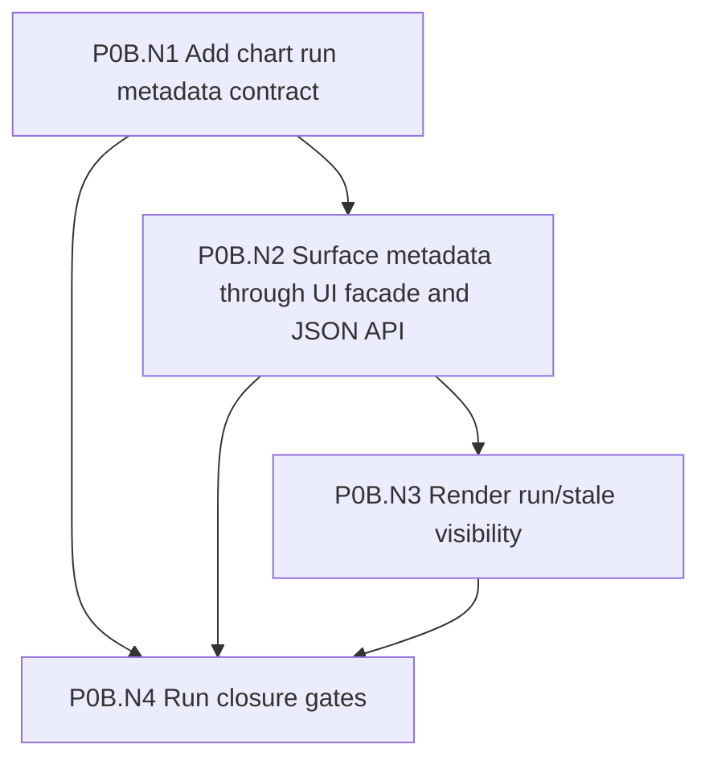
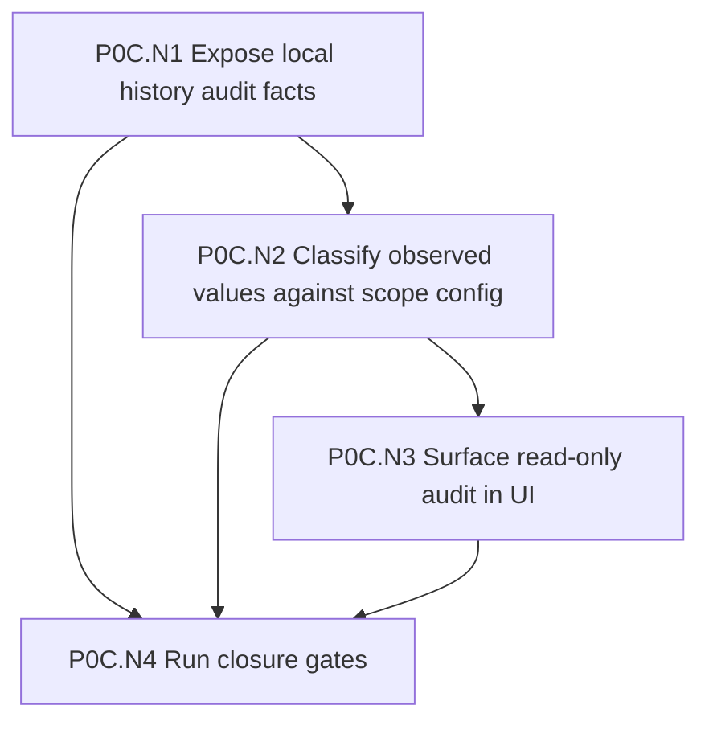
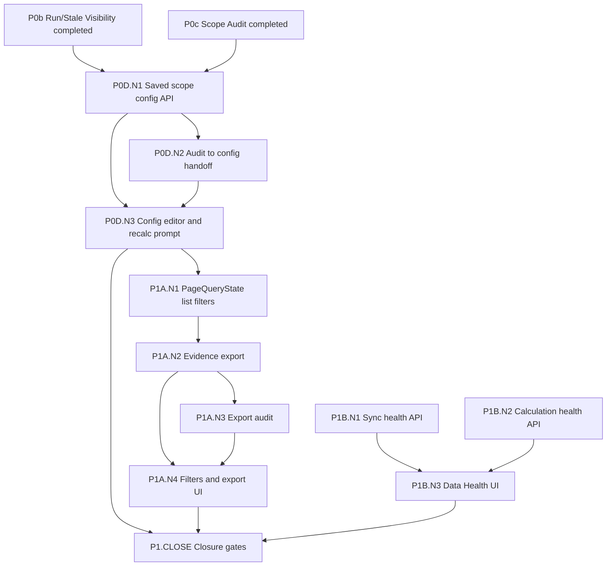
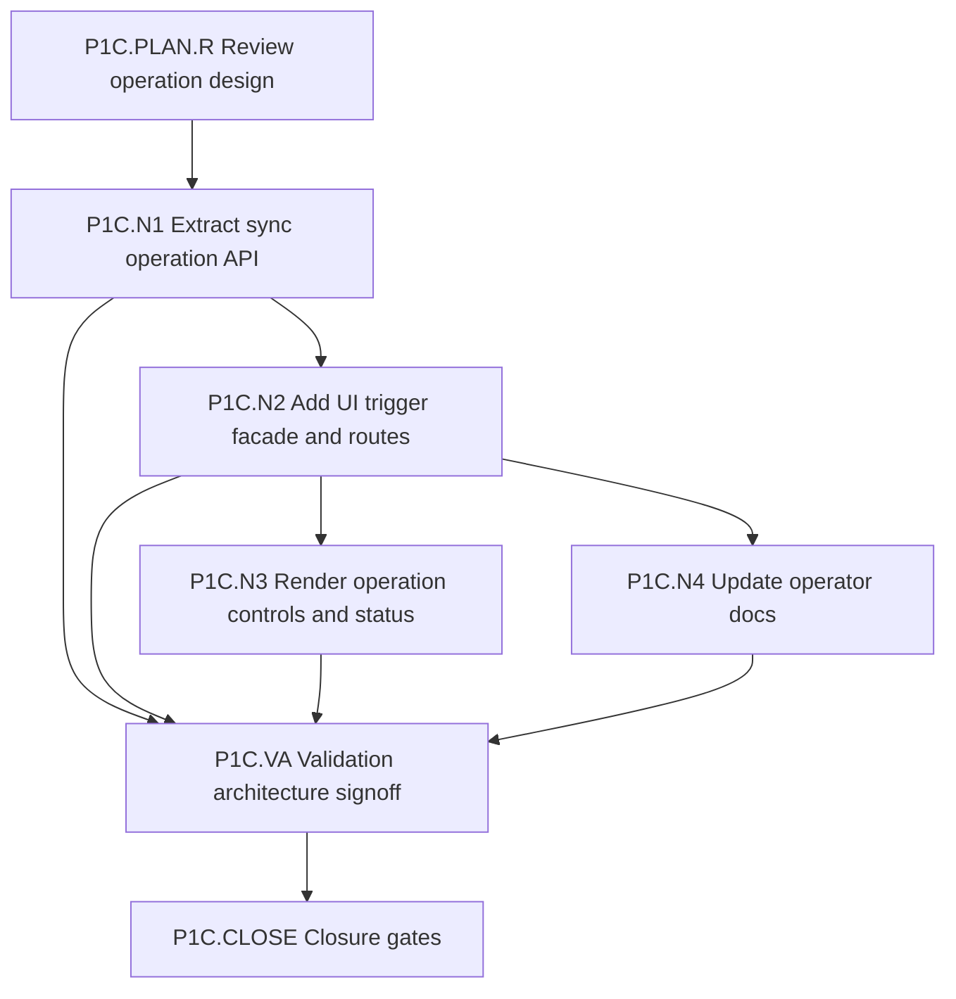
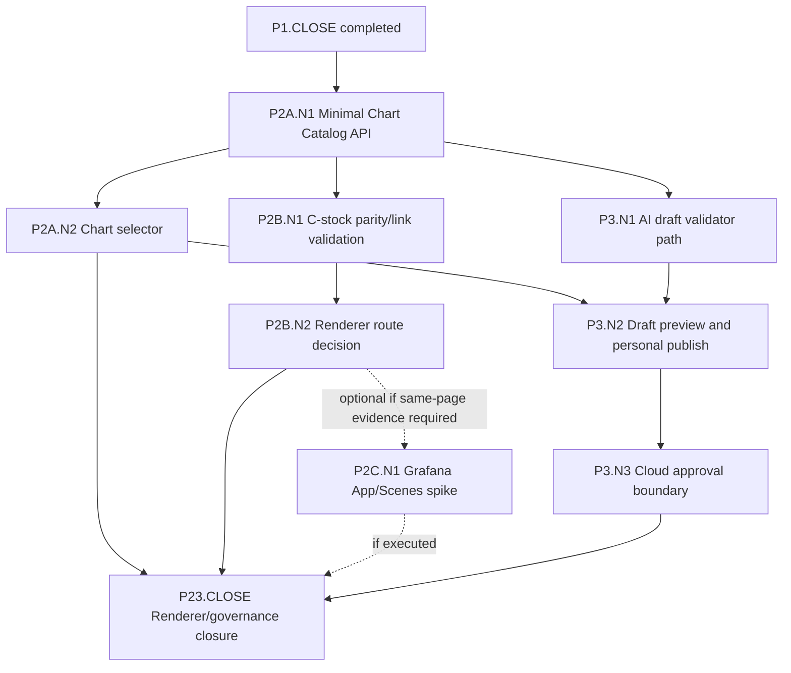

# Bug Trend Dashboard 产品要求文档

日期：2026-08-20

## 目的

本文件定义 Metrics dashboard 中 Bug Trend 功能从当前 demo 走向生产功能所需的产品能力、页面体验、设计细节和验收标准。

当前 demo 已经具备一个重要基础：真实 Intel Jira 数据可以被只读采集、持久化为本地历史与计算产物，并在 Bug Trend 页面上显示上方趋势图和下方 evidence ticket list。下一阶段的产品化目标是 C-first：验证 Grafana 能否成为主要 dashboard UI，同时让 Metrics 继续拥有 scope 语义、计算产物、evidence contract、Chart Catalog validation、audit 和 AI governance。

## 产品目标

1. 用户可以针对不同 Jira project/IP/team 创建和维护 Bug Trend scope，而不需要修改代码或环境变量。
2. 每个 scope 的 bug 类型、状态、resolution、severity、component、owner、milestone 等语义由 Metrics 统一管理。
3. Dashboard 图表和 ticket evidence list 必须从同一个计算产物读取数据，不能出现图表数字和列表证据不一致。
4. 用户可以从图表点击到对应 bucket/series 的 ticket 证据，也可以对列表做局部过滤和导出。
5. 生产页面需要清楚展示数据新鲜度、计算版本、配置版本、sync/calculation 状态和潜在数据质量问题。
6. Grafana 和 AI 模块只能消费 Metrics 产出的确定性数据/定义，不能成为项目语义的第二套 truth system。

## 目标用户

| 用户 | 主要需求 |
| --- | --- |
| Engineering manager | 快速判断 bug in、bug out、open backlog 和 critical/high 趋势是否健康。 |
| Scrum master / project owner | 按 milestone、component、owner、team 查看趋势和证据列表。 |
| Developer / validator | 点击图表后看到具体 Jira ticket，确认某个 bucket 数字从哪里来。 |
| Dashboard maintainer | 配置项目 scope、检查 unmapped Jira values、处理 sync/calculation 异常。 |
| Future AI user | 用自然语言要求系统生成某个时间范围、某个 scope、某种指标的图表。 |

## 核心用户故事

1. 作为 dashboard 用户，我可以选择 IP、Project/Scope、Begin、End，看到指定范围的 Bug Trend 图和证据列表。
2. 作为 dashboard 用户，我点击某个 week/day 的 `new_critical_high` bar 后，下方列表只显示贡献这个 bar 的 Jira tickets。
3. 作为 dashboard 用户，我点击 Clear selection 后，列表恢复为当前可见时间范围内所有参与图表计算的 distinct tickets。
4. 作为 dashboard 用户，我可以用 list-local filters 缩小 evidence list，但不会误以为图表数字也被改变。
5. 作为 scope owner，我可以编辑当前 project 的 bug/status/severity/milestone 映射，并触发重新计算。
6. 作为 scope owner，我可以看到真实 Jira 中出现过但未被当前 scope config 覆盖的 status、priority、resolution 或 component。
7. 作为生产运维者，我可以看到每个 scope 最近一次 sync 和 calculation 是否成功、是否 stale、是否有 warning。
8. 作为 AI 用户，我可以请求生成一个新的 daily bug in/out 图表，并在 Metrics-governed chart surface、Grafana App chart selector 或 Chart Catalog 中查看、切换和追溯它。

## 部署模式、权限与审计

产品需要支持两种部署模式，通过环境配置切换。第一阶段优先实现个人使用模式，但必须预留 cloud 审批接口和状态字段。

```text
METRICS_DASHBOARD_GOVERNANCE_MODE=personal | cloud
```

| 模式 | 目标场景 | 发布策略 | 第一阶段要求 |
| --- | --- | --- | --- |
| `personal` | 单人或本地 demo 使用。 | AI-generated chart、user-created chart 通过 validator 后可直接保存为个人可见 draft/published。 | 优先实现；无需人工审批，但仍记录 audit event。 |
| `cloud` | 多用户公共 dashboard。 | Chart publish、Grafana provisioning、shared scope config activation 需要审批。 | 第一阶段留好接口、状态和权限模型，不要求完整审批 UI。 |

### 角色

| 角色 | 权限边界 |
| --- | --- |
| `viewer` | 查看被授权 scope 的 dashboard、点击 evidence、使用 list filters、导出 evidence。 |
| `scope_owner` | 创建/编辑自己负责的 scope config draft，触发 audit/recalculation，申请启用配置。 |
| `dashboard_maintainer` | 管理 scope、sync/calculation、Data Health、Grafana parity 和故障处理。 |
| `chart_author` | 创建 user-created 或 AI-generated chart draft，预览并提交发布。 |
| `chart_approver` | cloud 模式下审批、发布、禁用、回滚 shared chart。 |
| `admin` | 管理用户权限、全局配置、Grafana datasource allowlist 和治理模式。 |

### 动作权限

| 动作 | `personal` 模式 | `cloud` 模式 |
| --- | --- | --- |
| 查看 dashboard | 有 scope view 权限即可。 | 有 scope view 权限即可。 |
| 导出 evidence | 有页面访问权即可，必须审计。 | 有页面访问权即可，必须审计。 |
| 编辑 scope config | scope owner 或 maintainer。 | scope owner 可编辑 draft，启用需 maintainer/admin。 |
| 触发 recalculation | scope owner 或 maintainer。 | scope owner 或 maintainer，必须审计。 |
| 创建 AI chart draft | chart author 或 maintainer。 | chart author 或 maintainer。 |
| 发布 chart | chart author 或 maintainer；validator 通过即可发布到个人 chart selector，必须审计。 | 需要 chart approver/admin 审批。 |
| 回滚/禁用 chart | chart owner 或 maintainer。 | chart approver、maintainer 或 admin。 |
| Grafana provisioning | maintainer。 | maintainer 发起，approver/admin 批准。 |

### 审计事件

所有生产相关动作都应写入 audit log，至少包含：

| 字段 | 含义 |
| --- | --- |
| `event_type` | scope_saved、scope_activated、calculation_started、evidence_exported、chart_draft_created、chart_validation_started、chart_validation_passed、chart_validation_failed、chart_publish_requested、chart_publish_approved、chart_publish_rejected、chart_published、chart_disabled、chart_rolled_back、chart_archived、grafana_provisioned 等。 |
| `actor` | 用户或服务账号。 |
| `governance_mode` | `personal` 或 `cloud`。 |
| `scope_id` | 关联 scope。 |
| `chart_id` / `chart_version` | 关联 chart。 |
| `calculation_run_id` | 关联计算产物。 |
| `request_summary` | 非 secret 的请求摘要。 |
| `result` | success、warning、failed、rejected。 |
| `created_at` | 事件时间。 |

## 页面信息架构

### 主导航

建议增加或保留以下 dashboard 入口：

| 页面 | 用途 |
| --- | --- |
| Bug Trend | 当前主要用户页面，显示趋势图、筛选器和 evidence list。 |
| Scope Config | 创建和维护 Jira scope config。 |
| Scope Audit | 展示真实 Jira observed values、unmapped values 和配置建议。 |
| Calculation Runs | 查看每次计算的范围、版本、状态、耗时、warning 和产物数量。 |
| Data Health | 查看 Jira connectivity、sync status、scheduler status、DB 状态和 stale scopes。 |
| Chart Catalog | 未来管理 Grafana/AI 生成的 chart specs、版本和可见性。 |

### Bug Trend 页面布局

页面采用上下结构：

1. 顶部 filter bar。
2. 主图表区域。
3. 图表状态和数据版本摘要。
4. 下方 evidence ticket list。
5. 可选的 chart catalog/variant selector，用于切换同一 scope 下的不同图表。

建议布局：

```text
Bug Trend Dashboard

[Scope] [Milestone] [Component] [Owner] [Begin] [End] [Apply]
[Data freshness/status line: last sync, calculation run, config hash, warnings]

[Chart slot: default Bug Trend / selected Grafana panel / selected AI-generated chart]

[Selection summary: visible range or selected bucket/series]
[List-local filters: text, status, severity, owner, component, series]
[Evidence ticket table]
```

## Filter 设计要求

### Chart filters

Chart filters 同时影响图表和 evidence list。

MVP 后续建议支持：

| Filter | 数据来源 | 行为 |
| --- | --- | --- |
| Scope | `jira_scope_config` | 切换完整数据 universe 和语义配置。 |
| Begin / End | 用户输入 | 限制 bucket 时间范围。 |
| Milestone / Fix Version | scope config 指定字段 | 同时过滤 chart buckets 和 evidence rows。 |
| Component / Team | scope config 指定字段 | 同时过滤 chart buckets 和 evidence rows。 |
| Owner | assignee 或 scope owner field | 同时过滤 chart buckets 和 evidence rows。 |
| Priority / Severity | severity field | 同时过滤 chart buckets 和 evidence rows。 |
| Work item type | Jira issue type | 默认可锁定为 bug，也可做诊断过滤。 |

### List-local filters

List-local filters 只缩小 evidence list，不改变图表数据。

UI 必须明确标注，例如使用标题 `Evidence filters` 或 helper text `These filters narrow the ticket list only`。

建议支持：

| Filter | 行为 |
| --- | --- |
| Text search | 搜索 key、summary、owner、component。 |
| Status | 过滤当前 evidence rows。 |
| Severity | 过滤当前 evidence rows。 |
| Owner | 过滤当前 evidence rows。 |
| Component | 过滤当前 evidence rows。 |
| Series | 过滤当前 evidence rows。 |

## 图表设计要求

### 默认 Bug Trend 图

默认图表应继续支持：

| Series | 类型 | 方向 | 设计 |
| --- | --- | --- | --- |
| `all_open_bugs` | Line | Positive | 主 backlog 趋势线，颜色稳定。 |
| `all_open_critical_high` | Line | Positive | critical/high 趋势线，视觉优先级高于普通 backlog。 |
| `new_critical_high` | Bar | Positive | bug in，高严重度，使用警示色。 |
| `new_medium_low` | Bar | Positive | bug in，中低严重度，使用次级色。 |
| `fixed_or_closed_bugs` | Bar | Negative | bug out，负向柱状图，但 evidence list count 始终为正数。 |

图表必须支持：

1. Legend toggle。
2. Hover tooltip。
3. Click bucket/series 后刷新下方 evidence list。
4. Empty state：没有数据时说明当前 scope/date/filter 没有可计算 bucket。
5. Error state：计算失败时显示原因和下一步动作。
6. Stale state：scope config 或 Jira sync 已更新但 chart 仍来自旧 calculation run。

### 图表容器设计

生产方向是 C-first：Grafana 应成为主要 dashboard UI candidate，但不能成为业务语义和 evidence query owner。Metrics 必须继续拥有 `PageQueryState` schema、`IndicatorDefinition`、`EvidenceContract`、Chart Catalog validator、audit、fallback/reference path 和 AI governance。

因此产品上需要的不是任意 Grafana iframe，而是受控 chart surface：

```text
ChartSurface
  chart_id
  chart_version
  renderer_type: chartjs | grafana | static_image
  integration_route: reference | c_stock | c_plugin
  page_query_state
  evidence_contract_id
```

这样图表可以由 Grafana 承载，但筛选器语义、证据列表、权限、导出、audit 和 AI 生成图表仍由 Metrics 统一治理。

### Chart 与 Evidence List 的主从关系

Bug Trend 页面最终可以由 Grafana dashboard/app shell 承载。页面内的当前 evidence context 由上半部分的 active chart 拥有，下半部分 Evidence list 是 active chart 的证据投影，且由 Metrics evidence API 生成。

```text
Grafana Dashboard/App Shell
  owns: chart layout, active chart interaction, dashboard variables

Metrics Backend Governance
  owns: scope/date state schema, permissions, Chart Catalog, export, audit, evidence API

Active Chart
  owns: selected chart definition, selected bucket/series/dimension

Evidence List
  derives from: active chart evidence contract + list-local filters
```

这意味着切换上半部分图表时，下半部分列表必须重新绑定到新 active chart 的 evidence contract。点击图表时，只更新 chart selection 和 evidence list，不应让 Grafana 或 Chart.js 独立决定列表内容。

并非所有图表都可以驱动 bug list。每个 chart definition 必须声明自己的 evidence 能力：

| Evidence 能力 | 说明 | UI 行为 |
| --- | --- | --- |
| `bucket_series` | 图表点击可映射到 bucket + series + membership。 | 支持点击图表刷新 Evidence list。 |
| `range_only` | 图表只能映射到当前 scope/date/filter 范围。 | 不支持单点 drilldown，下方显示 visible-range evidence。 |
| `summary_only` | 图表无法可靠映射到 tickets。 | 不驱动 Evidence list，UI 必须明确提示。 |

产品规则：只有 `bucket_series` 或等价能力的 chart 才能成为 Bug Trend + Evidence 页面主 slot 的完整 active evidence owner。`range_only` chart 可以显示列表，但不能声称列表解释了某个图表点。`summary_only` chart 更适合放在 summary dashboard，不适合放在需要 ticket evidence 的主分析页面。

### EvidenceContract 字段要求

每个可解释图表必须绑定一个后端可验证的 `EvidenceContract`。它是图表和 bug list 之间的唯一连接点。

| 字段 | 要求 |
| --- | --- |
| `contract_id` | 稳定 ID，供 ChartDefinition 引用。 |
| `capability` | `bucket_series`、`range_only` 或 `summary_only`。 |
| `membership_source` | 允许的 membership table/view；逻辑名为 `bucket_membership_view`，MVP 默认映射到当前 durable artifact `bug_trend_bucket_issue`，未来 source-neutral 实现可映射到 `work_item_bucket_membership`。 |
| `membership_key` | membership row 的唯一键，避免 export/pagination 重复。 |
| `bucket_dimension` | bucket 字段，例如 week、date 或 bucket id。 |
| `series_dimension` | series 字段，例如 `new_critical_high`。 |
| `ticket_identity` | source system + source item key，定义 distinct ticket。 |
| `dedupe_policy` | visible-range 是否 distinct ticket；bucket-series 是否 membership grain。 |
| `time_boundary_policy` | bucket timezone、inclusive/exclusive 边界。 |
| `allowed_list_filters` | 允许的 list-local filters。 |
| `export_policy` | export 使用当前 result snapshot/calculation run，不重新查最新 run。 |
| `unsupported_reason` | `summary_only` chart 必须给出用户可读原因。 |

EvidenceContract 不能包含任意业务 SQL。它只能引用 Metrics-owned indicator definition、fact view 和 membership artifacts。

## Evidence List 设计要求

Evidence list 是生产功能的核心，不是辅助表格。

### 必需状态

| 状态 | 触发 | 标题示例 | 列表内容 |
| --- | --- | --- | --- |
| Visible range evidence | 未选择 bucket | Evidence tickets for visible range | 当前图表可见范围内参与任意 series 的 distinct tickets。 |
| Bucket evidence | 选择某个 bucket | Evidence tickets for 25WW16 | 该 bucket 内参与任意 series 的 tickets。 |
| Bucket-series evidence | 选择 bucket + series | `new_critical_high` tickets for 25WW16 | 该 bucket/series 的 membership rows。 |

### 必需列

| 列 | 要求 |
| --- | --- |
| Source | Jira/GitHub/未来来源。 |
| Key | 可点击 source URL，不再调用 source API。 |
| Summary | ticket 标题。 |
| Series | 解释该行贡献了哪个图表 series。 |
| Type | Jira issue type 或 source-neutral type。 |
| Status / State | 当前状态或计算所需历史状态。 |
| Priority / Severity | 支持 critical/high 解释。 |
| Owner | assignee 或 owner field。 |
| Component / Label | component、label 或 team 维度。 |
| Created / Updated / Resolved | 支持时间范围解释。 |
| Display Fields | 每个 scope 自定义的额外字段，顺序必须跟 scope config 一致。 |

### 交互细节

1. 当用户点击图表时，Evidence list 更新但图表不需要重绘。
2. Clear selection 只清除 bucket/series 选择，不改变 scope/date/chart filters。
3. List-local filters 不改变图表数字。
4. Export 必须导出当前 evidence result，而不是重新查最新 run。
5. 每一行 source link 必须来自已存储 source URL 或可确定构造的 URL，不能依赖实时 Jira API。
6. 切换 chart selector 时，Evidence list 必须清除旧 chart 的 bucket/series selection，并按新 chart 的默认 evidence state 重新加载。
7. 如果新 chart 是 `range_only`，Evidence list 标题必须说明它显示的是当前 chart range evidence，而不是某个 clicked point 的 evidence。
8. 如果新 chart 是 `summary_only`，Evidence list 区域应显示说明性 empty state，避免用户误以为列表解释了该图。
9. Multi-panel layout 中只能有一个 active panel 控制 Evidence list；active panel 必须有明确视觉状态。
10. Evidence list 的 query 由 Metrics 后端执行，不能由 Grafana panel SQL 或前端脚本拼接成为第二套规则。

## Scope Config 产品要求

### 字段编辑

Scope config 页面至少支持：

1. 基本信息：name、IP、project label、enabled。
2. Query：JQL 或 saved query。
3. Bug classification：bug type values。
4. Lifecycle mapping：open/fixed/closed/terminal excluded/reopen statuses。
5. Resolution mapping：fixed/closed resolution values。
6. Severity mapping：severity field、critical/high values、medium/low values。
7. Display fields：evidence table 的额外字段和顺序。
8. Timezone 和 bucket granularity。
9. Component/owner/team/milestone/fix version field mappings。

### 配置体验

1. 支持保存草稿和启用配置。
2. 保存后显示 semantic config hash。
3. 修改会提示是否需要重新计算。
4. 配置页面应显示 observed values，帮助用户从真实 Jira 数据选择 mapping。
5. 禁止在 UI 中显示或保存 Jira token、PAT、password。

## Scope Audit 产品要求

Scope Audit 页面用于把真实 Jira 数据中的值暴露给配置 owner。

建议展示：

| 区域 | 内容 |
| --- | --- |
| Observed issue types | 所有 issue type 及计数。 |
| Observed statuses | 所有 status 及计数，标记是否已映射到 open/fixed/closed/excluded。 |
| Observed resolutions | 所有 resolution 及计数，标记是否已映射。 |
| Observed priorities/severities | 所有 priority/severity 值及 critical/high mapping 状态。 |
| Observed components/labels | component/team/label 值及计数。 |
| Unmapped values | 当前配置没有覆盖但出现在真实数据中的值。 |
| Data coverage | created、updated、resolutiondate、changelog、status transitions、resolution transitions 覆盖率。 |

验收标准：

1. 新 Jira scope 至少可以通过 Audit 页面发现 `P1-Stopper` 这类真实 priority 值。
2. Unmapped lifecycle values 必须可见，不能只在日志中出现。
3. Audit 不修改 Jira，仅读取本地 raw archive 或已同步 payload。

## Calculation Runs 产品要求

Calculation Runs 页面用于生产可追溯性。

每次 run 应展示：

1. run id。
2. scope id/name。
3. begin/end。
4. bucket granularity。
5. config version hash。
6. source snapshot/sync marker。
7. issue count、bucket count、membership count。
8. started/finished/duration。
9. status：success、warning、failed、stale。
10. warnings/errors。

用户动作：

1. View chart from this run。
2. View evidence from this run。
3. Recalculate current scope。
4. Compare two runs。

## Data Health 产品要求

生产环境需要一个 Data Health 页面或顶部状态入口：

1. Jira connectivity health。
2. Read-only auth validation。
3. Scheduler/worker health。
4. Latest sync per scope。
5. Latest calculation per scope。
6. Stale scopes。
7. Failed sync/calculation。
8. Warning count。
9. Local DB/storage usage。

## Chart Catalog 产品要求

Chart Catalog 是未来支持多图和 AI-generated charts 的核心。

每个 chart definition 应包含：

| 字段 | 含义 |
| --- | --- |
| chart_id | 稳定 ID。 |
| title | UI 显示名称。 |
| description | 用户可读说明。 |
| renderer_type | canonical renderer enum：`chartjs`、`grafana`、`static_image`。 |
| integration_route | `reference`、`c_stock` 或 `c_plugin`，表示宿主/集成路线，不是第二套 renderer truth。 |
| source | built-in、user-created、ai-generated。 |
| scope compatibility | 可用于哪些 scope/source/indicator definition。 |
| required facts | 需要哪些 fact tables/views。 |
| evidence contract | 点击图表后如何查询 evidence。 |
| evidence capability | `bucket_series`、`range_only` 或 `summary_only`。 |
| click mapping | 图表点击事件如何映射到 bucket、series、dimension。 |
| status | `draft`、`previewed`、`pending_approval`、`approved`、`rejected`、`published`、`disabled`、`rolled_back`、`archived`。 |
| version | 图表定义版本。 |
| owner | 创建者或 owning team。 |
| enabled | 是否在 UI 可见。 |

Bug Trend 页面可以在主图上方提供 chart selector：

```text
[Chart: Default Bug Trend v1 ▼] [Manage charts]
```

选择不同 chart 后，页面仍保留同一套 scope/date filters 和 evidence list contract。

Chart Catalog 必须阻止没有 evidence contract 的 chart 被误配置成主 evidence chart。AI-generated chart 默认进入 draft 状态，只有通过 Metrics validator 后才能成为可选 chart。

ChartDefinition 不拥有业务语义 SQL。它只能组合：

```text
ChartDefinition
  -> IndicatorDefinition reference
  -> EvidenceContract reference
  -> RendererSpec
  -> Scope compatibility
```

`published` 版本不可原地修改；任何改变都创建新版本。旧版本可以 disabled 或 archived，但不能被静默覆盖。

`approved` 只在 cloud shared publish 中必需。`personal` 模式下，chart author 或 maintainer 可以在 validator 通过后直接发布到个人 chart selector，但仍必须记录 validation 和 publish audit events。

## 非功能要求

1. Jira 操作必须只读。
2. 不得在 docs、fixtures、logs、Grafana JSON、AI prompt 或 DB fact rows 中存储 secret。
3. 图表和 evidence list 必须 pin 到同一个 calculation run。
4. 生产路径不能依赖 demo fixture。
5. Warning 默认作为 test failure 处理。
6. 页面加载应允许 chart 和 evidence 局部刷新，不需要整页 reload。
7. 对大 scope 必须支持分页、limit、导出任务或异步导出，避免一次性渲染过多 ticket rows。
8. Chart selector、chart click、Clear selection 和 list-local filters 都必须收敛到一个后端 PageQueryState，不允许各层保存互相独立的选择状态。
9. `personal` 模式可以跳过人工审批，但不能跳过 validator 和 audit。
10. `cloud` 模式必须支持 chart publish/provisioning 审批接口。

## MVP 后续实施增量

| 增量 | 用户价值 | 交付范围 | 非目标 | DoD |
| --- | --- | --- | --- | --- |
| P0a Demo hardening | 当前真实 Jira demo 可稳定验收。 | 保持 Chart.js reference chart + evidence list；补数据状态、empty/error/unsupported 文案。 | 不做 Grafana 正式路径。 | 现有 real Jira fixture chart/list 回归通过；warnings-as-errors 通过。 |
| P0b Run/stale visibility | 用户知道图表来自哪次计算。 | 显示 calculation run、config hash、coverage、completed time、fresh/stale 状态。 | 不做完整 run compare；`last sync` 留给 P1 Data Health。 | 改 scope config 后旧 chart 显示 config stale。 |
| P0c Read-only Scope Audit | scope owner 能看真实 Jira observed values。 | issue type/status/resolution/priority/component/coverage audit。 | 不提供自动修复 mapping。 | `P1-Stopper` 等真实值可见且标记 mapped/unmapped。 |
| P0d Scope Config draft/activate | 用户可维护项目语义。 | draft 编辑、activate、config hash、recalculate 提示。 | cloud 审批 UI 仅预留接口。 | 新 scope 无需改代码可生成 Bug Trend。 |
| P1 Chart/list filters + export | 用户能做实际分析和带走证据。 | chart filters、list-local filters、audit-backed evidence export。 | 不做自定义图表。 | Export 行数等于当前 evidence result。 |
| P1 Data Health | Maintainer 能定位生产问题。 | Jira connectivity、sync/calculation status、failed/warning scopes。 | 不做自动恢复。 | Data Health 可定位最近失败 run。 |
| P1C User-triggered sync/recalculate | 用户能从产品入口刷新当前 scope 的 Jira 数据和 Bug Trend 计算。 | Scope Config/Bug Trend/Data Health 上的显式 Sync/Recalculate 操作、bounded request DTO、cursor/run 状态回显、并发保护。 | 不做后台队列、定时调度、自动恢复、Grafana 写操作。 | 点击当前 scope 的刷新操作后，系统通过 `jira_sync` owner 执行 sync，通过 `bug_metrics` owner 执行 recalculate，并在 UI 显示 running/success/failed 状态。 |
| P2 Minimal Chart Catalog | 支持多图入口但不扩大主路径。 | ChartDefinition、EvidenceContract、Chart selector，一个 built-in chart。 | 不做 multi-panel layout。 | 切换 chart 清除旧 selection 并重载 evidence。 |
| P2 C-stock Grafana feasibility | 验证是否可以直接让 stock Grafana 成为主图表路径。 | Grafana 主图、变量/time range 同步、与 Chart.js 数字比对、click/data-link 到 evidence 可行性。 | 不承诺 stock Grafana 覆盖全部 PRD。 | 同一 PageQueryState 下 Grafana 与 reference chart 一致，并明确 event/evidence gate 是否通过。 |
| P2/P3 C-plugin spike | 当 C-stock 不满足 evidence 联动时，验证 Grafana App/Scenes 主页面。 | Grafana App/Scenes 内实现 chart selector、active chart state、evidence list 调 Metrics API。 | 不迁移 Jira sync/indicator/evidence ownership 到 Grafana。 | Grafana app 可以在同一页面完成 chart + evidence 联动。 |
| P3 AI draft chart pipeline | 用户可用自然语言生成 draft chart。 | AI request、validator、draft preview、personal 模式直接发布。 | cloud 审批完整 UI 可后续。 | AI chart 未通过 validator 不出现在 chart selector。 |

## P0b Run/Stale Visibility DAG

P0b 只解决一个生产可见性问题：用户必须知道当前 Bug Trend 图表来自哪次 Metrics-owned calculation run，以及该 run 是否匹配当前 scope config。它不实现 scope config editor、不做完整 run compare、不显示 `last sync`，也不让 Grafana 或 Django template 自己推断 stale 语义。`last sync` 的 owner 属于后续 P1 Data Health。

### P0b Contract Registry

| Contract | Owner | Consumers | Disconfirming check |
| --- | --- | --- | --- |
| `INV-P0B-RUN-METADATA` | `bug_metrics.app.api.BugTrendChart` | `ui_web` page, JSON API, Grafana payload | Focused tests fail if a fresh chart omits run id, run config hash, current scope config hash, completed time, coverage range, or freshness status. |
| `INV-P0B-STALE-AUTHORITY` | `bug_metrics.app.api.ApiForBugTrend.get_chart` | `ui_web`, Grafana payload | Test changes scope config after a completed run and expects `freshness_status=stale_config`, stale run metadata, and no evidence panel claiming current data. |
| `INV-P0B-UI-VISIBILITY` | `ui_web` Bug Trend template/facade | End user | View test fails if fresh/stale status and run/config hash are not visible in the Bug Trend page. |
| `INV-P0B-GRAFANA-PAYLOAD` | `ui_web.facades.BugTrendFacade.get_chart_payload` | Grafana C-stock dashboard and validators | JSON API test fails if payload omits `run_metadata.calculation_run_id`, `run_config_version_hash`, `current_config_version_hash`, `freshness_status`, `source_coverage_start`, `source_coverage_end`, or `completed_at`. |

### P0b DAG Nodes

| id | depends_on | owner_paths | authority_boundary | contracts | validation | exit_criteria | parallel_policy |
| --- | --- | --- | --- | --- | --- | --- | --- |
| P0B.N1 - Add chart run metadata contract | [] | `bug_metrics/app/api/`, `bug_metrics/tests/` | `bug_metrics` owns calculation run freshness and config-hash semantics. | `INV-P0B-RUN-METADATA`, `INV-P0B-STALE-AUTHORITY` | API tests for fresh run metadata and stale config after scope config changes. | `BugTrendChart` exposes fresh/stale/no-run metadata without UI-specific interpretation. | serial |
| P0B.N2 - Surface metadata through UI facade and JSON API | [P0B.N1] | `ui_web/facades/`, `ui_web/data/`, `ui_web/tests/` | UI facade transports API-owned metadata; it does not recompute freshness. | `INV-P0B-RUN-METADATA`, `INV-P0B-GRAFANA-PAYLOAD` | Facade/API tests assert payload contains run metadata and stale status. | Chart JSON and Grafana payload can show operator-visible run/config state. | serial |
| P0B.N3 - Render run/stale visibility on Bug Trend page | [P0B.N2] | `ui_web/templates/`, `ui_web/tests/` | Template presents API-owned freshness state. | `INV-P0B-UI-VISIBILITY`, `INV-P0B-STALE-AUTHORITY` | View tests assert fresh run details render; stale config displays recalculation guidance and no evidence panel is rendered under current-scope semantics. This is P0b UI policy, not a claim that historical stale evidence is unavailable. | User can distinguish fresh current chart from stale/no-run state. | serial |
| P0B.N4 - Run closure gates | [P0B.N1, P0B.N2, P0B.N3] | `bug_metrics/tests/`, `ui_web/tests/`, `openspec/docs/` | Validation evidence owner. | all P0b contracts | Focused tests, `manage.py check`, Grafana artifact validator, C0/C1 evidence checkers, whitespace/file-size gates. | P0b can be committed without weakening C-stock validation. | serial |



### P0b Execution Ledger

- [ ] P0B.N1 - Add chart run metadata contract
- [ ] P0B.N2 - Surface metadata through UI facade and JSON API
- [ ] P0B.N3 - Render run/stale visibility on Bug Trend page
- [ ] P0B.N4 - Run closure gates

### P0b Validation Commands

```powershell
.venv\Scripts\python.exe -m pytest bug_metrics\tests\test_api_bug_trend_contracts.py ui_web\tests\test_bug_trend_views.py ui_web\tests\test_bug_trend_fact_table_ui.py -q
.venv\Scripts\python.exe scripts\validate_grafana_artifacts.py --artifact-root ops\grafana --allowlist openspec/docs/current-baseline/grafana-approved-data-surfaces.json
.venv\Scripts\python.exe scripts\check_c0_validation_evidence.py --evidence docs\c0-validation-closure-evidence.md
.venv\Scripts\python.exe scripts\check_c1_evidence_link_evidence.py --evidence docs\c1-evidence-link-validation-evidence.md
.venv\Scripts\python.exe manage.py check
.venv\Scripts\python.exe scripts\check_file_size_limits.py --include-untracked
.venv\Scripts\python.exe scripts\check_diff_whitespace.py --include-untracked
```

## P0c Read-only Scope Audit DAG

P0c 只解决一个已保存 scope 的配置诊断问题：scope owner 必须能从 Metrics 已同步的本地 Jira history 中看到真实 observed values，并知道这些值是否已被当前 `JiraScopeConfig` 覆盖。Audit 是只读诊断面，不修改 Jira、不自动修 mapping、不审计未保存 draft、不保存新的语义 truth，也不从 Grafana、template 或 AI prompt 推断分类规则。未保存 draft config 的 audit preview 属于 P0d Scope Config draft/activate。

### P0c Scope Baseline

| Field | Value |
| --- | --- |
| baseline_head | `43754832dd5517872efb3ac9dff18430cd8f3067` |
| pre_existing_dirty_paths | `.github/copilot-instructions.md` |
| planned_owner_paths | `jira_history/app/api/__init__.py`, `jira_history/tests/test_api_scope_audit_facts.py`, `bug_metrics/app/api/__init__.py`, `bug_metrics/app/api/scope_audit.py`, `bug_metrics/tests/test_api_scope_audit.py`, `ui_web/data/bug_trend_data.py`, `ui_web/facades/bug_trend_facade.py`, `ui_web/views/bug_trend_view.py`, `ui_web/templates/bug_trend_scope_audit.html`, `ui_web/tests/test_bug_trend_scope_audit_views.py`, `ui_web/urls.py`, `openspec/docs/future-target/bug-trend-dashboard-product-requirements.zh.md`, `openspec/docs/current-baseline/architecture-manual.md`, `openspec/docs/historical/implementation-start.md` |
| excluded_paths | `.github/copilot-instructions.md` remains outside P0c unless explicitly repaired in a separate task. |

### P0c Code-doc Truth Sync

| Surface | Status | Reason |
| --- | --- | --- |
| `openspec/docs/future-target/bug-trend-dashboard-product-requirements.zh.md` | update-required | P0c defines the audit contract, owner paths, and closure gates here. |
| `openspec/docs/current-baseline/architecture-manual.md`, `openspec/docs/historical/implementation-start.md` | update-required | P0c adds an operator-facing read-only Scope Audit entry point and public module API behavior. These docs must name the workflow and owner boundary. |
| `README.md`, `CLAUDE.md`, `.github/ai-governance/` | no-doc-change | P0c follows existing module-boundary and validation rules without changing global workflow. |

### P0c Contract Registry

| Contract | Owner | Consumers | Disconfirming check |
| --- | --- | --- | --- |
| `INV-P0C-OBSERVED-VALUES` | `jira_history.app.api.get_scope_audit_facts(scope_config)` DTOs in `jira_history/app/api/__init__.py` | `bug_metrics.app.api.get_scope_audit(scope_id)` | `jira_history/tests/test_api_scope_audit_facts.py` seeds `JiraIssue` and `JiraTransition` rows for a persisted `JiraScopeConfig`, then fails if issue type, status, resolution, priority/severity, and component values are not returned with counts from local history only. `bug_metrics` owns resolving `scope_id` to `JiraScopeConfig`; `jira_history` does not accept raw ids or draft criteria in P0c. |
| `INV-P0C-MAPPING-AUTHORITY` | `bug_metrics.models.JiraScopeConfig` plus audit DTOs in `bug_metrics/app/api/scope_audit.py` | `ui_web` audit facade/view | `bug_metrics/tests/test_api_scope_audit.py` includes mapped and unmapped priority values such as `P1-Stopper`, then fails if mapped/unmapped classification comes from any source other than the current scope config fields. |
| `INV-P0C-READ-ONLY-AUDIT` | `bug_metrics.app.api.get_scope_audit(scope_id)` | `ui_web` page/API | `bug_metrics/tests/test_api_scope_audit.py` captures model counts before and after audit and fails if audit creates, updates, deletes, recalculates, syncs, or mutates scope config/history rows. |
| `INV-P0C-COVERAGE` | `jira_history.app.api.get_scope_audit_facts(scope_config)` coverage DTO | `bug_metrics.app.api` audit DTO, operator UI | `jira_history/tests/test_api_scope_audit_facts.py` fails if coverage omits total issue count, non-empty created/updated/resolved counts, status transition count, and resolution transition count. `bug_metrics/tests/test_api_scope_audit.py` fails if these coverage counts are not transported unchanged from `jira_history`; P0c performs no coverage arithmetic, percentages, sums, or model recounting. |
| `INV-P0C-UI-VISIBILITY` | `ui_web` scope audit facade/view/template | Scope owner | `ui_web/tests/test_bug_trend_scope_audit_views.py` fails if observed values, counts, mapped/unmapped status, and coverage summary are not visible for a saved scope. |

### P0c DAG Nodes

| id | depends_on | owner_paths | authority_boundary | contracts | validation | exit_criteria | parallel_policy |
| --- | --- | --- | --- | --- | --- | --- | --- |
| P0C.N1 - Expose local history audit facts | [] | `jira_history/app/api/__init__.py`, `jira_history/tests/test_api_scope_audit_facts.py` | `jira_history` owns persisted Jira issue/transition observations and coverage facts for a persisted `JiraScopeConfig`. It does not classify business meaning and does not resolve `scope_id`. | `INV-P0C-OBSERVED-VALUES`, `INV-P0C-COVERAGE` | `test_api_scope_audit_facts.py` seeds local history and asserts observed value counts plus coverage facts. | `get_scope_audit_facts(scope_config)` returns raw observed value DTOs and coverage DTOs for one saved scope without reading Jira live. | serial |
| P0C.N2 - Classify observed values against scope config | [P0C.N1] | `bug_metrics/app/api/__init__.py`, `bug_metrics/app/api/scope_audit.py`, `bug_metrics/tests/test_api_scope_audit.py` | `JiraScopeConfig` is the only mapping authority; `bug_metrics` resolves `scope_id`, asks `jira_history` for observations, compares observations to config, and returns scope audit DTOs. | `INV-P0C-MAPPING-AUTHORITY`, `INV-P0C-READ-ONLY-AUDIT`, `INV-P0C-COVERAGE` | `test_api_scope_audit.py` asserts `P1-Stopper` priority is unmapped until listed in `critical_high_values`, mapped statuses/resolutions are recognized, coverage counts are transported unchanged, and no DB mutations occur during audit. | `get_scope_audit(scope_id)` names each observed value, count, category, mapped/unmapped state, and unchanged coverage counts while preserving read-only behavior. | serial |
| P0C.N3 - Surface read-only audit in UI | [P0C.N2] | `ui_web/data/bug_trend_data.py`, `ui_web/facades/bug_trend_facade.py`, `ui_web/views/bug_trend_view.py`, `ui_web/templates/bug_trend_scope_audit.html`, `ui_web/tests/test_bug_trend_scope_audit_views.py`, `ui_web/urls.py` | UI transports and renders API-owned audit results at `bug-trend/scope-audit/?scope_id=<id>`; it does not recompute mappings, observed counts, or coverage facts. | `INV-P0C-UI-VISIBILITY`, `INV-P0C-MAPPING-AUTHORITY` | `test_bug_trend_scope_audit_views.py` asserts audit page renders observed values, counts, mapped/unmapped badges, and coverage from API data for a saved scope. | Scope owner can open read-only Audit for a saved scope and see unmapped values before editing the saved config. | serial |
| P0C.N4 - Run closure gates | [P0C.N1, P0C.N2, P0C.N3] | `jira_history/tests/test_api_scope_audit_facts.py`, `bug_metrics/tests/test_api_scope_audit.py`, `ui_web/tests/test_bug_trend_scope_audit_views.py`, `openspec/docs/current-baseline/architecture-manual.md`, `openspec/docs/historical/implementation-start.md`, `openspec/docs/future-target/bug-trend-dashboard-product-requirements.zh.md` | Validation evidence owner. | all P0c contracts | Focused audit tests, affected Bug Trend focused tests, Grafana artifact validator, `manage.py check`, file-size and whitespace gates. | P0c can be committed without weakening P0b stale evidence authority, C-stock validation, or operator docs. | serial |



### P0c Execution Ledger

- [x] P0C.N1 - Expose local history audit facts
- [x] P0C.N2 - Classify observed values against scope config
- [x] P0C.N3 - Surface read-only audit in UI
- [x] P0C.N4 - Run closure gates

### P0c Validation Commands

```powershell
.venv\Scripts\python.exe -m pytest jira_history\tests\test_api_scope_audit_facts.py bug_metrics\tests\test_api_scope_audit.py ui_web\tests\test_bug_trend_scope_audit_views.py -q
.venv\Scripts\python.exe -m pytest bug_metrics\tests\test_api_bug_trend_contracts.py ui_web\tests\test_bug_trend_views.py ui_web\tests\test_bug_trend_fact_table_ui.py -q
.venv\Scripts\python.exe scripts\validate_grafana_artifacts.py --artifact-root ops\grafana --allowlist openspec/docs/current-baseline/grafana-approved-data-surfaces.json
.venv\Scripts\python.exe manage.py check
.venv\Scripts\python.exe scripts\check_file_size_limits.py --include-untracked
.venv\Scripts\python.exe scripts\check_diff_whitespace.py --include-untracked
```

### P0c Review Gate

Before implementation starts, `PLAN.R` must confirm that observed facts, mapping authority, read-only behavior, coverage reporting, and UI visibility each have one owner and one executable disconfirming check. It must also confirm every P0c coverage dimension is rendered in the audit UI and transported unchanged from `jira_history` through `bug_metrics`. Any request to auto-fix mappings, write scope config, audit unsaved draft config, live-query Jira, or expose `last sync` belongs to P0d or P1 Data Health, not P0c.

## P0d/P1 Long-run Implementation DAG

P0d 和 P1 作为一个长跑计划执行，但仍按 owner boundary 分片提交。P0d 关闭 saved scope 配置维护闭环；P1 分为两个后续轨道：P1A chart/list filters + export，P1B Data Health。三个轨道共享同一个原则：`JiraScopeConfig` 继续是 scope semantics 的唯一权威，`BugTrendPageQueryState` 继续是 chart/list/export 选择状态的唯一入口，`jira_sync`/`bug_metrics` 分别拥有 sync/calculation health，`ui_web` 只渲染和传输。

### P0d/P1 Scope Baseline

| Field | Value |
| --- | --- |
| baseline_head | `e71490c Add read-only bug trend scope audit` |
| pre_existing_dirty_paths | `.github/copilot-instructions.md` |
| planned_owner_paths | `bug_metrics/models.py`, `bug_metrics/app/api/`, `bug_metrics/tests/`, `jira_sync/app/api/`, `jira_sync/tests/`, `ui_web/data/`, `ui_web/facades/`, `ui_web/views/`, `ui_web/templates/`, `ui_web/urls.py`, `ui_web/tests/`, `openspec/docs/future-target/bug-trend-dashboard-product-requirements.zh.md`, `openspec/docs/current-baseline/architecture-manual.md`, `openspec/docs/historical/implementation-start.md` |
| excluded_paths | `.github/copilot-instructions.md` remains outside P0d/P1 unless explicitly repaired in a separate task. |

### P0d/P1 Code-doc Truth Sync

| Surface | Status | Reason |
| --- | --- | --- |
| `openspec/docs/future-target/bug-trend-dashboard-product-requirements.zh.md` | update-required | This section owns the combined long-run contracts, DAG, ledger, and validation commands. |
| `openspec/docs/current-baseline/architecture-manual.md` | update-required | Add or update sections for Bug Trend Scope Config Workflow, Evidence Export, and Data Health ownership. |
| `openspec/docs/historical/implementation-start.md` | update-required | Add operator workflow entries for scope config edit/activate, evidence export, and Data Health entry points. |
| `README.md` | deferred-with-trigger | Update if the implemented route set becomes part of demo/operator setup instructions. |
| `CLAUDE.md`, `.github/ai-governance/` | no-doc-change | The plan follows existing module-boundary and validation policy without changing AI workflow. |

### P0d/P1 Parallel Policy

`baseline` for this long-run plan means P0b and P0c are committed and pushed at `e71490c`, and `.github/copilot-instructions.md` remains the only pre-existing dirty path. P0D.N1 starts from that baseline. P1B.N1 and P1B.N2 may be planned in parallel with P0d because Data Health reads existing `jira_sync` cursors and `bug_metrics` runs, but P1B.N3 cannot start until both health APIs exist. P1A starts only after P0D.N3 because filter/export UX depends on the final saved-scope workflow and recalculation prompt behavior.

Parallel policy glossary for P0d/P1/P2/P3:

- `serial`: the node must wait for all listed dependencies and blocks its dependents until complete.
- `parallel-after-baseline`: the node can be planned or implemented in parallel with sibling tracks after the declared baseline is available.
- `serial-after-health-apis`: the node runs serially after both health API tracks converge.
- `conditional-serial-spike`: the node runs only when the preceding decision record sets its trigger flag; a proven or rejected spike can both satisfy exit criteria if the fallback route is documented.

### P0d/P1 Contract Registry

| Contract | Owner | Consumers | Disconfirming check |
| --- | --- | --- | --- |
| `INV-P0D-SAVED-SCOPE-CONFIG-AUTHORITY` | `bug_metrics.models.JiraScopeConfig` and `bug_metrics.app.api` config methods | `ui_web` config editor, recalculation prompt, Bug Trend chart | API tests fail if saved scope edits bypass `JiraScopeConfig`, store semantics outside config fields, or fail to update `config_version_hash` after semantic changes. |
| `INV-P0D-DRAFT-ACTIVATE-BOUNDARY` | `bug_metrics.app.api` scope config workflow | `ui_web` editor | Tests fail if draft edits become active chart semantics before explicit save/activate, or if cloud approval behavior is implemented rather than only bounded as a non-goal/interface placeholder. |
| `INV-P0D-AUDIT-TO-CONFIG-HANDOFF` | `bug_metrics.app.api` scope audit + scope config DTOs | `ui_web` audit/config pages | View/API tests fail if an unmapped audit value such as `P1-Stopper` cannot be copied or selected into the saved config workflow without creating a second mapping truth. |
| `INV-P0D-RECALCULATION-PROMPT` | `bug_metrics.app.api` config hash and latest run freshness | `ui_web` config editor, Bug Trend page | Tests fail if changing saved semantics does not preserve `INV-P0B-STALE-AUTHORITY`, mark current runs stale, or show a recalculate prompt tied to the current `config_version_hash`. |
| `INV-P1A-PAGEQUERY-STATE` | `bug_metrics.app.api.page_query.BugTrendPageQueryState` | chart click, list filters, export, UI links | Tests fail if chart selection, Clear selection, list-local filters, or export use separate state parameters instead of one backend `BugTrendPageQueryState`. |
| `INV-P1A-CHART-SELECTION-STATE` | `bug_metrics.app.api.page_query.BugTrendPageQueryState.active_chart_id` | `ui_web` chart selector, evidence panel, export | Tests fail if chart selection is stored in UI-local state, template variables, Grafana variables, or any owner outside backend `BugTrendPageQueryState`. |
| `INV-P1A-LIST-FILTERS` | `bug_metrics.app.api.page_query.BugTrendTicketListFilters` | `ui_web` evidence panel | Focused tests fail if owner/status/severity/component/text filters change chart data, lose run pinning, or return rows outside the current evidence result. |
| `INV-P1A-EVIDENCE-EXPORT` | `bug_metrics.app.api` export method over evidence query result | `ui_web` export action | Tests fail if export row count differs from current evidence result, ignores list filters, changes run/bucket/series pinning, or serializes fields not present in the evidence DTO. |
| `INV-P1A-EXPORT-AUDIT` | `bug_metrics.app.api` export audit record or event surface | operator docs, future governance | Tests fail if export completes without recording scope id, run id, filters, row count, timestamp, and actor value. P1 uses a non-secret local actor placeholder such as `local_operator`; authenticated actors are deferred to later governance. |
| `INV-P1B-SYNC-HEALTH-AUTHORITY` | `jira_sync.app.api` over `JiraSyncCursor` | Data Health facade/view | Tests fail if latest sync status, errors, coverage window, or changelog coverage are inferred from UI, logs, or chart metadata instead of `jira_sync` cursor state. |
| `INV-P1B-CALCULATION-HEALTH-AUTHORITY` | `bug_metrics.app.api` over `BugTrendCalculationRun` and scope config hash | Data Health facade/view | Tests fail if latest calculation status, stale scope state, failed run state, or warning status are inferred outside `bug_metrics`. |
| `INV-P1B-DATA-HEALTH-UI` | `ui_web` Data Health facade/view/template | Maintainer | View tests fail if a maintainer cannot see Jira connectivity placeholder/status, latest sync per scope, latest calculation per scope, stale scopes, failed sync/calculation, warning counts, and DB/storage summary placeholders without triggering recovery actions. |
| `INV-P1B-NO-AUTO-RECOVERY` | `jira_sync.app.api`, `bug_metrics.app.api`, `ui_web` Data Health view | Maintainer | Tests fail if opening Data Health starts sync, recalculation, token validation, or any write/recovery action. |

### P0d/P1 DAG Nodes

| id | depends_on | owner_paths | authority_boundary | contracts | validation | exit_criteria | parallel_policy |
| --- | --- | --- | --- | --- | --- | --- | --- |
| P0D.N1 - Define saved scope config API | [] | `bug_metrics/app/api/`, `bug_metrics/tests/` | `bug_metrics` owns saved scope config DTOs, field validation, and `config_version_hash` semantics. | `INV-P0D-SAVED-SCOPE-CONFIG-AUTHORITY`, `INV-P0D-DRAFT-ACTIVATE-BOUNDARY` | API tests edit representative semantic fields and assert hash changes only through `JiraScopeConfig` owner. | Saved scope config can be loaded, validated, saved, and activated through one Metrics-owned API without touching Jira secrets. | serial |
| P0D.N2 - Connect audit values to config workflow | [P0D.N1] | `bug_metrics/app/api/`, `bug_metrics/tests/`, `ui_web/facades/`, `ui_web/tests/` | Audit remains diagnostic; config API owns semantic writes. | `INV-P0D-AUDIT-TO-CONFIG-HANDOFF`, `INV-P0D-SAVED-SCOPE-CONFIG-AUTHORITY` | Tests start with `P1-Stopper` unmapped in audit, save it through config workflow, then assert audit reports it mapped from `JiraScopeConfig`. | Scope owner can use P0c audit findings to update saved config without creating parallel mapping storage. | serial |
| P0D.N3 - Render scope config editor and recalc prompt | [P0D.N1, P0D.N2] | `ui_web/data/`, `ui_web/facades/`, `ui_web/views/`, `ui_web/templates/`, `ui_web/urls.py`, `ui_web/tests/` | UI renders and submits config DTOs; it does not compute semantic hashes or run freshness. | `INV-P0D-RECALCULATION-PROMPT`, `INV-P0D-DRAFT-ACTIVATE-BOUNDARY` | View tests edit saved config, assert new hash and recalc prompt, and assert stale chart state remains API-owned. | Operator can maintain saved scope semantics and clearly see recalculation need. | serial |
| P1A.N1 - Extend PageQueryState for list filters | [P0D.N3] | `bug_metrics/app/api/page_query.py`, `bug_metrics/tests/` | `BugTrendPageQueryState` owns chart/list/export selection state, including `active_chart_id` for later chart selector integration. | `INV-P1A-PAGEQUERY-STATE`, `INV-P1A-CHART-SELECTION-STATE`, `INV-P1A-LIST-FILTERS` | API tests cover active chart id, chart selection, Clear selection, and list filters against the same run/bucket/series state. | `BugTrendPageQueryState` includes `active_chart_id`; in P1 it may point to a hardcoded `default_bug_trend` context, and in P2A it resolves through Chart Catalog. Evidence list filters operate without changing chart data or losing run pinning. | serial |
| P1A.N2 - Add evidence export over current query result | [P1A.N1] | `bug_metrics/app/api/`, `bug_metrics/tests/`, `ui_web/facades/`, `ui_web/tests/` | Export consumes the same evidence query result; it does not define a second evidence query language. | `INV-P1A-EVIDENCE-EXPORT`, `INV-P1A-PAGEQUERY-STATE` | Tests assert export rows equal current evidence rows for range-only, bucket/series, and list-filtered states. | User can export exactly the evidence currently represented by `BugTrendPageQueryState`. | serial |
| P1A.N3 - Record evidence export audit | [P1A.N2] | `bug_metrics/app/api/`, `bug_metrics/tests/`, `openspec/docs/` | Metrics owns export audit evidence. | `INV-P1A-EXPORT-AUDIT` | Tests assert export records scope id, run id, filters, row count, timestamp, and actor placeholder without secrets. | Export has governance traceability without adding AI/chart catalog approval flow. | serial |
| P1A.N4 - Render filters and export UI | [P1A.N2, P1A.N3] | `ui_web/data/`, `ui_web/facades/`, `ui_web/views/`, `ui_web/templates/`, `ui_web/tests/` | UI submits filter/export state; backend remains source of evidence truth. | `INV-P1A-LIST-FILTERS`, `INV-P1A-EVIDENCE-EXPORT` | View/browser tests assert filters narrow list only, export link preserves current query state, and Clear selection resets bucket/series but not unrelated scope/date state. | User can analyze and take evidence without desynchronizing chart/list/export. | serial |
| P1B.N1 - Expose sync health API | [] | `jira_sync/app/api/`, `jira_sync/tests/` | `jira_sync` owns sync cursor status and sync errors. | `INV-P1B-SYNC-HEALTH-AUTHORITY`, `INV-P1B-NO-AUTO-RECOVERY` | API tests seed success/running/failed cursors and assert health DTOs without writes or live Jira calls. | Maintainer can read latest sync health per scope from cursor state. | parallel-after-baseline |
| P1B.N2 - Expose calculation health API | [] | `bug_metrics/app/api/`, `bug_metrics/tests/` | `bug_metrics` owns calculation run status, stale state, failed run state, and warnings. | `INV-P1B-CALCULATION-HEALTH-AUTHORITY`, `INV-P1B-NO-AUTO-RECOVERY` | API tests seed fresh/stale/failed/running runs and assert health DTOs without recalculation. | Maintainer can read calculation health per scope from run artifacts and config hashes. | parallel-after-baseline |
| P1B.N3 - Compose Data Health UI | [P1B.N1, P1B.N2] | `ui_web/data/`, `ui_web/facades/`, `ui_web/views/`, `ui_web/templates/`, `ui_web/urls.py`, `ui_web/tests/` | UI composes health APIs; it does not own sync or calculation truth. | `INV-P1B-DATA-HEALTH-UI`, `INV-P1B-SYNC-HEALTH-AUTHORITY`, `INV-P1B-CALCULATION-HEALTH-AUTHORITY` | View tests assert latest sync, latest calculation, stale scopes, failed items, warning counts, and no recovery action controls execute on load. | Maintainer can diagnose production state from a read-only Data Health page. | serial-after-health-apis |
| P1.CLOSE - Long-run closure gates | [P0D.N3, P1A.N4, P1B.N3] | `bug_metrics/tests/`, `jira_sync/tests/`, `ui_web/tests/`, `openspec/docs/`, `scripts/` | Validation evidence owner. | all P0d/P1 contracts | P0d/P1 focused tests, existing Bug Trend focused tests, Grafana artifact validator, `manage.py check`, file-size/whitespace gates, UI-level smoke for config/audit/export/health entry points. | P0d/P1 can close without weakening P0b/P0c, C-stock validation, or Metrics-owned evidence authority. | serial |



### P0d/P1 Execution Ledger

- [x] P0D.N1 - Define saved scope config API
- [x] P0D.N2 - Connect audit values to config workflow
- [x] P0D.N3 - Render scope config editor and recalc prompt
- [x] P1A.N1 - Extend PageQueryState for list filters
- [x] P1A.N2 - Add evidence export over current query result
- [x] P1A.N3 - Record evidence export audit
- [x] P1A.N4 - Render filters and export UI
- [x] P1B.N1 - Expose sync health API
- [x] P1B.N2 - Expose calculation health API
- [x] P1B.N3 - Compose Data Health UI
- [x] P1.CLOSE - Long-run closure gates

### P0d/P1 Planned Focused Tests

These tests are created by their owning nodes before the corresponding node can be closed:

| Node | Planned focused tests | Existing regression to keep green |
| --- | --- | --- |
| P0D.N1 | `bug_metrics\tests\test_api_scope_config.py` | `bug_metrics\tests\test_api_bug_trend_contracts.py`, `bug_metrics\tests\test_api_scope_audit.py` |
| P0D.N2 | `bug_metrics\tests\test_api_scope_config.py`, `ui_web\tests\test_bug_trend_scope_config_views.py` | `jira_history\tests\test_api_scope_audit_facts.py`, `bug_metrics\tests\test_api_scope_audit.py` |
| P0D.N3 | `ui_web\tests\test_bug_trend_scope_config_views.py` | `ui_web\tests\test_bug_trend_views.py`, `ui_web\tests\test_bug_trend_scope_audit_views.py` |
| P1A.N1 | `bug_metrics\tests\test_bug_trend_page_query_state.py` | `bug_metrics\tests\test_api_bug_trend_contracts.py` |
| P1A.N2 | `bug_metrics\tests\test_api_evidence_export.py` | `ui_web\tests\test_bug_trend_fact_table_ui.py` |
| P1A.N3 | `bug_metrics\tests\test_api_evidence_export.py` | `scripts\validate_grafana_artifacts.py` |
| P1A.N4 | `ui_web\tests\test_bug_trend_fact_table_ui.py` | `ui_web\tests\test_bug_trend_views.py` |
| P1B.N1 | `jira_sync\tests\test_api_data_health.py` | `jira_sync\tests\test_sync_jira_scope_command.py` |
| P1B.N2 | `bug_metrics\tests\test_api_data_health.py` | `bug_metrics\tests\test_api_bug_trend_contracts.py` |
| P1B.N3 | `ui_web\tests\test_data_health_views.py` | `ui_web\tests\test_bug_trend_views.py` |

### P0d/P1 Executable Baseline Gates

These commands are executable at plan creation and must stay green while new focused tests are introduced by each node:

```powershell
.venv\Scripts\python.exe -m pytest jira_history\tests\test_api_scope_audit_facts.py bug_metrics\tests\test_api_scope_audit.py ui_web\tests\test_bug_trend_scope_audit_views.py bug_metrics\tests\test_api_bug_trend_contracts.py ui_web\tests\test_bug_trend_views.py ui_web\tests\test_bug_trend_fact_table_ui.py -q
.venv\Scripts\python.exe -m pytest jira_sync\tests\test_sync_jira_scope_command.py -q
.venv\Scripts\python.exe scripts\validate_grafana_artifacts.py --artifact-root ops\grafana --allowlist openspec/docs/current-baseline/grafana-approved-data-surfaces.json
.venv\Scripts\python.exe manage.py check
.venv\Scripts\python.exe scripts\check_file_size_limits.py --include-untracked
.venv\Scripts\python.exe scripts\check_diff_whitespace.py --include-untracked
```

### P0d/P1 Review Gates

`PLAN.R` by the Architect Planner Reviewer must approve the combined DAG before implementation starts. Before P1A starts, the same `PLAN.R` role must confirm all filter/export state flows through `BugTrendPageQueryState`. Before P1B starts, the same `PLAN.R` role must confirm Data Health is read-only and uses `jira_sync`/`bug_metrics` health APIs rather than UI-derived state. `CLOSE.R` by the Architect Planner Reviewer must review the final implementation after focused validation.

UI smoke criteria for `CLOSE.R`:

1. Open `/bug-trend/scope-config/?scope_id=<saved>` and verify the editor renders saved config and recalculation guidance.
2. Apply an evidence list filter, trigger export, and verify the exported row count matches the current evidence result.
3. Open `/bug-trend/data-health/` and verify sync/calculation health tables render without starting sync, recalculation, or recovery actions.

## P1C User-triggered Sync/Recalculate DAG

P1C 是当前产品化 demo 的下一步：把已经存在的 operator command 能力收敛成 Metrics UI/API 的显式用户操作。用户可以针对当前 saved scope 和日期范围触发一次 bounded sync/recalculate，并在 Bug Trend、Scope Config、Data Health 中看到同一个 owner 产生的状态。P1C 不改变核心原则：dashboard page load 仍然只读本地 durable artifacts，`jira_sync` 仍然是 Jira fetch/cursor/status owner，`bug_metrics` 仍然是 calculation run/freshness/evidence owner，`ui_web` 只提交请求和显示结果。

### P1C Scope Baseline

| Field | Value |
| --- | --- |
| profile_source | `repo-local` |
| baseline_head | `35c84f447c9486cfc9fc3b667d3bca4c5349f40b` |
| pre_existing_dirty_paths | none at plan creation |
| planned_owner_paths | `jira_sync/app/api/`, `jira_sync/management/commands/sync_jira_scope.py`, `jira_sync/tests/`, `bug_metrics/app/api/`, `bug_metrics/tests/`, `ui_web/data/`, `ui_web/facades/`, `ui_web/views/`, `ui_web/templates/`, `ui_web/urls.py`, `ui_web/tests/`, `openspec/docs/future-target/bug-trend-dashboard-product-requirements.zh.md`, `openspec/docs/current-baseline/architecture-manual.md`, `openspec/docs/historical/implementation-start.md` |
| excluded_paths | Grafana JSON, Chart Catalog, AI chart pipeline, scheduler/queue infrastructure remain outside P1C unless this plan is revised. |

### P1C Design

The implementation should introduce a small application-level operation API rather than invoking the management command from a Django view. The management command may be refactored to reuse that API, so CLI and UI share one owner path and one set of invariants.

Request shape:

| Field | Owner | Required behavior |
| --- | --- | --- |
| `scope_id` | `bug_metrics` resolves saved scope; `jira_sync` consumes the resolved scope | Must reference an existing saved `JiraScopeConfig`. |
| `coverage_start` / `coverage_end` | request DTO validated by `jira_sync.app.api` | ISO dates, `coverage_start <= coverage_end`, no silent default in POST path. |
| `full_sync` | `jira_sync.app.api` | Required when current cursor cannot safely expand coverage or config hash changed since materialization. |
| `requested_by` | `ui_web` supplies non-secret actor string | Stored only in audit/status surface if implemented; never a credential. |
| `trigger_source` | `ui_web` route/action | Values like `bug_trend_page`, `scope_config`, `data_health`; used only for audit/debug display. |

Execution shape:

1. `ui_web` validates CSRF/session form mechanics and sends a bounded sync request to a facade.
2. The facade calls a `jira_sync` public API such as `run_scope_sync(request)` or `trigger_scope_sync(request)`.
3. `jira_sync` claims the cursor, enforces running/config/coverage guards, fetches Jira through its adapter, persists issue payloads through `jira_history`, and calls `bug_metrics.recalculate_scope` for the same requested coverage range.
4. `bug_metrics` records successful or failed calculation runs exactly as the current command path does.
5. The response redirects or htmx-swaps to a status summary sourced from `jira_sync.list_sync_health()` and `bug_metrics.list_calculation_health()`, not from local template flags.

P1C intentionally keeps execution synchronous for the first productized slice because the existing command is synchronous and already has cursor-level running protection. If runtime proves too slow for request/response, the follow-up is a queue/scheduler DAG, not a silent half-async rewrite inside the view.

### P1C Web UI Sketch

The UI sketch is intentionally low fidelity. It captures layout, controls, feedback states, and owner boundaries before visual polish. Implementation must keep the existing Metrics dashboard style: semantic HTML, Bulma components, htmx partial refresh, and no React-style frontend architecture.

#### Bug Trend Page Refresh Panel

```text
+--------------------------------------------------------------------------------+
| Bug Trend Indicator                                                            |
| Scope [ STDEL Graphics  v ]  Chart [ Default Bug Trend v ]                     |
| Date  [ 2026-06-01 ] to [ 2026-08-09 ]                         [ Refresh ]     |
|                                                                                |
| Data state                                                                     |
| +----------------------+----------------------+------------------------------+ |
| | Last sync            | Last calculation     | Current config              | |
| | success, 10:42       | success, run #128    | fresh, hash abc123          | |
| +----------------------+----------------------+------------------------------+ |
|                                                                                |
| [Sync and recalculate current scope] [Full sync]                               |
| Helper text: Uses saved scope config and selected date range.                  |
|                                                                                |
| Chart.js Bug Trend chart                                                       |
|                                                                                |
| Evidence list / filters / export                                               |
+--------------------------------------------------------------------------------+
```

Behavior rules:

| UI element | Owner contract | Required behavior |
| --- | --- | --- |
| `Sync and recalculate current scope` button | `INV-P1C-SYNC-OPERATION-AUTHORITY` | POSTs to the UI trigger route; view/facade calls only the `jira_sync` public operation. |
| `Full sync` checkbox | `INV-P1C-BOUNDED-RANGE-REQUEST` | Sends explicit full/incremental intent; unsafe incremental requests are refused before Jira fetch. |
| Data state cards | `INV-P1C-STATUS-FEEDBACK` | Render from `jira_sync` and `bug_metrics` health APIs after reload or htmx swap. |
| Chart/evidence below the panel | `INV-P1C-NO-PAGELOAD-LIVE-JIRA` | Continue reading local durable artifacts; no refresh happens unless the user clicks the explicit action. |

#### Scope Config Refresh Prompt

```text
+--------------------------------------------------------------------------------+
| Bug Trend Scope Config                                                         |
| Scope: STDEL Graphics                                                          |
|                                                                                |
| [Saved] Semantic config changed                                                |
| Recalculate this scope before using existing Bug Trend runs as current evidence.|
|                                                                                |
| Coverage range                                                                 |
| [ 2026-06-01 ] to [ 2026-08-09 ]      [Sync and recalculate] [Full sync]       |
|                                                                                |
| Config editor fields                                                           |
| - JQL                                                                          |
| - Bug type values                                                              |
| - Lifecycle mappings                                                           |
| - Severity mappings                                                            |
+--------------------------------------------------------------------------------+
```

Behavior rules:

| UI element | Owner contract | Required behavior |
| --- | --- | --- |
| Recalculate prompt | `INV-P1C-CALCULATION-CHAIN` | Appears when saved config hash makes current runs stale; disappears only after a matching successful recalculation. |
| Coverage range fields | `INV-P1C-BOUNDED-RANGE-REQUEST` | Use explicit dates; no hidden default in POST. |
| Config editor | `INV-P0D-SAVED-SCOPE-CONFIG-AUTHORITY` | Remains the semantic owner path; sync action does not create another config truth. |

#### Data Health Operation Row

```text
+--------------------------------------------------------------------------------+
| Data Health                                                                    |
| Summary: 4 scopes, 1 stale, 0 failed syncs, 0 failed calculations              |
|                                                                                |
| Jira Sync Health                                                               |
| +-------+----------+----------------+----------------+----------------------+ |
| | Scope | Status   | Last sync      | Coverage       | Action               | |
| | STDEL | stale    | 2026-08-21     | 06-01..08-09   | [Sync/Recalculate]   | |
| | GFX   | success  | 2026-08-21     | 06-01..08-09   | [Sync/Recalculate]   | |
| +-------+----------+----------------+----------------+----------------------+ |
|                                                                                |
| Calculation Health                                                             |
| +-------+----------+-----------+-------------+------------------------------+ |
| | Scope | Status   | Run       | Freshness   | Last error                   | |
| | STDEL | success  | #128      | stale_config|                              | |
| +-------+----------+-----------+-------------+------------------------------+ |
+--------------------------------------------------------------------------------+
```

Behavior rules:

| UI element | Owner contract | Required behavior |
| --- | --- | --- |
| Per-scope action | `INV-P1C-SYNC-OPERATION-AUTHORITY` | Triggers the same route/service as the Bug Trend page; no Data Health-specific sync implementation. |
| Status and errors | `INV-P1C-STATUS-FEEDBACK` | Come from persisted cursor/run health and survive reload. |
| Page load | `INV-P1C-NO-PAGELOAD-LIVE-JIRA` | Remains read-only; no automatic recovery, token validation, sync, or recalculation. |

#### Interaction States

| State | UI response | Required backend truth |
| --- | --- | --- |
| Ready | Button enabled; latest sync/calculation summary visible. | Cursor is not `running`; current scope exists. |
| Running | Button disabled or replaced by htmx loading state; status panel says running. | `JiraSyncCursor.status=running`. |
| Success | Status panel shows latest successful sync and calculation run. | Cursor success and matching calculation run exist for requested range/config hash. |
| Failed sync | Error banner links to Data Health; chart remains stale/unavailable as appropriate. | Cursor failed with `last_error`; no UI-local success override. |
| Failed calculation | Error banner links to Data Health; stale evidence is not presented as current. | Failed calculation run is recorded by `bug_metrics`. |
| Unsafe incremental request | Form-level error asks for `Full sync`. | Cursor/history/run counts unchanged; no Jira fetch. |

### P1C Code-doc Truth Sync

| Surface | Status | Reason |
| --- | --- | --- |
| `openspec/docs/future-target/bug-trend-dashboard-product-requirements.zh.md` | update-required | This section owns the P1C design, contracts, DAG, ledger, and validation commands. |
| `openspec/docs/current-baseline/architecture-manual.md` | update-required | Must describe user-triggered sync as a `jira_sync` public API operation and preserve dashboard local-artifact rendering. |
| `openspec/docs/historical/implementation-start.md` | update-required | Must add operator workflow for refreshing a saved scope from the product UI/API. |
| `README.md` | deferred-with-trigger | Update only if P1C changes local startup/demo instructions or published operator commands. |
| `.github/copilot-instructions.md`, `.github/ai-governance/` | no-doc-change | Existing module-boundary and validation rules already cover this change. |

### P1C Contract Registry

| Contract | Owner | Consumers | risk_level | Disconfirming check |
| --- | --- | --- | --- | --- |
| `INV-P1C-SYNC-OPERATION-AUTHORITY` | `jira_sync.app.api` sync operation service | UI facade/view, management command | high | Tests fail if the UI invokes Django management command internals, Jira adapters, `jira_history`, or `bug_metrics.recalculate_scope` directly instead of the `jira_sync` public operation. |
| `INV-P1C-BOUNDED-RANGE-REQUEST` | `jira_sync.app.api` request DTO and guards | UI forms, command arguments, browser tests | high | Tests fail if missing dates, invalid ranges, config-hash mismatch, unsafe incremental range expansion, or concurrent running cursor can start a sync. |
| `INV-P1C-CALCULATION-CHAIN` | `jira_sync.app.api` orchestrates; `bug_metrics.app.api` calculates | Bug Trend chart, Scope Config prompt, Data Health | high | Tests fail if a successful sync does not create/update a matching `BugTrendCalculationRun`, or if calculation failure is not recorded and exposed as failed health. |
| `INV-P1C-STATUS-FEEDBACK` | `jira_sync.list_sync_health()` and `bug_metrics.list_calculation_health()` | Bug Trend page, Scope Config page, Data Health page | high | View/browser tests fail if post-trigger UI status is derived from request-local flags instead of persisted cursor/run health. |
| `INV-P1C-NO-PAGELOAD-LIVE-JIRA` | `ui_web` Bug Trend/Data Health GET routes | dashboard users, Grafana consumers | high | Tests fail if opening `/bug-trend/`, `/data-health/`, chart-data API, or evidence API triggers Jira fetch, sync, recalculation, or command execution. |

### P1C Contract Propagation Matrix

| contract_id | authority_field | producer_paths | consumer_paths | required_behavior | negative_check | non_goal_paths |
| --- | --- | --- | --- | --- | --- | --- |
| `INV-P1C-SYNC-OPERATION-AUTHORITY` | `run_scope_sync` operation boundary | `jira_sync/app/api/`, `jira_sync/management/commands/sync_jira_scope.py` | `ui_web/facades/`, `ui_web/views/`, `jira_sync/tests/`, `ui_web/tests/` | CLI and UI both reuse `jira_sync` public operation; only `jira_sync` talks to Jira adapter and `jira_history`. | Patch/spy tests make direct UI calls to command internals or adapters impossible; grep review confirms no direct import of `sync_jira_scope.Command` in `ui_web`. | Grafana remains read-only and does not trigger sync. |
| `INV-P1C-BOUNDED-RANGE-REQUEST` | `scope_id`, `coverage_start`, `coverage_end`, `full_sync` | `jira_sync/app/api/` request DTO | `ui_web/templates/`, `ui_web/views/`, command arguments, browser test fixtures | Every trigger supplies explicit range and full/incremental intent; unsafe range/config states are refused before Jira fetch. | Tests assert missing/invalid dates and unsafe incremental expansion return errors and leave cursor/history/run counts unchanged. | Scheduled default ranges are deferred to scheduler DAG. |
| `INV-P1C-CALCULATION-CHAIN` | calculation run for requested coverage | `jira_sync/app/api/`, `bug_metrics/app/api/calculation.py` | Bug Trend chart API, evidence API, Data Health, Scope Config prompt | A completed operation updates cursor success and calculation health for the same scope/range/config hash. | Failure injection around `bug_metrics.recalculate_scope` records failed calculation and failed cursor without presenting fresh chart evidence. | Chart Catalog semantics do not change. |
| `INV-P1C-STATUS-FEEDBACK` | persisted cursor/run status | `jira_sync/app/api/__init__.py`, `bug_metrics/app/api/` health APIs | `ui_web/facades/data_health_facade.py`, Bug Trend facade/view/template, Scope Config template, Data Health template | UI shows running/success/failed/stale based on persisted owner APIs after trigger. | View tests reload after trigger and assert status survives a new request; request-local success messages alone are insufficient. | Authentication/actor identity beyond local operator placeholder is deferred. |
| `INV-P1C-NO-PAGELOAD-LIVE-JIRA` | GET routes are read-only | `ui_web/views/`, `ui_web/facades/` | browser tests, chart-data/evidence APIs, Grafana C-stock dashboard | GET/load/render paths read local artifacts only; only explicit POST/action triggers sync. | Tests patch Jira client creation and fail if GET pages or Grafana APIs call it. | Manual CLI sync remains allowed. |

### P1C Consumer Universe Checklist

| Category | Status | Reason |
| --- | --- | --- |
| public API | applies | `jira_sync.app.api` gets the operation boundary; `bug_metrics.app.api` remains calculation owner. |
| internal service/facade | applies | `ui_web` facade submits operation and reads health APIs. |
| UI route/template/component | applies | Bug Trend, Scope Config, and Data Health need trigger/status surfaces. |
| export/report | not-applies | Evidence export remains read-only over existing query result. |
| audit/log/event | applies | P1C should at least preserve cursor/run failure details; richer audit actor is optional but must not hold secrets. |
| validation script | not-applies | Existing Grafana validators stay read-only; no new script is required unless implementation adds one. |
| migration/schema | deferred-with-trigger | Required only if operation audit requires a new persisted event model. Cursor/run models already exist. |
| background job/scheduler | not-applies | P1C is explicit synchronous action; queue/scheduler is future work. |
| cache/index/search | not-applies | No task search cache or index changes. |
| external artifact | not-applies | Grafana C-stock remains read-only and link-out only. |
| CLI/admin command | applies | `sync_jira_scope` should reuse the same operation boundary. |
| docs/operator workflow | applies | Architecture and implementation docs must describe the explicit refresh workflow. |
| test double/fake/fixture | applies | Existing Jira adapter mocks and browser seeded data need coverage for operation success/failure. |

### P1C DAG Nodes

| id | depends_on | owner_paths | authority_boundary | contracts | contract_coverage | negative_cases | sibling_entry_points | validation | exit_criteria | parallel_policy |
| --- | --- | --- | --- | --- | --- | --- | --- | --- | --- | --- |
| P1C.PLAN.R - Review operation design | [] | `openspec/docs/future-target/bug-trend-dashboard-product-requirements.zh.md` | Planning authority | all P1C contracts | Confirms producer/consumer matrix, risk levels, and GET/POST split before code. | Missing owner, missing consumer, or UI-owned sync truth blocks implementation. | Existing command path included as required sibling. | Architect Planner Reviewer plan review. | Plan approved or amended before code starts. | serial |
| P1C.N1 - Extract sync operation API | [P1C.PLAN.R] | `jira_sync/app/api/`, `jira_sync/management/commands/sync_jira_scope.py`, `jira_sync/tests/` | `jira_sync` owns sync operation and cursor guards. | `INV-P1C-SYNC-OPERATION-AUTHORITY`, `INV-P1C-BOUNDED-RANGE-REQUEST`, `INV-P1C-CALCULATION-CHAIN` | Produces shared operation, request DTO, cursor claim rules, and command reuse. | Concurrent running cursor, invalid date range, config-hash mismatch, unsafe incremental expansion, calculation failure. | Management command must call the new operation; no duplicate orchestration remains in command only. | `python -m pytest jira_sync/tests/test_sync_jira_scope_command.py jira_sync/tests/test_api_user_triggered_sync.py -q` | CLI behavior stays green and new API operation can run success/failure paths with mocked Jira. | serial |
| P1C.N2 - Add UI trigger facade and routes | [P1C.N1] | `ui_web/data/`, `ui_web/facades/`, `ui_web/views/`, `ui_web/urls.py`, `ui_web/tests/` | `ui_web` submits explicit POST/action and renders API-owned result. | `INV-P1C-STATUS-FEEDBACK`, `INV-P1C-NO-PAGELOAD-LIVE-JIRA`, `INV-P1C-BOUNDED-RANGE-REQUEST` | Consumes operation API; produces POST route or htmx action; preserves read-only GET routes. | GET pages must not create Jira client; missing/invalid dates display bounded error; failed operation shows persisted health. | Scope Config, Bug Trend, and Data Health entry points included or explicitly linked to one trigger route. | `python -m pytest ui_web/tests/test_bug_trend_user_triggered_sync_views.py ui_web/tests/test_data_health_views.py ui_web/tests/test_bug_trend_scope_config_views.py -q` | User can trigger refresh from a product route; refreshed status comes from cursor/run APIs after reload. | serial |
| P1C.N3 - Render operation controls and status | [P1C.N2] | `ui_web/templates/`, `ui_web/tests/` | Templates display action controls and persisted owner health. | `INV-P1C-STATUS-FEEDBACK`, `INV-P1C-NO-PAGELOAD-LIVE-JIRA` | Produces controls on Scope Config/Bug Trend/Data Health or one shared partial linked from all three; consumes existing health data. | No hidden auto-submit on page load; no stale success banner after failed persisted status; no Grafana trigger. | Evidence export remains read-only and not a trigger. | Focused view/browser tests for explicit action and safe GET. | Operator sees how to refresh current scope and can distinguish running/success/failed after action. | serial |
| P1C.N4 - Update operator docs | [P1C.N2] | `openspec/docs/current-baseline/architecture-manual.md`, `openspec/docs/historical/implementation-start.md`, `openspec/docs/future-target/bug-trend-dashboard-product-requirements.zh.md` | Docs truth owner | all P1C contracts | Documents operation boundary, synchronous-first policy, and non-goals. | Docs must not claim page-load live Jira query, auto-recovery, or Grafana-triggered sync. | Existing local scripts remain startup helpers, not product operation authority. | Doc grep for prohibited claims plus review. | Docs match implemented route/API behavior. | serial |
| P1C.VA - Validation architecture signoff | [P1C.N1, P1C.N2, P1C.N3, P1C.N4] | `jira_sync/tests/`, `bug_metrics/tests/`, `ui_web/tests/`, `openspec/docs/` | Validation owner | all P1C contracts | Confirms tests cover command, API, UI, GET read-only, and failure persistence. | Any contract with no executable disconfirming check reopens the owning node. | Browser test included if UI control is rendered. | Validation Engineer or equivalent focused validation review. | Validation set is accepted before closure gates. | serial |
| P1C.CLOSE - Closure gates | [P1C.VA] | `jira_sync/tests/`, `bug_metrics/tests/`, `ui_web/tests/`, `openspec/docs/`, `scripts/` | Closure evidence owner | all P1C contracts | Runs focused tests plus repo hard gates. | Gate checking zero files, skipped browser path, or dirty undeclared files blocks closure. | Full Release Gate may be run for release candidate, but focused gates are required first. | Focused tests, browser Bug Trend gate, `manage.py check`, file-size, whitespace, Grafana artifact validator. | P1C can be committed with bounded residual risks named. | serial |



### P1C Execution Ledger

- [ ] P1C.PLAN.R - Review operation design.
- [ ] P1C.N1 - Extract sync operation API.
- [ ] P1C.N2 - Add UI trigger facade and routes.
- [ ] P1C.N3 - Render operation controls and status.
- [ ] P1C.N4 - Update operator docs.
- [ ] P1C.VA - Validation architecture signoff.
- [ ] P1C.CLOSE - Closure gates.

### P1C Planned Focused Tests

| Node | Planned focused tests | Existing regression to keep green |
| --- | --- | --- |
| P1C.N1 | `jira_sync\tests\test_api_user_triggered_sync.py` | `jira_sync\tests\test_sync_jira_scope_command.py`, `bug_metrics\tests\test_api_bug_trend_contracts.py` |
| P1C.N2 | `ui_web\tests\test_bug_trend_user_triggered_sync_views.py` | `ui_web\tests\test_bug_trend_views.py`, `ui_web\tests\test_data_health_views.py` |
| P1C.N3 | `ui_web\tests\test_browser_bug_trend_dashboard.py` or a focused browser test added beside it | `ui_web\tests\test_bug_trend_scope_config_views.py`, `ui_web\tests\test_bug_trend_fact_table_ui.py` |
| P1C.N4 | Doc grep/review, no standalone unit test expected | `scripts\check_diff_whitespace.py`, file-size gate |

### P1C Validation Commands

```powershell
.venv\Scripts\python.exe -m pytest jira_sync\tests\test_sync_jira_scope_command.py jira_sync\tests\test_api_user_triggered_sync.py -q
.venv\Scripts\python.exe -m pytest ui_web\tests\test_bug_trend_user_triggered_sync_views.py ui_web\tests\test_data_health_views.py ui_web\tests\test_bug_trend_scope_config_views.py -q
.venv\Scripts\python.exe -m pytest ui_web\tests\test_browser_bug_trend_dashboard.py -q
.venv\Scripts\python.exe -m pytest bug_metrics\tests\test_api_bug_trend_contracts.py ui_web\tests\test_bug_trend_views.py ui_web\tests\test_bug_trend_fact_table_ui.py -q
.venv\Scripts\python.exe scripts\validate_grafana_artifacts.py --artifact-root ops\grafana --allowlist openspec/docs/current-baseline/grafana-approved-data-surfaces.json
.venv\Scripts\python.exe manage.py check
.venv\Scripts\python.exe scripts\check_file_size_limits.py --include-untracked
.venv\Scripts\python.exe scripts\check_diff_whitespace.py --include-untracked
```

### P1C Review Gates

`PLAN.R` must approve the operation boundary before implementation: no UI-owned Jira client, no direct command invocation from views, no page-load live Jira query, and no Grafana-triggered sync. `P1C.VA` must approve that every high-risk contract has an executable negative check. `P1C.CLOSE` must review the final implementation after focused validation and must explicitly answer whether synchronous execution remains acceptable or whether a queue/scheduler follow-up DAG is required.

## P2/P3 Long-run Continuation DAG

P2/P3 extends the P0d/P1 foundation into chart governance and alternate renderers. It does not move Jira sync, scope semantics, calculation runs, evidence query rules, validators, or audit ownership into Grafana or AI. Metrics remains the semantic and governance authority; Grafana and AI are consumers/producers that must pass Metrics-owned contracts before anything is visible to users.

### P2/P3 Continuation Policy

P2 starts only after P1.CLOSE unless a separate reviewer-approved spike isolates read-only Grafana validation from production UI. P2A introduces the minimal Chart Catalog owner. P2B decides whether stock Grafana can be promoted as a supported renderer route. P2C is optional: it starts only if P2B records same-page evidence as a required capability that C-stock cannot provide. If C-stock link-out evidence is sufficient, P2C is skipped and the P2B renderer route decision is enough for closure. P3 starts only after Chart Catalog validation and publish/audit ownership exist in Metrics.

### P2/P3 Contract Registry

| Contract | Owner | Consumers | Disconfirming check |
| --- | --- | --- | --- |
| `INV-P2A-CHART-CATALOG-AUTHORITY` | `bug_metrics` Chart Catalog API/model | `ui_web` chart selector, Grafana artifact validator, AI draft pipeline | Tests fail if chart definitions, renderer route, evidence capability, status, version, or enabled state are stored in templates, Grafana JSON, AI prompt text, or any owner outside Metrics. |
| `INV-P2A-EVIDENCE-CONTRACT` | `bug_metrics` EvidenceContract DTO/API | chart selector, evidence panel, export, Grafana data links | Tests fail if an evidence-backed chart can be published without a contract mapping chart selection to `BugTrendPageQueryState`, or if `summary_only` charts render ticket-level evidence. |
| `INV-P2A-CHART-SELECTOR-STATE` | `bug_metrics.app.api.page_query.BugTrendPageQueryState.active_chart_id` plus Chart Catalog API | `ui_web` selector, evidence panel | Tests fail if switching charts preserves stale bucket/series selection, bypasses scope/date state, or uses UI-local state rather than backend `BugTrendPageQueryState.active_chart_id`. |
| `INV-P2B-CSTOCK-PARITY` | `scripts/compare_grafana_bug_trend_parity.py` and Metrics API | Grafana C-stock dashboard, reviewer evidence | Tests fail if C-stock chart values diverge from Metrics reference chart for the same scope/date/run. |
| `INV-P2B-CSTOCK-LINK-EVIDENCE` | Metrics API evidence endpoints and Grafana artifact validator | Grafana C-stock dashboard | Tests fail if C-stock data links omit run/bucket/series fields, use unapproved params, or imply same-page evidence support that stock Grafana cannot provide. |
| `INV-P2B-RENDERER-ROUTE-DECISION` | `bug_metrics` Chart Catalog + docs decision record | `ui_web`, ops Grafana artifacts | Tests/docs checks fail if C-stock is promoted beyond its validated capability or if unsupported same-page evidence behavior is hidden. |
| `INV-P2C-CPLUGIN-BOUNDARY` | Grafana App/Scenes spike artifact under `ops/grafana` plus Metrics APIs | reviewer, future chart UI | Spike validation fails if plugin/app reads Jira or DB directly, owns semantics, stores evidence query rules, or bypasses Metrics API. |
| `INV-P3-AI-DRAFT-VALIDATION` | Metrics chart validator and Chart Catalog draft state | AI draft chart pipeline | Tests fail if AI-generated charts become selectable before validator approval or if generated specs contain SQL, secrets, unsupported data sources, or missing evidence contracts. |
| `INV-P3-PUBLISH-AUDIT` | Metrics Chart Catalog audit surface | personal/cloud publish flows | Tests fail if personal publish skips validator/audit, or if cloud publish makes a chart visible before pending approval is resolved. |
| `INV-P3-NO-PROMPT-TRUTH` | Metrics prompt/context builder and validator | AI draft pipeline | Tests fail if AI prompt text becomes the source of scope semantics, evidence rules, or chart availability instead of Metrics-owned APIs. |

### P2/P3 DAG Nodes

| id | depends_on | owner_paths | authority_boundary | contracts | validation | exit_criteria | parallel_policy |
| --- | --- | --- | --- | --- | --- | --- | --- |
| P2A.N1 - Define minimal Chart Catalog API | [P1.CLOSE] | `bug_metrics/models.py`, `bug_metrics/app/api/`, `bug_metrics/tests/`, `openspec/docs/` | `bug_metrics` owns chart definitions, renderer route, evidence capability, version, and publish status. | `INV-P2A-CHART-CATALOG-AUTHORITY`, `INV-P2A-EVIDENCE-CONTRACT` | Focused tests register the existing P0b/P0c reference Bug Trend chart as the built-in default and reject chart definitions without valid evidence capability/contract. | The existing Metrics reference Bug Trend chart is registered in the catalog with a stable chart id, renderer route, capability, and evidence contract without changing its evidence semantics. | serial |
| P2A.N2 - Add chart selector against catalog | [P2A.N1] | `ui_web/data/`, `ui_web/facades/`, `ui_web/views/`, `ui_web/templates/`, `ui_web/tests/` | UI renders catalog choices and submits active chart id; backend `BugTrendPageQueryState.active_chart_id` owns chart state and catalog owns evidence contract. | `INV-P2A-CHART-SELECTOR-STATE`, `INV-P2A-EVIDENCE-CONTRACT` | View/API tests switch between built-in charts and assert stale selection clears and evidence area follows capability. | User can select an approved chart without desynchronizing scope/date/evidence state. | serial |
| P2B.N1 - Re-run C-stock parity and link validation under catalog | [P2A.N1] | `ops/grafana/`, `scripts/`, `openspec/docs/`, `bug_metrics/tests/` | C-stock is a renderer route registered by Metrics, not a semantic owner. | `INV-P2B-CSTOCK-PARITY`, `INV-P2B-CSTOCK-LINK-EVIDENCE` | Grafana artifact validator and parity tests run through chart catalog metadata for the built-in chart. | C-stock is validated as link-out evidence renderer with explicit capability limits. | serial |
| P2B.N2 - Record renderer route decision | [P2B.N1] | `openspec/docs/`, `bug_metrics/app/api/`, `bug_metrics/tests/` | Metrics records whether `c_stock` is supported, limited, or rejected for each chart capability. | `INV-P2B-RENDERER-ROUTE-DECISION`, `INV-P2A-CHART-CATALOG-AUTHORITY` | Tests/docs checks fail if renderer route claims exceed validated C-stock evidence behavior. | Decision record, stored as a docs YAML/Markdown record or Metrics API model, contains `same_page_evidence_required`, `c_stock_same_page_capable`, `supported_c_stock_capabilities`, and `trigger_p2c_spike = same_page_evidence_required and not c_stock_same_page_capable`; P2C.N1 executes only when `trigger_p2c_spike` is true. | serial |
| P2C.N1 - Spike Grafana App/Scenes same-page evidence | [P2B.N2] | `ops/grafana/`, `openspec/docs/`, `scripts/` | Grafana App/Scenes may host UI but must call Metrics APIs for chart data and evidence. This node runs only when P2B.N2 records same-page evidence as required and C-stock as insufficient. | `INV-P2C-CPLUGIN-BOUNDARY`, `INV-P2A-EVIDENCE-CONTRACT` | Spike test/check fails if app/plugin accesses DB/Jira directly or encodes semantic SQL/rules. | Same-page Grafana chart + evidence feasibility is proven or rejected with documented rationale and fallback renderer route decision; rejection is a valid spike outcome. | conditional-serial-spike |
| P3.N1 - Define AI draft chart request and validator path | [P2A.N1] | `bug_metrics/app/api/`, `scripts/`, `openspec/docs/`, `bug_metrics/tests/` | Metrics validator owns acceptance; AI only proposes draft chart specs. | `INV-P3-AI-DRAFT-VALIDATION`, `INV-P3-NO-PROMPT-TRUTH` | Tests reject generated specs with SQL, secrets, unapproved data sources, missing evidence contract, or unsupported renderer route. | AI-generated chart specs can enter draft state only after validator checks. | serial-after-catalog |
| P3.N2 - Add draft preview and personal publish flow | [P3.N1, P2A.N2] | `ui_web/data/`, `ui_web/facades/`, `ui_web/views/`, `ui_web/templates/`, `ui_web/tests/`, `bug_metrics/tests/` | UI previews validator-approved drafts; Metrics owns publish state and audit. | `INV-P3-PUBLISH-AUDIT`, `INV-P3-AI-DRAFT-VALIDATION` | Tests assert personal publish records validator result and audit event before appearing in personal chart selector. | Personal mode can publish validated draft charts without bypassing Metrics governance. | serial |
| P3.N3 - Add cloud approval boundary | [P3.N2] | `bug_metrics/app/api/`, `ui_web/views/`, `ui_web/templates/`, `openspec/docs/`, `bug_metrics/tests/` | Cloud shared publish requires pending approval; approval state is owned by Metrics catalog. | `INV-P3-PUBLISH-AUDIT`, `INV-P2A-CHART-CATALOG-AUTHORITY` | Tests assert cloud submissions enter pending approval and do not appear in shared selector until approved. | Cloud governance boundary exists without implementing full enterprise workflow. | serial |
| P23.CLOSE - Full renderer/governance closure | [P2A.N2, P2B.N2, P2C.N1, P3.N3] | `bug_metrics/tests/`, `ui_web/tests/`, `ops/grafana/`, `scripts/`, `openspec/docs/` | Validation evidence owner. | all P2/P3 contracts | Catalog tests, renderer route tests, Grafana validator/parity checks, AI validator tests, publish audit tests, `manage.py check`, file-size/whitespace gates, UI smoke for selector/Grafana route/draft publish. | P2/P3 can close without moving semantic/evidence/governance authority out of Metrics. | serial |



### P2/P3 Execution Ledger

- [x] P2A.N1 - Define minimal Chart Catalog API
- [x] P2A.N2 - Add chart selector against catalog
- [x] P2B.N1 - Re-run C-stock parity and link validation under catalog
- [x] P2B.N2 - Record renderer route decision
- [x] P2C.N1 - Spike Grafana App/Scenes same-page evidence skipped by P2B decision: `same_page_evidence_required=false`, `c_stock_same_page_capable=false`, `trigger_p2c_spike=false`; C-stock is link-out evidence only.
- [x] P3.N1 - Define AI draft chart request and validator path
- [x] P3.N2 - Add draft preview and personal publish flow
- [x] P3.N3 - Add cloud approval boundary
- [x] P23.CLOSE - Full renderer/governance closure

### P2/P3 Planned Focused Tests

These tests are created by their owning nodes before the corresponding node can be closed:

| Node | Planned focused tests | Existing regression to keep green |
| --- | --- | --- |
| P2A.N1 | `bug_metrics\tests\test_api_chart_catalog.py` | `bug_metrics\tests\test_api_bug_trend_contracts.py`, `scripts\validate_grafana_artifacts.py` |
| P2A.N2 | `ui_web\tests\test_bug_trend_chart_selector_views.py` | `ui_web\tests\test_bug_trend_fact_table_ui.py` |
| P2B.N1 | `bug_metrics\tests\test_grafana_data_surface_contract.py`, `scripts\compare_grafana_bug_trend_parity.py` | `scripts\validate_grafana_artifacts.py` |
| P2B.N2 | `bug_metrics\tests\test_api_chart_catalog.py`, docs decision check if added | `docs\c1-evidence-link-validation-evidence.md` checker |
| P2C.N1 | `scripts\validate_grafana_artifacts.py` plus spike-specific validator | P2B parity/link checks |
| P3.N1 | `bug_metrics\tests\test_api_ai_chart_drafts.py`, validator tests | `scripts\validate_grafana_artifacts.py` |
| P3.N2 | `ui_web\tests\test_ai_chart_draft_views.py`, `bug_metrics\tests\test_api_ai_chart_drafts.py` | chart selector tests |
| P3.N3 | `bug_metrics\tests\test_api_chart_publish_governance.py` | publish audit tests |

### P2/P3 Executable Baseline Gates

These commands are executable before P2 starts and must stay green while each P2/P3 node adds its own focused tests. If any listed file is missing at P2 plan approval time, the command is not a valid baseline gate and the plan must be corrected before implementation continues:

```powershell
.venv\Scripts\python.exe -m pytest bug_metrics\tests\test_grafana_data_surface_contract.py bug_metrics\tests\test_api_bug_trend_contracts.py ui_web\tests\test_bug_trend_fact_table_ui.py -q
.venv\Scripts\python.exe scripts\validate_grafana_artifacts.py --artifact-root ops\grafana --allowlist openspec/docs/current-baseline/grafana-approved-data-surfaces.json
.venv\Scripts\python.exe scripts\check_c0_validation_evidence.py --evidence docs\c0-validation-closure-evidence.md
.venv\Scripts\python.exe scripts\check_c1_evidence_link_evidence.py --evidence docs\c1-evidence-link-validation-evidence.md
.venv\Scripts\python.exe manage.py check
.venv\Scripts\python.exe scripts\check_file_size_limits.py --include-untracked
.venv\Scripts\python.exe scripts\check_diff_whitespace.py --include-untracked
```

### P2/P3 Review Gates

`P2.PLAN.R` by the Architect Planner Reviewer must confirm Chart Catalog owner paths and renderer route contracts before P2A starts. `P2B.R` must review C-stock evidence capability before any route is marked supported. If P2B.R records same-page evidence as required and C-stock as insufficient, `P2C.R` must review the Grafana App/Scenes spike before any plugin/app work is treated as production direction; otherwise P2C is explicitly skipped. `P3.PLAN.R` must confirm AI draft validation and publish/audit ownership before P3 starts. `P23.CLOSE.R` must review final renderer/governance implementation after focused validation and UI smoke for chart selector, Grafana route, draft preview, and publish state.

UI smoke criteria for `P23.CLOSE.R`:

1. Open Bug Trend chart selector and verify the built-in Metrics reference chart remains available.
2. Select a Grafana/C-stock route only if catalog marks its evidence capability as link-out; verify unsupported same-page evidence is not presented.
3. Preview an AI draft chart, verify validator status is visible, and confirm it does not enter selector until publish rules pass.
4. Submit a cloud publish request and verify it remains pending approval and hidden from the shared selector.

## 验收标准

1. 用户无需改代码即可创建一个新的 Jira scope 并生成 Bug Trend。
2. 一个真实 Jira scope 的 observed status/priority/resolution values 可以在 UI 中查看。
3. 图表点击任意 bucket/series 后，Evidence list 只显示同一 calculation run 的匹配 tickets。
4. Clear selection 后，Evidence list 回到 visible-range distinct tickets。
5. 修改 scope config 后，旧 chart 明确显示 stale 或要求重新计算。
6. Export 的行数和当前 Evidence list result 一致。
7. Data Health 可以显示最新 sync/calculation 状态。
8. Grafana panel 或 AI-generated chart 即使渲染失败，也不能破坏默认 Bug Trend reference chart 和 evidence list。
9. 切换到另一个 evidence-backed chart 后，下方 Evidence list 使用新 chart 的 evidence contract，旧 chart 的 selection 不再生效。
10. 切换到 `summary_only` chart 后，UI 不显示误导性的 ticket evidence，而是明确说明该图不支持 ticket-level evidence。

### 行为验收样例

| 场景 | Given | When | Then |
| --- | --- | --- | --- |
| 点击 bucket-series | active chart 是 `bucket_series`，chart/list pin 到 run `R1`。 | 用户点击 `25WW16/new_critical_high`。 | Evidence query 使用 run `R1`、bucket `25WW16`、series `new_critical_high`，列表只显示匹配 membership。 |
| 切换 chart | 用户已在 Chart A 选择 bucket。 | 用户切换到 Chart B。 | PageQueryState 清除 Chart A selection，Evidence list 按 Chart B evidence capability 重新加载。 |
| List-local filter | 图表显示 100 个 evidence tickets。 | 用户在 Evidence filters 输入 owner。 | 图表不变，列表缩小，标题显示 shown/total。 |
| Summary-only chart | active chart 是 `summary_only`。 | 页面渲染或用户切换到该 chart。 | Evidence 区域显示 unsupported state，不展示旧列表。 |
| Export | 当前 evidence result pin 到 run `R1` 且有 list filters。 | 用户点击 export。 | 导出内容与当前 result 一致，并记录 `evidence_exported` audit event。 |
| Personal AI publish | governance mode 是 `personal`，AI chart validator 通过。 | 用户保存 chart。 | Chart 可直接进入个人 chart selector，并记录 audit event。 |
| Cloud AI publish | governance mode 是 `cloud`，AI chart validator 通过。 | 用户提交发布。 | Chart 进入 pending approval，不进入 shared chart selector。 |
